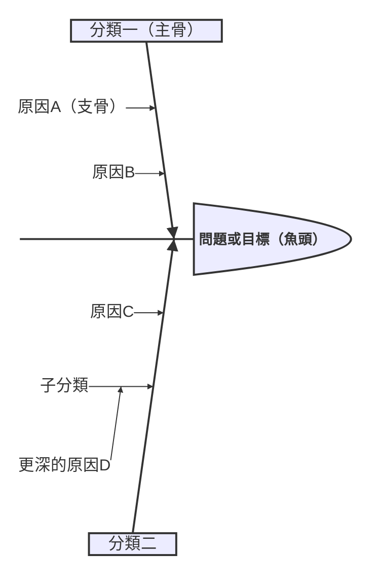
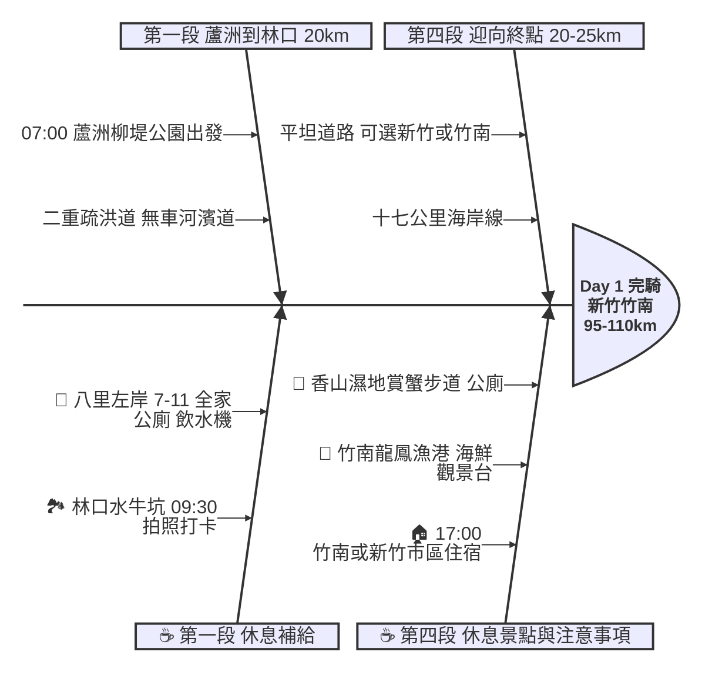

# Skill：用 Mermaid 製作魚骨圖 (Ishikawa Diagram)

## 📌 前提條件

- **Mermaid 版本**：需 v11.12.3+（2026年4月釋出）
- **語法關鍵字**：`ishikawa-beta`（仍為 beta 階段）
- **Markdown Preview Enhanced**：確認內建的 Mermaid 版本支援此語法

---

## 📐 基本語法

### 語法規則

1. **第一行**：`ishikawa-beta`（圖表類型宣告）
2. **第二行（縮排1層）**：問題/目標 → 會顯示為魚頭（最右邊）
3. **後續行（縮排1層）**：主分類 → 會顯示為主骨
4. **再縮排（縮排2層）**：子原因 → 會顯示為支骨
5. **可繼續縮排（縮排3層+）**：更細的子分類
6. 純粹靠**縮排（4個空格）**控制層級，不需要箭頭或節點ID

---

## 🎨 設計原則：上下對稱排版

魚骨圖的主骨會**上下交替排列**：
- 第1個分類 → 上方
- 第2個分類 → 下方
- 第3個分類 → 上方
- 第4個分類 → 下方
- ...以此類推

### 實用設計模式

將資訊分成「上方」與「下方」兩類交替排列，例如：

| 上方（奇數位） | 下方（偶數位） |
|:---|:---|
| 路線/路況資訊 | 休息點/補給站 |
| 技術規格 | 風險/注意事項 |
| 功能需求 | 品質要求 |
| 時程/里程碑 | 資源/預算 |

### 範例：騎行路線魚骨圖

---

## 🔄 方向性：排序技巧

Mermaid ishikawa 的渲染方向是 **由左到右**：
- 程式碼中**先列出的分類** → 出現在**左邊**（離魚頭較遠）
- 程式碼中**後列出的分類** → 出現在**右邊**（靠近魚頭）

### 時間軸情境的排序

如果魚骨圖表達的是有先後順序的流程（如旅程），要讓時間軸由左到右：
- **倒序排列**：最後的階段寫在程式碼最前面，最早的階段寫在最後面
- 這樣渲染出來的視覺效果是：左邊=終點段 → 右邊=起點段 → 魚頭=目標

---

## 📏 版面簡潔原則

魚骨圖的目的是**一眼掌握全貌**，應避免塞入過多細節：

- **精簡支骨數量**：每個主骨下建議 2~5 個支骨，超過會顯得擁擠
- **細節移至文件其他段落**：例如撤退方案、詳細時刻表等，放在魚骨圖下方用文字段落補充即可
- **一行一重點**：每個支骨只寫一個核心資訊，不要在同一行塞太多內容

---

## ✏️ Emoji 使用

可以在文字中直接使用 emoji，常用標示：

| Emoji | 用途 |
|:---:|:---|
| ☕️ | 休息站分類標題 |
| 🥤 | 便利商店/補給站 |
| 🍔 | 用餐點 |
| 🏞️ | 拍照/景點 |
| 🚻 | 公廁 |
| 🏠 | 住宿 |
| ⚠️ | 注意事項/警告 |
| 🚎 | 交通/轉乘 |

---

## 📋 製作步驟 Checklist

1. [ ] 確認 Mermaid 版本 ≥ v11.12.3
2. [ ] 決定魚頭（目標/問題）
3. [ ] 規劃主骨分類，考慮上下對稱（奇數=上方，偶數=下方）
4. [ ] 列出各分類的支骨（子原因/細節）
5. [ ] 決定排序方向（若有時間軸，用倒序排列）
6. [ ] 加入 emoji 增加辨識度
7. [ ] 在 Markdown Preview 中確認渲染效果
