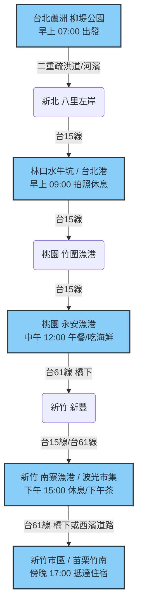

# Day 1：台北蘆洲 ➔ 新竹/竹南 (西濱海岸線追風之旅)

## 📍 路線總覽
* **出發地**：台北蘆洲柳堤公園
* **目的地**：新竹市區 或 苗栗竹南
* **總距離**：約 85 - 95 公里
* **總爬升**：幾乎為 0 (極度平坦)
* **主要路線**：二重疏洪道/八里左岸 ➔ 台15線 ➔ 台61線 (西濱快速公路橋下平面道路)

### 🌍 Google Maps 手機導航連結
👉 **[點擊此處開啟 Day 1 西濱路線 Google Maps (腳踏車模式) 導航](https://www.google.com/maps/dir/?api=1&origin=%E8%98%86%E6%B4%B2%E6%9F%B3%E5%A0%A4%E5%85%AC%E5%9C%92&destination=%E7%AB%B9%E5%8D%97%E8%BB%8A%E7%AB%99&waypoints=%E5%85%AB%E9%87%8C%E5%B7%A6%E5%B2%B8%E8%87%AA%E8%A1%8C%E8%BB%8A%E9%81%93%7C%E6%9E%97%E5%8F%A3%E6%B0%B4%E7%89%9B%E5%9D%91%7C%E7%AB%B9%E5%9C%8D%E6%BC%81%E6%B8%AF%7C%E6%B0%B8%E5%AE%89%E6%BC%81%E6%B8%AF%7C%E5%85%A8%E5%AE%B6%E4%BE%BF%E5%88%A9%E5%95%86%E5%BA%97+%E6%96%B0%E8%B1%90%E4%BC%91%E6%81%AF%E7%AB%99%7C%E5%8D%97%E5%AF%AE%E6%BC%81%E6%B8%AF&travelmode=bicycling)**
> *(💡 小提醒：Google 地圖的腳踏車導航有時會帶你鑽進鄉間小路。若你想要路況最好、全程沿著海岸線騎乘，只要順著大馬路上的「台15線」與「台61線(橋下機慢車道)」指標直行即可。)*

---

## 🗺️ 詳細路線圖 (Mermaid 流程)

---

## 🕒 建議行程與時間配速

### 第一段：河濱晨騎 (蘆洲 ➔ 八里 ➔ 林口)
* **距離**：約 20 km
* **路況**：從蘆洲切入二重疏洪道，沿著淡水河左岸一路騎到八里，完全沒有汽機車，非常舒服。
* **景點/休息補給**：
  * **八里渡船頭/左岸**：有密集的便利商店（7-11、全家）、公廁與飲水機。離開八里進入台15線前，建議在此把水壺裝滿。
  * **林口段**：經過林口水牛坑（打卡景點）前後，台15線上有 **7-11 (台北港門市/八仙門市)** 以及 **中油加油站 (林口發電廠附近)**，可借廁所與稍作休息。

### 第二段：桃園海岸線 (林口 ➔ 竹圍 ➔ 永安漁港)
* **距離**：約 30 km
* **路況**：進入**台15線**，路寬大又直，幾乎沒有爬坡。大車稍微多一點，但路肩很寬。
* **景點/休息補給**：
  * **竹圍漁港周邊**：台15線上（蘆竹/大園段）沿途有幾間 **萊爾富** 及 **中油加油站**，因為腹地大，是西濱單車客與重機族最愛的短暫喝水休息站。
  * **永安漁港 / 海螺館**：強烈建議的**中午大休點**！內部有冷氣、乾淨公廁與飲水機，推薦在此吃海鮮小吃當作午餐，並到純白海螺館拍照。

### 第三段：風車相伴 (永安漁港 ➔ 南寮漁港)
* **距離**：約 25 km
* **路況**：這段開始可以選擇走**台61線(西濱)的高架橋下平面道路**，好處是不用曬太陽，而且完全平坦。
* **景點/休息補給**：
  * **新豐休息站 (台61線58K)**：單車雖然不能上高架，但在**橋下的平面道路**可以直接進入！這裡有 **全家便利商店**、乾淨的**大型公廁**與洗手台，是極佳的單車補給站。
  * **南寮漁港**：抵達新竹後的大休點。周邊有 **7-11、全家**，遊客中心有公廁，波光市集則有許多小吃可當作下午茶。

### 第四段：迎向終點 (南寮漁港 ➔ 新竹市區/竹南)
* **距離**：約 15-20 km
* **路況**：平坦道路。若要住新竹市區，從南寮往市區騎；若要住竹南，則繼續沿著西濱南下即可抵達。
* **景點/休息補給**：
  * **十七公里海岸線**：沿途有多處優良的公共設施，例如 **香山濕地賞蟹步道公廁**、**海山漁港**，適合想上廁所或看海休息的人。
  * **終點 (竹南/新竹市區)**：轉入市區前，台61聯絡道旁皆有便利商店可作最終補給。西濱沿線風大較消耗體力，抵達住宿點後務必做足伸展放鬆。

---

## 💡 騎乘注意事項 (Day 1 - 西濱路線)

1. **季風影響極大**：西濱的特色就是風大。如果是「秋冬（10月~隔年3月）」騎乘，東北季風是超大**順風**，不用踩也能滑行；若是「春夏」騎乘，則可能遇到西南風的**逆風**，體力消耗會非常大。
2. **防曬與補水**：西濱公路沿線**遮蔽物極少**（除非騎在台61高架橋下）。一定要定時補充水分，並做好防曬，以免第一天就曬傷。
3. **補給點距離**：西濱上的超商（便利商店）不像市區那麼密集，通常在大型路口或需稍稍繞進聚落才有。看到超商時，即使不渴也建議停下來把水壺裝滿。
4. **注意大車死角**：台15/台61是砂石車與大貨車的交通要道，請盡量保持在最外側的機慢車道或路肩，並時刻留意後方來車。
