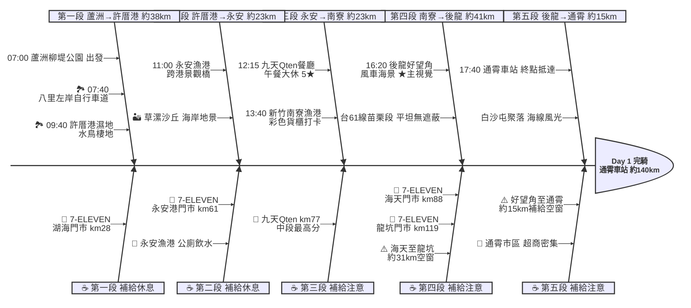

# Day 1：蘆洲柳堤公園 ➔ 通霄車站（西濱追風．蘆洲到通霄）

---

## 路線總覽

* **出發地**：台北蘆洲柳堤公園
* **目的地**：通霄
* **總距離**：139.8 公里（GPX 實測）
* **總爬升 / 下降**：西濱平坦，幾乎無爬升，後龍好望角為唯一明顯緩坡
* **主要路線**：二重疏洪道自行車道 ➔ 八里左岸 ➔ 台15線 ➔ 台61線西濱(許厝港/草漯/永安) ➔ 南寮漁港 ➔ 後龍好望角 ➔ 通霄車站

[📱 開啟 Google Maps 導航](https://www.google.com/maps/dir/?api=1&origin=%E6%96%B0%E5%8C%97%E5%B8%82%E8%98%86%E6%B4%B2%E6%9F%B3%E5%A0%A4%E5%85%AC%E5%9C%92&destination=%E9%80%9A%E9%9C%84%E8%BB%8A%E7%AB%99&waypoints=%E5%85%AB%E9%87%8C%E5%B7%A6%E5%B2%B8%E8%87%AA%E8%A1%8C%E8%BB%8A%E9%81%93%7C%E8%A8%B1%E5%8E%9D%E6%B8%AF%E6%BF%95%E5%9C%B0%7C%E6%A1%83%E5%9C%92%E6%B0%B8%E5%AE%89%E6%BC%81%E6%B8%AF%7C%E6%96%B0%E7%AB%B9%E5%8D%97%E5%AF%AE%E6%BC%81%E6%B8%AF%7C%E8%8B%97%E6%A0%97%E5%BE%8C%E9%BE%8D%E5%A5%BD%E6%9C%9B%E8%A7%92&travelmode=bicycling)

<iframe src="https://www.google.com/maps/d/u/0/embed?mid=1jkVYdvwUMUZ9jxtJojAd5-fQKzrFCZo&ehbc=2E312F" width="100%" height="100%" style="border:none; border-radius: 8px;"></iframe>

---

## 詳細路線行程圖解

---

## 建議行程與時間配速

### 第一段：蘆洲柳堤公園 → 許厝港濕地（約 38 km）｜河口暖身段

**距離**：38 km
**路況**：蘆洲沿二重疏洪道河濱自行車道北上，過關渡橋進八里，接八里左岸自行車道與台15線南下，於八里渡船頭老街補早餐後沿海岸南行，進台61線西濱快速道路抵許厝港濕地。全段平坦、補給豐富。

**景點與補給：**
- 🚀 **07:00 蘆洲柳堤公園**（起點，km 0）：有公廁與停車場，建議提早到場暖身、補充早餐。
- 🏞️ **07:40 八里左岸自行車道**（km ~8，八里）：必經點。八里左岸自行車道與渡船頭老街（4.4★/1424），河口暖身兼早餐補給，可順遊十三行文化園區。
- 🥤 **7-ELEVEN 湖海門市**（km ~28，大園）：進台61線西濱快速道前最後超商，補滿水分與行動糧。
- 🏞️ **09:40 許厝港濕地**（km ~38，大園）：國際級水鳥重要棲地與海岸濕地（4.4★/3801），八里到永安中段最高分景點，海風強注意保暖。

---

### 第二段：許厝港濕地 → 永安漁港（約 23 km）｜西濱沙丘段

**距離**：23 km
**路況**：接台61線西濱快速公路南下，沿途經觀音草漯海岸沙丘地景抵永安漁港。觀音至新屋段側風較強，注意路肩與大型車。

**景點與補給：**
- 🏜️ **觀音草漯沙丘**（km ~44，觀音（沿線景觀））：有「台版撒哈拉」之稱的海岸沙丘地景，路過可遠眺，進步道為沙地須牽車。
- 🥤 **7-ELEVEN 永安港門市**（km ~61，距漁港正門 200m）：永安漁港旁補給，補充飲料與行動糧。
- 🏞️ **11:00 永安漁港**（km ~61）：必經點。大型觀光漁港、跨港景觀橋（4.1★/3.8萬則），有廁所與停車場，可短暫休息打卡。

---

### 第三段：永安漁港 → 南寮漁港（約 23 km）｜西濱新竹段

**距離**：23 km
**路況**：沿新屋綠色走廊、台61線新竹段南下，經新豐、竹北海岸抵新竹南寮。平坦但遮蔽物少，午後易有海風；中段於新豐九天Qten午餐大休。

**景點與補給：**
- 🍱 **12:15–13:15 九天Qten餐廳**（km ~77，新豐）：午餐大休點。中段最高評分（5★/1144），距主線約 0.1km。建議先確認營業時間，公休日可改新豐/竹北沿線餐廳。
- 🏞️ **13:40 南寮漁港**（km ~85）：必經點（新竹南寮）。彩色貨櫃屋與魚鱗天梯，新竹 17 公里海岸風景區起點，海岸地標。

---

### 第四段：南寮漁港 → 後龍好望角（約 41 km）｜西濱苗栗風車段

**距離**：41 km
**路況**：過頭前溪、中港溪經香山、竹南進入苗栗後龍。香山至後龍貼線超商較少，務必在海天門市、龍坑門市補滿水壺。

**景點與補給：**
- 🥤 **7-ELEVEN 海天門市**（km ~88，香山）：香山海岸線補給，本段較長先補滿。
- 🥤 **7-ELEVEN 龍坑門市**（km ~119，後龍）：登後龍好望角前最後超商，把水壺補滿。
- 🏞️ **16:20 後龍好望角風景區**（km ~125，半天寮休閒文化園區）：必經點、本日★主視覺。草原、白色風力發電機與遼闊海景制高點，西濱最經典畫面。緩上坡約 1km，登頂可遠眺台灣海峽與海線鐵路。

---

### 第五段：後龍好望角 → 通霄車站（約 15 km）｜海線收尾段

**距離**：15 km
**路況**：下好望角沿台1線／西濱南下，經白沙屯聚落抵通霄。好望角至通霄約15km無貼線超商，通霄市區人車漸多、超商密集，留意路口。終點通霄車站可搭海線鐵路接駁。

**景點與補給：**
- 🏁 **17:40 通霄車站**（km ~140，通霄鎮）：當日終點，周邊有旅館與小吃、超商密集。台鐵海線通霄站可搭區間車撤退或接駁。

---

## 晚餐推薦

| # | 店名 | 評分 | 留言數 | 貝葉斯分 | 備註 |
|:---:|:---|:---:|---:|:---:|:---|
| 1 | [陳仔食堂](https://www.google.com/maps/place/?q=place_id:ChIJScPF8jwIaTQRomUjsKnbw8U) | 4.9★ | 317 | 4.6963 | 餐廳 |
| 2 | [梁陳吉日複合式乾燥花餐廳](https://www.google.com/maps/place/?q=place_id:ChIJZUOwC7QJaTQRFLkG0qJe69U) | 4.7★ | 619 | 4.6231 | 餐廳 |
| 3 | [家庭廚房Familykitchen](https://www.google.com/maps/place/?q=place_id:ChIJtaP8hG4JaTQRmgQTfLp3Y04) | 4.7★ | 173 | 4.5382 | 家庭餐廳 |
| 4 | [林記北平烤鴨](https://www.google.com/maps/place/?q=place_id:ChIJX_p7ym2naTQRlDyTfbEx2ns) | 4.8★ | 78 | 4.5138 | 餐廳 |
| 5 | [水食堂](https://www.google.com/maps/place/?q=place_id:ChIJe_NOiyAJaTQRjEgvvtqbk7w) | 4.6★ | 254 | 4.5129 | 日式餐廳 |

> 💡 *排序依據：留言數越多的高分店越可信（IMDB 風格貝葉斯平均）*
> 📋 *[看更多 >>](./day1_dinner.md)*

---

## 住宿推薦 🏨

| # | 飯店 | 評分 | 留言數 | 貝葉斯分 | 備註 |
|:---:|:---|:---:|---:|:---:|:---|
| 1 | [苗栗通霄好穗民宿。通霄民宿。通霄住宿。苗栗民宿。苗栗包棟。合法民宿。包棟。出差。背包客。旅遊。住宿](https://www.google.com/maps/place/?q=place_id:ChIJJROLeFQJaTQRiyPMDro28pQ) | 5★ | 41 | 4.4254 |  |
| 2 | [沐明民宿](https://www.google.com/maps/place/?q=place_id:ChIJncq-0FYJaTQRLIW4haQGR30) | 5★ | 28 | 4.3318 |  |
| 3 | [牧草原民宿](https://www.google.com/maps/place/?q=place_id:ChIJL6WFSI2naTQRKQ8Qe4kdLps) | 4.7★ | 39 | 4.284 |  |
| 4 | [幸福農場民宿](https://www.google.com/maps/place/?q=place_id:ChIJJaWFSI2naTQRs84BdcoQIKc) | 4.7★ | 3 | 4.0111 |  |
| 5 | [苗栗通霄國賓大旅社☆火車站前 住宿推薦☆](https://www.google.com/maps/place/?q=place_id:ChIJae7fFDoIaTQR8hFYDZ7u1yQ) | 4★ | 120 | 3.9913 |  |

> 💡 *終點周邊 3 公里 · 9 筆候選 · IMDB 風格貝葉斯平均*
> 📋 *[看更多 >>](./day1_hotel.md)*

---

## 騎乘注意事項

1. **強風防範**：台61線西濱公路全線無遮蔽，夏季常有西南風助騎，冬季可能面對強烈東北季風（逆風），建議預留多 30% 騎行時間。
2. **補給空窗（沿實際路線）**：湖海(km28)→永安港(km61) 約 33km、永安港(km61)→海天(km88) 約 27km、海天(km88)→龍坑(km119) 約 31km、龍坑(km119)→通霄市區(km140) 約 21km（後龍好望角一帶超商稀少），皆須在前一站把水壺補滿。
3. **草漯沙丘路況**：沙丘觀景步道為沙地，牽車進入、注意輪胎。
4. **午餐確認**：九天Qten餐廳（5★/1144）建議出發前確認營業時間；公休或客滿時可改新豐、竹北沿線餐廳或南寮漁港美食區。
5. **里程偏長**：本日實測約 140km（西濱多漁港繞行），較一般日程長，建議 06:30–07:00 出發並控制各景點停留時間。
6. **撤退方案**：km85 南寮漁港可騎至新竹站、km119 一帶可至竹南站／後龍站、km140 通霄站皆可搭台鐵海線區間車返程。

---

## 更佳景點參考

> 以下為沿途 Bayesian 排名較高但未排入路線的備選點位。可視當天體力 / 天候 / 時間彈性加入。

### 景點備案

| 名次 | 名稱 | 評分 | 留言數 | 貝葉斯分 |
|:---:|:---|:---:|---:|:---:|
| 1 | SALTLIFE鹽夢工場 八里旗艦店｜精品鹽燈專賣｜DIY鹽沙手作 | 4.9★ | 1,712 | 4.81 |
| 2 | 風情海岸 | 4.6★ | 950 | 4.54 |
| 3 | 好望角停車場 | 4.6★ | 893 | 4.54 |
| 4 | 新屋綠色隧道海景 | 4.7★ | 194 | 4.49 |
| 5 | 微風運河廣場 | 4.5★ | 2,345 | 4.48 |

### 午餐 / 餐廳大休備案

| 名次 | 店名 | 評分 | 留言數 | 貝葉斯分 |
|:---:|:---|:---:|---:|:---:|
| 1 | 樂釜 Love Hot Pot 極上鍋物(長榮店) | 4.9★ | 6,290 | 4.87 |
| 2 | 月山 咖啡/甜點/麵包/簡餐/飲料（提早賣完就會提早打烊） | 4.9★ | 2,102 | 4.82 |
| 3 | 極丼飯館 | 4.9★ | 1,990 | 4.82 |

