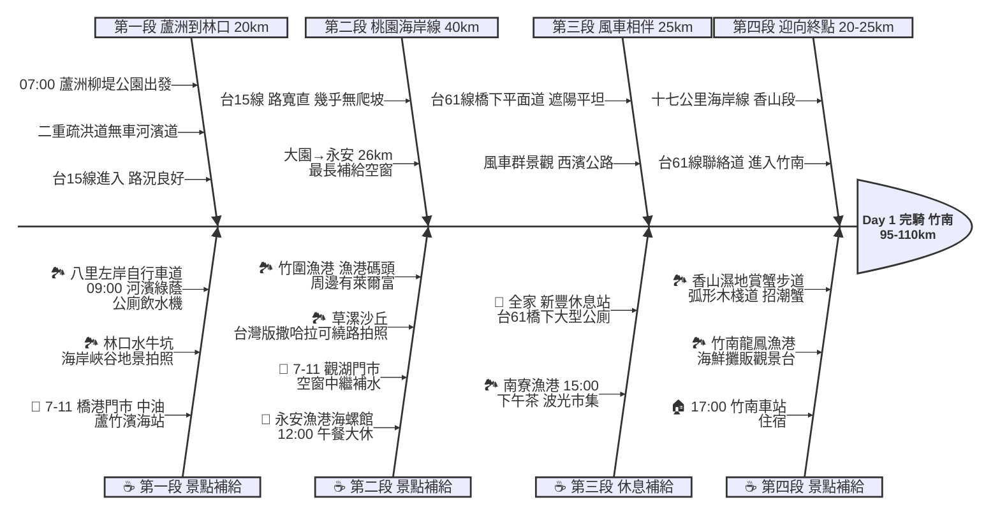

# Day 1：台北蘆洲 ➔ 苗栗竹南 (西濱海岸線追風之旅)

## 📍 路線總覽
* **出發地**：台北蘆洲柳堤公園
* **目的地**：苗栗竹南車站
* **總距離**：約 95 - 110 公里
* **總爬升**：幾乎為零（全程西濱平坦路線）
* **主要路線**：二重疏洪道 / 八里左岸 ➔ 台15線 ➔ 台61線（西濱公路橋下平面道路）

---

### 🌍 Google Maps 導航與地圖預覽

#### 手機導航連結
👉 **[點擊此處開啟 Day 1 西濱路線導航（腳踏車模式）](https://www.google.com/maps/dir/?api=1&origin=%E8%98%86%E6%B4%B2%E6%9F%B3%E5%A0%A4%E5%85%AC%E5%9C%92&destination=%E7%AB%B9%E5%8D%97%E8%BB%8A%E7%AB%99&waypoints=%E5%85%AB%E9%87%8C%E5%B7%A6%E5%B2%B8%E8%87%AA%E8%A1%8C%E8%BB%8A%E9%81%93%7C%E6%9E%97%E5%8F%A3%E6%B0%B4%E7%89%9B%E5%9D%91%7C%E7%AB%B9%E5%9C%8D%E6%BC%81%E6%B8%AF%7C%E6%B0%B8%E5%AE%89%E6%BC%81%E6%B8%AF%7C%E5%8D%97%E5%AF%AE%E6%BC%81%E6%B8%AF%7C%E9%A6%99%E5%B1%B1%E6%BF%95%E5%9C%B0%E8%B3%9E%E8%9F%B9%E6%AD%A5%E9%81%93&travelmode=bicycling)**

> *(💡 建議直接沿台15線與台61線橋下機慢車道騎，不要完全依賴導航，避免被帶入鄉間小路。)*

#### 🗺️ 路線小地圖

> 💡 *【版型提醒】：請將生成的海報圖命名為 `day1_poster.png` 放於此資料夾，並將上方超連結替換為您的 Google My Maps 專屬連結！*

---

## 🐟 Day 1 路線魚骨圖

---

## 🕒 建議行程與時間配速

### 第一段：河濱晨騎（蘆洲 ➔ 八里 ➔ 林口）
* **距離**：約 20 km
* **路況**：從蘆洲柳堤公園進入二重疏洪道，沿淡水河左岸騎到八里，全程無汽機車，輕鬆舒適。
* **景點 / 休息補給**：
  * **八里左岸自行車道**（評分 4.4，推薦景點）：河濱綠蔭自行車道，有便利商店、公廁與飲水機，離開八里前建議把水壺裝滿。
  * **林口水牛坑**（評分 4.2，值得一看）：位於台15線西部濱海公路旁，台灣少見的海岸峽谷地景，適合拍照打卡。旁邊有 **7-11 橋港門市** 與 **中油蘆竹濱海站** 可借廁所。

### 第二段：桃園海岸線（林口 ➔ 竹圍漁港 ➔ 觀音 ➔ 永安漁港）
* **距離**：約 40 km
* **路況**：進入台15線，路寬筆直，幾乎無爬坡。大車稍多，靠外側機慢車道騎乘。大園至永安約 26 公里為本日最長補給空窗。
* **景點 / 休息補給**：
  * **竹圍漁港**（評分 4.4，推薦景點）：桃園段著名漁港，漁港碼頭景觀，周邊有萊爾富、中油加油站可補給。
  * **草漯沙丘地質公園**（評分 4.2，值得一看）：「台灣版撒哈拉」的海岸沙丘地景，可視體力繞路 1-2 km 拍照。
  * **7-11 觀湖門市**：觀音段台15線，大園→永安 26 km 最長空窗的中繼補水點，強烈建議停靠。
  * **永安漁港海螺館**（評分 4.3，推薦景點）：本日**午餐大休點**，白色巨型海螺建築為西濱地標，有冷氣與乾淨公廁。

### 第三段：風車相伴（永安漁港 ➔ 新豐 ➔ 南寮漁港）
* **距離**：約 25 km
* **路況**：進入台61線西濱高架橋下平面道路，遮陽不曬，完全平坦，兩側為沿海大風車景觀。
* **景點 / 休息補給**：
  * **全家 新豐休息站**（台61線橋下）：有全家便利商店與大型乾淨公廁，是絕佳的下午補水點。
  * **南寮漁港**（評分 4.2，值得一看）：抵達新竹後的休息點，周邊有 7-11、全家，波光市集有多種小吃。

### 第四段：迎向終點（南寮漁港 ➔ 香山濕地 ➔ 竹南）
* **距離**：約 20-25 km
* **路況**：沿台61線繼續南下，十七公里海岸線景觀優美，道路平坦。
* **景點 / 休息補給**：
  * **香山濕地賞蟹步道**（評分 4.4，推薦景點）：Day 1 最具畫面感的景點！弧形木棧道延伸入海，可觀察招潮蟹，附近有優良公廁。
  * **竹南龍鳳漁港**（評分 4.1，值得一看）：竹南前最後景點，有海鮮攤販與觀景台，距竹南車站約 4 km。
  * **終點：竹南車站**：傍晚 17:00 前抵達，市區有超商可最後補給。

---

## 💡 騎乘注意事項

1. **季風影響**：秋冬（10月~3月）東北季風可能是強力順風；春夏易遇西南逆風，需預留更多時間。
2. **防曬補水**：西濱沿線遮蔽物極少（台61橋下段除外）。每隔 30 分鐘主動補水，全程做好防曬。
3. **最長補給空窗（大園→永安，約 26 km）**：離開竹圍漁港後，中間只有 7-11 觀湖門市可補給。務必在此停靠，不可跳過。
4. **注意大車**：台15線為砂石車與大貨車要道，全程靠外側機慢車道騎乘，保持警覺。
5. **撤退方案**：
   * **竹圍漁港** (約 55km)：轉入大園市區，騎約 8 km 可達桃園機場捷運 A10 山鼻站
   * **永安漁港** (約 70km)：轉入新屋方向，騎約 9 km 可達新屋車站
   * **新豐休息站** (約 83km)：轉入新豐方向，騎約 5 km 可達新豐車站
   * **南寮漁港** (約 92km)：可直接轉入新竹市區住宿，不必繼續到竹南

---

## 🎨 提示詞構圖指引 (day1_prompt.md)

* **主景點（最高熱門度，Day1 最具畫面感）**：香山濕地賞蟹步道（評分 4.4）
  * 主場景：弧形木棧道延伸入海、招潮蟹、遠方風車群
* **小分身（起點，CSV 第 1 筆）**：蘆洲柳堤公園（河濱自行車道旁，準備出發）
* **遠景（終點，CSV 最後 1 筆）**：竹南車站

**路線走向**：南北走向（由北往南）→ 直幅 1024 x 1536
**光線氛圍**：柔和清晨明亮光線（預設，本日無夕陽景點）
