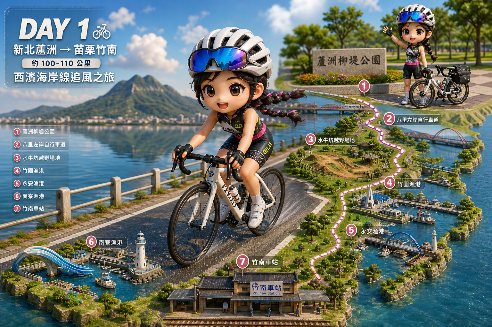
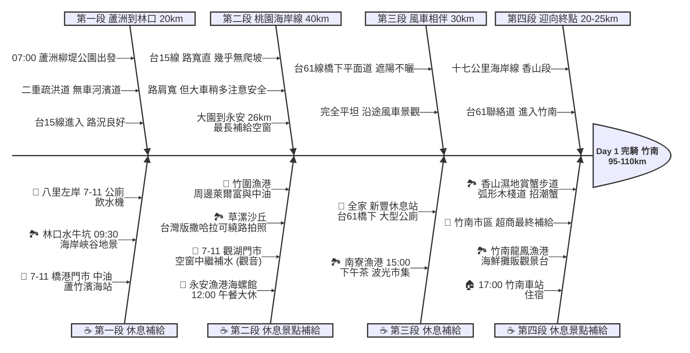

# Day 1：台北蘆洲 ➔ 苗栗竹南 (西濱海岸線追風之旅)

## 📍 路線總覽
* **出發地**：台北蘆洲柳堤公園
* **目的地**：苗栗竹南車站
* **總距離**：約 95 - 110 公里
* **總爬升**：幾乎為 0（全程極度平坦）
* **主要路線**：二重疏洪道/八里左岸 ➔ 台15線 ➔ 台61線（西濱快速公路橋下平面道路）

### 🌍 Google Maps 導航與地圖預覽

#### 手機導航連結
👉 **[點擊此處開啟 Day 1 西濱路線 Google Maps（腳踏車模式）導航](https://www.google.com/maps/dir/?api=1&origin=%E8%98%86%E6%B4%B2%E6%9F%B3%E5%A0%A4%E5%85%AC%E5%9C%92&destination=%E7%AB%B9%E5%8D%97%E8%BB%8A%E7%AB%99&waypoints=%E5%85%AB%E9%87%8C%E5%B7%A6%E5%B2%B8%E8%87%AA%E8%A1%8C%E8%BB%8A%E9%81%93%7C%E6%9E%97%E5%8F%A3%E6%B0%B4%E7%89%9B%E5%9D%91%7C%E7%AB%B9%E5%9C%8D%E6%BC%81%E6%B8%AF%7C%E6%B0%B8%E5%AE%89%E6%BC%81%E6%B8%AF%7C%E5%8D%97%E5%AF%AE%E6%BC%81%E6%B8%AF%7C%E9%A6%99%E5%B1%B1%E6%BF%95%E5%9C%B0%E8%B3%9E%E8%9F%B9%E6%AD%A5%E9%81%93&travelmode=bicycling)**
> *(💡 小提醒：Google 地圖腳踏車導航有時會帶你鑽入鄉間小路。若想路況最好、全程沿海岸線騎，只要順著「台15線」與「台61線橋下機慢車道」指標直行即可。)*

#### 🗺️ 路線小地圖

> 💡 *【預設版型提醒】：請在此放置生成的路線圖 (命名為 `day1_poster.png`)，並記得將上方圖片的超連結替換成您當天的 Google My Maps 專屬連結！*

---

## 🐟 Day 1 魚骨圖 (Ishikawa Diagram)

---

## 🕒 建議行程與時間配速

### 第一段：河濱晨騎 (蘆洲 ➔ 八里 ➔ 林口)
* **距離**：約 20 km
* **路況**：從蘆洲切入二重疏洪道，沿淡水河左岸騎到八里，完全無汽機車，輕鬆舒適。
* **景點/休息補給**：
  * **八里左岸自行車道** ⭐（評分 4.4）：有密集便利商店（7-11、全家）、公廁與飲水機。離開八里前建議把水壺裝滿。
  * **林口水牛坑**（評分 4.2）：位在台15線西部濱海公路旁，是少見的海岸峽谷地景，適合簡單拍照打卡，旁邊有 **7-11 橋港門市** 與 **中油蘆竹濱海站** 可借廁所。

### 第二段：桃園海岸線 (林口 ➔ 竹圍 ➔ 觀音 ➔ 永安漁港)
* **距離**：約 40 km
* **路況**：進入**台15線**，路寬大又直，幾乎沒有爬坡。大車稍多，路肩很寬，靠外騎即可。
* **景點/休息補給**：
  * **竹圍漁港**（評分 4.4）：台15線上桃園段著名漁港，漁港碼頭景觀不錯。周邊有萊爾富、中油加油站，適合稍事休息補水。
  * **草漯沙丘地質公園**（評分 4.2）：位在觀音段，有「台灣版撒哈拉」之稱的海岸沙丘地景，可視體力繞路 1-2 km 入內拍照。
  * **7-11 觀湖門市** ⭐：位在觀音濱海路上，正好是大園→永安漁港約 26 公里**最長補給空窗**的中間點，強烈建議在此停靠補水。
  * **永安漁港海螺館**（評分 4.3）⭐：本日**中午大休點**！白色巨型海螺建築是西濱地標，有冷氣、乾淨公廁，推薦在此享用海鮮午餐。

### 第三段：風車相伴 (永安漁港 ➔ 新豐 ➔ 南寮漁港)
* **距離**：約 25 km
* **路況**：進入**台61線西濱高架橋下平面道路**，遮陽不曬，完全平坦，兩側是西部沿海大風車景觀。
* **景點/休息補給**：
  * **全家 新豐休息站**（台61線橋下）：單車可直接進入，有全家便利商店、大型乾淨公廁，是極佳的下午茶補給站。
  * **南寮漁港**（評分 4.2）：抵達新竹後的休息點，周邊有 7-11、全家，**波光市集**有多種小吃，適合下午茶。

### 第四段：迎向終點 (南寮漁港 ➔ 香山 ➔ 竹南)
* **距離**：約 20-25 km
* **路況**：沿台61線繼續南下，十七公里海岸線景觀優美，道路平坦。
* **景點/休息補給**：
  * **香山濕地賞蟹步道**（評分 4.4）⭐：弧形木棧道延伸入海，有招潮蟹可觀察，附近有優良公廁。是竹南前最後一個值得停留的景點。
  * **竹南龍鳳漁港**（評分 4.1）：竹南車站前最後景點，有海鮮攤販與觀景台，距竹南車站約 4 km。
  * **終點 竹南車站**：傍晚 17:00 前抵達，市區有便利商店可最終補給，住宿選竹南或新竹市區皆可。

---

## 💡 騎乘注意事項 (Day 1 - 西濱路線)

1. **季風影響極大**：秋冬（10 月~隔年 3 月）東北季風是強力**順風**；春夏可能遇到西南逆風，體力消耗大幅增加，需預留更多時間。
2. **防曬與補水**：西濱沿線遮蔽物極少（除台61橋下段）。定時補充水分，做好防曬，避免第一天就曬傷。
3. **最長補給空窗（大園→永安，約 26 km）**：從大園出發後，直到觀音的 7-11 觀湖門市才有超商，務必在竹圍漁港或觀湖門市補滿水。
4. **注意大車死角**：台15/台61 是砂石車與大貨車要道，全程靠外側機慢車道，時刻注意後方來車。
5. **備用撤退方案**：
   * **竹圍漁港**（~55km）：轉入大園市區，騎約 8 km 可達**桃園國際機場捷運 A10 山鼻站**
   * **永安漁港**（~70km）：轉入新屋方向，騎約 9 km 可達**新屋車站**
   * **新豐休息站**（~83km）：轉入新豐方向，騎約 5 km 可達**新豐車站**
   * **南寮漁港**（~92km）：可直接轉入**新竹市區**住宿，不必繼續到竹南

---

## 🎨 提示詞構圖指引 (day1_prompt.md)

1. **主角位置（畫面最大）**：香山濕地賞蟹步道（評分 4.4，Day 1 最具畫面感的景點）
   - 主場景：弧形木棧道延伸入海、招潮蟹、遠方風車群
2. **小分身位置（起點）**：蘆洲柳堤公園（河濱自行車道旁，準備出發意象）
3. **遠景（終點）**：竹南龍鳳漁港（畫面最下方）

**路線走向**：南北走向，畫面起點在上（蘆洲），終點在下（竹南），海在畫面西側（左側）
