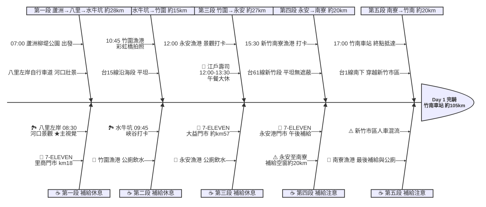

# Day 1：蘆洲柳堤公園 ➔ 竹南車站（西濱海岸線追風之旅）

---

## 📍 路線總覽

* **出發地**：台北蘆洲柳堤公園
* **目的地**：竹南車站
* **總距離**：約 80–100 公里
* **總爬升**：全程幾乎平坦，台61線西濱公路爬升極少，南寮至竹南段略有起伏
* **主要路線**：二重疏洪道自行車道 ➔ 八里左岸自行車道 ➔ 台15線 ➔ 台61線（竹圍/觀音/新屋）➔ 南寮漁港 ➔ 台1線 ➔ 竹南車站

---

## 🌍 地圖與導航

[📱 手機導航連結（Google Maps 單車模式）](https://www.google.com/maps/dir/?api=1&origin=%E6%96%B0%E5%8C%97%E5%B8%82%E8%98%86%E6%B4%B2%E5%8D%80%E6%9F%B3%E5%A0%A4%E5%85%AC%E5%9C%92&destination=%E7%AB%B9%E5%8D%97%E7%81%AB%E8%BB%8A%E7%AB%99&waypoints=%E6%96%B0%E5%8C%97%E5%B8%82%E5%85%AB%E9%87%8C%E5%B7%A6%E5%B2%B8%E8%87%AA%E8%A1%8C%E8%BB%8A%E9%81%93%7C%E6%A1%83%E5%9C%92%E7%AB%B9%E5%9C%8D%E6%BC%81%E6%B8%AF%7C%E6%A1%83%E5%9C%92%E6%B0%B8%E5%AE%89%E6%BC%81%E6%B8%AF%7C%E6%96%B0%E7%AB%B9%E5%8D%97%E5%AF%AE%E6%BC%81%E6%B8%AF&travelmode=bicycling)

#### 🗺️ 路線小地圖

> 💡 *【預設版型提醒】：請在此放置生成的路線圖 (命名為 `day1_poster.png`)，並記得將上方圖片的超連結替換成您當天的 Google My Maps 專屬連結！*

---

## 🐟 詳細路線行程圖解

---

## 🕒 建議行程與時間配速

### 第一段：蘆洲柳堤公園 → 水牛坑越野場地（約 28 km）｜出發熱身段

**距離**：28 km
**路況**：蘆洲出發沿二重疏洪道河濱自行車道向北，經關渡橋抵達八里，接八里左岸自行車道南行，再接台15線至林口水牛坑。全段平坦，補給豐富。

**景點與補給：**
- 🚀 **07:00 蘆洲柳堤公園**（起點，km 0）：有公廁與停車場，建議提早到場暖身補充早餐。
- 🏞️ **08:30 八里左岸自行車道**（km ~15）：淡水河口壯觀景色，觀音山倒影如畫，全日 Bayesian 評分最高（4.31）。有公廁。
- 🥤 **7-ELEVEN 里商門市**（km ~18，商港三路99號）：離開八里前最後超商，補充水分與行動糧。
- 🏞️ **09:45 水牛坑越野場地**（km ~28）：特殊峽谷地貌、牛群放牧，拍照打卡勝地。全天開放免費。

---

### 第二段：水牛坑 → 竹圍漁港（約 15 km）｜台15線海岸衝刺段

**距離**：15 km
**路況**：台15線沿海段，路況良好，風景開闊。靠近竹圍漁港時注意漁港入口轉彎。

**景點與補給：**
- 🏞️ **10:45 竹圍漁港**（km ~43，漁港路451巷25號）：彩虹橋為地標，Google Maps 評論數高達 41,574 筆，為全日最高人氣景點。建議停留 15–20 分鐘。

---

### 第三段：竹圍漁港 → 永安漁港（約 27 km）｜台61線西濱快速道

**距離**：27 km
**路況**：接台61線西濱快速公路，注意路肩。觀音至新屋段側風較強。

**景點與補給：**
- 🥤 **7-ELEVEN 大益門市**（km ~57，觀音區濱海路大潭段22號）：竹圍漁港後第一個超商，務必補水。
- 🏞️ **12:00 永安漁港**（km ~70）：大型觀光漁市，有廁所與停車場。
- 🍔 **江戶壽司（永安漁港店，鮮魚區C02）**：Bayesian 評分最高餐廳（4.35），午餐大休 12:00–13:30。週一公休，週一改選海晏漁村料理（週三公休）。

---

### 第四段：永安漁港 → 南寮漁港（約 20 km）｜西濱新竹段

**距離**：20 km
**路況**：台61線繼續南下，平坦但遮蔽物少，午後易有西南風或北風。

**景點與補給：**
- 🥤 **7-ELEVEN 永安港門市**（km ~70，距漁港正門 200m）：午餐後補充飲料與行動糧。
- 🏞️ **15:30 新竹南寮漁港**（km ~90）：6,813 筆 Google Maps 評論，新竹重要海岸地標。沿海岸往南即「新竹 17 公里海岸風景區」。

---

### 第五段：南寮漁港 → 竹南車站（約 20 km）｜終點收尾段

**距離**：20 km
**路況**：從南寮漁港接台1線南下，穿越新竹市區，道路較寬但人車混流，需注意行人與機車。

**景點與補給：**
- 🏁 **17:00 竹南車站**（km ~110，苗栗縣竹南鎮中山路166號）：周邊有平價旅館與餐廳，台鐵竹南站可搭乘區間車或自強號返程。

---

## 🍽️ 晚餐推薦（終點周邊 3km · 貝葉斯排序）

| # | 店名 | 評分 | 留言數 | 貝葉斯分 | 備註 |
|:---:|:---|:---:|---:|:---:|:---|
| 1 | [柒石柒 石頭鍋](https://www.google.com/maps/place/?q=place_id:ChIJb60QSwCzaTQRMa5Xeeni_6M) | 4.8★ | 1616 | 4.732 | 石頭火鍋 每天11:00-02:00 車站旁 |
| 2 | [豚嘢家 日式咖哩豬排](https://www.google.com/maps/place/?q=place_id:ChIJ2xKrLQCzaTQR_DnVboSVmh0) | 4.8★ | 1455 | 4.7266 | 日式咖哩豬排 每天11:00-21:00 車站旁 |
| 3 | [夏川食堂](https://www.google.com/maps/place/?q=place_id:ChIJkyfmh1CzaTQRqpYlWbi62b8) | 4.8★ | 751 | 4.6869 | 日式拉麵 週二公休 |
| 4 | [House過癮](https://www.google.com/maps/place/?q=place_id:ChIJZc05r26zaTQRj5C1snCX4_k) | 4.8★ | 336 | 4.634 | 手工窯烤披薩 週一二公休 |
| 5 | [順風順水宵夜](https://www.google.com/maps/place/?q=place_id:ChIJQexrNgCzaTQRBnZbzQwzAoA) | 4.9★ | 147 | 4.6101 | 宵夜豆漿燒餅 每天17:00-07:00 |

> 💡 *排序依據：留言數越多的高分店越可信（IMDB 風格貝葉斯平均）*
> 📋 *完整 19 筆候選排名請見 [`day1_dinner.md`](./day1_dinner.md)*

---

## 💡 騎乘注意事項

1. **強風防範**：台61線西濱公路全線無遮蔽，夏季常有西南風助騎，冬季可能面對強烈東北季風（逆風），建議預留多 30% 騎行時間。
2. **補給空窗**：竹圍漁港至大益門市約 14 km 無超商；永安至南寮約 20 km 無超商，出發前確認水壺與補給。
3. **台61線進出口**：部分路段限制低速車輛，若有管制改走台15線平行道路。
4. **水牛坑路況**：水牛坑接台15線沿途有沙地與碎石路，建議 25C 以上輪胎。
5. **餐廳公休**：江戶壽司週一公休、海晏漁村料理週三公休。
6. **撤退方案**：km15 八里搭公車、km43 竹圍漁港搭計程車至桃園台鐵站、km70 永安漁港至新竹台鐵站、km90 南寮漁港騎至新竹站、km110 竹南站直接返程。

