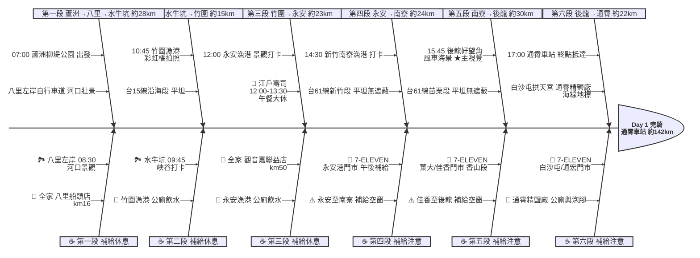

# Day 1：蘆洲柳堤公園 ➔ 通霄車站（西濱追風．蘆洲到通霄）

---

## 路線總覽

* **出發地**：台北蘆洲柳堤公園
* **目的地**：通霄
* **總距離**：142.4 公里（GPX 實測）
* **總爬升 / 下降**：西濱平坦，幾乎無爬升，後龍好望角為唯一明顯緩坡
* **主要路線**：二重疏洪道自行車道 ➔ 八里左岸自行車道 ➔ 台15線 ➔ 台61線（竹圍/觀音/新屋）➔ 南寮漁港 ➔ 後龍好望角 ➔ 通霄車站

[📱 開啟 Google Maps 導航](https://www.google.com/maps/dir/?api=1&origin=%E6%96%B0%E5%8C%97%E5%B8%82%E8%98%86%E6%B4%B2%E5%8D%80%E6%9F%B3%E5%A0%A4%E5%85%AC%E5%9C%92&destination=%E9%80%9A%E9%9C%84%E8%BB%8A%E7%AB%99&waypoints=%E6%96%B0%E5%8C%97%E5%B8%82%E5%85%AB%E9%87%8C%E5%B7%A6%E5%B2%B8%E8%87%AA%E8%A1%8C%E8%BB%8A%E9%81%93%7C%E6%A1%83%E5%9C%92%E7%AB%B9%E5%9C%8D%E6%BC%81%E6%B8%AF%7C%E6%A1%83%E5%9C%92%E6%B0%B8%E5%AE%89%E6%BC%81%E6%B8%AF%7C%E6%96%B0%E7%AB%B9%E5%8D%97%E5%AF%AE%E6%BC%81%E6%B8%AF%7C%E8%8B%97%E6%A0%97%E5%BE%8C%E9%BE%8D%E5%A5%BD%E6%9C%9B%E8%A7%92&travelmode=bicycling)

<iframe src="https://www.google.com/maps/d/u/0/embed?mid=1jkVYdvwUMUZ9jxtJojAd5-fQKzrFCZo&ehbc=2E312F" width="100%" height="100%" style="border:none; border-radius: 8px;"></iframe>

---

## 詳細路線行程圖解

---

## 建議行程與時間配速

### 第一段：蘆洲柳堤公園 → 水牛坑越野場地（約 28 km）｜出發熱身段

**距離**：28 km
**路況**：蘆洲出發沿二重疏洪道河濱自行車道向北，經關渡橋抵達八里，接八里左岸自行車道南行，再接台15線至林口水牛坑。全段平坦，補給豐富。

**景點與補給：**
- 🚀 **07:00 蘆洲柳堤公園**（起點，km 0）：有公廁與停車場，建議提早到場暖身補充早餐。
- 🏞️ **08:30 八里左岸自行車道**（km ~15）：淡水河口壯觀景色，觀音山倒影如畫，晨騎熱身的第一個亮點。有公廁。
- 🥤 **全家便利商店 八里船頭店**（km ~16，緊鄰台15線）：離開八里前最後超商（沿路線僅 80m），補充水分與行動糧。
- 🏞️ **09:45 水牛坑越野場地**（km ~28）：特殊峽谷地貌、牛群放牧，拍照打卡勝地。全天開放免費。

---

### 第二段：水牛坑 → 竹圍漁港（約 15 km）｜台15線海岸衝刺段

**距離**：15 km
**路況**：台15線沿海段，路況良好，風景開闊。靠近竹圍漁港時注意漁港入口轉彎。

**景點與補給：**
- 🏞️ **10:45 竹圍漁港**（km ~43，漁港路451巷25號）：彩虹橋為地標，Google Maps 評論數高達 41,574 筆，為全日最高人氣景點。建議停留 15–20 分鐘。

---

### 第三段：竹圍漁港 → 永安漁港（約 27 km）｜台61線西濱快速道

**距離**：27 km
**路況**：接台61線西濱快速公路，注意路肩。觀音至新屋段側風較強。

**景點與補給：**
- 🥤 **全家便利商店 觀音嘉聯益店**（km ~50，觀音台61沿線）：竹圍漁港後台61段第一個貼線超商，務必補水（前後補給空窗較長）。
- 🏞️ **12:00 永安漁港**（km ~70）：大型觀光漁市，有廁所與停車場。
- 🍔 **江戶壽司（永安漁港店，鮮魚區C02）**：Bayesian 評分最高餐廳（4.35），午餐大休 12:00–13:30。週一公休，週一改選海晏漁村料理（週三公休）。

---

### 第四段：永安漁港 → 南寮漁港（約 20 km）｜西濱新竹段

**距離**：20 km
**路況**：台61線繼續南下，平坦但遮蔽物少，午後易有西南風或北風。

**景點與補給：**
- 🥤 **7-ELEVEN 永安港門市**（km ~70，距漁港正門 200m）：午餐後補充飲料與行動糧。
- 🏞️ **14:30 新竹南寮漁港**（km ~90）：新竹重要海岸地標，海鮮市集與彩色貨櫃屋。沿海岸往南即「新竹 17 公里海岸風景區」。

---

### 第五段：南寮漁港 → 後龍好望角（約 22 km）｜西濱苗栗風車段

**距離**：22 km
**路況**：從南寮接台61/台15線繼續南下進入苗栗，過頭前溪、中港溪後抵竹南，再接縣道轉往後龍。香山至後龍貼線超商較少，務必在菄大、佳香門市補滿。

**景點與補給：**
- 🥤 **7-ELEVEN 菄大門市**（km ~91，新竹香山）：南寮出發後第一個貼線補給。
- 🥤 **7-ELEVEN 佳香門市**（km ~100，香山往竹南）：登後龍好望角前最後超商，補水與行動糧（後段補給空窗較長）。
- 🏞️ **15:45 後龍好望角風景區**（km ~112，半天寮休閒文化園區）：草原、白色風力發電機與遼闊海景的制高點，西濱最經典畫面，本日主視覺。緩上坡約 1km，登頂後可遠眺台灣海峽與海線鐵路。

---

### 第六段：後龍好望角 → 通霄車站（約 18 km）｜通霄海線收尾段

**距離**：18 km
**路況**：下後龍好望角後沿台1線/西濱南下，經白沙屯抵通霄。市區人車漸多，留意路口。終點通霄車站可搭海線鐵路接駁，苑裡留待 Day 2 開頭。

**景點與補給：**
- 🥤 **7-ELEVEN 白沙屯門市**（km ~125，通霄鎮白東里）：白沙屯聚落補給。
- ⛩️ **16:20 白沙屯拱天宮**（km ~119）：白沙屯媽祖信仰中心，每年徒步進香聞名全台，可短暫參拜歇腳。
- 🏭 **16:45 台鹽通霄精鹽廠觀光工廠**（km ~122，通霄鎮內島里122號）：通霄海線地標，有海洋溫泉泡腳池可舒緩腿部，園區免費參觀。
- 🥤 **7-ELEVEN 通宏門市**（km ~136，通霄市區）：進通霄市區、抵站前最後補給。
- 🏁 **17:00 通霄車站**（km ~142，通霄鎮）：當日終點，周邊有旅館與小吃。台鐵海線通霄站可搭區間車撤退或接駁；苑裡留待 Day 2 開頭再經過。

---

## 晚餐推薦

| # | 店名 | 評分 | 留言數 | 貝葉斯分 | 備註 |
|:---:|:---|:---:|---:|:---:|:---|
| 1 | [陳仔食堂](https://www.google.com/maps/place/?q=place_id:ChIJScPF8jwIaTQRomUjsKnbw8U) | 4.9★ | 317 | 4.6963 | 餐廳 |
| 2 | [梁陳吉日複合式乾燥花餐廳](https://www.google.com/maps/place/?q=place_id:ChIJZUOwC7QJaTQRFLkG0qJe69U) | 4.7★ | 619 | 4.6231 | 餐廳 |
| 3 | [家庭廚房Familykitchen](https://www.google.com/maps/place/?q=place_id:ChIJtaP8hG4JaTQRmgQTfLp3Y04) | 4.7★ | 173 | 4.5382 | 家庭餐廳 |
| 4 | [林記北平烤鴨](https://www.google.com/maps/place/?q=place_id:ChIJX_p7ym2naTQRlDyTfbEx2ns) | 4.8★ | 78 | 4.5138 | 餐廳 |
| 5 | [水食堂](https://www.google.com/maps/place/?q=place_id:ChIJe_NOiyAJaTQRjEgvvtqbk7w) | 4.6★ | 254 | 4.5129 | 日式餐廳 |

> 💡 *排序依據：留言數越多的高分店越可信（IMDB 風格貝葉斯平均）*
> 📋 *[看更多 >>](./day1_dinner.md)*

---

## 住宿推薦 🏨

| # | 飯店 | 評分 | 留言數 | 貝葉斯分 | 備註 |
|:---:|:---|:---:|---:|:---:|:---|
| 1 | [苗栗通霄好穗民宿。通霄民宿。通霄住宿。苗栗民宿。苗栗包棟。合法民宿。包棟。出差。背包客。旅遊。住宿](https://www.google.com/maps/place/?q=place_id:ChIJJROLeFQJaTQRiyPMDro28pQ) | 5★ | 41 | 4.4254 |  |
| 2 | [沐明民宿](https://www.google.com/maps/place/?q=place_id:ChIJncq-0FYJaTQRLIW4haQGR30) | 5★ | 28 | 4.3318 |  |
| 3 | [牧草原民宿](https://www.google.com/maps/place/?q=place_id:ChIJL6WFSI2naTQRKQ8Qe4kdLps) | 4.7★ | 39 | 4.284 |  |
| 4 | [幸福農場民宿](https://www.google.com/maps/place/?q=place_id:ChIJJaWFSI2naTQRs84BdcoQIKc) | 4.7★ | 3 | 4.0111 |  |
| 5 | [苗栗通霄國賓大旅社☆火車站前 住宿推薦☆](https://www.google.com/maps/place/?q=place_id:ChIJae7fFDoIaTQR8hFYDZ7u1yQ) | 4★ | 120 | 3.9913 |  |

> 💡 *終點周邊 3 公里 · 9 筆候選 · IMDB 風格貝葉斯平均*
> 📋 *[看更多 >>](./day1_hotel.md)*

---

## 騎乘注意事項

1. **強風防範**：台61線西濱公路全線無遮蔽，夏季常有西南風助騎，冬季可能面對強烈東北季風（逆風），建議預留多 30% 騎行時間。
2. **補給空窗（沿 ORS 實際路線）**：八里船頭店(km16)→觀音嘉聯益店(km50) 約 34km、永安(km66)→南寮/菄大(km90) 約 24km、佳香門市(km100)→白沙屯(km125) 約 25km，皆為台61西濱貼線超商稀少路段，務必在前一站把水壺補滿。
3. **台61線進出口**：部分路段限制低速車輛，若有管制改走台15線平行道路。
4. **水牛坑路況**：水牛坑接台15線沿途有沙地與碎石路，建議 25C 以上輪胎。
5. **餐廳公休**：江戶壽司週一公休、海晏漁村料理週三公休。
6. **里程偏長**：本日 ORS 實測約 142km（西濱多漁港繞行，僅必經點骨架就 137km），較一般日程長，建議 06:30–07:00 出發並控制各景點停留時間。
7. **撤退方案**：km43 竹圍漁港搭計程車至桃園台鐵站、km90 南寮漁港騎至新竹站、km100 香山站、km125 白沙屯站、km142 通霄站皆可搭台鐵海線區間車返程。

---

## 更佳景點參考

> 以下為沿途 Bayesian 排名較高但未排入路線的備選點位。可視當天體力 / 天候 / 時間彈性加入。

### 景點備案

| 名次 | 名稱 | 評分 | 留言數 | 貝葉斯分 |
|:---:|:---|:---:|---:|:---:|
| 1 | 關渡橋頭（八里左岸） | 4.5★ | 446 | 4.36 |
| 2 | 永安北岸觀海亭 | 4.4★ | 103 | 4.33 |
| 3 | 新竹17公里海岸風景區 | 4.3★ | 3,930 | 4.31 |
| 4 | 海天一線看海區 | 4.3★ | 2,829 | 4.31 |
| 5 | 永安海螺文化體驗園區 | 4.3★ | 2,216 | 4.31 |

### 午餐 / 餐廳大休備案

| 名次 | 店名 | 評分 | 留言數 | 貝葉斯分 |
|:---:|:---|:---:|---:|:---:|
| 1 | 永安領鮮生魚片 | 5.0★ | 142 | 4.38 |
| 2 | 君美現炸海鮮 | 4.6★ | 180 | 4.35 |
| 3 | 海晏漁村料理 | 4.4★ | 481 | 4.34 |

