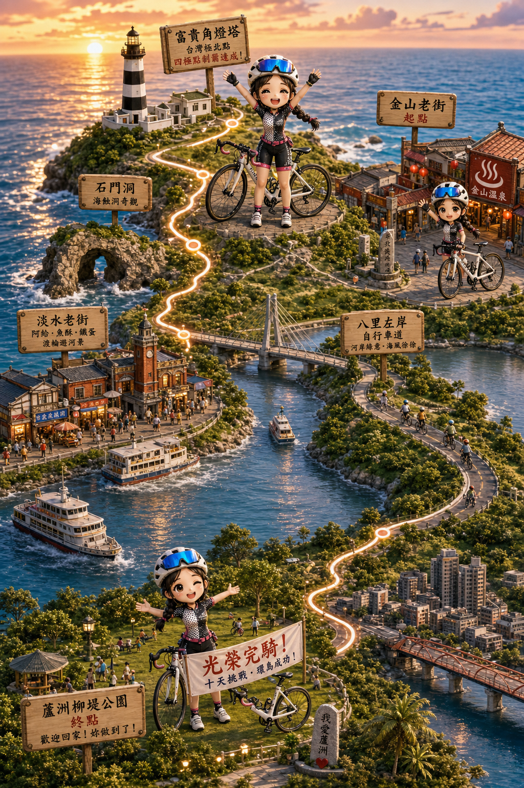
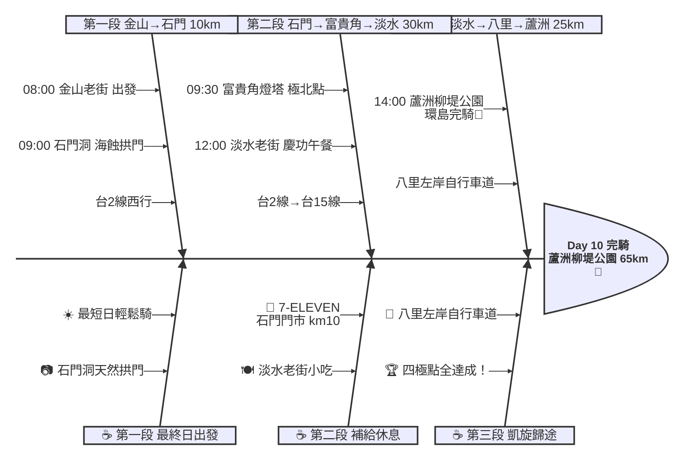

# Day 10：金山老街 ➔ 蘆洲柳堤公園（極北完騎凱旋歸途）

---

## 路線總覽

* **出發地**：金山 / 萬里
* **目的地**：富貴角 → 台北蘆洲柳堤公園
* **總距離**：51.4 公里（GPX 實測）
* **總爬升 / 下降**：↑ 300 m ／ ↓ 309 m（北海岸至淡水有丘陵，淡水後河岸自行車道平坦）
* **主要路線**：金山老街 ➔ 台2線西行 ➔ 石門洞 ➔ 富貴角燈塔（極北）➔ 三芝 ➔ 淡水老街 ➔ 八里左岸自行車道 ➔ 蘆洲柳堤公園

[📱 開啟 Google Maps 導航](https://www.google.com/maps/dir/金山老街/石門洞/富貴角燈塔/淡水老街/蘆洲柳堤公園/@25.2,121.5,11z/data=!4m2!4m1!3e1)

<iframe src="https://www.google.com/maps/d/u/0/embed?mid=11CpoZRaXL0mqm48giA0bbvo0P4c4b_4&ehbc=2E312F" width="100%" height="100%" style="border:none; border-radius: 8px;"></iframe>

---

## 詳細路線行程圖解

---

## 建議行程與時間配速

### 第一段：金山老街 → 石門洞（約 10 km）｜北海岸晨騎段

**距離**：10 km
**路況**：由金山沿台2線西行至石門。北海岸路段平緩，清晨車流少。最後一天可稍微睡晚些再出發。

**景點與補給：**
- 🚀 **08:00 金山老街**（起點，km 0）：環島最後一天！今日僅 65 km 且多為平路，可放鬆心情享受最後的騎行。金山清晨空氣清新，帶著完騎的期待出發。
- 🪨 **09:00 石門洞**（km 10，台2線旁）：天然形成的海蝕拱門，是北海岸代表性地質景觀。退潮時可走到岩洞下方近距離觀看。附近有潮間帶生態。停留 10 分鐘拍照。
- 🏪 **09:00 7-ELEVEN 石門門市**（km 10，石門區）：石門區補給，準備前往富貴角燈塔。

---

### 第二段：石門 → 富貴角燈塔 → 淡水老街（約 30 km）｜極北點完成段

**距離**：30 km
**路況**：台2線續西行，富貴角需從停車場步行約 15 分鐘至燈塔。過富貴角後經三芝進入淡水，路面平坦。

**景點與補給：**
- 🗼 **09:30 富貴角燈塔（極北點）**（km 13，台灣極北點）：台灣本島最北端的燈塔，獨特的黑白條紋塗裝（為方便海上辨識）。建於 1897 年日治時期，是台灣最古老的燈塔之一。從停車場步行約 15 分鐘抵達。四極點最後一座達成！停留 20 分鐘拍照慶祝。
- 🏘️ **12:00 淡水老街**（km 40，淡水河岸）：淡水河畔的觀光老街，阿給、鐵蛋、魚酥是三大名物。河岸步道可遠眺觀音山與出海口夕陽。環島慶功午餐就在這裡！停留 45 分鐘用餐逛街。

---

### 第三段：淡水 → 八里 → 蘆洲柳堤公園（約 25 km）｜凱旋歸途完騎段

**距離**：25 km
**路況**：由淡水沿淡水河自行車道南行，經關渡大橋至八里左岸自行車道，再沿二重疏洪道自行車道抵達蘆洲。全程為專用自行車道，無車流干擾，平坦舒適。

**景點與補給：**
- 🏆 **14:00 蘆洲柳堤公園**（km 65，環島完騎！）：回到 Day 1 出發點！十天環島、四極點全數達成。在柳堤公園拍攝完騎紀念照，慶祝這趟超過 900 公里的單車環島壯舉。晚間可在蘆洲市區享用慶功晚餐。🎉🚴‍♂️🇹🇼

---

## 晚餐推薦

| # | 店名 | 評分 | 留言數 | 貝葉斯分 | 備註 |
|:---:|:---|:---:|---:|:---:|:---|
| 1 | [李食好食製造所](https://www.google.com/maps/place/?q=place_id:ChIJORbrNYevQjQRNHh0dhDQGr4) | 4.9★ | 702 | 4.757 | 創意料理 蘆洲人氣店 |
| 2 | [醉餓感餐酒館](https://www.google.com/maps/place/?q=place_id:ChIJ14WKuX-pQjQRW1SzMUTbpPg) | 4.9★ | 453 | 4.7317 | 餐酒館 環島慶功 |
| 3 | [攤味](https://www.google.com/maps/place/?q=place_id:ChIJZd4jg62pQjQRBJ8ctynfEzQ) | 4.9★ | 265 | 4.7057 | 高空景觀餐廳 |
| 4 | [饎果](https://www.google.com/maps/place/?q=place_id:ChIJR62OKX-pQjQRBKG-LMPgzN4) | 5.0★ | 156 | 4.7006 | 精緻料理 |
| 5 | [樂樂燒肉 蘆洲店](https://www.google.com/maps/place/?q=place_id:ChIJYRBNAG2pQjQRAYNc0RXph68) | 4.7★ | 4016 | 4.6907 | 燒肉吃到飽 慶功宴 |

> 💡 *排序依據：留言數越多的高分店越可信（IMDB 風格貝葉斯平均）*
> 📋 *[看更多 >>](./day10_dinner.md)*

---

## 騎乘注意事項

1. **最後一天輕鬆騎**：全程僅 65 km 且多為平路+自行車道，是十天中最輕鬆的一天。可睡到 08:00 再出發，沿途慢慢享受最後的風景。
2. **富貴角步行注意**：從停車場到燈塔需步行約 15 分鐘（木棧道），自行車需停在停車場入口處。步道平緩好走但無遮蔭，注意防曬。
3. **淡水至蘆洲自行車道**：從淡水可走「金色水岸自行車道」沿河至關渡，過關渡大橋接「八里左岸自行車道」，再走「二重疏洪道自行車道」回蘆洲。全程專用車道，安全舒適。
4. **撤退方式**：淡水捷運站（紅線）可直達蘆洲站（橘線，需轉乘）。若天氣不佳或疲勞可搭捷運回家。
5. **完騎慶祝**：建議在蘆洲安排一頓慶功晚餐，環島十天辛苦了！柳堤公園周邊有多家餐廳可選擇（見 day10_dinner.md）。
6. **器材整理**：完騎後建議當天或隔天清洗單車、檢查零件磨損狀況。十天約 900+ km 的騎乘，鏈條、煞車皮、輪胎可能需要更換或保養。

---

## 更佳景點參考

> *當日候選池所有可評分點位皆已入選或為鎖定必經點，無加碼推薦。*

