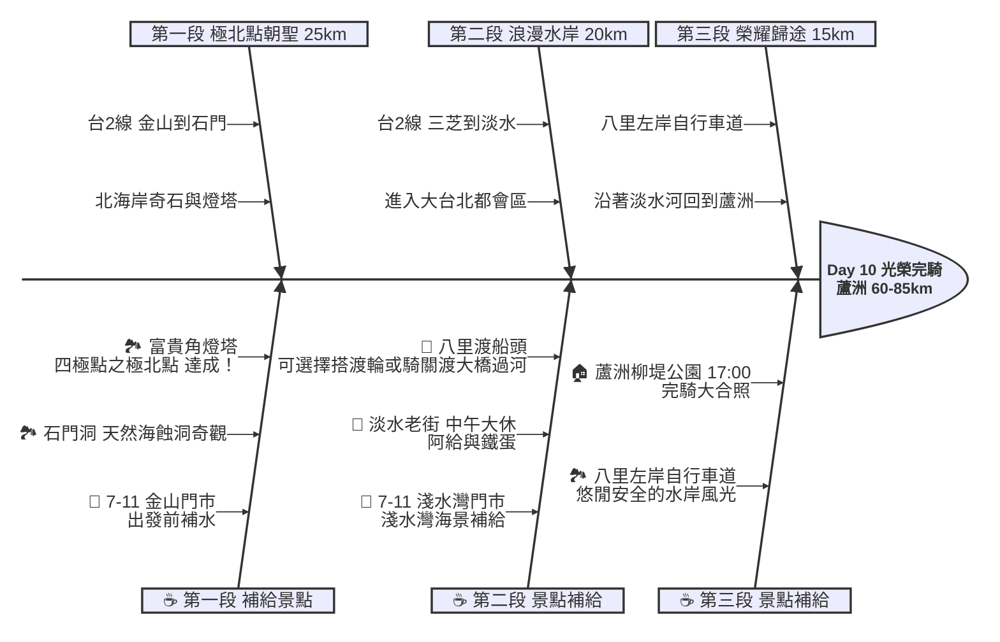

# Day 10：新北金山 ➔ 新北蘆洲 (極北點與光榮完騎)

## 📍 路線總覽
* **出發地**：新北金山老街
* **目的地**：新北蘆洲柳堤公園
* **總距離**：約 60 - 85 公里（依是否搭乘淡水渡輪而定）
* **總爬升**：微幅起伏（北海岸公路有部分丘陵，淡水到蘆洲為平緩自行車道）
* **主要路線**：台2線（北海岸公路） ➔ 淡水河自行車道 ➔ 八里左岸

---

### 🌍 Google Maps 導航與地圖預覽

#### 手機導航連結
👉 **[點擊此處開啟 Day 10 榮耀歸途導航（腳踏車模式）](https://www.google.com/maps/dir/?api=1&origin=%E6%96%B0%E5%8C%97%E9%87%91%E5%B1%B1%E8%80%81%E8%A1%97&destination=%E6%96%B0%E5%8C%97%E8%98%86%E6%B4%B2%E6%9F%B3%E5%A0%A4%E5%85%AC%E5%9C%92&waypoints=%E6%96%B0%E5%8C%97%E7%9F%B3%E9%96%80%E6%B4%9E%7C%E6%96%B0%E5%8C%97%E5%AF%8C%E8%B2%B4%E8%A7%92%E7%87%88%E5%A1%94%7C%E6%96%B0%E5%8C%97%E6%B7%A1%E6%B0%B4%E8%80%81%E8%A1%97%7C%E6%96%B0%E5%8C%97%E5%85%AB%E9%87%8C%E5%B7%A6%E5%B2%B8%E8%87%AA%E8%A1%8C%E8%BB%8A%E9%81%93&travelmode=bicycling)**

#### 🗺️ 路線小地圖

> 💡 *【預設版型提醒】：請在此放置生成的路線圖 (命名為 `day10_poster.png`)，並記得將上方圖片的超連結替換成您當天的 Google My Maps 專屬連結！*

---

## 🐟 魚骨圖 (Ishikawa Diagram)

---

## 🕒 建議行程與時間配速

### 第一段：極北點達成（金山 ➔ 石門 ➔ 富貴角）
* **距離**：約 25 km
* **路況**：從金山出發，沿著台2線北海岸公路西行。沿途會經過許多海蝕平台與灣澳，路面微幅起伏。
* **景點 / 休息補給**：
  * **出發補給**：金山市區的 **7-11 金山門市**。
  * **石門洞**（評分 4.3）：北海岸著名的天然海蝕拱門，擁有美麗的貝殼沙灘。
  * **富貴角燈塔**（評分 4.7，最高人氣必訪）：台灣本島極北點！黑白平行條紋的八角形燈塔。**恭喜達成四極點環島的最後一塊拼圖！**

### 第二段：浪漫淡水（富貴角 ➔ 三芝 ➔ 淡水）
* **距離**：約 20 km
* **路況**：經過三芝、淺水灣，沿著台2線逐漸靠近台北都會區。此段假日時車流極大，請務必騎在機慢車道並注意遊覽車。
* **景點 / 休息補給**：
  * **7-11 淺水灣門市**：三芝海岸線上的休息點。
  * **淡水老街**（評分 4.4）：本日**午餐大休點**。抵達捷運淡水站後，可在老街品嚐阿給、魚丸湯、鐵蛋等著名小吃。

### 第三段：光榮歸途（淡水 ➔ 八里 ➔ 蘆洲）
* **距離**：約 15 - 20 km
* **路況**：從淡水老街後，可選擇搭乘「淡水-八里渡輪」直接過淡水河（人車可上船），或是繼續往南騎乘經關渡大橋過河。過河後全程行駛於「八里左岸自行車道」，非常安全平坦。
* **景點 / 休息補給**：
  * **八里左岸自行車道**（評分 4.4）：遠離市區車囂，沿著美麗的淡水河左岸與紅樹林生態區騎乘，是一段非常享受的歸途。
  * **終點：蘆洲柳堤公園**（評分 4.3）：傍晚抵達出發時的起點。**恭喜！您已成功完成 10 天 1000 公里的台灣單車環島壯舉！** 記得拍下完騎大合照！

---

## 💡 騎乘注意事項

1. **北海岸東北季風**：秋冬季節北海岸同樣會面臨強烈的東北季風。雖然 Day 10 是由東向西騎乘，風向有時會偏側風或順風，但靠近海邊仍需注意強陣風。
2. **淡水塞車路段**：台2線淡水紅樹林段在假日或下班時間極度壅塞，機車與汽車爭道，強烈建議盡早轉入自行車道。
3. **渡輪體驗**：若時間允許，推薦在淡水老街搭乘渡輪前往八里，除了省下繞行關渡大橋的距離，還能在水上欣賞淡水河風光，為環島增添特別的回憶。
4. **慶功準備**：抵達蘆洲後，可以提前聯絡親友在柳堤公園迎接，並準備好完騎證書或慶功宴，為這趟旅程畫下完美的句點！
