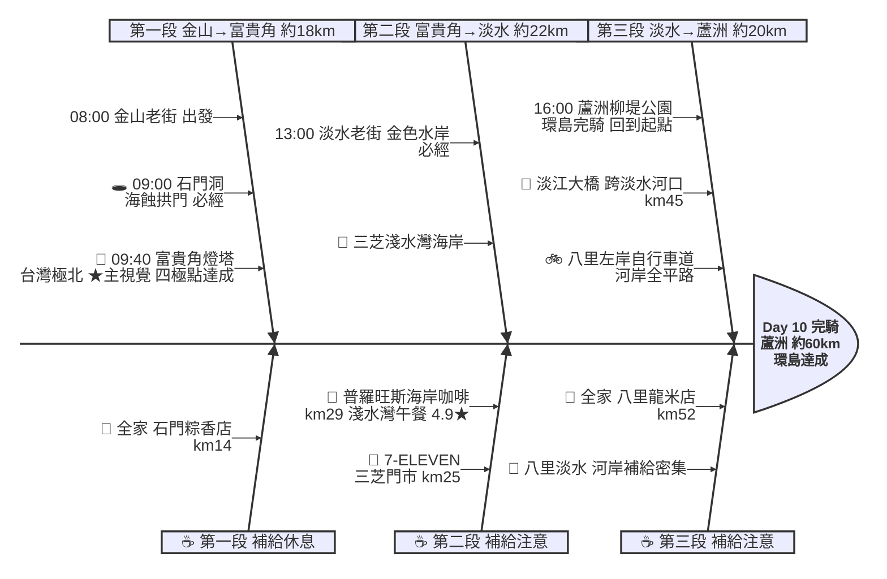

# Day 10：金山老街 ➔ 蘆洲柳堤公園（極北完騎凱旋歸途）

---

## 路線總覽

* **出發地**：金山 / 萬里
* **目的地**：台北蘆洲柳堤公園
* **總距離**：59.8 公里（GPX 實測）
* **總爬升 / 下降**：↑ 268 m ／ ↓ 276 m（台2線北海岸至淡水平緩，淡水→八里→蘆洲為河岸自行車道全平路，僅富貴角一帶小起伏）
* **主要路線**：金山老街 ➔ 台2線 ➔ 石門洞 ➔ 富貴角燈塔(極北) ➔ 三芝 ➔ 淡水老街 ➔ 淡江大橋跨淡水河 ➔ 八里左岸自行車道 ➔ 蘆洲柳堤公園

[📱 開啟 Google Maps 導航](https://www.google.com/maps/dir/?api=1&origin=%E6%96%B0%E5%8C%97%E5%B8%82%E9%87%91%E5%B1%B1%E8%80%81%E8%A1%97&destination=%E6%96%B0%E5%8C%97%E5%B8%82%E8%98%86%E6%B4%B2%E6%9F%B3%E5%A0%A4%E5%85%AC%E5%9C%92&waypoints=%E7%9F%B3%E9%96%80%E6%B4%9E%7C%E5%AF%8C%E8%B2%B4%E8%A7%92%E7%87%88%E5%A1%94%7C%E6%B7%A1%E6%B0%B4%E8%80%81%E8%A1%97%7C%E6%B7%A1%E6%B1%9F%E5%A4%A7%E6%A9%8B%7C%E5%85%AB%E9%87%8C%E6%B8%A1%E8%88%B9%E9%A0%AD%E8%80%81%E8%A1%97&travelmode=bicycling)

<iframe src="https://www.google.com/maps/d/u/0/embed?mid=11CpoZRaXL0mqm48giA0bbvo0P4c4b_4&ehbc=2E312F" width="100%" height="100%" style="border:none; border-radius: 8px;"></iframe>

---

## 詳細路線行程圖解

---

## 建議行程與時間配速

### 第一段：金山老街 → 富貴角燈塔（約 18 km）｜極北達成段

**距離**：18 km
**路況**：自金山沿台2線北海岸西行，經石門洞抵台灣本島最北點富貴角燈塔。最終日輕鬆出發，海岸風光明媚。

**景點與補給：**
- 🚀 **08:00 金山老街**（起點，km 0）：接續 Day9 終點。最終日里程短（約 61km），可從容出發，先逛金山老街吃早點。
- 🕳️ **09:00 石門洞**（km ~13，石門）：必經點（石門）。天然海蝕拱門地標（4.3★/1.2萬則），可下海堤散步。
- 🗼 **09:40 富貴角燈塔**（km ~18，石門）：必經點、四極點之一、本日★主視覺。台灣本島最北端黑白條紋燈塔（極北點），至此四極點全數達成！老梅綠石槽就在附近。

---

### 第二段：富貴角燈塔 → 淡水老街（約 22 km）｜北海岸三芝段

**距離**：22 km
**路況**：沿台2線（淡金公路）經三芝淺水灣南下抵淡水。沿途海景咖啡林立，淡水前車流漸多。

**景點與補給：**
- 🥤 **7-ELEVEN 三芝門市**（km ~25，三芝）：三芝補給點。
- 🍱 **11:30–12:30 普羅旺斯海岸咖啡**（km ~29，三芝淺水灣）：午餐大休點。淺水灣人氣海景餐廳（4.9★/3687），面海慶祝即將完騎。旁為芝蘭公園海上觀景平台。
- 🛍️ **13:00 淡水老街**（km ~40，淡水）：必經點（淡水）。金色水岸與老街美食（4.4★/3.3萬則），阿給、魚酥、鐵蛋必嚐。

---

### 第三段：淡水老街 → 蘆洲柳堤公園（約 20 km）｜淡江大橋河岸完騎段

**距離**：20 km
**路況**：自淡水老街沿台2乙轉接 2025 年通車的淡江大橋（淡水河口跨海斜張橋）越河抵八里，接八里左岸自行車道南行經渡船頭老街，續沿河濱車道經關渡大橋與二重疏洪道回蘆洲。全程河岸平坦專用道、橋景壯觀，凱旋收尾。

**景點與補給：**
- 🌉 **14:00 淡江大橋**（km ~45，淡水河口）：必經點。2025 年通車的淡水河口跨海斜張橋（4.5★/331），極北完騎跨河地標，橋上眺淡水河口與觀音山。
- ⛵ **14:40 八里渡船頭老街**（km ~48，八里）：左岸渡船頭老街（4.2★/3.5萬則），雙胞胎、孔雀蛤，與 Day1 首段呼應。
- 🥤 **全家便利商店 八里龍米店**（km ~52，八里）：八里左岸補給點。
- 🏁 **16:00 蘆洲柳堤公園**（km ~60，蘆洲）：環島終點！回到 Day1 出發的蘆洲柳堤公園，10 天四極點環島正式完騎，圓滿達成。

---

## 晚餐推薦

| # | 店名 | 評分 | 留言數 | 貝葉斯分 | 備註 |
|:---:|:---|:---:|---:|:---:|:---|
| 1 | [柒柒石頭火鍋 長安店](https://www.google.com/maps/place/?q=place_id:ChIJJ6CE7jmpQjQRKBMlDlZ5Tfc) | 5★ | 23784 | 4.9717 | 火鍋店 |
| 2 | [昭和園日式燒肉-蘆洲店](https://www.google.com/maps/place/?q=place_id:ChIJMZoHgrCoQjQRw5bUDHGHKJ0) | 4.8★ | 6551 | 4.7423 | 餐廳 |
| 3 | [官小二酸菜魚（蘆洲店）-酸菜魚｜蘆洲美食｜蘆洲長安街美食](https://www.google.com/maps/place/?q=place_id:ChIJc8HPy2-pQjQR1baFMrQGJT4) | 4.9★ | 1640 | 4.7015 | 餐廳 |
| 4 | [拍拍手披薩咖啡](https://www.google.com/maps/place/?q=place_id:ChIJU2im47CoQjQR3qmk6_xf37o) | 4.8★ | 1872 | 4.6569 | 餐廳 |
| 5 | [XO SHABU SHABU 蘆洲店](https://www.google.com/maps/place/?q=place_id:ChIJ5dWMwECpQjQRWA4b992AYt0) | 4.9★ | 1037 | 4.6501 | 餐廳 |

> 💡 *排序依據：留言數越多的高分店越可信（IMDB 風格貝葉斯平均）*
> 📋 *[看更多 >>](./day10_dinner.md)*

---

## 住宿推薦 🏨

| # | 飯店 | 評分 | 留言數 | 貝葉斯分 | 備註 |
|:---:|:---|:---:|---:|:---:|:---|
| 1 | [捷絲旅 台北三重館](https://www.google.com/maps/place/?q=place_id:ChIJDXlmoVqpQjQRUqH3LEuUcMo) | 4.7★ | 2736 | 4.6113 |  |
| 2 | [丰居旅店 微風館](https://www.google.com/maps/place/?q=place_id:ChIJnUT3l7-pQjQRyrvaW-Y3HDk) | 4.8★ | 853 | 4.5589 |  |
| 3 | [台北集賢商旅](https://www.google.com/maps/place/?q=place_id:ChIJ7T7l99GoQjQR6odvEqtERUU) | 4.5★ | 1279 | 4.4173 |  |
| 4 | [Two Tails Hotel 蘆洲](https://www.google.com/maps/place/?q=place_id:ChIJC08HLdCoQjQRkug4OZlWC7c) | 4.4★ | 2239 | 4.3682 |  |
| 5 | [樂頤飯店 La Clé Hotel Taipei](https://www.google.com/maps/place/?q=place_id:ChIJFUco3tGoQjQRCOKkHXAo51w) | 4.4★ | 822 | 4.3387 |  |

> 💡 *終點周邊 3 公里 · 17 筆候選 · IMDB 風格貝葉斯平均*
> 📋 *[看更多 >>](./day10_hotel.md)*

---

## 騎乘注意事項

1. **輕鬆完騎日**：本日約 60km、爬升約 268m，是 10 天中最短的一天，可放慢腳步享受北海岸與河岸風光、細細收尾。
2. **四極點達成**：富貴角燈塔為環島四極點（極東三貂角、極南鵝鑾鼻、極西國聖港、極北富貴角）最後一座，建議多停留拍照紀念。
3. **淡江大橋跨河**：以 2025 年通車的淡江大橋跨越淡水河口直抵八里（取代繞行上游關渡大橋），橋面長、河口風大，注意側風與行人、自行車道動線。
4. **淡水車流**：淡水老街與淡金公路車流多、假日人潮擁擠，牽車慢行注意行人。
5. **河岸自行車道**：八里左岸→二重疏洪道為河濱專用道，平坦好騎，與 Day1 首段相呼應、完美收尾。
6. **補給充足**：北海岸（金山、石門、三芝）至淡水、八里超商與餐廳密集，補給完全無虞。
7. **撤退方案**：北海岸可搭淡水客運至淡水捷運站，淡水、八里皆鄰近台北捷運與公車，交通便利。

---

## 更佳景點參考

> 以下為沿途 Bayesian 排名較高但未排入路線的備選點位。可視當天體力 / 天候 / 時間彈性加入。

### 景點備案

| 名次 | 名稱 | 評分 | 留言數 | 貝葉斯分 |
|:---:|:---|:---:|---:|:---:|
| 1 | 台北小奈良-淡水親子農場 梅花鹿 動物農場 淡水親子景點 淡水推薦景點 淡水觀光農場 好玩的親子景點 | 4.8★ | 908 | 4.69 |
| 2 | 鹿羽松牧場 | 4.9★ | 53 | 4.51 |
| 3 | 麟山鼻沙灘區 | 4.6★ | 165 | 4.5 |
| 4 | 八里左岸漫步廣場 | 4.6★ | 145 | 4.5 |
| 5 | 跳石海岸 | 4.5★ | 1,872 | 4.49 |

### 午餐 / 餐廳大休備案

| 名次 | 店名 | 評分 | 留言數 | 貝葉斯分 |
|:---:|:---|:---:|---:|:---:|
| 1 | 富基漁港北海岸a18a19春來活海鮮 | 4.9★ | 2,090 | 4.82 |
| 2 | 富基漁港A28小萍小珮活海鮮/富基漁港餐廳/富基漁港海鮮/restaurants/石門美食/附近美食/石門必吃 | 4.9★ | 1,314 | 4.79 |
| 3 | 牛仔莊園 | 4.8★ | 11,373 | 4.79 |

