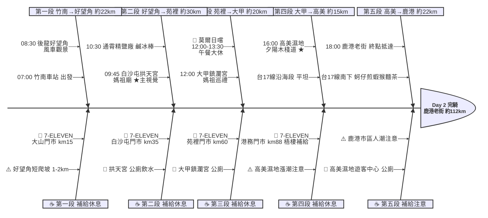

# Day 2：竹南車站 ➔ 鹿港老街（西海岸媽祖巡禮｜竹南→鹿港）

---

## 📍 路線總覽

* **出發地**：新竹 / 竹南
* **目的地**：鹿港 / 彰化
* **總距離**：約 100–115 公里
* **總爬升**：全程多平地，後龍好望角有 1–2 km 短爬坡，其餘沿台61/台1/台17線平坦
* **主要路線**：竹南 ➔ 台61線（後龍好望角）➔ 台1線（白沙屯/通霄/苑裡）➔ 大甲鎮瀾宮 ➔ 台17線（清水/梧棲）➔ 高美濕地 ➔ 鹿港老街

---

## 🌍 地圖與導航

[📱 手機導航連結（Google Maps 單車模式）](https://www.google.com/maps/dir/?api=1&origin=%E7%AB%B9%E5%8D%97%E7%81%AB%E8%BB%8A%E7%AB%99&destination=%E9%B9%BF%E6%B8%AF%E8%80%81%E8%A1%97&waypoints=%E5%BE%8C%E9%BE%8D%E5%A5%BD%E6%9C%9B%E8%A7%92%E9%A2%A8%E6%99%AF%E5%8D%80%7C%E7%99%BD%E6%B2%99%E5%B1%AF%E6%8B%B1%E5%A4%A9%E5%AE%AE%7C%E5%8F%B0%E9%B9%BD%E9%80%9A%E9%9C%84%E8%A7%80%E5%85%89%E5%9C%92%E5%8D%80%7C%E5%A4%A7%E7%94%B2%E9%8E%AE%E7%80%BE%E5%AE%AE%7C%E9%AB%98%E7%BE%8E%E6%BF%95%E5%9C%B0%E6%9C%A8%E6%A3%A7%E9%81%93&travelmode=bicycling)

#### 🗺️ 路線小地圖

> 💡 *【預設版型提醒】：請在此放置生成的路線圖 (命名為 `day2_poster.png`)，並記得將上方圖片的超連結替換成您當天的 Google My Maps 專屬連結！*

---

## 🐟 詳細路線行程圖解

---

## 🕒 建議行程與時間配速

### 第一段：竹南車站 → 後龍好望角（約 22 km）｜台61線海岸出發段

**距離**：22 km
**路況**：從竹南車站沿縣道接台61線西濱南下，過後龍溪後抵達好望角入口。最後 1–2 km 為短爬坡通往觀景台，全段路況良好。

**景點與補給：**
- 🚀 **07:00 竹南車站**（起點，km 0）：Day 1 終點繼續出發，站前有早餐店可補充體力。
- 🥤 **7-ELEVEN 大山門市**（km ~15，後龍鎮龍文路6號）：後龍北側補給點，4.3 分／168 評論，好望角前最後超商。
- 🏞️ **08:30 後龍好望角風景區**（km ~22）：苗栗海岸最美觀景台，4.4 分／17,664 評論，可俯瞰風車群與台灣海峽。短爬坡 1-2 km，停車場有公廁。

---

### 第二段：好望角 → 苑裡（約 30 km）｜白沙屯媽祖巡禮段

**距離**：30 km
**路況**：從好望角下坡接台1線南下，經白沙屯到通霄市區，再南下至苑裡。全段平坦，補給點密集。

**景點與補給：**
- 🥤 **7-ELEVEN 白沙屯門市**（km ~35，通霄鎮白東100號）：拱天宮旁 100m，補水與行動糧。
- ⛩️ **09:45 白沙屯拱天宮**（km ~35）：全日 Bayesian 評分最高（4.69），4.8 分／21,928 評論。著名媽祖廟、必訪景點，廟旁有公廁與小吃攤。★ 主視覺
- 🏭 **10:30 通霄精鹽廠 (台鹽通霄觀光園區)**（km ~50）：免費觀光工廠，4.1 分／7,279 評論。販售鹹冰棒，有公廁與飲水機。

---

### 第三段：苑裡 → 大甲鎮瀾宮（午餐大休）（約 20 km）｜媽祖文化雙廟段

**距離**：20 km
**路況**：台1線南下進入台中大甲，市區車多注意機車。鎮瀾宮周邊商圈熱鬧，建議牽車進入。

**景點與補給：**
- 🥤 **7-ELEVEN 苑裡門市**（km ~60，苑裡鎮房里北房8之9號）：台1線苑裡市區補給。
- ⛩️ **12:00 大甲鎮瀾宮**（km ~75）：全台最著名媽祖廟之一，4.6 分／17,285 評論。世界三大宗教慶典之一的大甲媽繞境起點。
- 🍱 **莫爾日嚐 MORE TASTE**（距鎮瀾宮約 250m）：12:00–13:30 午餐大休，4.8 分／480 評論，Bayesian 4.50。距廟最近的高評分餐廳。備選：龜鶴塘（4.8/407 評論，距廟 600m）。

---

### 第四段：大甲 → 高美濕地（約 15 km）｜台17線夕陽前奏段

**距離**：15 km
**路況**：台17線南下經清水進入梧棲，沿海路況開闊。靠近高美濕地時注意木棧道入口方向。

**景點與補給：**
- 🥤 **7-ELEVEN 港務門市**（km ~88，梧棲區中橫一路12號）：梧棲區評分最高便利商店（4.5），高美濕地前最後補給。
- 🌅 **16:00 高美濕地木棧道**（km ~90）：4.7 分／1,331 評論，木棧道延伸入海，夕陽必訪景點。建議 16:00 前抵達卡位拍照。⚠️ 漲潮時段木棧道關閉，出發前查潮汐。

---

### 第五段：高美濕地 → 鹿港老街（約 22 km）｜終點老街收尾段

**距離**：22 km
**路況**：從高美沿台17線南下至鹿港，跨越大肚溪後進入彰化縣境。鹿港市區人車多，老街口需牽車。

**景點與補給：**
- 🏁 **18:00 鹿港老街**（km ~112，鹿港鎮埔頭街3號）：當日終點，4.5 分／42,109 評論。蚵仔煎、蝦猴、麵茶必嚐。老街周邊有多間民宿，可預訂過夜。

---

## 💡 騎乘注意事項

1. **好望角短爬坡**：好望角入口至觀景台 1–2 km 為連續上坡，建議切到輕齒比慢速踏踩，俯瞰風車群風景值回票價。
2. **媽祖廟禮儀**：白沙屯拱天宮、大甲鎮瀾宮為信仰聖地，進入廟區應牽車、勿大聲喧嘩，廟方有提供飲水與廁所。
3. **高美濕地潮汐**：木棧道在漲潮時段（高潮前後 1.5 小時）關閉，出發前查當日潮汐表（中央氣象署或潮汐預報 App）；最佳拍照時段為夕陽前 30 分鐘。
4. **補給空窗**：好望角（km22）→ 白沙屯（km35）約 13 km、苑裡（km60）→ 大甲（km75）約 15 km，皆需備滿 1 瓶水。
5. **鹿港市區交通**：老街周邊機車人潮密集，建議下午 16:00 前抵達卡夕陽，18:00 後再進老街吃晚餐。
6. **撤退方案**：km15 後龍站搭區間車、km60 苑裡站搭區間車、km75 大甲站搭區間車與山線、km110 鹿港無火車站可搭客運至彰化／台中站。

