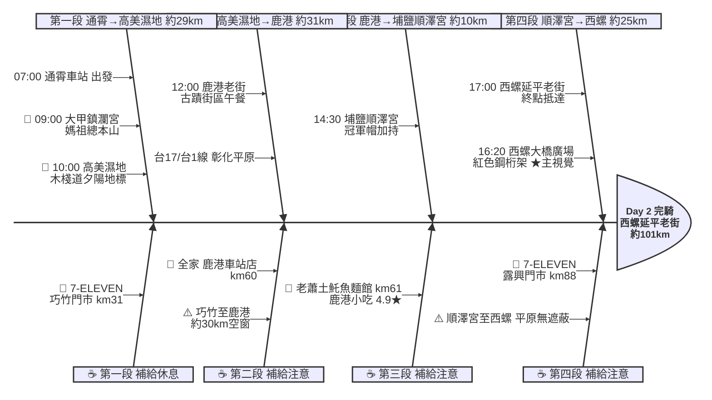

# Day 2：通霄車站 ➔ 西螺延平老街（宮廟巡禮．通霄到西螺）

---

## 路線總覽

* **出發地**：通霄
* **目的地**：西螺
* **總距離**：100.0 公里（GPX 實測）
* **總爬升 / 下降**：↑ 138 m ／ ↓ 118 m（全程平坦，台61線轉台1線縱貫公路，幾乎無爬升）
* **主要路線**：通霄 ➔ 大甲鎮瀾宮 ➔ 高美濕地 ➔ 台17/台1線 ➔ 鹿港老街 ➔ 埔鹽順澤宮 ➔ 西螺大橋廣場 ➔ 西螺延平老街

[📱 開啟 Google Maps 導航](https://www.google.com/maps/dir/?api=1&origin=%E8%8B%97%E6%A0%97%E7%B8%A3%E9%80%9A%E9%9C%84%E8%BB%8A%E7%AB%99&destination=%E9%9B%B2%E6%9E%97%E7%B8%A3%E8%A5%BF%E8%9E%BA%E5%BB%B6%E5%B9%B3%E8%80%81%E8%A1%97&waypoints=%E5%A4%A7%E7%94%B2%E9%8E%AE%E7%80%BE%E5%AE%AE%7C%E5%8F%B0%E4%B8%AD%E9%AB%98%E7%BE%8E%E6%BF%95%E5%9C%B0%7C%E9%B9%BF%E6%B8%AF%E8%80%81%E8%A1%97%7C%E5%9F%94%E9%B9%BD%E9%A0%86%E6%BE%A4%E5%AE%AE%7C%E8%A5%BF%E8%9E%BA%E5%A4%A7%E6%A9%8B&travelmode=bicycling)

<iframe src="https://www.google.com/maps/d/u/0/embed?mid=1_9V2ea1aWNt_hCw7_bEEAwka0qNWlBQ&ehbc=2E312F" width="100%" height="100%" style="border:none; border-radius: 8px;"></iframe>

---

## 詳細路線行程圖解

---

## 建議行程與時間配速

### 第一段：通霄車站 → 高美濕地（約 29 km）｜海線宮廟段

**距離**：29 km
**路況**：自通霄沿台1線／台61線南下，經苑裡進大甲參拜鎮瀾宮，續沿海線抵清水高美濕地。全段平坦、補給密集。

**景點與補給：**
- 🚀 **07:00 通霄車站**（起點，km 0）：接續 Day1 終點，站前整裝出發，周邊超商與早餐店密集。
- 🏯 **09:00 大甲鎮瀾宮**（km ~19，大甲）：必經點。台灣媽祖信仰中心（4.6★/1.7萬則），香火鼎盛，廟埕周邊小吃多，可補給休息。
- 🌅 **10:00 高美濕地遊客中心**（km ~29，清水）：國際級濕地（4.2★/4080），木棧道與夕陽地標，破大甲到鹿港長空檔的人氣景點。海風強。

---

### 第二段：高美濕地 → 鹿港老街（約 31 km）｜彰化平原段

**距離**：31 km
**路況**：沿台17/台1線南下，過大肚溪進彰化，經伸港、線西抵鹿港。平原路段補給稍稀，巧竹門市補滿再上路。

**景點與補給：**
- 🥤 **7-ELEVEN 巧竹門市**（km ~31，清水）：離開高美濕地後補給，本段約 30km 空窗，先補滿水分。
- 🏛️ **12:00 鹿港老街**（km ~60，鹿港）：必經點。國家級古蹟街區（4.5★/4.2萬則），龍山寺、摸乳巷、桂花巷，午餐美食天堂。
- 🥤 **全家便利商店 鹿港車站店**（km ~60，鹿港）：鹿港市區補給點，老街周邊。

---

### 第三段：鹿港老街 → 埔鹽順澤宮（約 10 km）｜信仰加持段

**距離**：10 km
**路況**：於鹿港午餐後沿縣道南下進埔鹽，路程短、平坦。

**景點與補給：**
- 🍱 **12:15–13:15 老蕭土魠魚麵館（日式豬排便當）**（km ~61，鹿港）：午餐大休點。鹿港高人氣小吃（4.9★/2782），土魠魚羹與日式豬排便當。客滿可改老街其他名店。
- 🧢 **14:30 埔鹽順澤宮**（km ~70，埔鹽）：必經點。因「冠軍帽」爆紅的廟宇（4.7★/2152），單車客打卡熱點，可求帽求平安。

---

### 第四段：埔鹽順澤宮 → 西螺延平老街（約 25 km）｜濁水溪收尾段

**距離**：25 km
**路況**：沿台1線南下、改走溪州大橋跨濁水溪進雲林西螺（西螺大橋已封閉禁行，不可由橋面通行）。平原無遮蔽、午後易有逆風，露興門市補滿再過溪州大橋。

**景點與補給：**
- 🥤 **7-ELEVEN 露興門市**（km ~88，溪州）：過溪州大橋前最後補給，平原段先補滿水分。
- 🌉 **16:20 西螺大橋廣場**（km ~90，西螺端岸邊）：必經點、本日★主視覺。紅色鋼桁架歷史大橋橫跨濁水溪，台灣公路地標；橋體目前封閉禁行，於西螺端廣場停留觀景拍照，過河走鄰側溪州大橋（台1線）。
- 🏁 **17:00 西螺延平老街**（km ~94，西螺）：當日終點。延平老街巴洛克建築、丸莊醬油、西螺麻糬，住宿與晚餐選擇多。

---

## 晚餐推薦

| # | 店名 | 評分 | 留言數 | 貝葉斯分 | 備註 |
|:---:|:---|:---:|---:|:---:|:---|
| 1 | [龍圓舊事](https://www.google.com/maps/place/?q=place_id:ChIJkxzAQoW1bjQREVoyafkkQjk) | 4.9★ | 1049 | 4.7582 | 餐廳 |
| 2 | [幸福Mochi-西螺麻糬 延平老街店](https://www.google.com/maps/place/?q=place_id:ChIJdbHqD321bjQRTQn90CyZpzo) | 4.8★ | 1469 | 4.7106 | 甜品餐廳 |
| 3 | [小兄弟牛排館](https://www.google.com/maps/place/?q=place_id:ChIJOXZihj60bjQR_HC6lLbjiPs) | 4.8★ | 1421 | 4.7082 | 牛排館 |
| 4 | [市場光壽司](https://www.google.com/maps/place/?q=place_id:ChIJ61kkkT61bjQRt7nC6GAp2XQ) | 4.7★ | 1126 | 4.6147 | 壽司店 |
| 5 | [川詠酸菜魚西螺店|寵物友善餐廳](https://www.google.com/maps/place/?q=place_id:ChIJI1x6nKu1bjQROn_WeWd1P_k) | 4.7★ | 762 | 4.5872 | 餐廳 |

> 💡 *排序依據：留言數越多的高分店越可信（IMDB 風格貝葉斯平均）*
> 📋 *[看更多 >>](./day2_dinner.md)*

---

## 住宿推薦 🏨

| # | 飯店 | 評分 | 留言數 | 貝葉斯分 | 備註 |
|:---:|:---|:---:|---:|:---:|:---|
| 1 | [粨倉文旅（請先至官網看訂房須知！）](https://www.google.com/maps/place/?q=place_id:ChIJncdBCgC1bjQRcGFJwub0ibA) | 4.9★ | 345 | 4.6755 |  |
| 2 | [西螺巴布客住宿](https://www.google.com/maps/place/?q=place_id:ChIJ2cUbXeu1bjQRFOVyfOmOE4E) | 4.9★ | 76 | 4.4352 |  |
| 3 | [西螺後街童畫民宿](https://www.google.com/maps/place/?q=place_id:ChIJB4HrLT-0bjQR4xIYtUtAP4I) | 4.5★ | 240 | 4.3876 |  |
| 4 | [西螺黎明驛站休閒民宿](https://www.google.com/maps/place/?q=place_id:ChIJP4FeHRe0bjQR8N12sM1xLno) | 4.6★ | 54 | 4.3199 |  |
| 5 | [旅人路過時](https://www.google.com/maps/place/?q=place_id:ChIJ75qM7hW0bjQR_GkDcwEyvmI) | 4.5★ | 71 | 4.3104 |  |

> 💡 *終點周邊 3 公里 · 14 筆候選 · IMDB 風格貝葉斯平均*
> 📋 *[看更多 >>](./day2_hotel.md)*

---

## 騎乘注意事項

1. **平原逆風**：彰化、雲林平原段無遮蔽，午後常有偏南逆風，建議控制節奏、預留時間。
2. **補給空窗（沿實際路線）**：巧竹(km31)→鹿港(km60) 約 29km、露興(km88) 後過橋即抵西螺，鹿港與西螺市區超商密集，平原段請於前一站補滿。
3. **宮廟參拜時間**：大甲鎮瀾宮香客多，假日廟埕人潮擁擠，牽車慢行注意行人。
4. **午餐確認**：鹿港老街美食眾多，老蕭土魠魚麵館（4.9★）尖峰需排隊，可改鹿港圓環頂、老牌麵店等。
5. **撤退方案**：km19 大甲站、km60 鹿港可至彰化／員林轉乘、終點西螺無台鐵站可搭客運至斗六或員林站轉乘台鐵。

---

## 更佳景點參考

> 以下為沿途 Bayesian 排名較高但未排入路線的備選點位。可視當天體力 / 天候 / 時間彈性加入。

### 景點備案

| 名次 | 名稱 | 評分 | 留言數 | 貝葉斯分 |
|:---:|:---|:---:|---:|:---:|
| 1 | 白沙屯拱天宮 | 4.8★ | 21,940 | 4.8 |
| 2 | 山邊媽祖宮 | 4.8★ | 3,365 | 4.78 |
| 3 | 鹿港龍山寺 | 4.7★ | 10,027 | 4.69 |
| 4 | 高美濕地木棧道 | 4.7★ | 1,331 | 4.67 |
| 5 | 蕭家古厝 | 4.8★ | 179 | 4.62 |

### 午餐 / 餐廳大休備案

| 名次 | 店名 | 評分 | 留言數 | 貝葉斯分 |
|:---:|:---|:---:|---:|:---:|
| 1 | 溪湖拾貳 | 4.9★ | 1,172 | 4.82 |
| 2 | 龍圓舊事 | 4.9★ | 1,049 | 4.82 |
| 3 | NU PASTA 彰化溪湖店 | 4.9★ | 1,153 | 4.82 |

