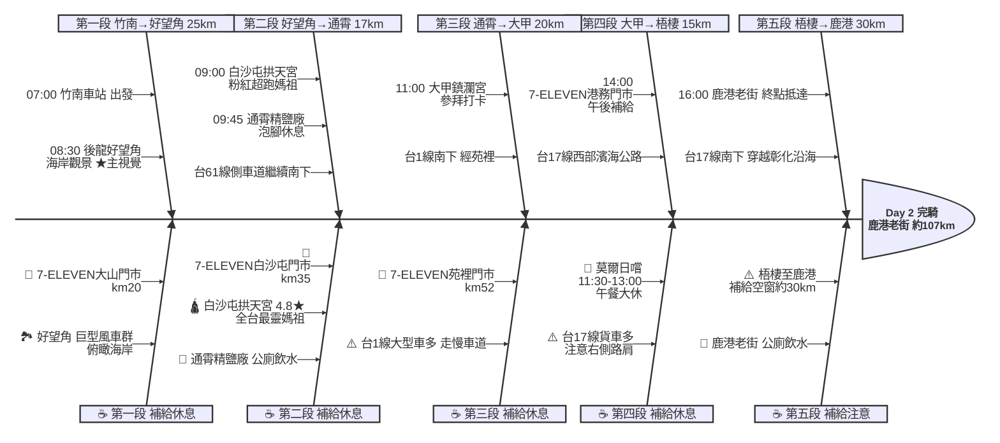

# Day 2：竹南車站 ➔ 鹿港老街（西濱風車海岸南行）

---

## 📍 路線總覽

* **出發地**：新竹 / 竹南
* **目的地**：鹿港 / 彰化
* **總距離**：99.7 公里（GPX 實測）
* **總爬升**：全程平坦，沿西濱海岸線南下幾乎無爬升
* **主要路線**：竹南車站 ➔ 台61線(西濱) ➔ 好望角 ➔ 白沙屯拱天宮 ➔ 通霄精鹽廠 ➔ 台1線 ➔ 大甲鎮瀾宮 ➔ 台17線 ➔ 鹿港老街

---

## 🌍 地圖與導航

#### 🖼️ 海報

#### 📱 手機導航連結（Google Maps 單車模式）

[開啟 Google Maps 導航](https://www.google.com/maps/dir/竹南車站/後龍好望角/白沙屯拱天宮/通霄精鹽廠/大甲鎮瀾宮/鹿港老街/@24.3,120.6,10z/data=!4m2!4m1!3e1)

#### 🗺️ 我的地圖 (My Map) 路線

<iframe src="https://www.google.com/maps/d/u/0/embed?mid=1_9V2ea1aWNt_hCw7_bEEAwka0qNWlBQ&ehbc=2E312F" width="100%" height="450" style="border:none; border-radius: 8px; box-shadow: 0 4px 6px rgba(0,0,0,0.1);"></iframe>

---

## 🐟 詳細路線行程圖解

---

## 🕒 建議行程與時間配速

### 第一段：竹南車站 → 後龍好望角（約 25 km）｜西濱啟程追風段

**距離**：25 km
**路況**：竹南出發接台61線西濱快速道路側車道南下，沿途平坦無坡，海風從左側吹來。路面寬敞車流少，視野開闊可見海上風車群。

**景點與補給：**
- 🚀 **07:00 竹南車站**（起點，km 0）：Day 1 終點續行，站前有公廁與便利商店，出發前補足水分。
- 🏪 **07:50 7-ELEVEN 大山門市**（km 20）：進入後龍前最後補給點，台61側車道旁。
- 🌊 **08:30 後龍好望角風景區**（km 25，苗栗海岸最美觀景台）：巨型白色風車群 + 俯瞰整個西部海岸線的絕美景觀。停留 15-20 分鐘拍照。有公廁。

---

### 第二段：好望角 → 白沙屯拱天宮 → 通霄精鹽廠（約 17 km）｜海線媽祖巡禮段

**距離**：17 km
**路況**：續沿台61側車道南下，經白沙屯、通霄。路況平坦良好，沿途可見鐵路海線火車。白沙屯拱天宮距7-ELEVEN步行3分鐘，是「粉紅超跑」遶境的起點。

**景點與補給：**
- 🏪 **08:55 7-ELEVEN 白沙屯門市**（km 35）：白沙屯聚落補給，距白沙屯拱天宮步行3分鐘。
- 🛕 **09:00 白沙屯拱天宮**（km 36，全台最具靈氣媽祖廟）：「粉紅超跑」媽祖遶境起點。4.8★/21936則。廟宇彩繪屋脊龍鳳精美。停留 10-15 分鐘。
- 🧂 **09:45 通霄精鹽廠**（km 42，台鹽觀光園區）：免費泡腳池舒緩雙腿、鹽業歷史展覽。停留 20 分鐘。週一公休。

---

### 第三段：通霄 → 大甲鎮瀾宮（約 20 km）｜媽祖信仰核心段

**距離**：20 km
**路況**：由通霄轉接台1線南下，經苑裡進入大甲。台1線有部分路段車流較多，注意大型車輛。進入大甲市區後路寬易騎。

**景點與補給：**
- 🏪 **10:15 7-ELEVEN 苑裡門市**（km 50）：苑裡市區補給，調整補水與食物。
- 🛕 **11:00 大甲鎮瀾宮**（km 60，台灣最著名媽祖廟）：大甲媽祖遶境起點。建築華麗壯觀，廟口美食區小吃眾多。停留 20 分鐘參拜。

---

### 第四段：大甲 → 梧棲（午餐大休）（約 15 km）｜午間補給續航段

**距離**：15 km
**路況**：大甲午餐後沿台17線（西部濱海公路）南下。經清水、梧棲工業區，路面平坦但貨車較多，注意右側路肩。

**景點與補給：**
- 🍽️ **11:30–13:00 莫爾日嚐 MORE TASTE**（km 60，距鎮瀾宮步行5分鐘）：法式料理咖啡廳，餐點精緻。午餐大休 1.5 小時補充體力。
- 🏪 **14:00 7-ELEVEN 港務門市**（km 75，梧棲）：午後補給，台中港區。

---

### 第五段：梧棲 → 鹿港老街（約 30 km）｜終點衝刺段

**距離**：30 km
**路況**：沿台17線續南，經大肚溪口進入彰化境內。最後 10 公里接彰鹿路直達鹿港。此段為當日最長無補給路段，務必在梧棲補滿水。

**景點與補給：**
- 🏛️ **16:00 鹿港老街**（km 105，當日終點）：台灣保存最完整的清代商業街區。紅磚老屋、手工藝品、老街小吃一次滿足。

---

## 🍽️ 晚餐推薦（終點周邊 3km · 貝葉斯排序）

| # | 店名 | 評分 | 留言數 | 貝葉斯分 | 備註 |
|:---:|:---|:---:|---:|:---:|:---|
| 1 | [敘敘究燒肉專門店](https://www.google.com/maps/place/?q=place_id:ChIJDyBgePpFaTQRJUsJs7vOpkc) | 4.9★ | 2739 | 4.8347 | 燒肉 需預約 |
| 2 | [一畝石鍋 鹿港總店](https://www.google.com/maps/place/?q=place_id:ChIJpRXSwg9HaTQRwOSJh1lAlM8) | 4.9★ | 2150 | 4.8225 | 石頭火鍋 高CP值 |
| 3 | [NU PASTA 彰化鹿港店](https://www.google.com/maps/place/?q=place_id:ChIJPzC4BMlFaTQRrCS331iUfUQ) | 4.9★ | 1224 | 4.7907 | 義式連鎖 平價 |
| 4 | [快樂蘇打 Happy Soda鹿港店](https://www.google.com/maps/place/?q=place_id:ChIJ0Z-zC6lHaTQREgeeip-pG2U) | 4.8★ | 1430 | 4.7417 | 氣氛佳 份量足 |
| 5 | [玖燒 炭烤](https://www.google.com/maps/place/?q=place_id:ChIJB3GtcN9FaTQRIqFsC2PKdqk) | 4.9★ | 219 | 4.7028 | 炭烤串燒 宵夜 |

> 💡 *排序依據：留言數越多的高分店越可信（IMDB 風格貝葉斯平均）*
> 📋 *完整 16 筆候選排名請見 [`day2_dinner.md`](./day2_dinner.md)*

---

## 💡 騎乘注意事項

1. **強風注意**：台61線西濱全程無遮蔽，夏季南風助騎、冬季北風逆行。查看風向預報再決定出發時間。
2. **台1線車流**：苑裡至大甲段台1線大型車輛多，建議走慢車道或平行替代道路。
3. **梧棲至鹿港補給空窗**：km 75–105 共 30 公里無便利商店，務必在梧棲 7-ELEVEN 補滿水與食物。
4. **撤退車站**：後龍站（km 20）、白沙屯站（km 35）、通霄站（km 42）、苑裡站（km 50）、大甲站（km 62）— 均為海線車站可直接上車。
5. **通霄精鹽廠與莫爾日嚐均週一公休**：若當日為週一，精鹽廠改為純路過（已有拱天宮）；午餐改至花義複合式餐飲（4.8★/502則，大甲中山路一段1237號）。
6. **鹿港老街營業時間**：多數店家 10:00–18:00，晚到可能部分歇業，但周邊餐廳仍營業。

---

## ✨ 更佳景點參考（未排入路線，加碼推薦）

> 以下為沿途 Bayesian 排名較高但未排入路線的備選點位（資料來源：`python3 scripts/plan.py review 2` 候選池，11 筆）。可視當天體力 / 天候 / 時間彈性加入。

### 景點備案

| 名次 | 名稱 | 評分 | 留言數 | 貝葉斯分 |
|:---:|:---|:---:|---:|:---:|
| 1 | 高美濕地木棧道 | 4.7★ | 1,331 | 4.64 |

### 午餐 / 餐廳大休備案

| 名次 | 店名 | 評分 | 留言數 | 貝葉斯分 |
|:---:|:---|:---:|---:|:---:|
| 1 | 花義複合式餐飲 | 4.8★ | 502 | 4.63 |
| 2 | 龜鶴塘 | 4.8★ | 407 | 4.63 |
| 3 | 莫爾日嚐 MORE TASTE | 4.8★ | 250 | 4.61 |

> 💡 *表格由 `compose-better-attractions` 從候選池自動生成；如需補敘述（路況、時段建議等），直接編輯 `_plan/segments.json.better_attractions` 即可。*

