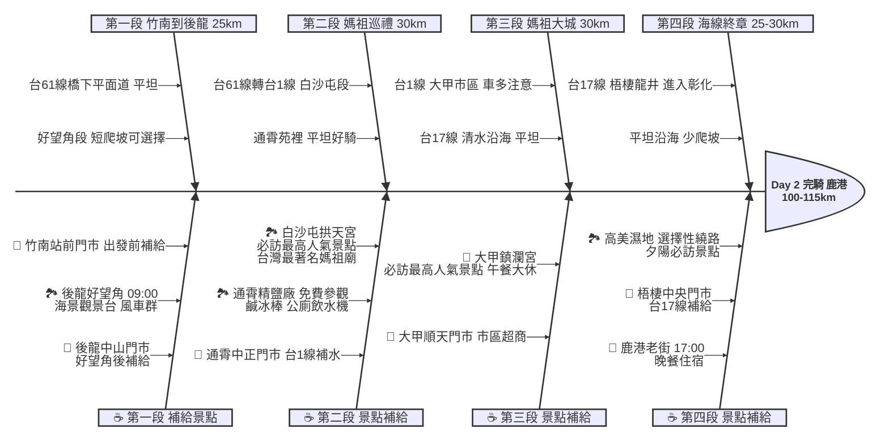

# Day 2：苗栗竹南 ➔ 彰化鹿港 (西濱媽祖海線朝聖之旅)

## 📍 路線總覽
* **出發地**：苗栗竹南車站
* **目的地**：彰化鹿港老街
* **總距離**：約 100 - 115 公里
* **總爬升**：極低（好望角短程爬坡約 50m 外，全程平坦）
* **主要路線**：台61線（西濱快速公路橋下平面道路） ➔ 台1線 ➔ 台17線

---

### 🌍 Google Maps 導航與地圖預覽

#### 手機導航連結
👉 **[點擊此處開啟 Day 2 西濱媽祖海線導航（腳踏車模式）](https://www.google.com/maps/dir/?api=1&origin=%E7%AB%B9%E5%8D%97%E8%BB%8A%E7%AB%99&destination=%E5%BD%B0%E5%8C%96%E9%B9%BF%E6%B8%AF%E8%80%81%E8%A1%97&waypoints=%E5%BE%8C%E9%BE%8D%E5%A5%BD%E6%9C%9B%E8%A7%92%E9%A2%A8%E6%99%AF%E5%8D%80%7C%E8%8B%97%E6%A0%97%E9%80%9A%E9%9C%84%E7%99%BD%E6%B2%99%E5%B1%AF%E6%8B%B1%E5%A4%A9%E5%AE%AE%7C%E5%8F%B0%E4%B8%AD%E5%A4%A7%E7%94%B2%E9%8E%AE%E7%80%BE%E5%AE%AE%7C%E5%8F%B0%E4%B8%AD%E6%B8%85%E6%B0%B4%E9%AB%98%E7%BE%8E%E6%BF%95%E5%9C%B0&travelmode=bicycling)**

> *(💡 好望角為短程爬坡，不想爬坡可沿台61線平面繞過；高美濕地為選擇性繞路，需額外 3-5 km。)*

#### 🗺️ 路線小地圖

> 💡 *【預設版型提醒】：請在此放置生成的路線圖 (命名為 `day2_poster.png`)，並記得將上方圖片的超連結替換成您當天的 Google My Maps 專屬連結！*

---

## 🐟 魚骨圖 (Ishikawa Diagram)

---

## 🕒 建議行程與時間配速

### 第一段：追風啟程（竹南 ➔ 後龍 ➔ 好望角）
* **距離**：約 25 km
* **路況**：從竹南車站沿台61線橋下平面道路南下，路況平坦。好望角為短程爬坡（約 1-2 km 陡坡），可視體力決定是否繞上去。
* **景點 / 休息補給**：
  * **出發補給**：竹南車站附近的 **7-11 竹南站前門市** 補滿水與早餐，再出發。
  * **後龍好望角**（評分 4.4，推薦景點）：苗栗海岸線最美觀景台，可俯瞰大風車群與後龍海岸線。爬坡約 1-2 km，建議牽車上去，山頂有簡易公廁。
  * **7-11 後龍中山門市**：好望角下來後台61線旁，是進入白沙屯前的最佳補給點。

### 第二段：媽祖巡禮（後龍 ➔ 白沙屯拱天宮 ➔ 通霄 ➔ 苑裡）
* **距離**：約 30 km
* **路況**：台61線轉入台1線南下。白沙屯至通霄為海岸線平坦路段。
* **景點 / 休息補給**：
  * **白沙屯拱天宮**（評分 4.8，最高人氣必訪景點）：台灣最著名媽祖廟之一，每年進香為全台盛事。廟旁有公廁與小吃攤，可在此短暫休息祈福。
  * **通霄精鹽廠（台鹽觀光工廠）**（評分 4.1，值得一看）：免費參觀，有鹹冰棒（消暑神器）、公廁與飲水機，適合補充能量。
  * **7-11 通霄中正門市**：台1線旁，進入大甲前的最後穩定補給點。

### 第三段：大甲媽祖城（苑裡 ➔ 大甲 ➔ 清水）
* **距離**：約 30 km
* **路況**：台1線大甲市區車流較多，過大甲後轉台17線沿海南下，路況恢復平坦。
* **景點 / 休息補給**：
  * **大甲鎮瀾宮**（評分 4.6，最高人氣必訪景點）：台灣最知名的媽祖廟，Discovery 評選世界三大宗教慶典。本日**午餐大休點**，廟旁大甲市場有蔥油餅、芋頭酥等大甲名產。
  * **7-11 大甲順天門市**：鎮瀾宮旁，大休後補滿水再出發。
  * **中油 龍井站**：台17線龍井段，可借廁所。

### 第四段：海線終章（清水 ➔ 梧棲 ➔ 鹿港）
* **距離**：約 25-30 km
* **路況**：台17線沿海南下，經梧棲、龍井進入彰化，路況平坦。
* **景點 / 休息補給**：
  * **高美濕地**（評分 4.5，最高人氣景點）：選擇性繞路 3-5 km。木棧道延伸入海，夕陽時分最美，建議下午 16:00 前抵達。為本日唯一夕陽景點。
  * **7-11 梧棲中央門市**：台17線梧棲段，進鹿港前最後補給。
  * **終點：鹿港老街**（評分 4.5，最高人氣）：傍晚 17:00 抵達，逛老街品嚐蚵仔煎、蝦猴、麵茶等鹿港名產。

---

## 💡 騎乘注意事項

1. **好望角爬坡**：約 1-2 km 陡坡，如不想爬坡可沿台61線繞過，不影響主線行程。
2. **大甲市區車流**：台1線大甲段砂石車多，靠外側機慢車道騎乘，注意紅綠燈。
3. **補給充裕**：Day 2 補給密集，後龍、通霄、大甲、清水、梧棲均有超商，不用擔心斷水。
4. **高美濕地時機**：若想看夕陽，需在 16:00 前抵達；若時間不夠，可跳過繼續前往鹿港。
5. **撤退方案**：
   * **後龍車站**（約 25 km）：距好望角約 5 km，海線台鐵車站
   * **通霄車站**（約 45 km）：台1線轉入市區約 2 km
   * **大甲車站**（約 60 km）：鎮瀾宮旁，台鐵海線車站
   * **清水車站**（約 75 km）：台17線旁，轉入市區即達
