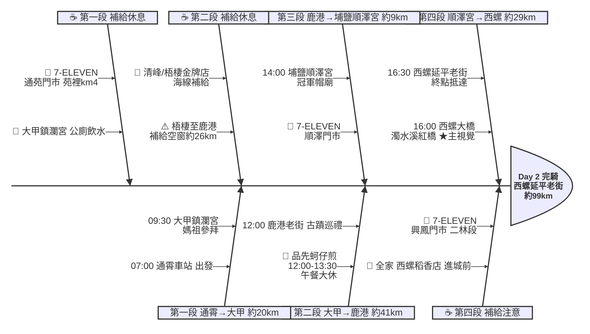

# Day 2：通霄車站 ➔ 西螺延平老街（海線媽祖香路．通霄到西螺）

---

## 路線總覽

* **出發地**：通霄
* **目的地**：西螺
* **總距離**：99.0 公里（GPX 實測）
* **總爬升 / 下降**：西濱與台1線平坦，全程幾乎無爬升
* **主要路線**：通霄車站 ➔ 苑裡 ➔ 台61/台17線 ➔ 大甲鎮瀾宮 ➔ 鹿港老街（午餐）➔ 埔鹽順澤宮 ➔ 台1線 ➔ 西螺大橋 ➔ 西螺延平老街

[📱 開啟 Google Maps 導航](https://www.google.com/maps/dir/?api=1&origin=%E9%80%9A%E9%9C%84%E8%BB%8A%E7%AB%99&destination=%E8%A5%BF%E8%9E%BA%E5%BB%B6%E5%B9%B3%E8%80%81%E8%A1%97&waypoints=%E8%8B%97%E6%A0%97%E7%B8%A3%E8%8B%91%E8%A3%A1%E9%8E%AE%7C%E5%A4%A7%E7%94%B2%E9%8E%AE%E7%80%BE%E5%AE%AE%7C%E9%B9%BF%E6%B8%AF%E8%80%81%E8%A1%97%7C%E5%9F%94%E9%B9%BD%E9%A0%86%E6%BE%A4%E5%AE%AE%7C%E8%A5%BF%E8%9E%BA%E5%A4%A7%E6%A9%8B&travelmode=bicycling)

<iframe src="https://www.google.com/maps/d/u/0/embed?mid=1_9V2ea1aWNt_hCw7_bEEAwka0qNWlBQ&ehbc=2E312F" width="100%" height="100%" style="border:none; border-radius: 8px;"></iframe>

---

## 詳細路線行程圖解

---

## 建議行程與時間配速

### 第一段：通霄車站 → 大甲鎮瀾宮（約 20 km）｜海線南下熱身段

**距離**：20 km
**路況**：通霄車站出發沿台1線/西濱南下，經苑裡進入台中海線，過大安溪抵大甲。路況平坦、補給充足，市區路口留意人車。

**景點與補給：**
- 🚀 **07:00 通霄車站**（起點，km 0）：海線鐵路通霄站，周邊有早餐與超商，出發前補滿水分。
- 🥤 **7-ELEVEN 通苑門市**（km ~4，苑裡市區）：經苑裡市區補給，可順遊苑裡藺草文化。
- ⛩️ **09:30 大甲鎮瀾宮**（km ~20，順天路158號）：全台媽祖信仰中心，大甲媽遶境聞名。廟埕廣場可歇腳、有公廁，周邊小吃眾多。

---

### 第二段：大甲鎮瀾宮 → 鹿港老街（約 41 km）｜台17線海線午餐段

**距離**：41 km
**路況**：接台17線南下，經清水、梧棲台中港、伸港、線西至鹿港。跨大甲溪、大肚溪，沿途風大但平坦；台中港區聯結車多需注意，梧棲至鹿港彰濱段補給較疏。

**景點與補給：**
- 🥤 **7-ELEVEN 清峰門市**（km ~31，清水區）：清水段補給。
- 🥤 **全家便利商店 梧棲金牌店**（km ~35，梧棲台中港）：台中港區最後貼線補給，後段彰濱約 26km 補給較少，務必補滿。
- 🏘️ **12:00 鹿港老街**（km ~61，埔頭街）：彰化最具代表性的古蹟老街，天后宮、九曲巷、摸乳巷，Google 評論逾 4 萬筆，全日最高人氣。
- 🍔 **品先蚵仔煎**（鹿港老街周邊）：Google 4.8★ 的鹿港在地蚵仔煎，午餐大休 12:00–13:30。公休不定，請先看店家 FB；老街內小吃選擇多可替代。
- 🥤 **7-ELEVEN 鹿港門市**（km ~61，鹿港市區）：午餐後出發補給。

---

### 第三段：鹿港老街 → 埔鹽順澤宮（約 9 km）｜彰化內陸鄉道段

**距離**：9 km
**路況**：離開鹿港接台19線/鄉道往內陸埔鹽，田園風光、車流減少，路面較窄注意農機車。

**景點與補給：**
- 🧢 **14:00 埔鹽順澤宮**（km ~70，埔鹽鄉）：因世大運奪牌選手戴上「冠軍帽」爆紅的廟宇，車友常來求冠軍帽加持，可短暫參拜歇腳。
- 🥤 **7-ELEVEN 順澤門市**（km ~70，順澤宮旁）：順澤宮旁補給，往西螺前先補水。

---

### 第四段：埔鹽順澤宮 → 西螺延平老街（約 29 km）｜濁水溪紅橋收尾段

**距離**：29 km
**路況**：沿台19線/縣道南下，經溪湖、二林、北斗、二崙至西螺，最後跨越濁水溪上的西螺大橋進入西螺。此段補給較疏，務必在興鳳門市補滿。

**景點與補給：**
- 🥤 **7-ELEVEN 興鳳門市**（km ~84，二林/北斗段）：順澤宮往西螺的中繼補給，後段約 12km 補給較少。
- 🌉 **16:00 西螺大橋**（km ~96，跨濁水溪）：1952 年完工的紅色華倫式鋼桁架大橋，全長 1939 公尺，曾是遠東第一長橋，本日主視覺。單車走機慢車道並靠右，拍照請牽車至安全處。
- 🥤 **全家便利商店 西螺稻香店**（km ~98，西螺市區）：進西螺市區補給。
- 🏁 **16:30 西螺延平老街**（km ~99，延平路）：當日終點，巴洛克歷史街屋與西螺醬油聞名，周邊有旅館與小吃。西螺無火車站，撤退需至斗六或二崙轉乘。

---

## 晚餐推薦

| # | 店名 | 評分 | 留言數 | 貝葉斯分 | 備註 |
|:---:|:---|:---:|---:|:---:|:---|
| 1 | [龍圓舊事](https://www.google.com/maps/place/?q=place_id:ChIJkxzAQoW1bjQREVoyafkkQjk) | 4.9★ | 1049 | 4.7369 | 餐廳 |
| 2 | [幸福Mochi-西螺麻糬 延平老街店](https://www.google.com/maps/place/?q=place_id:ChIJdbHqD321bjQRTQn90CyZpzo) | 4.8★ | 1469 | 4.6957 | 甜品餐廳 |
| 3 | [小兄弟牛排館](https://www.google.com/maps/place/?q=place_id:ChIJOXZihj60bjQR_HC6lLbjiPs) | 4.8★ | 1421 | 4.693 | 牛排館 |
| 4 | [市場光壽司](https://www.google.com/maps/place/?q=place_id:ChIJ61kkkT61bjQRt7nC6GAp2XQ) | 4.7★ | 1126 | 4.6005 | 壽司店 |
| 5 | [五鮮級鍋物專賣 西螺西興南店](https://www.google.com/maps/place/?q=place_id:ChIJcbg5QFm7bjQRN0v1aF80j-A) | 4.6★ | 1171 | 4.5302 | 火鍋店 |

> 💡 *排序依據：留言數越多的高分店越可信（IMDB 風格貝葉斯平均）*
> 📋 *[看更多 >>](./day2_dinner.md)*

---

## 住宿推薦 🏨

| # | 飯店 | 評分 | 留言數 | 貝葉斯分 | 備註 |
|:---:|:---|:---:|---:|:---:|:---|
| 1 | [粨倉文旅（請先至官網看訂房須知！）](https://www.google.com/maps/place/?q=place_id:ChIJncdBCgC1bjQRcGFJwub0ibA) | 4.9★ | 345 | 4.6755 |  |
| 2 | [西螺巴布客住宿](https://www.google.com/maps/place/?q=place_id:ChIJ2cUbXeu1bjQRFOVyfOmOE4E) | 4.9★ | 76 | 4.4352 |  |
| 3 | [西螺後街童畫民宿](https://www.google.com/maps/place/?q=place_id:ChIJB4HrLT-0bjQR4xIYtUtAP4I) | 4.5★ | 240 | 4.3876 |  |
| 4 | [西螺黎明驛站休閒民宿](https://www.google.com/maps/place/?q=place_id:ChIJP4FeHRe0bjQR8N12sM1xLno) | 4.6★ | 54 | 4.3199 |  |
| 5 | [旅人路過時](https://www.google.com/maps/place/?q=place_id:ChIJ75qM7hW0bjQR_GkDcwEyvmI) | 4.5★ | 71 | 4.3104 |  |

> 💡 *終點周邊 3 公里 · 14 筆候選 · IMDB 風格貝葉斯平均*
> 📋 *[看更多 >>](./day2_hotel.md)*

---

## 騎乘注意事項

1. **補給空窗**：梧棲台中港至鹿港彰濱段約 26km 貼線超商較疏；埔鹽順澤宮至北斗/二林、興鳳門市至西螺各約 12km，請在港區與順澤宮、興鳳門市補滿。
2. **台中港區**：梧棲台中港聯結車與砂石車多，行經務必靠右、注意大型車內輪差。
3. **強風**：台17線海線午後常有西南風或側風，留意騎乘穩定。
4. **西螺大橋**：橋面車道與機慢車道分隔，單車走機慢車道並靠右；拍照請牽車至安全處。
5. **餐廳公休**：品先蚵仔煎公休不定，出發前先查店家 FB；鹿港老街內小吃選擇多可替代。
6. **里程輕鬆**：本日 ORS 實測約 99km，較其他天輕鬆，可在鹿港老街多留時間。
7. **撤退方案**：km20 大甲站（台鐵海線）、km61 鹿港搭客運至彰化站、km84 北斗搭員林客運至員林台鐵站、終點西螺可搭客運至斗六高鐵/台鐵站返程。

---

## 更佳景點參考

> 以下為沿途 Bayesian 排名較高但未排入路線的備選點位。可視當天體力 / 天候 / 時間彈性加入。

### 景點備案

| 名次 | 名稱 | 評分 | 留言數 | 貝葉斯分 |
|:---:|:---|:---:|---:|:---:|
| 1 | 白沙屯拱天宮 | 4.8★ | 21,940 | 4.78 |
| 2 | 山邊媽祖宮 | 4.8★ | 3,365 | 4.71 |
| 3 | 高美濕地木棧道 | 4.7★ | 1,331 | 4.63 |
| 4 | 後龍好望角風景區 | 4.4★ | 17,669 | 4.42 |
| 5 | 台鹽通霄精鹽廠觀光工廠 | 4.1★ | 7,280 | 4.21 |

### 午餐 / 餐廳大休備案

| 名次 | 店名 | 評分 | 留言數 | 貝葉斯分 |
|:---:|:---|:---:|---:|:---:|
| 1 | 純粹綿綿冰 | 4.8★ | 732 | 4.64 |
| 2 | 莫爾日嚐MORE TASTE | 4.8★ | 481 | 4.62 |
| 3 | 花義複合式餐飲 | 4.8★ | 502 | 4.62 |

