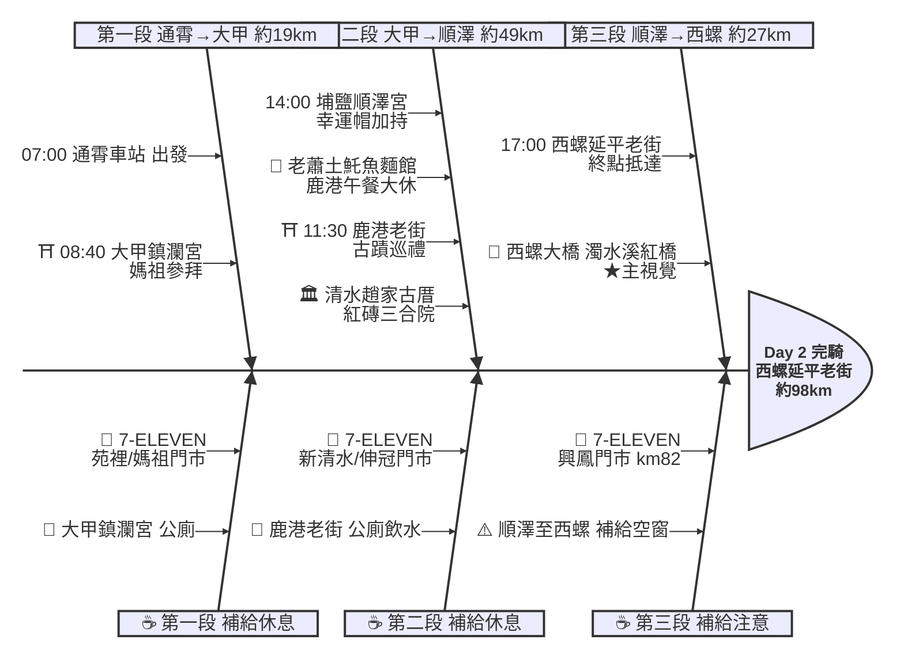

# Day 2：通霄車站 ➔ 西螺延平老街（宮廟巡禮．通霄到西螺）

---

## 路線總覽

* **出發地**：通霄
* **目的地**：西螺
* **總距離**：97.9 公里（GPX 實測）
* **總爬升 / 下降**：全程平坦，台61線轉台1線縱貫公路，幾乎無爬升
* **主要路線**：通霄 ➔ 台61線 ➔ 大甲鎮瀾宮 ➔ 台1線 ➔ 鹿港老街 ➔ 埔鹽順澤宮 ➔ 西螺大橋 ➔ 西螺延平老街

[📱 開啟 Google Maps 導航](https://www.google.com/maps/dir/?api=1&origin=%E9%80%9A%E9%9C%84%E8%BB%8A%E7%AB%99&destination=%E8%A5%BF%E8%9E%BA%E5%BB%B6%E5%B9%B3%E8%80%81%E8%A1%97&waypoints=%E5%A4%A7%E7%94%B2%E9%8E%AE%E7%80%BE%E5%AE%AE%7C%E6%B8%85%E6%B0%B4%E8%B6%99%E5%AE%B6%E5%8F%A4%E5%8E%9D%7C%E9%B9%BF%E6%B8%AF%E8%80%81%E8%A1%97%7C%E5%9F%94%E9%B9%BD%E9%A0%86%E6%BE%A4%E5%AE%AE%7C%E8%A5%BF%E8%9E%BA%E5%A4%A7%E6%A9%8B&travelmode=bicycling)

<iframe src="https://www.google.com/maps/d/u/0/embed?mid=1_9V2ea1aWNt_hCw7_bEEAwka0qNWlBQ&ehbc=2E312F" width="100%" height="100%" style="border:none; border-radius: 8px;"></iframe>

---

## 詳細路線行程圖解

---

## 建議行程與時間配速

### 第一段：通霄車站 → 大甲鎮瀾宮（約 19 km）｜海線南下段

**距離**：19 km
**路況**：通霄沿台61線／台1線南下，經苑裡進入台中大甲。全段平坦、補給密集，海風較大。

**景點與補給：**
- 🚀 **07:00 通霄車站**（起點，km 0）：海線車站起點，站前有小吃與超商，整裝出發。
- 🥤 **7-ELEVEN 苑裡門市**（km ~7，苑裡）：出發後第一個貼線補給。
- ⛩️ **08:40 大甲鎮瀾宮**（km ~19，大甲順天路）：台灣媽祖信仰中心、大甲媽遶境起點，香火鼎盛，必訪宮廟。周邊大甲老街可順遊。

---

### 第二段：大甲鎮瀾宮 → 埔鹽順澤宮（約 49 km）｜彰化平原宮廟段

**距離**：49 km
**路況**：接台1線縱貫公路南下，過大甲溪、大肚溪進入彰化，經清水、線西至鹿港，再轉埔鹽。全段平坦、超商密集。

**景點與補給：**
- 🥤 **7-ELEVEN 媽祖門市**（km ~19，大甲）：鎮瀾宮旁補給。
- 🏛️ **09:20 清水趙家古厝**（km ~27，清水）：清水百年紅磚三合院古厝，閩式建築拍照點。
- 🥤 **7-ELEVEN 新清水門市**（km ~29，清水）：清水段補給。
- 🥤 **7-ELEVEN 伸冠門市**（km ~46，線西）：彰濱線西段補給。
- ⛩️ **11:30 鹿港老街**（km ~60）：鹿港古蹟老街，龍山寺、天后宮、九曲巷與在地小吃匯聚，午餐大休點，建議停留 60–90 分鐘。
- 🍜 **12:00–13:30 老蕭土魠魚麵館**（鹿港）：鹿港高人氣土魠魚麵（4.9★/2782），午餐大休。公休日可改鹿港圓環頂麵食館或在地蚵仔煎。
- ⛩️ **14:00 埔鹽順澤宮**（km ~68，埔鹽）：「全台最幸運的宮廟」，戴運動帽參拜求冠軍加持的打卡名所。

---

### 第三段：埔鹽順澤宮 → 西螺延平老街（約 27 km）｜濁水溪收尾段

**距離**：27 km
**路況**：順澤宮南下經二林、過濁水溪西螺大橋進入雲林西螺。市區人車漸多，留意路口。

**景點與補給：**
- 🥤 **7-ELEVEN 順澤門市**（km ~68，埔鹽）：順澤宮旁補給，南段空窗前補滿。
- 🥤 **7-ELEVEN 興鳳門市**（km ~82，二林）：二林往西螺段補給。
- 🌉 **16:30 西螺大橋**（km ~93）：橫跨濁水溪的紅色鋼桁架大橋，台灣公路地標，橋上可騎乘拍照，本日主視覺。
- 🏁 **17:00 西螺延平老街**（km ~98，西螺鎮）：當日終點，巴洛克立面老街與西螺醬油文化，周邊住宿與小吃齊全。

---

## 晚餐推薦

| # | 店名 | 評分 | 留言數 | 貝葉斯分 | 備註 |
|:---:|:---|:---:|---:|:---:|:---|
| 1 | [龍圓舊事](https://www.google.com/maps/place/?q=place_id:ChIJkxzAQoW1bjQREVoyafkkQjk) | 4.9★ | 1049 | 4.7369 | 餐廳 |
| 2 | [幸福Mochi-西螺麻糬 延平老街店](https://www.google.com/maps/place/?q=place_id:ChIJdbHqD321bjQRTQn90CyZpzo) | 4.8★ | 1469 | 4.6957 | 甜品餐廳 |
| 3 | [小兄弟牛排館](https://www.google.com/maps/place/?q=place_id:ChIJOXZihj60bjQR_HC6lLbjiPs) | 4.8★ | 1421 | 4.693 | 牛排館 |
| 4 | [市場光壽司](https://www.google.com/maps/place/?q=place_id:ChIJ61kkkT61bjQRt7nC6GAp2XQ) | 4.7★ | 1126 | 4.6005 | 壽司店 |
| 5 | [五鮮級鍋物專賣 西螺西興南店](https://www.google.com/maps/place/?q=place_id:ChIJcbg5QFm7bjQRN0v1aF80j-A) | 4.6★ | 1171 | 4.5302 | 火鍋店 |

> 💡 *排序依據：留言數越多的高分店越可信（IMDB 風格貝葉斯平均）*
> 📋 *[看更多 >>](./day2_dinner.md)*

---

## 住宿推薦 🏨

| # | 飯店 | 評分 | 留言數 | 貝葉斯分 | 備註 |
|:---:|:---|:---:|---:|:---:|:---|
| 1 | [粨倉文旅（請先至官網看訂房須知！）](https://www.google.com/maps/place/?q=place_id:ChIJncdBCgC1bjQRcGFJwub0ibA) | 4.9★ | 345 | 4.6755 |  |
| 2 | [西螺巴布客住宿](https://www.google.com/maps/place/?q=place_id:ChIJ2cUbXeu1bjQRFOVyfOmOE4E) | 4.9★ | 76 | 4.4352 |  |
| 3 | [西螺後街童畫民宿](https://www.google.com/maps/place/?q=place_id:ChIJB4HrLT-0bjQR4xIYtUtAP4I) | 4.5★ | 240 | 4.3876 |  |
| 4 | [西螺黎明驛站休閒民宿](https://www.google.com/maps/place/?q=place_id:ChIJP4FeHRe0bjQR8N12sM1xLno) | 4.6★ | 54 | 4.3199 |  |
| 5 | [旅人路過時](https://www.google.com/maps/place/?q=place_id:ChIJ75qM7hW0bjQR_GkDcwEyvmI) | 4.5★ | 71 | 4.3104 |  |

> 💡 *終點周邊 3 公里 · 14 筆候選 · IMDB 風格貝葉斯平均*
> 📋 *[看更多 >>](./day2_hotel.md)*

---

## 騎乘注意事項

1. **宮廟參拜**：大甲鎮瀾宮、埔鹽順澤宮香火鼎盛，假日人潮多，牽車進出並顧好單車。順澤宮戴帽參拜求「冠軍加持」是特色。
2. **補給便利**：台1線縱貫公路超商密集，全日補給輕鬆；鹿港、西螺市區餐飲選擇多。
3. **西螺大橋**：紅色鋼桁架地標，可於橋上騎乘或牽行拍照，注意往來車輛。
4. **午餐公休**：老蕭土魠魚麵館公休日改鹿港圓環頂麵食館或在地蚵仔煎、麵線糊。
5. **里程輕鬆**：本日 ORS 實測約 98km、全程平坦無爬升，是環島少數可放鬆的日程，可多留時間逛鹿港與西螺老街。
6. **撤退方案**：km19 大甲可搭台鐵海線大甲站、清水站；彰化市可接台鐵縱貫線彰化站；西螺無台鐵，可搭國道客運至斗南／斗六轉乘或叫車接駁。

---

## 更佳景點參考

> 以下為沿途 Bayesian 排名較高但未排入路線的備選點位。可視當天體力 / 天候 / 時間彈性加入。

### 景點備案

| 名次 | 名稱 | 評分 | 留言數 | 貝葉斯分 |
|:---:|:---|:---:|---:|:---:|
| 1 | 白沙屯拱天宮 | 4.8★ | 21,940 | 4.8 |
| 2 | 山邊媽祖宮 | 4.8★ | 3,365 | 4.78 |
| 3 | 鹿港龍山寺 | 4.7★ | 10,027 | 4.7 |
| 4 | 高美濕地木棧道 | 4.7★ | 1,331 | 4.68 |
| 5 | 縣定古蹟西螺廣福宮 老大媽廟 | 4.6★ | 683 | 4.58 |

### 午餐 / 餐廳大休備案

| 名次 | 店名 | 評分 | 留言數 | 貝葉斯分 |
|:---:|:---|:---:|---:|:---:|
| 1 | 品先蚵仔煎 | 4.8★ | 1,123 | 4.76 |
| 2 | 純粹綿綿冰 | 4.8★ | 732 | 4.74 |
| 3 | 莫爾日嚐MORE TASTE | 4.8★ | 481 | 4.72 |

