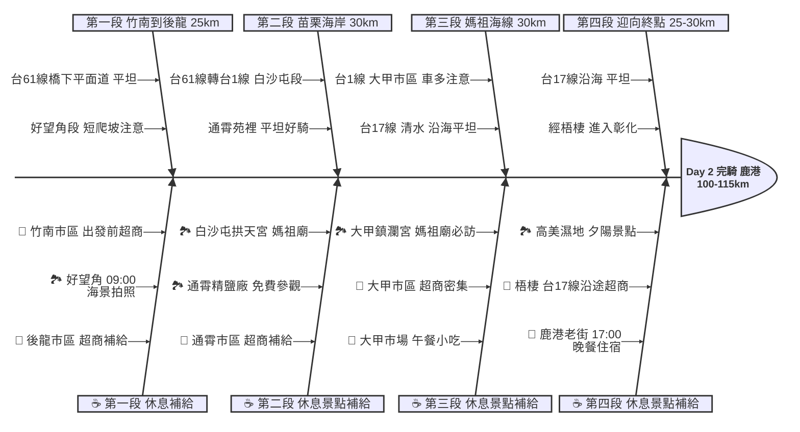

# Day 2：竹南 ➔ 鹿港 (西濱媽祖海線朝聖之旅)

## 📍 路線總覽
* **出發地**：苗栗竹南
* **目的地**：彰化鹿港
* **總距離**：約 100 - 115 公里
* **總爬升**：極低（西濱平坦路段為主，好望角段有短爬坡）
* **主要路線**：台61線 (西濱快速公路橋下平面道路) ➔ 台1線 ➔ 台17線

### 🌍 Google Maps 手機導航連結
👉 **[點擊此處開啟 Day 2 西濱路線 Google Maps (腳踏車模式) 導航](https://www.google.com/maps/dir/?api=1&origin=%E7%AB%B9%E5%8D%97%E8%BB%8A%E7%AB%99&destination=%E9%B9%BF%E6%B8%AF%E8%80%81%E8%A1%97&waypoints=%E5%BE%8C%E9%BE%8D%E5%A5%BD%E6%9C%9B%E8%A7%92%E9%A2%A8%E6%99%AF%E5%8D%80%7C%E7%99%BD%E6%B2%99%E5%B1%AF%E6%8B%B1%E5%A4%A9%E5%AE%AE%7C%E9%80%9A%E9%9C%84%E7%B2%BE%E9%B9%BD%E5%BB%A0%7C%E5%A4%A7%E7%94%B2%E9%8E%AE%E7%80%BE%E5%AE%AE%7C%E9%AB%98%E7%BE%8E%E6%BF%95%E5%9C%B0&travelmode=bicycling)**
> *(💡 小提醒：好望角為短程爬坡景點，若不想爬坡可跳過，繼續沿西濱平面道路南下即可。)*

---

## 🐟 Day 2 魚骨圖 (Ishikawa Diagram)

---

## 🕒 建議行程與時間配速

### 第一段：追風啟程 (竹南 ➔ 後龍 ➔ 好望角)
* **距離**：約 25 km
* **路況**：從竹南出發沿**台61線橋下平面道路**南下，路況平坦。好望角是短程爬坡景點（約 1-2 km 陡坡），可視體力決定是否繞上去。
* **景點/休息補給**：
  * **竹南市區**：出發前在竹南車站附近的 **7-11、全家** 補滿水與早餐。
  * **後龍好望角風景區** ⭐：苗栗海岸線最美的觀景點（評分 4.4），可俯瞰大風車群與海岸線。爬坡約 1-2 km，建議牽車上去，山頂有簡易公廁。
  * **後龍市區**：台61線後龍交流道附近有 **7-11、全家**，是好望角下來後的最佳補給點。

### 第二段：媽祖巡禮 (後龍 ➔ 白沙屯 ➔ 通霄 ➔ 苑裡)
* **距離**：約 30 km
* **路況**：從後龍沿**台61線**或轉入**台1線**南下。白沙屯至通霄段為海岸線，路況平坦。通霄到苑裡走台1線，偶有緩坡但無大爬升。
* **景點/休息補給**：
  * **白沙屯拱天宮** ⭐：台灣最著名的媽祖廟之一（評分 4.8），每年白沙屯媽祖進香是全台盛事。廟旁有公廁與小吃攤。
  * **通霄精鹽廠（台鹽觀光工廠）**：免費參觀，內有鹹冰棒（消暑神器！）、公廁與飲水機，是很好的休息點。
  * **通霄市區**：台1線通霄段有 **7-11、全家**，建議在此補水。苑裡段也有零星超商。

### 第三段：大甲媽祖城 (苑裡 ➔ 大甲 ➔ 清水)
* **距離**：約 30 km
* **路況**：進入**台1線大甲市區**，車流較多但路寬。過大甲後轉入**台17線（西濱公路）**沿海南下，路況恢復平坦。
* **景點/休息補給**：
  * **大甲鎮瀾宮** ⭐：台灣最知名的媽祖廟（評分 4.6），建議安排為**中午大休點**。廟旁的大甲市場有蔥油餅、芋頭酥等知名小吃，是午餐的絕佳選擇。
  * **大甲市區**：超商密集（7-11、全家），可充分補給。
  * **清水段**：台17線清水段沿途有零星超商與中油加油站。

### 第四段：海線終章 (清水 ➔ 梧棲 ➔ 鹿港)
* **距離**：約 25-30 km
* **路況**：沿**台17線**一路南下，經過梧棲、龍井進入彰化縣，最終抵達鹿港。路況平坦，但進入市區後紅綠燈較多。
* **景點/休息補給**：
  * **高美濕地**：若時間充裕（建議下午 16:00 前抵達），可繞進去看夕陽美景（評分 4.5）。但需額外繞路約 3-5 km。
  * **梧棲/龍井段**：台17線沿途有 **7-11、全家**，補給不成問題。
  * **鹿港老街** ⭐：本日終點（評分 4.5）！抵達後可逛老街、品嚐蚵仔煎、蝦猴、麵茶等鹿港名產。住宿建議選在鹿港老街或彰化市區。

---

## 💡 騎乘注意事項 (Day 2 - 西濱媽祖海線)

1. **好望角爬坡**：好望角是本日唯一需要爬坡的路段（約 1-2 km 陡坡）。若不想爬坡，可以直接沿台61線平面道路繞過，不影響行程。
2. **大甲市區車流**：台1線大甲段為主要幹道，砂石車與汽車較多，請靠外側慢車道騎乘，並注意紅綠燈。
3. **補給充足**：Day 2 沿途經過多個市區（後龍、通霄、大甲、清水、梧棲），補給點遠比 Day 1 的西濱路段密集。
4. **風向影響**：若為秋冬季，東北季風為順風（輕鬆！）；春夏可能遇到逆風或側風，建議預留較多時間。
5. **備用撤退方案**：本日沿途火車站密集，隨時可撤退：
   * **後龍車站** (~25km)：距好望角約 5 公里，海線火車站
   * **通霄車站** (~45km)：距台1線主路約 2 公里
   * **大甲車站** (~60km)：距鎮瀾宮步行約 5 分鐘
   * **清水車站** (~75km)：台17線旁，轉入市區即達
