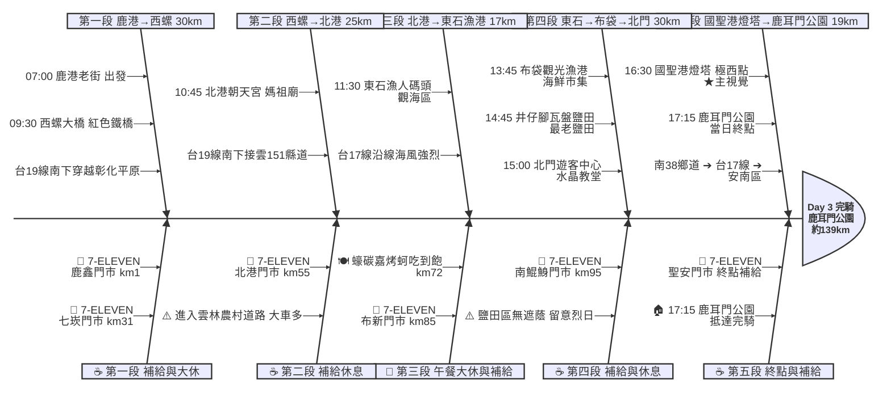

# Day 3：鹿港老街 ➔ 鹿耳門公園（極西國聖燈塔追日行）

---

## 路線總覽

* **出發地**：鹿港 / 彰化
* **目的地**：台南 / 鹿耳門公園
* **總距離**：187.9 公里（GPX 實測）
* **總爬升 / 下降**：↑ 49 m ／ ↓ 53 m（嘉南平原全平路，幾乎零爬升）
* **主要路線**：鹿港老街 ➔ 台19線南下 ➔ 西螺大橋 ➔ 北港朝天宮 ➔ 接台17線 ➔ 東石漁港 ➔ 布袋 ➔ 北門 ➔ 七股鹽山 ➔ 國聖港燈塔（極西點）➔ 鹿耳門公園

[📱 開啟 Google Maps 導航](https://www.google.com/maps/dir/鹿港老街/西螺大橋/北港朝天宮/東石漁人碼頭/布袋觀光漁港/井仔腳瓦盤鹽田/七股鹽山/國聖港燈塔/鹿耳門公園/@23.6,120.3,9z/data=!4m2!4m1!3e1)

<iframe src="https://www.google.com/maps/d/u/0/embed?mid=13Pl_w2JJ-cUgbBk77eEKo-G5GZ7vJIs&ehbc=2E312F" width="100%" height="100%" style="border:none; border-radius: 8px;"></iframe>

---

## 詳細路線行程圖解

---

## 建議行程與時間配速

### 第一段：鹿港老街 → 西螺大橋（約 30 km）｜彰雲平原啟程段

**距離**：30 km
**路況**：鹿港出發接台19線南下，穿越彰化平原農村地帶。路面平坦但部分鄉道路面較窄，注意田間機具與小貨車。接近西螺前進入西螺鎮市區。

**景點與補給：**
- 🚀 **07:00 鹿港老街**（起點，km 0）：Day 2 終點續行，老街晨景安靜，出發前確認補水與食物。
- 🏪 **07:05 7-ELEVEN 鹿鑫門市**（km 1，福興路上）：鹿港出口最後補給點，購足當日早餐與飲水。
- 🌉 **09:30 西螺大橋**（km 30，彰雲交界）：1953 年完工的紅色鋼桁鐵公路橋，橫跨濁水溪。橋上禁行汽車但允許機慢車與自行車。拍照 5 分鐘。

---

### 第二段：西螺大橋 → 北港朝天宮（約 25 km）｜雲林媽祖信仰段

**距離**：25 km
**路況**：西螺南下接雲151縣道往西，穿越虎尾、土庫、北港。雲林平原地帶平坦，農村路段車流少；接近北港市區則人車漸多。

**景點與補給：**
- 🏪 **09:35 7-ELEVEN 七崁門市**（km 31，西螺市區）：過橋後第一個補給點，西螺七嵌防呆劍俠故鄉，補水後南下。
- 🛕 **10:45 北港朝天宮**（km 55，台灣媽祖開臺祖廟）：始建於 1694 年，三百多年香火鼎盛。建築精雕細琢，廟口小吃集中（鴨肉飯、煎盤粿、麵線糊）。停留 20 分鐘參拜+拍照。
- 🏪 **11:05 7-Eleven Beigang**（km 55，民主路）：北港市區補給，準備接下來無遮蔭海線。

---

### 第三段：北港 → 東石漁港（午餐大休）（約 17 km）｜西部蚵鄉午餐段

**距離**：17 km
**路況**：由北港西行接朴子、台17線進入嘉義東石。沿途有蚵棚景觀，地勢平坦但海風漸強。中午陽光直曬，務必補水。

**景點與補給：**
- 🐚 **11:30 東石漁人碼頭**（km 72，嘉義西海岸）：嘉義最大漁港+觀光休閒區，蚵棚景觀廣闊。可看蚵農作業，海風強勁。
- 🍽️ **11:30–13:00 蠔碳嘉烤鮮蚵吃到飽**（km 72，彩霞大道）：東石招牌烤蚵吃到飽（4.9★/4887則）。午餐大休 1.5 小時+補體力。價格實惠，當地評價極高。

---

### 第四段：東石 → 布袋 → 井仔腳鹽田（約 30 km）｜南台灣鹽田巡禮段

**距離**：30 km
**路況**：台17線南下穿越布袋鎮、進入台南北門區。沿途為廢棄鹽田、養殖漁塭與紅樹林景觀，視野遼闊但完全無遮蔭。下午時段風沙大，建議戴口罩或頭巾。

**景點與補給：**
- 🚢 **13:45 布袋觀光漁港**（km 85，嘉義布袋）：海鮮市集+布袋鹽田景觀，遊客可購買當地海產。停留 15 分鐘。
- 🏪 **13:50 7-ELEVEN 布新門市**（km 85，中正路）：布袋市區補給點，準備接下來鹽田無補給路段。
- 🏪 **14:30 7-ELEVEN 南鯤鯓門市**（km 95，台南北門蚵寮里）：進入北門前最後便利商店，南鯤鯓代天府附近。
- 🧂 **14:45 井仔腳瓦盤鹽田**（km 100，台灣最古老鹽田）：1818 年闢建，棋盤狀瓦盤鹽結晶池。傍晚日落時最美，下午光線通透適合拍照。停留 15 分鐘。
- ⛪ **15:00 北門遊客中心**（km 102，水晶教堂園區）：結合水晶教堂、婚紗美地、北門驛長宿舍。免費參觀，有公廁飲水。停留 15-20 分鐘。

---

### 第五段：北門 → 七股鹽山 → 國聖港燈塔 → 鹿耳門公園（★主視覺）（約 37 km）｜極西點與歷史朝聖段

**距離**：37 km
**路況**：由北門續沿台17線南下，經將軍後西轉進入七股鹽田區，抵達極西點國聖燈塔。隨後經南38鄉道與台17線，跨越曾文溪進入安南區，最後抵達本日終點鹿耳門公園。

**景點與補給：**
- ⛰️ **15:45 七股鹽山**（km 113，純白巨型鹽山）：由台鹽七股鹽場推積而成的人工鹽山，地標級景觀。可登頂拍照。周邊有遊客中心。
- 🗼 **16:30 國聖港燈塔**（km 123，台灣本島極西點 ★主視覺）：黑白方型鋼造燈塔，矗立於七股西堤防風林末端。台灣本島最西點地理座標 23°06'N 120°02'E，環島四極點之一。拍照打卡後南下往台南市區前行。
- 🏪 **17:10 7-ELEVEN 聖安門市**（km 139，安南區安中路）：終點前最後補給與休息點，備有公廁及飲水。
- 🏡 **17:15 鹿耳門公園**（km 139，本日終點）：本日終點，位於鹿耳門天后宮與聖母廟附近，是歷史上荷蘭人與鄭成功登陸的戰略要地。在此完騎本日行程並前往附近民宿休息。

---

## 晚餐推薦

| # | 店名 | 評分 | 留言數 | 貝葉斯分 | 備註 |
|:---:|:---|:---:|---:|:---:|:---|
| 1 | [阿忠螃蟹-府城蟳禮](https://www.google.com/maps/place/?q=place_id:ChIJXTAli0fYbTQR8R6PbzuZjtI) | 5★ | 4894 | 4.9679 | 餐廳 |
| 2 | [台南土城螃蟹專賣店（耐人蟳味）](https://www.google.com/maps/place/?q=place_id:ChIJP07EjEfYbTQRJR4Uu7HgTR8) | 4.8★ | 188 | 4.6453 | 餐廳 |
| 3 | [凰詩越南美食](https://www.google.com/maps/place/?q=place_id:ChIJI8UHUlXZbTQRityPHkapKB8) | 4.8★ | 47 | 4.596 | 越南餐廳 |
| 4 | [廟前海產碳烤](https://www.google.com/maps/place/?q=place_id:ChIJtdm_fKDZbTQRfi2uTtzMgWw) | 4.7★ | 77 | 4.5927 | 餐廳 |
| 5 | [啊蘭小吃](https://www.google.com/maps/place/?q=place_id:ChIJWwx9XgDZbTQRTTlrPEVtvDc) | 5★ | 9 | 4.5813 | 亞洲風味餐廳 |

> 💡 *排序依據：留言數越多的高分店越可信（IMDB 風格貝葉斯平均）*
> 📋 *[看更多 >>](./day3_dinner.md)*

---

## 住宿推薦 🏨

| # | 飯店 | 評分 | 留言數 | 貝葉斯分 | 備註 |
|:---:|:---|:---:|---:|:---:|:---|
| 1 | [台南民宿回家旅行(訂房加line：@comehome)](https://www.google.com/maps/place/?q=place_id:ChIJpVhOegDZbTQRKTChyjpEvoI) | 4.9★ | 47 | 4.4797 |  |
| 2 | [出差出租管理宿舍（七股工業區焚化爐工作者打工出差者）](https://www.google.com/maps/place/?q=place_id:ChIJFQuBGbPXbTQRWGUlvpLEdD4) | 4.4★ | 107 | 4.3262 |  |
| 3 | [鄉下有房](https://www.google.com/maps/place/?q=place_id:ChIJAZxY6SDYbTQReVt4BlKU-_w) | 4.5★ | 27 | 4.2954 |  |
| 4 | [九塊厝林聚庭園](https://www.google.com/maps/place/?q=place_id:ChIJa2wWoFnYbTQRRr-V48nLT1k) | 4.6★ | 14 | 4.2815 |  |
| 5 | [Titi tata 民宿](https://www.google.com/maps/place/?q=place_id:ChIJ2zBHUYLZbTQRokp0rVHUeSk) | 5★ | 3 | 4.2528 |  |

> 💡 *終點周邊 3 公里 · 10 筆候選 · IMDB 風格貝葉斯平均*
> 📋 *[看更多 >>](./day3_hotel.md)*

---

## 騎乘注意事項

1. **西部沙塵與防曬**：北港以南沿線無遮蔭，鹽田區風沙偏大，建議戴口罩、頭巾、太陽眼鏡，並隨時補水。
2. **台19/台17大車車流**：彰雲段台19多砂石車、台南段台17多貨車，請走右側慢車道並保持警覺。
3. **鹽田區補給空窗**：km 95（南鯤鯓 7-11）至 km 139（聖安門市）之間，除井仔腳/北門遊客中心可短暫飲水外，無大型便利商店，務必在南鯤鯓補滿水。
4. **撤退車站**：員林站（km 約 25，東邊 ~10km）、新營站（km 90，東邊 ~15km）、台南車站（終點東南約 10km）— 西部濱海沿線無台鐵車站，撤退需先騎到內陸縱貫線站；緊急情況可在北港或七股招計程車接駁至最近台鐵站。
5. **國聖燈塔防風林路況**：最後 7 公里為農路+堤岸路，部分路段積沙較深，建議牽車通過並注意輪胎防刺。最晚 17:00 前離開，避免天黑迷路。
6. **住宿位置**：本日終點位於安南區，鄰近鹿耳門天后宮及聖母廟，周邊有豐富的民宿選擇，方便隔天直接續行南下。

---

## 更佳景點參考

> 以下為沿途 Bayesian 排名較高但未排入路線的備選點位。可視當天體力 / 天候 / 時間彈性加入。

### 景點備案

| 名次 | 名稱 | 評分 | 留言數 | 貝葉斯分 |
|:---:|:---|:---:|---:|:---:|
| 1 | 鹿耳門天后宮 | 4.7★ | 7,940 | 4.54 |
| 2 | 鹿耳門聖母廟 | 4.7★ | 5,234 | 4.5 |
| 3 | 王功漁港 | 4.2★ | 2,218 | 4.32 |
| 4 | 北門水晶教堂 | 3.8★ | 10,672 | 4.03 |

### 午餐 / 餐廳大休備案

| 名次 | 店名 | 評分 | 留言數 | 貝葉斯分 |
|:---:|:---|:---:|---:|:---:|
| 1 | 蚵老大海鮮碳烤 | 4.8★ | 6,709 | 4.57 |

