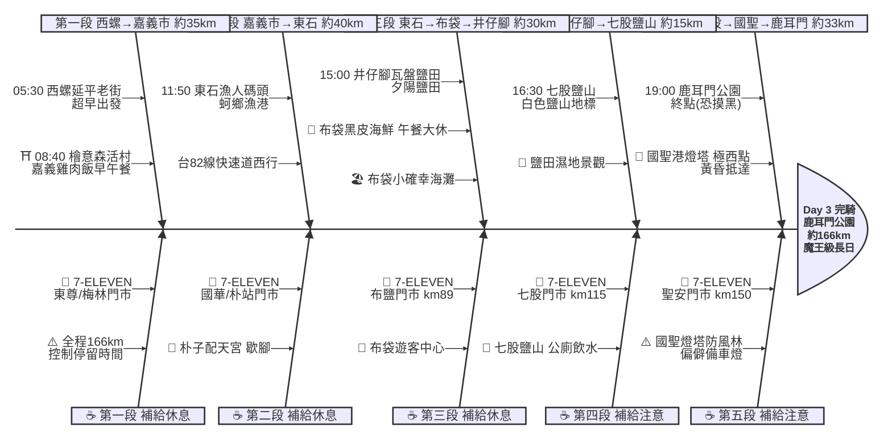

# Day 3：西螺延平老街 ➔ 鹿耳門公園（濱海極西．西螺到台南）

---

## 路線總覽

* **出發地**：西螺
* **目的地**：台南/鹿耳門公園
* **總距離**：166.4 公里（GPX 實測）
* **總爬升 / 下降**：全程平坦，台1線轉台17線西部濱海，無爬升，國聖港燈塔段防風林路面偶有積沙
* **主要路線**：西螺 ➔ 台1線 ➔ 嘉義市 ➔ 台82線 ➔ 東石漁港 ➔ 台17線 ➔ 布袋 ➔ 井仔腳鹽田 ➔ 七股鹽山 ➔ 國聖港燈塔(極西) ➔ 鹿耳門公園

[📱 開啟 Google Maps 導航](https://www.google.com/maps/dir/?api=1&origin=%E8%A5%BF%E8%9E%BA%E5%BB%B6%E5%B9%B3%E8%80%81%E8%A1%97&destination=%E9%B9%BF%E8%80%B3%E9%96%80%E5%85%AC%E5%9C%92%20%E5%8F%B0%E5%8D%97&waypoints=%E6%AA%9C%E6%84%8F%E6%A3%AE%E6%B4%BB%E6%9D%91%20%E5%98%89%E7%BE%A9%7C%E6%9D%B1%E7%9F%B3%E6%BC%81%E4%BA%BA%E7%A2%BC%E9%A0%AD%7C%E4%BA%95%E4%BB%94%E8%85%B3%E7%93%A6%E7%9B%A4%E9%B9%BD%E7%94%B0%7C%E4%B8%83%E8%82%A1%E9%B9%BD%E5%B1%B1%7C%E5%9C%8B%E8%81%96%E6%B8%AF%E7%87%88%E5%A1%94%20%E5%8F%B0%E5%8D%97&travelmode=bicycling)

<iframe src="https://www.google.com/maps/d/u/0/embed?mid=13Pl_w2JJ-cUgbBk77eEKo-G5GZ7vJIs&ehbc=2E312F" width="100%" height="100%" style="border:none; border-radius: 8px;"></iframe>

---

## 詳細路線行程圖解

---

## 建議行程與時間配速

### 第一段：西螺延平老街 → 嘉義市（約 35 km）｜縱貫內陸南下段

**距離**：35 km
**路況**：05:30 超早出發，沿台1線縱貫公路正南下，過虎尾、大林進入嘉義市。全段平坦、超商密集。本日里程166km，務必控制各點停留。

**景點與補給：**
- 🚀 **05:30 西螺延平老街**（起點，km 0）：接續 Day2 終點，魔王級長日務必摸黑前超早出發。
- 🥤 **7-ELEVEN 東尊門市**（km ~9，莿桐）：出發後第一個補給。
- 🥤 **7-ELEVEN 梅林門市**（km ~24，大林）：大林段補給。
- 🏛️ **08:40 檜意森活村**（km ~35，嘉義市東區）：全台首座森林文創園區，阿里山林業日式宿舍群。順遊文化路雞肉飯吃早午餐補充體力。

---

### 第二段：嘉義市 → 東石漁港（約 40 km）｜出海口西行段

**距離**：40 km
**路況**：出嘉義市區接台82線東西向快速道路（自行車注意替代道路）西行往海口，經朴子抵東石。平坦、海風漸強。

**景點與補給：**
- 🥤 **7-ELEVEN 國華門市**（km ~40，嘉義市）：離開嘉義市區前補給。
- 🥤 **7-ELEVEN 朴站門市**（km ~63，朴子）：朴子段補給，可順遊朴子配天宮。
- 🦪 **11:50 東石漁人碼頭**（km ~75）：蚵鄉漁港，海之夢觀景台與漁港風情，可嚐鮮蚵。

---

### 第三段：東石漁港 → 井仔腳鹽田（約 30 km）｜濱海蚵鄉午餐段

**距離**：30 km
**路況**：接台17線濱海公路南下，經布袋至北門。布袋午餐大休後進入鹽田濕地區。

**景點與補給：**
- 🏖️ **12:30 布袋小確幸海灘**（km ~87）：白色沙灘海景，網美打卡點。
- 🍱 **13:00–14:00 布袋港黑皮海鮮餐廳**（布袋港）：布袋港海鮮（巨無霸海鮮肉圓，4.2★/3097），午餐大休。
- 🥤 **7-ELEVEN 布鹽門市**（km ~89，布袋）：布袋出發補給，鹽田區前補滿。
- 🧂 **15:00 井仔腳瓦盤鹽田**（km ~105，北門）：台灣現存最古老瓦盤鹽田，夕陽與倒影名所，可體驗曬鹽。

---

### 第四段：井仔腳鹽田 → 七股鹽山（約 15 km）｜鹽田濕地段

**距離**：15 km
**路況**：沿台17/南25鄉道南下七股，經將軍、青鯤鯓進入七股鹽業園區。

**景點與補給：**
- 🥤 **7-ELEVEN 七股門市**（km ~115，七股）：七股段補給。
- ⛰️ **16:30 七股鹽山**（km ~120）：兩層樓高的白色鹽山地標，可攀爬遠眺鹽田濕地，園區有鹽業文化展示。

---

### 第五段：七股鹽山 → 國聖港燈塔 → 鹿耳門（約 33 km）｜極西點收尾段

**距離**：33 km
**路況**：轉往極西點國聖港燈塔，最後沿台17線回鹿耳門。國聖燈塔位於頂頭額沙洲防風林內，路面偶有積沙、傍晚偏僻，務必備車燈、留意天色。

**景點與補給：**
- 🔦 **17:45 國聖港燈塔**（km ~140，七股）：台灣本島極西點，黑白方格塔身，環島四極點之一。黃昏抵達拍照後盡速離開。
- 🥤 **7-ELEVEN 聖安門市**（km ~150，安南）：抵終點前最後補給。
- 🏁 **19:00 鹿耳門公園**（km ~166，台南安南）：當日終點，鹿耳門溪口與鹿耳門天后宮。摸黑路段務必開燈慢行。

---

## 晚餐推薦

| # | 店名 | 評分 | 留言數 | 貝葉斯分 | 備註 |
|:---:|:---|:---:|---:|:---:|:---|
| 1 | [阿忠螃蟹-府城蟳禮](https://www.google.com/maps/place/?q=place_id:ChIJXTAli0fYbTQR8R6PbzuZjtI) | 5★ | 4894 | 4.9711 | 餐廳 |
| 2 | [台南土城螃蟹專賣店（耐人蟳味）](https://www.google.com/maps/place/?q=place_id:ChIJP07EjEfYbTQRJR4Uu7HgTR8) | 4.8★ | 189 | 4.6507 | 餐廳 |
| 3 | [凰詩越南美食](https://www.google.com/maps/place/?q=place_id:ChIJI8UHUlXZbTQRityPHkapKB8) | 4.8★ | 47 | 4.5978 | 越南餐廳 |
| 4 | [廟前海產碳烤](https://www.google.com/maps/place/?q=place_id:ChIJtdm_fKDZbTQRfi2uTtzMgWw) | 4.7★ | 77 | 4.5941 | 餐廳 |
| 5 | [啊蘭小吃](https://www.google.com/maps/place/?q=place_id:ChIJWwx9XgDZbTQRTTlrPEVtvDc) | 5★ | 9 | 4.5816 | 亞洲風味餐廳 |

> 💡 *排序依據：留言數越多的高分店越可信（IMDB 風格貝葉斯平均）*
> 📋 *[看更多 >>](./day3_dinner.md)*

---

## 住宿推薦 🏨

| # | 飯店 | 評分 | 留言數 | 貝葉斯分 | 備註 |
|:---:|:---|:---:|---:|:---:|:---|
| 1 | [台南民宿回家旅行(訂房加line：@comehome)](https://www.google.com/maps/place/?q=place_id:ChIJpVhOegDZbTQRKTChyjpEvoI) | 4.9★ | 47 | 4.4797 |  |
| 2 | [出差出租管理宿舍（七股工業區焚化爐工作者打工出差者）](https://www.google.com/maps/place/?q=place_id:ChIJFQuBGbPXbTQRWGUlvpLEdD4) | 4.4★ | 107 | 4.3262 |  |
| 3 | [鄉下有房](https://www.google.com/maps/place/?q=place_id:ChIJAZxY6SDYbTQReVt4BlKU-_w) | 4.5★ | 27 | 4.2954 |  |
| 4 | [九塊厝林聚庭園](https://www.google.com/maps/place/?q=place_id:ChIJa2wWoFnYbTQRRr-V48nLT1k) | 4.6★ | 14 | 4.2815 |  |
| 5 | [Titi tata 民宿](https://www.google.com/maps/place/?q=place_id:ChIJ2zBHUYLZbTQRokp0rVHUeSk) | 5★ | 3 | 4.2528 |  |

> 💡 *終點周邊 3 公里 · 10 筆候選 · IMDB 風格貝葉斯平均*
> 📋 *[看更多 >>](./day3_hotel.md)*

---

## 騎乘注意事項

1. **⚠️ 魔王級長日**：本日 ORS 實測約 166km、9.6 小時，因必經內陸嘉義市而比沿海多繞約 24km。務必 05:30 前出發、嚴格控制各景點停留，否則國聖燈塔與終點將摸黑抵達。
2. **國聖港燈塔（極西點）**：位於七股頂頭額沙洲防風林內，聯外道路偏僻、路面偶有積沙，建議牽車通過並注意輪胎防刺；傍晚抵達務必備妥前後車燈。
3. **補給空窗**：井仔腳(km105)→七股(km115)、國聖燈塔往返段超商稀少，請在布鹽門市(km89)、七股門市(km115)把水壺補滿。
4. **嘉義美食**：嘉義市檜意森活村周邊文化路雞肉飯、噴水雞肉飯，08:40 左右當早午餐補充能量最實際。
5. **鹽田夕陽**：井仔腳瓦盤鹽田為著名夕陽景點，但本日里程長，建議拍照後即續行勿久留。
6. **撤退方案**：km35 嘉義市可搭台鐵縱貫線嘉義站；新營、善化、台南站可接駁；若時間嚴重落後，建議於七股鹽山(km120)評估叫車至台南市區，避免摸黑騎國聖燈塔偏僻段。

---

## 更佳景點參考

> 以下為沿途 Bayesian 排名較高但未排入路線的備選點位。可視當天體力 / 天候 / 時間彈性加入。

### 景點備案

| 名次 | 名稱 | 評分 | 留言數 | 貝葉斯分 |
|:---:|:---|:---:|---:|:---:|
| 1 | 北港朝天宮 | 4.7★ | 24,030 | 4.67 |
| 2 | 鹿耳門天后宮 | 4.7★ | 7,940 | 4.63 |
| 3 | 鹿耳門聖母廟 | 4.7★ | 5,234 | 4.6 |
| 4 | 頂頭額沙洲 | 4.5★ | 1,806 | 4.39 |
| 5 | 61線活海產 | 4.4★ | 1,398 | 4.33 |

### 午餐 / 餐廳大休備案

| 名次 | 店名 | 評分 | 留言數 | 貝葉斯分 |
|:---:|:---|:---:|---:|:---:|
| 1 | 蠔碳嘉烤鮮蚵吃到飽 | 4.9★ | 4,888 | 4.74 |
| 2 | 蚵老大海鮮碳烤 | 4.8★ | 6,709 | 4.7 |
| 3 | 可口火雞肉飯 | 4.4★ | 1,924 | 4.34 |

