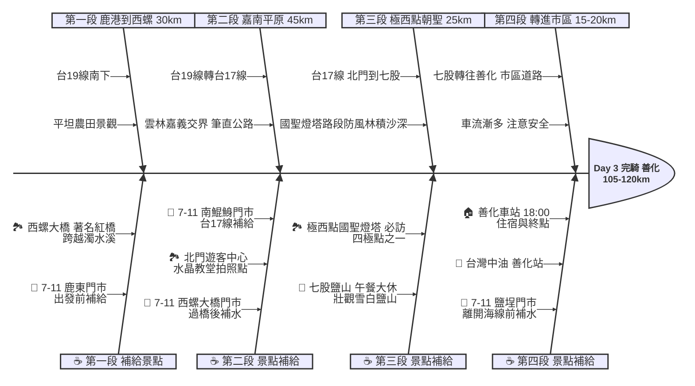

# Day 3：彰化鹿港 ➔ 台南七股/善化 (極西點打卡之旅)

## 📍 路線總覽
* **出發地**：彰化鹿港老街
* **目的地**：台南善化車站
* **總距離**：約 105 - 120 公里
* **總爬升**：極低（全程幾乎平坦，但前往國聖燈塔的防風林路段可能積沙較深）
* **主要路線**：台19線 ➔ 台17線 (西部濱海) ➔ 縣道轉往善化

---

### 🌍 Google Maps 導航與地圖預覽

#### 手機導航連結
👉 **[點擊此處開啟 Day 3 極西點導航（腳踏車模式）](https://www.google.com/maps/dir/?api=1&origin=%E5%BD%B0%E5%8C%96%E9%B9%BF%E6%B8%AF%E8%80%81%E8%A1%97&destination=%E5%8F%B0%E5%8D%97%E5%96%84%E5%8C%96%E8%BB%8A%E7%AB%99&waypoints=%E9%9B%B2%E6%9E%97%E8%A5%BF%E8%9E%BA%E5%A4%A7%E6%A9%8B%7C%E5%8F%B0%E5%8D%97%E5%8C%97%E9%96%80%E9%81%8A%E5%AE%A2%E4%B8%AD%E5%BF%83%7C%E5%8F%B0%E5%8D%97%E4%B8%83%E8%82%A1%E9%B9%BD%E5%B1%B1%7C%E5%8F%B0%E5%8D%97%E4%B8%83%E8%82%A1%E6%A5%B5%E8%A5%BF%E9%BB%9E%E5%9C%8B%E8%81%96%E7%87%88%E5%A1%94&travelmode=bicycling)**

#### 🗺️ 路線小地圖

> 💡 *【預設版型提醒】：請在此放置生成的路線圖 (命名為 `day3_poster.png`)，並記得將上方圖片的超連結替換成您當天的 Google My Maps 專屬連結！*

---

## 🐟 魚骨圖 (Ishikawa Diagram)

---

## 🕒 建議行程與時間配速

### 第一段：農鄉晨騎（鹿港 ➔ 西螺）
* **距離**：約 30 km
* **路況**：從鹿港沿著台19線南下，穿越彰化平原，路況平坦，兩側多為農田景觀。
* **景點 / 休息補給**：
  * **出發補給**：在鹿港老街附近的 **7-11 鹿東門市** 補齊水與高熱量食物再出發。
  * **西螺大橋**（推薦景點）：台灣著名的鮮紅色鐵橋，橫跨濁水溪，是單車環島必拍的地標。
  * **7-11 西螺大橋門市**：過橋進入雲林後的第一個大補給點。

### 第二段：嘉南大平原（西螺 ➔ 北門）
* **距離**：約 45 km
* **路況**：繼續沿台19線南下，之後切往沿海的台17線進入台南市。此段距離較長，風向影響大。
* **景點 / 休息補給**：
  * **北門遊客中心 / 水晶教堂**（評分 4.1，值得一看）：充滿異國風情的園區，水晶教堂是絕佳的拍照打卡點。
  * **7-11 南鯤鯓門市**：台17線上重要的便利商店，進七股前的補水點。

### 第三段：極西點朝聖（北門 ➔ 七股）
* **距離**：約 25 km
* **路況**：台17線海線路段。前往國聖燈塔的最後一段路為防風林與沙洲地形，容易有積沙。
* **景點 / 休息補給**：
  * **七股鹽山**（評分 3.9）：本日**午餐大休點**，巨大的雪白鹽山非常有特色，園區內有販售鹹冰棒與食物。
  * **極西點國聖燈塔**（評分 4.4，本日最高潮）：台灣本島極西點！黑白相間的鐵塔矗立在頂頭額沙洲上。**注意：抵達燈塔前的路段可能積沙極深，強烈建議下來牽車，以免摔車或刺破輪胎。**
  * **7-11 鹽埕門市**：離開七股海線前的最後補水點。

### 第四段：轉進市區（七股 ➔ 善化）
* **距離**：約 15-20 km
* **路況**：離開台17線，轉向東邊進入台南市區道路前往善化。車流量開始變大，請靠外側騎乘。
* **景點 / 休息補給**：
  * **台灣中油 善化站**：進入善化市區前可借用廁所。
  * **終點：善化車站**：傍晚 18:00 抵達，善化車站周邊住宿與餐廳選擇多，若需撤退也可直接搭乘台鐵。

---

## 💡 騎乘注意事項

1. **極西點積沙警告**：國聖燈塔位處沙洲，最後幾公里的防風林道路經常被風沙掩蓋。**切勿勉強騎乘**，一旦感覺輪胎下陷，請立刻下車推行，以免摔車或導致輪框受損。
2. **西濱強風**：沿著台17線騎乘時，周邊毫無遮蔽物。若遇逆風將極度消耗體力，請隨時補充水分與碳水化合物。
3. **長距離空窗期**：西螺到北門之間距離較長（約 45 km），途經農業區，便利商店較不密集。請在西螺務必將水壺裝滿，並隨身攜帶備用能量膠。
4. **撤退方案**：
   * **嘉義車站**（偏離主線約 15 km）：若在雲嘉交界體力透支，可往東騎至嘉義車站搭車。
   * **新營車站**（偏離主線約 10 km）：台19線學甲段附近可往東撤退至新營車站。
   * **善化車站**（終點）：海線少數有停靠對號列車的台鐵大站。
