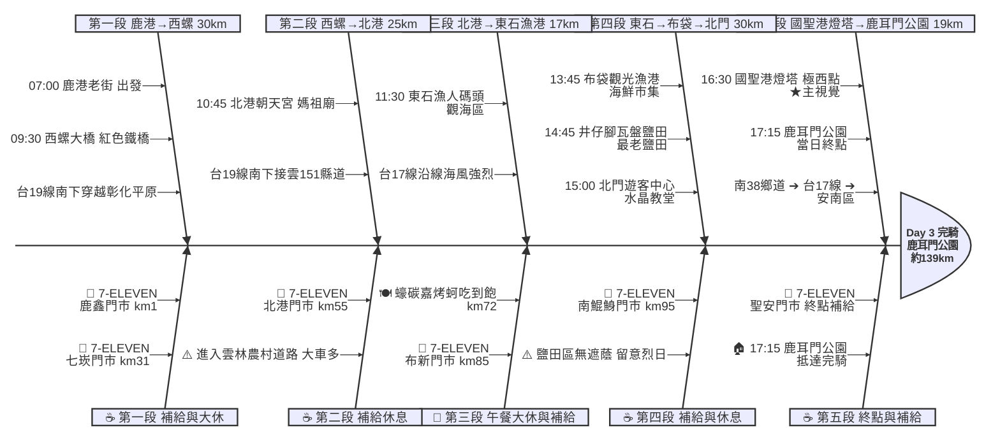

# Day 3：鹿港 ➔ 台南鹿耳門（極西國聖燈塔追日行）

---

## 路線總覽

* **出發地**：鹿港 / 彰化
* **目的地**：台南 / 鹿耳門公園
* **總距離**：187.8 公里（GPX 實測）
* **總爬升 / 下降**：↑ 49 m ／ ↓ 53 m（嘉南平原全平路，幾乎零爬升）
* **主要路線**：鹿港老街 ➔ 台19線南下 ➔ 西螺大橋 ➔ 北港朝天宮 ➔ 接台17線 ➔ 東石漁港 ➔ 布袋 ➔ 北門 ➔ 七股鹽山 ➔ 國聖港燈塔（極西點）➔ 鹿耳門公園

[📱 開啟 Google Maps 導航](https://www.google.com/maps/dir/鹿港老街/西螺大橋/北港朝天宮/東石漁人碼頭/布袋觀光漁港/井仔腳瓦盤鹽田/七股鹽山/國聖港燈塔/鹿耳門公園/@23.6,120.3,9z/data=!4m2!4m1!3e1)

<iframe src="https://www.google.com/maps/d/u/0/embed?mid=13Pl_w2JJ-cUgbBk77eEKo-G5GZ7vJIs&ehbc=2E312F" width="100%" height="100%" style="border:none; border-radius: 8px;"></iframe>

---

## 詳細路線行程圖解

---

## 建議行程與時間配速

### 第一段：鹿港老街 → 西螺大橋（約 30 km）｜彰雲平原鋼橋跨溪段

**距離**：30 km
**路況**：台19線南下，彰化平原農田地勢平坦，路面寬但砂石車多，建議走右側慢車道。晨間順風，視野開闊。

**景點與補給：**
- 🚀 **07:00 鹿港老街**（起點 km 0）：出發前在老街補充早餐與水，周邊有多家早餐店與超商。
- 🏪 **07:30 7-ELEVEN 鹿鑫門市**（km 5）：離開鹿港市區前的最後超商補給。
- 🌉 **09:00 西螺大橋**（km 30，雲林縣西螺鎮）：昔日遠東最長公路橋，橫跨濁水溪，鋼鐵紅色拱架壯觀。建議下車推行拍照，橋上禁止快速騎乘。

---

### 第二段：西螺大橋 → 北港朝天宮（約 25 km）｜雲林香火大廟朝聖段

**距離**：25 km
**路況**：接台19線繞經西螺老街，轉縣道往北港，路面平緩，沿途農田與廟宇交錯，車流中等。

**景點與補給：**
- 🏪 **09:30 7-ELEVEN 七崁門市**（km 35，西螺建興路）：過橋後補給點，可在此補水並稍作休息。
- 🛕 **10:30 北港朝天宮**（km 55，雲林縣北港鎮）：全台香火最旺媽祖廟，建築金碧輝煌。停留 20 分鐘參觀，周邊有多家傳統小吃。
- 🏪 **10:50 7-ELEVEN 北港門市**（km 57，北港民主路）：廟旁超商，補足西行到東石前的水糧。

---

### 第三段：北港 → 東石漁人碼頭（午餐）（約 17 km）｜嘉義海岸蚵仔大休段

**距離**：17 km
**路況**：台19甲西行接東石，進入嘉義海岸濕地，平坦但迎風面大，路面偶有積沙，時速可能降至 15 km。

**景點與補給：**
- 🐚 **11:30 東石漁人碼頭**（km 72，嘉義縣東石鄉）：嘉義著名漁港景點，設有觀景台與美食攤位，可眺望外海牡蠣養殖。
- 🍽️ **12:00 蠔碳嘉烤鮮蚵吃到飽**（km 72，彩霞大道）：評分 4.9 ★，東石現撈蚵仔碳烤吃到飽，午餐大休 45-60 分鐘補充體力。建議訂位或提早前往。

---

### 第四段：東石 → 北門鹽田（約 30 km）｜西濱海岸鹽鄉景觀段

**距離**：30 km
**路況**：台17西濱公路南下，路況佳但貨車多，沿途大型廟宇與鹽田交替出現，風景獨特。下午迎南風有助推進。

**景點與補給：**
- 🦀 **13:30 布袋漁港魚市場**（km 85，嘉義縣布袋鎮）：台灣重要漁港，魚市場售賣新鮮漁獲，可買袋裝零食補充。
- 🏪 **13:50 7-ELEVEN 布新門市**（km 88，布袋中正路）：進入台南前最方便的超商，建議在此補滿水（後段空窗約 40 km）。
- 🏪 **14:50 7-ELEVEN 南鯤鯓門市**（km 98，台南北門）：鹽田區最後補給超商，務必補滿水與食物再繼續。
- 🧂 **15:20 井仔腳瓦盤鹽田**（km 104，台南北門區）：台灣現存最古老瓦盤鹽田，夕陽時分色彩絕美，停留 15 分鐘拍照。
- 🏛️ **15:40 北門遊客中心**（km 107，台南北門）：可在此補水、使用廁所。北門水晶教堂在附近，時間充裕可繞行參觀（備案）。

---

### 第五段：北門 → 極西點 → 鹿耳門（終）（約 37 km）｜七股鹽山追極西完騎段

**距離**：37 km
**路況**：台17接縣道往七股，再走堤岸農路到國聖港燈塔。農路路面積沙，建議牽車。最後折返東行入市區至鹿耳門，全段平坦。

**景點與補給：**
- 🏔️ **16:10 七股鹽山**（km 112，台南七股）：白色鹽山地標，可短暫停留眺望，附近有鹽業博物館。
- 🗼 **16:45 國聖港燈塔（台灣極西點）**（km 126，台南七股堤岸）：黑白相間鐵架燈塔，台灣本島最西端，必訪四極點之一。農路最後 7 km 積沙請牽車，最晚 17:00 前離開。
- 🏁 **18:00 鹿耳門公園**（km 144，台南安南區）：今日終點，鄰近鹿耳門天后宮，停車場寬敞可整理裝備。周邊餐廳與民宿豐富。

---

## 晚餐推薦

| # | 店名 | 評分 | 留言數 | 貝葉斯分 | 備註 |
|:---:|:---|:---:|---:|:---:|:---|
| 1 | [阿忠螃蟹-府城蟳禮](https://www.google.com/maps/place/?q=place_id:ChIJXTAli0fYbTQR8R6PbzuZjtI) | 5★ | 4894 | 4.9711 | 餐廳 |
| 2 | [台南土城螃蟹專賣店（耐人蟳味）](https://www.google.com/maps/place/?q=place_id:ChIJP07EjEfYbTQRJR4Uu7HgTR8) | 4.8★ | 189 | 4.6507 | 餐廳 |
| 3 | [凰詩越南美食](https://www.google.com/maps/place/?q=place_id:ChIJI8UHUlXZbTQRityPHkapKB8) | 4.8★ | 47 | 4.5978 | 越南餐廳 |
| 4 | [廟前海產碳烤](https://www.google.com/maps/place/?q=place_id:ChIJtdm_fKDZbTQRfi2uTtzMgWw) | 4.7★ | 77 | 4.5941 | 餐廳 |
| 5 | [啊蘭小吃](https://www.google.com/maps/place/?q=place_id:ChIJWwx9XgDZbTQRTTlrPEVtvDc) | 5★ | 9 | 4.5816 | 亞洲風味餐廳 |

> 💡 *排序依據：留言數越多的高分店越可信（IMDB 風格貝葉斯平均）*
> 📋 *[看更多 >>](./day3_dinner.md)*

---

## 住宿推薦 🏨

| # | 飯店 | 評分 | 留言數 | 貝葉斯分 | 備註 |
|:---:|:---|:---:|---:|:---:|:---|
| 1 | [台南民宿回家旅行(訂房加line：@comehome)](https://www.google.com/maps/place/?q=place_id:ChIJpVhOegDZbTQRKTChyjpEvoI) | 4.9★ | 47 | 4.4797 |  |
| 2 | [出差出租管理宿舍（七股工業區焚化爐工作者打工出差者）](https://www.google.com/maps/place/?q=place_id:ChIJFQuBGbPXbTQRWGUlvpLEdD4) | 4.4★ | 107 | 4.3262 |  |
| 3 | [鄉下有房](https://www.google.com/maps/place/?q=place_id:ChIJAZxY6SDYbTQReVt4BlKU-_w) | 4.5★ | 27 | 4.2954 |  |
| 4 | [九塊厝林聚庭園](https://www.google.com/maps/place/?q=place_id:ChIJa2wWoFnYbTQRRr-V48nLT1k) | 4.6★ | 14 | 4.2815 |  |
| 5 | [Titi tata 民宿](https://www.google.com/maps/place/?q=place_id:ChIJ2zBHUYLZbTQRokp0rVHUeSk) | 5★ | 3 | 4.2528 |  |

> 💡 *終點周邊 3 公里 · 10 筆候選 · IMDB 風格貝葉斯平均*
> 📋 *[看更多 >>](./day3_hotel.md)*

---

## 騎乘注意事項

1. **西部沙塵與防曬**：北港以南沿線遮蔭少，鹽田區風沙偏大，建議戴口罩、頭巾、太陽眼鏡，並隨時補水。
2. **台19/台17大車車流**：彰雲段台19多砂石車、台南段台17多貨車，請走右側慢車道並保持警覺。
3. **鹽田區補給空窗**：南鯤鯓 7-11（km 約 95）至鹿耳門公園，中間僅北門遊客中心可補水，務必在南鯤鯓補滿水與食物。
4. **撤退車站**：員林站（km 約 25，東邊 ~10km）、新營站（km 約 90，東邊 ~15km）、台南車站（終點東南約 10km）— 西部濱海沿線無台鐵車站，撤退需先騎到內陸縱貫線；緊急情況可在北港或七股招計程車接駁。
5. **國聖燈塔農路路況**：最後 7 公里為堤岸農路，部分路段積沙較深，建議牽車通過並注意輪胎防刺。最晚 17:00 前離開，避免天黑迷路。
6. **住宿位置**：終點鹿耳門周邊有鹿耳門天后宮及聖母廟，鄰近多間民宿，隔天可直接續行南下。

---

## 更佳景點參考

> 以下為沿途 Bayesian 排名較高但未排入路線的備選點位。可視當天體力 / 天候 / 時間彈性加入。

### 景點備案

| 名次 | 名稱 | 評分 | 留言數 | 貝葉斯分 |
|:---:|:---|:---:|---:|:---:|
| 1 | 鹿耳門天后宮 | 4.7★ | 7,940 | 4.54 |
| 2 | 鹿耳門聖母廟 | 4.7★ | 5,234 | 4.5 |
| 3 | 王功漁港 | 4.2★ | 2,218 | 4.32 |
| 4 | 北門水晶教堂 | 3.8★ | 10,672 | 4.03 |

### 午餐 / 餐廳大休備案

| 名次 | 店名 | 評分 | 留言數 | 貝葉斯分 |
|:---:|:---|:---:|---:|:---:|
| 1 | 蚵老大海鮮碳烤 | 4.8★ | 6,709 | 4.57 |

