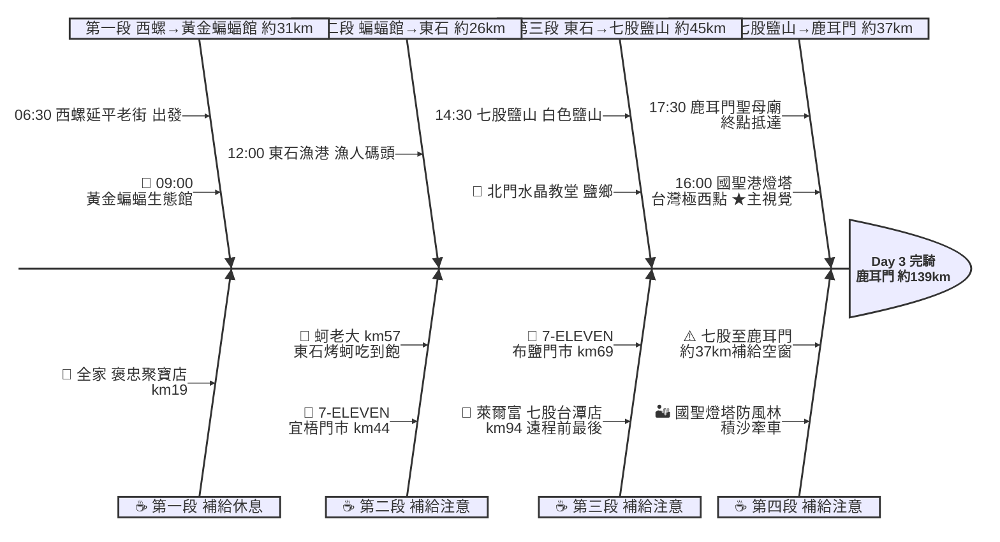

# Day 3：西螺延平老街 ➔ 鹿耳門聖母廟（濱海極西．西螺到台南）

---

## 路線總覽

* **出發地**：西螺
* **目的地**：台南/鹿耳門公園
* **總距離**：139.1 公里（GPX 實測）
* **總爬升 / 下降**：↑ 14 m ／ ↓ 44 m（全程平坦，台1線轉台17線西部濱海，無爬升，國聖港燈塔段防風林路面偶有積沙）
* **主要路線**：西螺 ➔ 黃金蝙蝠館 ➔ 台17線 ➔ 東石漁港 ➔ 布袋 ➔ 北門 ➔ 七股鹽山 ➔ 國聖港燈塔(極西) ➔ 鹿耳門

[📱 開啟 Google Maps 導航](https://www.google.com/maps/dir/?api=1&origin=%E9%9B%B2%E6%9E%97%E7%B8%A3%E8%A5%BF%E8%9E%BA%E5%BB%B6%E5%B9%B3%E8%80%81%E8%A1%97&destination=%E5%8F%B0%E5%8D%97%E5%B8%82%E9%B9%BF%E8%80%B3%E9%96%80%E8%81%96%E6%AF%8D%E5%BB%9F&waypoints=%E9%BB%83%E9%87%91%E8%9D%99%E8%9D%A0%E7%94%9F%E6%85%8B%E9%A4%A8%7C%E6%9D%B1%E7%9F%B3%E6%BC%81%E6%B8%AF%7C%E5%8F%B0%E5%8D%97%E5%8C%97%E9%96%80%E9%81%8A%E5%AE%A2%E4%B8%AD%E5%BF%83%7C%E4%B8%83%E8%82%A1%E9%B9%BD%E5%B1%B1%7C%E5%9C%8B%E8%81%96%E6%B8%AF%E7%87%88%E5%A1%94&travelmode=bicycling)

<iframe src="https://www.google.com/maps/d/u/0/embed?mid=13Pl_w2JJ-cUgbBk77eEKo-G5GZ7vJIs&ehbc=2E312F" width="100%" height="100%" style="border:none; border-radius: 8px;"></iframe>

---

## 詳細路線行程圖解

---

## 建議行程與時間配速

### 第一段：西螺延平老街 → 黃金蝙蝠生態館（約 31 km）｜雲林平原暖身段

**距離**：31 km
**路況**：自西螺沿台1線／縣道南下，穿越雲林平原農村進水林。長程日建議 06:30 前出發，全段平坦補給尚可。

**景點與補給：**
- 🚀 **06:30 西螺延平老街**（起點，km 0）：接續 Day2 終點。本日約 139km 為前段最長，務必提早出發、備足飲水。
- 🥤 **全家便利商店 褒忠聚寶店**（km ~19，褒忠）：平原段補給點，補滿水分與行動糧。
- 🦇 **09:00 黃金蝙蝠生態館**（km ~31，水林）：以金黃鼠耳蝠聞名的生態館（4.6★/2040），破西螺到東石長空檔的人氣中繼點。

---

### 第二段：黃金蝙蝠生態館 → 東石漁港（約 26 km）｜濱海蚵鄉段

**距離**：26 km
**路況**：沿縣道接台17線濱海公路進嘉義東石。靠海風大、遮蔽少，於宜梧門市補給後直奔東石午餐。

**景點與補給：**
- 🥤 **7-ELEVEN 宜梧門市**（km ~44，口湖）：濱海段補給點。
- 🦪 **11:45–12:45 蚵老大海鮮碳烤**（km ~57，東石漁港）：午餐大休點。東石招牌烤蚵吃到飽（4.8★/6760），鮮蚵與海產，補滿能量再上路。
- 🏞️ **13:00 東石漁港**（km ~57，東石）：必經點。漁人碼頭與夕陽（4.1★/1524），蚵棚海景，可短暫休息打卡。

---

### 第三段：東石漁港 → 七股鹽山（約 45 km）｜鹽鄉潟湖段

**距離**：45 km
**路況**：沿台17線南下，經布袋、北門井仔腳鹽鄉進台南七股。鹽鄉路段補給漸稀，務必在布鹽、七股台潭店補滿。

**景點與補給：**
- 🥤 **7-ELEVEN 布鹽門市**（km ~69，布袋）：布袋補給點。
- 🧂 **14:00 北門遊客中心**（km ~85，北門）：井仔腳瓦盤鹽田、水晶教堂所在鹽鄉（4.1★/5381），可順遊拍照。
- 🥤 **萊爾富 七股台潭店**（km ~94，七股）：進七股潟湖、國聖燈塔遠程段前『最後補給』，務必補滿至少 2 瓶水。
- ⛰️ **14:45 七股鹽山**（km ~102，七股）：必經點。台版富士山白色鹽山（3.9★/2萬則），鹽業地標，可登頂眺望潟湖。

---

### 第四段：七股鹽山 → 鹿耳門（約 37 km）｜極西點收尾段

**距離**：37 km
**路況**：穿越七股潟湖、防風林抵台灣本島極西國聖港燈塔，再沿海岸南下進台南安南鹿耳門。本段約 37km 幾無補給、防風林路面積沙須牽車，最艱苦也最有成就感。

**景點與補給：**
- 🗼 **16:00 國聖港燈塔**（km ~119，七股頂頭額沙洲）：必經點、本日★主視覺。台灣本島最西點黑白方格燈塔，最後一段防風林積沙建議牽車通過、注意輪胎防刺。
- 🏁 **17:30 鹿耳門聖母廟**（km ~139，台南安南）：當日終點。全台規模最大媽祖廟之一（4.7★/5234），周邊有住宿與小吃，可搭公車或騎入台南市區。

---

## 晚餐推薦

| # | 店名 | 評分 | 留言數 | 貝葉斯分 | 備註 |
|:---:|:---|:---:|---:|:---:|:---|
| 1 | [阿忠螃蟹-府城蟳禮](https://www.google.com/maps/place/?q=place_id:ChIJXTAli0fYbTQR8R6PbzuZjtI) | 5★ | 4895 | 4.9693 | 餐廳 |
| 2 | [台南土城螃蟹專賣店（耐人蟳味）](https://www.google.com/maps/place/?q=place_id:ChIJP07EjEfYbTQRJR4Uu7HgTR8) | 4.8★ | 189 | 4.6312 | 餐廳 |
| 3 | [凰詩越南美食](https://www.google.com/maps/place/?q=place_id:ChIJI8UHUlXZbTQRityPHkapKB8) | 4.8★ | 47 | 4.5707 | 越南餐廳 |
| 4 | [廟前海產碳烤](https://www.google.com/maps/place/?q=place_id:ChIJtdm_fKDZbTQRfi2uTtzMgWw) | 4.7★ | 77 | 4.5687 | 餐廳 |
| 5 | [來點鹹水雞-土城店](https://www.google.com/maps/place/?q=place_id:ChIJVw3OWBXZbTQRMY2hkjoOhjw) | 4.8★ | 22 | 4.5552 | 餐廳 |

> 💡 *排序依據：留言數越多的高分店越可信（IMDB 風格貝葉斯平均）*
> 📋 *[看更多 >>](./day3_dinner.md)*

---

## 住宿推薦 🏨

| # | 飯店 | 評分 | 留言數 | 貝葉斯分 | 備註 |
|:---:|:---|:---:|---:|:---:|:---|
| 1 | [台南民宿回家旅行(訂房加line：@comehome)](https://www.google.com/maps/place/?q=place_id:ChIJpVhOegDZbTQRKTChyjpEvoI) | 4.9★ | 47 | 4.4794 |  |
| 2 | [出差出租管理宿舍（七股工業區焚化爐工作者打工出差者）](https://www.google.com/maps/place/?q=place_id:ChIJFQuBGbPXbTQRWGUlvpLEdD4) | 4.4★ | 107 | 4.3261 |  |
| 3 | [鄉下有房](https://www.google.com/maps/place/?q=place_id:ChIJAZxY6SDYbTQReVt4BlKU-_w) | 4.5★ | 27 | 4.2952 |  |
| 4 | [九塊厝林聚庭園](https://www.google.com/maps/place/?q=place_id:ChIJa2wWoFnYbTQRRr-V48nLT1k) | 4.6★ | 14 | 4.2814 |  |
| 5 | [Titi tata 民宿](https://www.google.com/maps/place/?q=place_id:ChIJ2zBHUYLZbTQRokp0rVHUeSk) | 5★ | 3 | 4.2527 |  |

> 💡 *終點周邊 3 公里 · 10 筆候選 · IMDB 風格貝葉斯平均*
> 📋 *[看更多 >>](./day3_hotel.md)*

---

## 騎乘注意事項

1. **長程日**：本日實測約 139km，西部濱海多繞行，建議 06:00–06:30 出發、嚴格控制各點停留時間。
2. **極西點防風林積沙**：國聖港燈塔最後一段防風林路面可能積沙較深，建議牽車通過並注意輪胎防刺（index 提醒）。
3. **補給空窗（沿實際路線）**：七股台潭店(km94) 之後到鹿耳門(km139) 約 37–45km 幾無超商（七股潟湖、國聖燈塔一帶人煙稀少），務必於 km94 補滿至少 2 瓶水與高熱量補給品。
4. **海岸強風防曬**：台17線濱海全段無遮蔽，注意防曬與側風。
5. **午餐確認**：東石蚵老大等烤蚵店假日人潮多，可改東石漁人碼頭其他蚵店。
6. **撤退方案**：路線多離台鐵海線較遠，km0 西螺可至斗六站、東石/布袋一帶可搭嘉義客運至嘉義站、終點鹿耳門可騎入台南市區搭台鐵台南站。

---

## 更佳景點參考

> 以下為沿途 Bayesian 排名較高但未排入路線的備選點位。可視當天體力 / 天候 / 時間彈性加入。

### 景點備案

| 名次 | 名稱 | 評分 | 留言數 | 貝葉斯分 |
|:---:|:---|:---:|---:|:---:|
| 1 | 龍亨觀光/搭船/烤蚵/遊七股潟湖生態之旅 | 4.9★ | 590 | 4.72 |
| 2 | 北港朝天宮 | 4.7★ | 24,030 | 4.7 |
| 3 | 鹿耳門天后宮 | 4.7★ | 7,940 | 4.69 |
| 4 | 沐藝家DIY休閒觀光工廠 | 4.8★ | 672 | 4.67 |
| 5 | 芬哥農場 | 5★ | 104 | 4.53 |

### 午餐 / 餐廳大休備案

| 名次 | 店名 | 評分 | 留言數 | 貝葉斯分 |
|:---:|:---|:---:|---:|:---:|
| 1 | 阿忠螃蟹-府城蟳禮 | 5★ | 4,895 | 4.96 |
| 2 | 蠔碳嘉烤鮮蚵吃到飽-東石鮮蚵吃到飽 | 4.9★ | 4,909 | 4.87 |
| 3 | 台南七股．欖人生態民宿 | 4.9★ | 1,769 | 4.82 |

