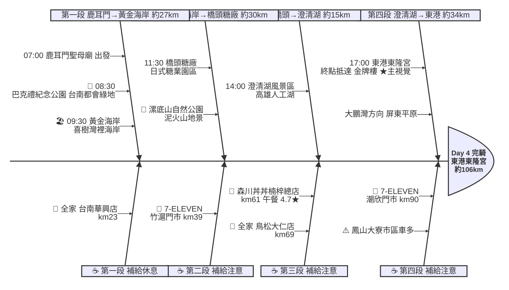

# Day 4：鹿耳門聖母廟 ➔ 東港東隆宮（府城向南．台南到東港）

---

## 路線總覽

* **出發地**：台南/鹿耳門公園
* **目的地**：東港東隆宮
* **總距離**：105.8 公里（GPX 實測）
* **總爬升 / 下降**：↑ 80 m ／ ↓ 80 m（全程平坦，台17線濱海與高雄市區道路，幾乎無爬升）
* **主要路線**：鹿耳門 ➔ 巴克禮公園 ➔ 黃金海岸 ➔ 台17線 ➔ 橋頭糖廠 ➔ 澄清湖 ➔ 鳳山 ➔ 大寮 ➔ 東港東隆宮

[📱 開啟 Google Maps 導航](https://www.google.com/maps/dir/?api=1&origin=%E5%8F%B0%E5%8D%97%E5%B8%82%E9%B9%BF%E8%80%B3%E9%96%80%E8%81%96%E6%AF%8D%E5%BB%9F&destination=%E5%B1%8F%E6%9D%B1%E7%B8%A3%E6%9D%B1%E6%B8%AF%E6%9D%B1%E9%9A%86%E5%AE%AE&waypoints=%E5%8F%B0%E5%8D%97%E5%B7%B4%E5%85%8B%E7%A6%AE%E7%B4%80%E5%BF%B5%E5%85%AC%E5%9C%92%7C%E5%8F%B0%E5%8D%97%E9%BB%83%E9%87%91%E6%B5%B7%E5%B2%B8%7C%E9%AB%98%E9%9B%84%E6%A9%8B%E9%A0%AD%E7%B3%96%E5%BB%A0%7C%E6%BE%84%E6%B8%85%E6%B9%96%E9%A2%A8%E6%99%AF%E5%8D%80&travelmode=bicycling)

<iframe src="https://www.google.com/maps/d/u/0/embed?mid=1fGVP1JC_t0o19Mx43kKNealr6btJreY&ehbc=2E312F" width="100%" height="100%" style="border:none; border-radius: 8px;"></iframe>

---

## 詳細路線行程圖解

---

## 建議行程與時間配速

### 第一段：鹿耳門聖母廟 → 黃金海岸（約 27 km）｜府城出城段

**距離**：27 km
**路況**：自鹿耳門經台南市區東側綠園道南下，過巴克禮公園後轉往南區喜樹接台17線濱海抵黃金海岸。市區路口多、注意通勤車流。

**景點與補給：**
- 🚀 **07:00 鹿耳門聖母廟**（起點，km 0）：接續 Day3 終點。建議避開台南市區早高峰，沿綠園道騎乘。
- 🌳 **08:30 巴克禮紀念公園**（km ~19，台南東區）：代表台南市區。都會綠地與生態埤塘（4.4★/7232），適合短暫休息。
- 🏖️ **09:30 黃金海岸**（km ~27，台南南區）：必經點。喜樹、灣裡一帶綿延沙岸（4.3★/1萬則），台17線濱海起點，海風大。

---

### 第二段：黃金海岸 → 橋頭糖廠（約 30 km）｜南高雄濱海段

**距離**：30 km
**路況**：沿台17線過二仁溪進高雄茄萣、彌陀，轉內陸進橋頭。濱海段遮蔽少、補給於竹滬門市補滿。

**景點與補給：**
- 🥤 **7-ELEVEN 竹滬門市**（km ~39，茄萣/路竹）：濱海段補給點。
- 🌋 **漯底山自然公園**（km ~50，彌陀）：泥火山惡地地景與觀景台（4.2★/3896），可遠眺高雄海岸平原。
- 🚂 **11:30 橋頭糖廠**（km ~57，橋頭）：日治糖業文化園區（4.2★/7575），老火車、雨豆樹與冰品，文青休息點。

---

### 第三段：橋頭糖廠 → 澄清湖（約 15 km）｜高雄都會段

**距離**：15 km
**路況**：經楠梓、仁武進鳥松抵澄清湖。市區路段補給密集，於楠梓午餐後續行。

**景點與補給：**
- 🍱 **12:00–13:00 森川丼丼楠梓總店**（km ~61，楠梓）：午餐大休點。高人氣丼飯（4.7★/1.3萬則），平價海鮮丼補充能量。
- 🥤 **全家便利商店 鳥松大仁店**（km ~69，鳥松）：澄清湖前補給點。
- 🏞️ **14:00 澄清湖風景區**（km ~72，鳥松）：必經點。高雄最大人工湖與環湖步道（4.4★/1710），九曲橋、得月樓，可環湖散心。

---

### 第四段：澄清湖 → 東港東隆宮（約 34 km）｜屏東平原收尾段

**距離**：34 km
**路況**：自澄清湖經鳳山、大寮過高屏溪進屏東，沿台17/縣道抵東港。鳳山大寮市區車流多、注意號誌；過高屏溪後豁然開朗進屏東平原。

**景點與補給：**
- 🥤 **7-ELEVEN 潮欣門市**（km ~90，大寮）：進東港前最後補給，過高屏溪前補滿。
- 🏁 **17:00 東港東隆宮**（km ~106，東港）：當日終點、本日★主視覺。以金色牌樓與三年一科王船祭聞名（4.7★/7785）。東港華僑市場黑鮪魚生魚片必嚐。

---

## 晚餐推薦

| # | 店名 | 評分 | 留言數 | 貝葉斯分 | 備註 |
|:---:|:---|:---:|---:|:---:|:---|
| 1 | [華僑市場 阿源生魚片124、125](https://www.google.com/maps/place/?q=place_id:ChIJSev8W7vhcTQRyb9RsVtTQeo) | 4.9★ | 5456 | 4.8334 | 餐廳 |
| 2 | [好想燒肉 毛孩公園 (東港店)](https://www.google.com/maps/place/?q=place_id:ChIJzz5iJ9ThcTQRKCMHMBdjDbs) | 4.9★ | 4212 | 4.8171 | 日式燒肉餐廳 |
| 3 | [老程生魚片（華僑市場編號126、127號/大門口左手第一間）](https://www.google.com/maps/place/?q=place_id:ChIJIab2jIPhcTQRqWQXg3lwHiE) | 4.9★ | 1746 | 4.7399 | 日式餐廳 |
| 4 | [食光杯 屏東東港店](https://www.google.com/maps/place/?q=place_id:ChIJnXVe46jhcTQRBoFhKTOea78) | 4.9★ | 767 | 4.6459 | 餐廳 |
| 5 | [東港華僑市場魚莊黑鮪魚生魚片、握壽司專賣店（212）](https://www.google.com/maps/place/?q=place_id:ChIJWTbKDY_hcTQRqf3RvetynZc) | 4.7★ | 3060 | 4.6385 | 海鮮餐廳 |

> 💡 *排序依據：留言數越多的高分店越可信（IMDB 風格貝葉斯平均）*
> 📋 *[看更多 >>](./day4_dinner.md)*

---

## 住宿推薦 🏨

| # | 飯店 | 評分 | 留言數 | 貝葉斯分 | 備註 |
|:---:|:---|:---:|---:|:---:|:---|
| 1 | [東港民宿-如你所院 RuNi SuoYuan Hostel-Tourist Vacation in Donggang](https://www.google.com/maps/place/?q=place_id:ChIJTwb8l-XhcTQRWRQ3bSIiYcE) | 5★ | 604 | 4.827 |  |
| 2 | [宥心文旅 You Sin B&B](https://www.google.com/maps/place/?q=place_id:ChIJZU7lBnDhcTQR2l6aPWkaD2M) | 5★ | 515 | 4.808 |  |
| 3 | [幸福浪漫旅(東港)](https://www.google.com/maps/place/?q=place_id:ChIJd95hSUkebjQRPeE8-GSjHqs) | 4.9★ | 884 | 4.7932 |  |
| 4 | [東港民宿 喝睏 H-khùn apartment 酒吧 機車出租-Tourist Vacation in Donggang](https://www.google.com/maps/place/?q=place_id:ChIJkcxwqXXhcTQRVM7R8cJGaqc) | 4.9★ | 425 | 4.7255 |  |
| 5 | [濱灣文旅](https://www.google.com/maps/place/?q=place_id:ChIJxUABP9HhcTQRLNN9FlLnEfM) | 5★ | 191 | 4.6811 |  |

> 💡 *終點周邊 3 公里 · 43 筆候選 · IMDB 風格貝葉斯平均*
> 📋 *[看更多 >>](./day4_hotel.md)*

---

## 騎乘注意事項

1. **都會車流**：台南市區、楠梓、鳳山、大寮路段車流密集，遵守號誌、行經路口減速。
2. **濱海防曬**：台17線黃金海岸至茄萣段無遮蔽，注意防曬與側風。
3. **補給充足**：本日大多行經市區，超商密集，僅濱海段（黃金海岸→彌陀）稍長，竹滬門市補滿即可。
4. **午餐選擇**：楠梓、橋頭一帶餐廳多，森川丼丼尖峰需候位，可改北平楊寶寶蒸餃、糖廠周邊餐廳。
5. **東港美食**：終點東港華僑市場黑鮪魚生魚片、雙糕潤為當地名物，晚餐推薦。
6. **撤退方案**：台南市區可搭台鐵台南站、高雄市區可搭台鐵／高捷（楠梓、鳳山站），終點東港無台鐵站，可搭屏東客運至屏東站或高雄轉乘。

---

## 更佳景點參考

> 以下為沿途 Bayesian 排名較高但未排入路線的備選點位。可視當天體力 / 天候 / 時間彈性加入。

### 景點備案

| 名次 | 名稱 | 評分 | 留言數 | 貝葉斯分 |
|:---:|:---|:---:|---:|:---:|
| 1 | 四鯤鯓紅樹林生態觀光船 | 4.6★ | 232 | 4.53 |
| 2 | 澄清湖觀夕平台 | 4.6★ | 152 | 4.52 |
| 3 | 鹿耳門牌樓 | 4.8★ | 32 | 4.5 |
| 4 | 原臺灣總督府C551、D512蒸汽機關車 | 4.6★ | 67 | 4.49 |
| 5 | 三清宮海角廣場 | 4.7★ | 26 | 4.49 |

### 午餐 / 餐廳大休備案

| 名次 | 店名 | 評分 | 留言數 | 貝葉斯分 |
|:---:|:---|:---:|---:|:---:|
| 1 | tuku bistro | 5★ | 1,233 | 4.91 |
| 2 | 燒肉無双 高雄澄清館 | 4.9★ | 8,135 | 4.89 |
| 3 | 好想燒肉 毛孩公園 (東港店) | 4.9★ | 4,212 | 4.88 |

