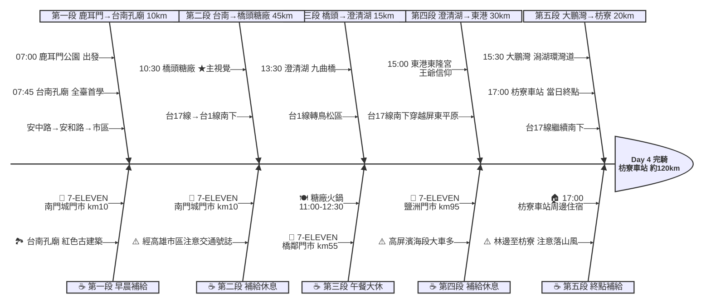

# Day 4：鹿耳門公園 ➔ 枋寮車站（南國廟宇與糖鐵巡禮）

---

## 📍 路線總覽

* **出發地**：台南 / 鹿耳門公園
* **目的地**：枋寮 / 枋山
* **總距離**：123.6 公里（GPX 實測）
* **總爬升**：全程平坦，經台南市區、高雄市區、屏東濱海平原，幾乎無爬升
* **主要路線**：鹿耳門公園 ➔ 台南孔廟 ➔ 台17線南下 ➔ 橋頭糖廠 ➔ 澄清湖 ➔ 東港東隆宮 ➔ 大鵬灣 ➔ 枋寮車站

---

## 🌍 地圖與導航

[📱 手機導航連結（Google Maps 單車模式）](https://www.google.com/maps/dir/鹿耳門公園/台南孔廟/橋頭糖廠/澄清湖/東港東隆宮/大鵬灣國家風景區/枋寮車站/@22.7,120.4,10z/data=!4m2!4m1!3e1)

#### 🗺️ 路線小地圖

> 💡 *【預設版型提醒】：請在此放置生成的路線圖 (命名為 `day4_poster.png`)，並記得將上方圖片的超連結替換成您當天的 Google My Maps 專屬連結！*

---

## 🐟 詳細路線行程圖解

---

## 🕒 建議行程與時間配速

### 第一段：鹿耳門公園 → 台南孔廟（約 10 km）｜府城文化晨騎段

**距離**：10 km
**路況**：從安南區鹿耳門出發，沿安中路、安和路進入台南市區。清晨市區車流少，路面平坦。抵達孔廟所在的中西區歷史街區。

**景點與補給：**
- 🚀 **07:00 鹿耳門公園**（起點，km 0）：Day 3 終點續行，鄰近鹿耳門聖母廟。出發前確認補水。
- 🏛️ **07:45 台南孔廟**（km 10，全臺首學）：1665 年建，台灣第一座孔廟。紅色傳統閩式建築，庭院幽靜。08:30 開門，提早到可在外圍拍照。停留 15 分鐘。
- 🏪 **08:00 7-ELEVEN 南門城門市**（km 10，南門路）：台南市區補給，購足早餐和飲水準備長距離南下。

---

### 第二段：台南孔廟 → 橋頭糖廠（約 45 km）｜台南高雄城際穿越段

**距離**：45 km
**路況**：由台南市區接台17線（西部濱海公路）南下，經仁德、湖內、路竹進入高雄市橋頭區。沿途為平坦濱海與工業混合區，部分路段貨車多，注意右側路肩。經過高雄都會區北緣。

**景點與補給：**
- 🏪 **10:25 7-ELEVEN 橋鄰門市**（km 55，橋頭區成功南路）：進入橋頭糖廠前補給，確認飲水充足。
- 🏭 **10:30 橋頭糖廠**（km 56，台灣第一座現代糖廠 ★主視覺）：1901 年日治時期興建，台灣工業革命起點。園區保留製糖工場、日式宿舍、紅磚水塔。可逛鐵園迷城、吃台糖冰品。停留 30 分鐘。

---

### 第三段：橋頭糖廠（午餐大休）→ 澄清湖（約 15 km）｜午間補給與湖畔段

**距離**：15 km
**路況**：橋頭糖廠附近午餐後，沿台1線南下轉入鳥松區。進入澄清湖園區需入園費（免費開放時段查詢官網）。路面良好，車流中等。

**景點與補給：**
- 🍽️ **11:00–12:30 糖廠火鍋**（km 56，橋頭區橋南路）：糖廠旁鍋物料理店（4.8★/495則），湯底鮮甜份量大。午餐大休 1.5 小時補充體力。
- 🏞️ **13:30 澄清湖**（km 70，高雄鳥松區）：高雄最大人工湖，著名的九曲橋蜿蜒湖面。湖畔環湖步道適合短暫散步拍照。停留 20 分鐘。

---

### 第四段：澄清湖 → 東港東隆宮 → 大鵬灣（約 33 km）｜屏東濱海王爺文化段

**距離**：33 km
**路況**：由鳥松接台1線南下經鳳山、萬丹，轉入屏東縣新園鄉、東港鎮。進入東港市區後有豐富海產小吃街。經東港跨海至大鵬灣。

**景點與補給：**
- 🏪 **14:45 7-ELEVEn 鹽洲門市**（km 95，新園鄉光復路）：東港前最後補給點，補水準備最後路段。
- 🛕 **15:00 東港東隆宮**（km 100，屏東東港）：1706 年建，台灣王爺信仰重鎮。三年一科「東港迎王平安祭典」聞名全台。華麗雕飾、金碧輝煌。停留 20 分鐘。
- 🌊 **15:30 大鵬灣國家風景區**（km 103，潟湖自行車道）：台灣最大潟湖風景區，環灣自行車道平坦視野開闊。可遠眺開啟式大鵬灣跨海大橋。停留 15 分鐘。

---

### 第五段：大鵬灣 → 枋寮車站（約 20 km）｜屏南終點衝刺段

**距離**：20 km
**路況**：由大鵬灣沿台17線繼續南下，經林邊、佳冬進入枋寮。沿途平坦但秋冬季可能有落山風。接近枋寮市區後路寬易騎。

**景點與補給：**
- 🚉 **17:00 枋寮車站**（km 120，本日終點）：屏東西部幹線重要車站，也是藍皮解憂號起點站。站前有公廁與便利商店。在此完騎本日行程，前往周邊住宿休息。

---

## 🍽️ 晚餐推薦（終點周邊 3km · 貝葉斯排序）

| # | 店名 | 評分 | 留言數 | 貝葉斯分 | 備註 |
|:---:|:---|:---:|---:|:---:|:---|
| 1 | [大叔叔廚房](https://www.google.com/maps/place/?q=place_id:ChIJ3xvN1QndcTQRPXjQ1WXgCow) | 4.8★ | 442 | 4.7196 | 精緻料理 |
| 2 | [枋新饗樂](https://www.google.com/maps/place/?q=place_id:ChIJD1RqKNrdcTQRQH9MSp1ebvY) | 4.9★ | 173 | 4.7175 | 精緻餐點 |
| 3 | [阿弟深海魚](https://www.google.com/maps/place/?q=place_id:ChIJB2e3xMTdcTQReS6qGZMIR3g) | 4.8★ | 273 | 4.7132 | 深海海鮮專門 |
| 4 | [巷子口河粉](https://www.google.com/maps/place/?q=place_id:ChIJvU_JlsHdcTQRNynrgvQrYlQ) | 4.8★ | 98 | 4.7053 | 越式河粉 |
| 5 | [阮家茶坊](https://www.google.com/maps/place/?q=place_id:ChIJyaO_4j7ccTQRIqSfs10f5ok) | 4.7★ | 3275 | 4.7001 | 茶飲+餐食 車站旁 |

> 💡 *排序依據：留言數越多的高分店越可信（IMDB 風格貝葉斯平均）*
> 📋 *完整 8 筆候選排名請見 [`day4_dinner.md`](./day4_dinner.md)*

---

## 💡 騎乘注意事項

1. **台南市區交通**：早晨 07:00 出發可避開台南尖峰車流，市區路段多紅綠燈，保持耐心。
2. **台17線高屏段大車**：台南至高雄段台17線有工業區貨車頻繁，請走慢車道並保持警覺。路竹至橋頭段尤其注意。
3. **橋頭糖廠開放時間**：園區 09:00-16:30，週一部分展館休。建議 10:30 後抵達確保開放。台糖冰品販售至 16:30。
4. **澄清湖入園**：目前免費入園，但停車收費。單車可直接騎入園區環湖道。
5. **撤退車站**：台南站（km 12）、路竹站（km 40）、橋頭站（km 55，MRT 橋頭糖廠站）、鳳山站（km 72）、東港轉乘至林邊站（km 110）。本日沿線車站密集，撤退容易。
6. **落山風注意**：林邊至枋寮段秋冬季可能遭遇落山風（東北風翻過中央山脈加速），需做好抗風準備。
7. **東港小吃**：東隆宮周邊海產街有旗魚黑輪、雙糕潤、肉粿等在地小食，可做下午點心補給。

---

## ✨ 更佳景點參考（未排入路線，加碼推薦）

> 以下為沿途搜尋結果中，**人氣或特色高於部分已排入停靠點**、地理上又合理可繞的景點，未納入路線是為了維持節奏與里程，附此作為當天臨時加碼或下次規劃參考。

| # | 景點 | 評分 / 留言數 | Bayesian | 偏離 / 往返 | 亮點 |
|:---:|:---|:---:|:---:|:---|:---|
| 1 | **鹿耳門聖母廟** | 4.7★ / 5,234 | 4.37 | 起點鹿耳門公園旁，零偏離 | 全台最大媽祖廟，壯觀殿宇；若出發時間充裕可先參觀再啟程 |
| 2 | **鹿耳門天后宮** | 4.7★ / 7,940 | 4.43 | 起點南方約 3 km，往返 +20 分鐘 | 正統鹿耳門天后宮，鄭成功登陸傳說地；歷史意義重大但需額外繞路 |

> 💡 兩座鹿耳門廟宇各有擁護者，時間充裕時可擇一參訪。聖母廟距起點最近（步行 2 分鐘），若提早 15 分鐘出發即可順遊。

