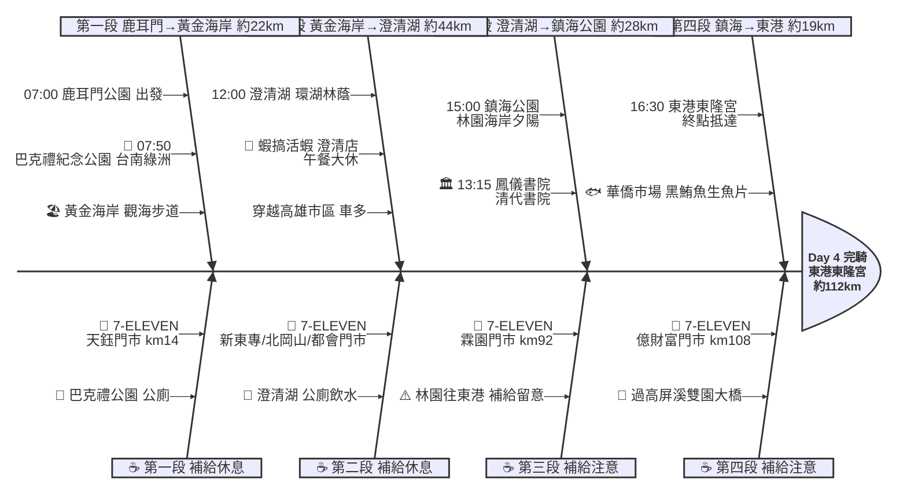

# Day 4：鹿耳門公園 ➔ 東港東隆宮（府城向南．台南到東港）

---

## 路線總覽

* **出發地**：台南/鹿耳門公園
* **目的地**：東港東隆宮
* **總距離**：111.5 公里（GPX 實測）
* **總爬升 / 下降**：全程平坦，台17線濱海與高雄市區道路，幾乎無爬升
* **主要路線**：鹿耳門 ➔ 台南市區 ➔ 黃金海岸 ➔ 台17線 ➔ 高雄市區 ➔ 澄清湖 ➔ 鳳山 ➔ 林園 ➔ 東港東隆宮

[📱 開啟 Google Maps 導航](https://www.google.com/maps/dir/?api=1&origin=%E9%B9%BF%E8%80%B3%E9%96%80%E5%85%AC%E5%9C%92%20%E5%8F%B0%E5%8D%97&destination=%E6%9D%B1%E6%B8%AF%E6%9D%B1%E9%9A%86%E5%AE%AE&waypoints=%E5%B7%B4%E5%85%8B%E7%A6%AE%E7%B4%80%E5%BF%B5%E5%85%AC%E5%9C%92%7C%E9%BB%83%E9%87%91%E6%B5%B7%E5%B2%B8%20%E5%8F%B0%E5%8D%97%E5%8D%97%E5%8D%80%7C%E6%BE%84%E6%B8%85%E6%B9%96%20%E9%AB%98%E9%9B%84%7C%E9%B3%B3%E5%84%80%E6%9B%B8%E9%99%A2%20%E9%B3%B3%E5%B1%B1%7C%E9%8E%AE%E6%B5%B7%E5%85%AC%E5%9C%92%20%E6%9E%97%E5%9C%92&travelmode=bicycling)

<iframe src="https://www.google.com/maps/d/u/0/embed?mid=1fGVP1JC_t0o19Mx43kKNealr6btJreY&ehbc=2E312F" width="100%" height="100%" style="border:none; border-radius: 8px;"></iframe>

---

## 詳細路線行程圖解

---

## 建議行程與時間配速

### 第一段：鹿耳門公園 → 黃金海岸（約 22 km）｜府城都會段

**距離**：22 km
**路況**：鹿耳門沿台17線進台南市區，經巴克禮公園後南下喜樹、灣裡至黃金海岸。市區路口多、留意交通。

**景點與補給：**
- 🚀 **07:00 鹿耳門公園**（起點，km 0）：接續 Day3 終點，鹿耳門溪口與天后宮，整裝出發。
- 🥤 **7-ELEVEN 天鈺門市**（km ~14，台南）：台南市區補給。
- 🌳 **07:50 巴克禮紀念公園**（km ~15，台南東區）：台南市區都會綠洲，老榕氣根與荷花池，晨騎散步好去處（4.4★/7232）。
- 🏖️ **08:20 黃金海岸**（km ~22，台南南區）：台南濱海觀海步道與金色沙灘，海景開闊（4.3★/萬則）。

---

### 第二段：黃金海岸 → 澄清湖（約 44 km）｜高雄都會穿越段

**距離**：44 km
**路況**：沿台17線南下進高雄市區，穿越市區後往東至鳥松澄清湖。市區車流量大，務必走慢車道、注意路口。

**景點與補給：**
- 🥤 **7-ELEVEN 新東專門市**（km ~39，路竹）：路竹段補給。
- 🥤 **7-ELEVEN 北岡山門市**（km ~47，岡山）：岡山段補給。
- 🥤 **7-ELEVEN 都會門市**（km ~63，高雄）：高雄市區補給。
- 🏞️ **12:00 澄清湖**（km ~66，鳥松）：高雄最大人工湖，九曲橋、得月樓與環湖林蔭大道，午餐大休點。
- 🦐 **12:00–13:00 蝦搞活蝦海鮮餐廳（澄清店）**（澄清湖畔）：澄清湖畔活蝦海鮮（4.8★/754），午餐大休。

---

### 第三段：澄清湖 → 鎮海公園（約 28 km）｜鳳山林園段

**距離**：28 km
**路況**：澄清湖南下經鳳山古城至林園海岸。鳳山市區補給方便，林園往東港段超商漸少。

**景點與補給：**
- 🏛️ **13:15 鳳儀書院**（km ~68，鳳山）：全台規模最大的清代書院古蹟，園區有趣味人物公仔（4.3★/8271）。
- 🥤 **7-ELEVEN 霖園門市**（km ~92，林園）：林園段補給，往東港前補滿。
- 🌅 **15:00 鎮海公園**（km ~93，林園）：林園海岸風景區，可遠眺小港工業港與夕陽。

---

### 第四段：鎮海公園 → 東港東隆宮（約 19 km）｜跨高屏溪收尾段

**距離**：19 km
**路況**：過高屏溪雙園大橋進入屏東東港。終點東港東隆宮鄰華僑市場，黑鮪魚生魚片必嚐。

**景點與補給：**
- 🥤 **7-ELEVEN 億財富門市**（km ~108，東港）：抵東港前最後補給。
- 🏁 **16:30 東港東隆宮**（km ~112，東港）：當日終點，東港王爺信仰中心、三年一科燒王船聞名，鄰華僑市場可大啖黑鮪魚生魚片。

---

## 晚餐推薦

| # | 店名 | 評分 | 留言數 | 貝葉斯分 | 備註 |
|:---:|:---|:---:|---:|:---:|:---|
| 1 | [華僑市場 阿源生魚片124、125](https://www.google.com/maps/place/?q=place_id:ChIJSev8W7vhcTQRyb9RsVtTQeo) | 4.9★ | 5456 | 4.8309 | 餐廳 |
| 2 | [好想燒肉 毛孩公園 (東港店)](https://www.google.com/maps/place/?q=place_id:ChIJzz5iJ9ThcTQRKCMHMBdjDbs) | 4.9★ | 4212 | 4.8143 | 日式燒肉餐廳 |
| 3 | [老程生魚片（華僑市場編號126、127號/大門口左手第一間）](https://www.google.com/maps/place/?q=place_id:ChIJIab2jIPhcTQRqWQXg3lwHiE) | 4.9★ | 1746 | 4.7355 | 日式餐廳 |
| 4 | [食光杯 屏東東港店](https://www.google.com/maps/place/?q=place_id:ChIJnXVe46jhcTQRBoFhKTOea78) | 4.9★ | 767 | 4.6411 | 餐廳 |
| 5 | [東港華僑市場魚莊黑鮪魚生魚片、握壽司專賣店（212）](https://www.google.com/maps/place/?q=place_id:ChIJWTbKDY_hcTQRqf3RvetynZc) | 4.7★ | 3060 | 4.6365 | 海鮮餐廳 |

> 💡 *排序依據：留言數越多的高分店越可信（IMDB 風格貝葉斯平均）*
> 📋 *[看更多 >>](./day4_dinner.md)*

---

## 住宿推薦 🏨

| # | 飯店 | 評分 | 留言數 | 貝葉斯分 | 備註 |
|:---:|:---|:---:|---:|:---:|:---|
| 1 | [東港民宿-如你所院 RuNi SuoYuan Hostel-Tourist Vacation in Donggang](https://www.google.com/maps/place/?q=place_id:ChIJTwb8l-XhcTQRWRQ3bSIiYcE) | 5★ | 604 | 4.8213 |  |
| 2 | [宥心文旅 You Sin B&B](https://www.google.com/maps/place/?q=place_id:ChIJZU7lBnDhcTQR2l6aPWkaD2M) | 5★ | 515 | 4.802 |  |
| 3 | [幸福浪漫旅(東港)](https://www.google.com/maps/place/?q=place_id:ChIJd95hSUkebjQRPeE8-GSjHqs) | 4.9★ | 884 | 4.7891 |  |
| 4 | [東港民宿 喝睏 H-khùn apartment 酒吧 機車出租-Tourist Vacation in Donggang](https://www.google.com/maps/place/?q=place_id:ChIJkcxwqXXhcTQRVM7R8cJGaqc) | 4.9★ | 425 | 4.7197 |  |
| 5 | [濱灣文旅](https://www.google.com/maps/place/?q=place_id:ChIJxUABP9HhcTQRLNN9FlLnEfM) | 5★ | 191 | 4.6735 |  |

> 💡 *終點周邊 3 公里 · 41 筆候選 · IMDB 風格貝葉斯平均*
> 📋 *[看更多 >>](./day4_hotel.md)*

---

## 騎乘注意事項

1. **高雄市區交通**：黃金海岸至澄清湖需穿越高雄市區，車流量大、紅綠燈多，務必走慢車道、保持警覺，預留較多時間。
2. **東港美食**：終點東港華僑市場以黑鮪魚生魚片聞名（阿源、老程生魚片人氣最高），務必留胃晚餐大啖。
3. **澄清湖午餐**：澄清湖環湖林蔭適合午休，蝦搞活蝦海鮮餐廳就在湖畔。
4. **里程適中**：本日 ORS 實測約 112km、平坦無爬升，較前兩日輕鬆，可從容遊台南、高雄市區景點。
5. **補給**：台南、高雄市區超商密集；林園往東港段（km92後）超商漸少，請在霖園門市補滿。
6. **撤退方案**：台南站、高雄站、鳳山站皆可搭台鐵；東港無台鐵，可搭客運至屏東或高雄轉乘，或於高雄市區評估提早收程。

---

## 更佳景點參考

> 以下為沿途 Bayesian 排名較高但未排入路線的備選點位。可視當天體力 / 天候 / 時間彈性加入。

### 景點備案

| 名次 | 名稱 | 評分 | 留言數 | 貝葉斯分 |
|:---:|:---|:---:|---:|:---:|
| 1 | 大涼生態公園榕樹廣場 | 4.3★ | 24 | 4.43 |
| 2 | 黃金海岸 喜樹秘境 | 4.4★ | 919 | 4.41 |
| 3 | 蓮池潭 | 4.4★ | 2,769 | 4.41 |
| 4 | 台南孔廟 | 4.4★ | 12,627 | 4.4 |
| 5 | 茄萣 竹滬鹽灘鹽警槍樓 | 3.9★ | 92 | 4.35 |

### 午餐 / 餐廳大休備案

| 名次 | 店名 | 評分 | 留言數 | 貝葉斯分 |
|:---:|:---|:---:|---:|:---:|
| 1 | 洄游丼飯所 | 4.9★ | 590 | 4.71 |
| 2 | 義淉義式料理-碧水河畔 | 4.8★ | 1,285 | 4.71 |
| 3 | 海明星生魚片批發零售 | 4.8★ | 1,129 | 4.7 |

