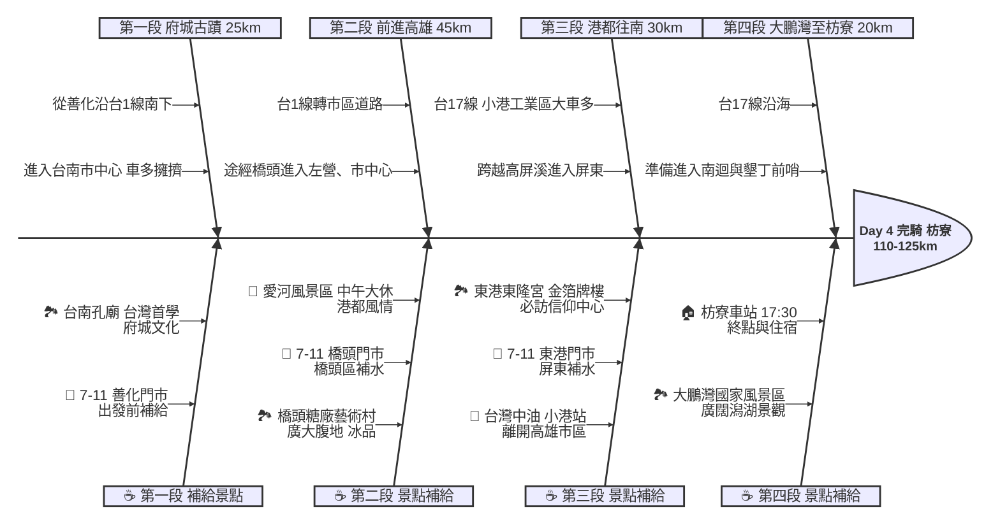

# Day 4：台南善化 ➔ 屏東枋寮 (雙城文化巡禮與港都風情)

## 📍 路線總覽
* **出發地**：台南善化車站
* **目的地**：屏東枋寮車站
* **總距離**：約 110 - 125 公里
* **總爬升**：平坦（主要行經市區與平原道路）
* **主要路線**：台1線（台南） ➔ 台17線（高雄、屏東）

---

### 🌍 Google Maps 導航與地圖預覽

#### 手機導航連結
👉 **[點擊此處開啟 Day 4 都會與港區導航（腳踏車模式）](https://www.google.com/maps/dir/?api=1&origin=%E5%8F%B0%E5%8D%97%E5%96%84%E5%8C%96%E8%BB%8A%E7%AB%99&destination=%E5%B1%8F%E6%9D%B1%E6%9E%枋%E5%AF%AE%E8%BB%8A%E7%AB%99&waypoints=%E5%8F%B0%E5%8D%97%E5%AD%94%E5%BB%9F%7C%E9%AB%98%E9%9B%84%E6%A9%8B%E9%A0%AD%E7%B3%96%E5%BB%A0%7C%E9%AB%98%E9%9B%84%E6%84%9B%E6%B2%B3%7C%E5%B1%8F%E6%9D%B1%E6%9D%B1%E6%B8%AF%E6%9D%B1%E9%9A%86%E5%AE%AE%7C%E5%B1%8F%E6%9D%B1%E5%A4%A7%E9%B5%AC%E7%81%A3&travelmode=bicycling)**

#### 🗺️ 路線小地圖

> 💡 *【預設版型提醒】：請在此放置生成的路線圖 (命名為 `day4_poster.png`)，並記得將上方圖片的超連結替換成您當天的 Google My Maps 專屬連結！*

---

## 🐟 魚骨圖 (Ishikawa Diagram)

---

## 🕒 建議行程與時間配速

### 第一段：府城巡禮（善化 ➔ 台南市區）
* **距離**：約 25 km
* **路況**：從善化出發沿台1線南下，進入台南市區。市區紅綠燈密集、機車較多，請放慢速度並注意交通安全。
* **景點 / 休息補給**：
  * **出發補給**：善化車站旁的 **7-11 善化門市** 補水。
  * **台南孔廟**（評分 4.4，推薦景點）：「全台首學」，紅色的古老磚牆與茂密的老樹，是體驗府城歷史的最佳起點。

### 第二段：南下港都（台南市區 ➔ 橋頭 ➔ 高雄愛河）
* **距離**：約 45 km
* **路況**：離開台南市區後，路況變為平直的省道。進入高雄橋頭後逐漸回到都會區。
* **景點 / 休息補給**：
  * **橋頭糖廠藝術村**（評分 4.3）：佔地廣闊，擁有豐富的百年糖業歷史與公共藝術，推薦品嚐著名的糖廠冰品。
  * **愛河風景區**（評分 4.3）：本日**午餐大休點**。沿著美麗的愛河自行車道騎乘，體驗高雄獨特的港都水岸風情。

### 第三段：跨越高屏溪（高雄愛河 ➔ 小港 ➔ 東港）
* **距離**：約 30 km
* **路況**：從市中心沿台17線往南，會經過小港與林園工業區。**注意：此路段大卡車與貨櫃車極多，請務必騎在機慢車道並保持警覺。** 跨越高屏溪雙園大橋後進入屏東縣。
* **景點 / 休息補給**：
  * **台灣中油 小港站**：離開工業區前可稍微休息借廁所。
  * **東港東隆宮**（評分 4.7，最高人氣）：三年一科「迎王平安祭典」聞名全台，耗資數億打造的黃金牌樓極為壯觀。

### 第四段：南國前哨（東港 ➔ 大鵬灣 ➔ 枋寮）
* **距離**：約 20 km
* **路況**：沿著屏東平原的台17線向南，路面寬廣平坦，開始感受到熱帶氣候的陽光。
* **景點 / 休息補給**：
  * **大鵬灣國家風景區**（評分 4.1）：擁有台灣最大的單口囊狀潟湖與跨海大橋，風景開闊。
  * **終點：枋寮車站**（評分 4.3）：傍晚抵達。這裡是西部幹線的終點，也是隔天前往墾丁或南迴公路的關鍵前哨站。

---

## 💡 騎乘注意事項

1. **市區車流與紅綠燈**：本日穿梭於台南、高雄兩大都會區，紅綠燈非常多，會大幅拉低均速。請預留更多的騎乘時間。
2. **小港工業區大車**：離開高雄市區行經小港、林園一帶（台17線），貨車與砂石車頻繁出沒。請靠右騎乘，勿與大車併行，過橋時小心側風。
3. **南部氣候炎熱**：進入屏東後陽光會更加強烈，請增加飲水頻率並加強防曬。
4. **撤退方案**：
   * 本日全程與台鐵西部幹線高度重疊，撤退極為方便。
   * **台南車站**、**高雄車站**、**新左營車站** 都是極佳的撤退與維修點。
   * 若體力不支，可直接從高雄搭車前往終點 **枋寮車站**。
