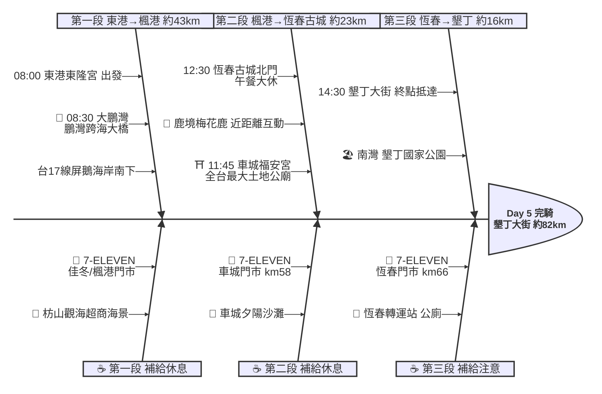

# Day 5：東港東隆宮 ➔ 墾丁大街（屏鵝南境．東港到墾丁）

---

## 路線總覽

* **出發地**：東港東隆宮
* **目的地**：墾丁大街
* **總距離**：82.2 公里（GPX 實測）
* **總爬升 / 下降**：前段台17平坦，楓港轉台26屏鵝公路後恆春半島地形略有起伏
* **主要路線**：東港 ➔ 大鵬灣 ➔ 台17線 ➔ 枋寮 ➔ 楓港 ➔ 台26屏鵝公路 ➔ 車城福安宮 ➔ 恆春古城 ➔ 墾丁大街

[📱 開啟 Google Maps 導航](https://www.google.com/maps/dir/?api=1&origin=%E6%9D%B1%E6%B8%AF%E6%9D%B1%E9%9A%86%E5%AE%AE&destination=%E5%A2%BE%E4%B8%81%E5%A4%A7%E8%A1%97&waypoints=%E9%B5%AC%E7%81%A3%E8%B7%A8%E6%B5%B7%E5%A4%A7%E6%A9%8B%7C%E8%BB%8A%E5%9F%8E%E7%A6%8F%E5%AE%89%E5%AE%AE%7C%E9%B9%BF%E5%A2%83%E6%A2%85%E8%8A%B1%E9%B9%BF%E7%94%9F%E6%85%8B%E5%9C%92%E5%8D%80%7C%E6%81%86%E6%98%A5%E7%B8%A3%E5%9F%8E%E5%8C%97%E9%96%80&travelmode=bicycling)

<iframe src="https://www.google.com/maps/d/u/0/embed?mid=1_OoqI76KfShNADmaLx_cPvZ_pPCfut0&ehbc=2E312F" width="100%" height="100%" style="border:none; border-radius: 8px;"></iframe>

---

## 詳細路線行程圖解

---

## 建議行程與時間配速

### 第一段：東港東隆宮 → 楓港（約 43 km）｜屏鵝海岸南下段

**距離**：43 km
**路況**：東港出發先遊大鵬灣，沿台17線經林邊、佳冬、枋寮南下，至楓港轉台26屏鵝公路。前段平坦濱海、補給尚密，海景開闊但遮蔽少。

**景點與補給：**
- 🚀 **08:00 東港東隆宮**（起點，km 0）：接續 Day4 終點，東港王爺信仰中心，整裝出發。
- 🌉 **08:30 大鵬灣（鵬灣跨海大橋）**（km ~5）：南台灣最大潟湖，鵬灣跨海大橋與環灣自行車道，可遠眺潟湖濕地（4.3★/4230）。
- 🥤 **7-ELEVEN 佳冬門市**（km ~14，佳冬）：佳冬段補給。
- 🌊 **全家便利商店 枋山觀海店**（km ~31，枋山）：枋山海景超商，可眺台灣海峽，補給休息。
- 🥤 **7-ELEVEN 楓港門市**（km ~43，楓港）：楓港轉台26屏鵝公路前補給。

---

### 第二段：楓港 → 恆春古城（約 23 km）｜恆春半島段

**距離**：23 km
**路況**：楓港接台26屏鵝公路進入恆春半島，地形略有起伏，經車城、保力至恆春古城。海風強勁，沿途有海景與牧場。

**景點與補給：**
- ⛩️ **11:45 車城福安宮**（km ~58，車城）：全台規模最大的土地公廟，香火鼎盛、金碧輝煌（4.6★/2.4萬）。
- 🥤 **7-ELEVEN 車城門市**（km ~58，車城）：車城段補給。
- 🦌 **12:15 鹿境梅花鹿生態園區**（km ~65，恆春）：可與梅花鹿近距離互動餵食的人氣園區（4.4★/1.9萬）。
- 🏯 **12:30 恆春縣城北門**（km ~66，恆春）：恆春古城保存最完整的城門，《海角七號》場景，午餐大休區。

---

### 第三段：恆春古城 → 墾丁大街（約 16 km）｜國境之南收尾段

**距離**：16 km
**路況**：恆春沿台26續行，經南灣抵墾丁大街。國境之南海景明媚，終點墾丁大街夜市美食與南灣戲水。

**景點與補給：**
- 🍱 **12:30–13:30 虎炊稻 Höo Triptown 臺菜沙龍**（恆春古城）：恆春在地台菜餐廳，午餐大休。
- 🥤 **7-ELEVEN 恆春門市**（km ~66，恆春）：恆春古城補給，往墾丁前補滿。
- 🏁 **14:30 墾丁大街**（km ~82，墾丁）：當日終點，墾丁大街夜市與南灣海灘，國境之南的度假勝地。

---

## 晚餐推薦

| # | 店名 | 評分 | 留言數 | 貝葉斯分 | 備註 |
|:---:|:---|:---:|---:|:---:|:---|
| 1 | [白沙灘泰式餐廳](https://www.google.com/maps/place/?q=place_id:ChIJdZTIfIixcTQRKpQlFFRQXok) | 4.7★ | 3381 | 4.6585 | 泰國餐廳 |
| 2 | [六木無煙燒肉海鮮](https://www.google.com/maps/place/?q=place_id:ChIJT1sbjT2xcTQRA9mTGJDRAPw) | 4.7★ | 1600 | 4.6281 | 日式燒肉餐廳 |
| 3 | [【珍饌庭園餐廳】墾丁美食｜墾丁餐廳推薦｜Kenting restaurants｜墾丁大街美食｜合菜 海產 親子 恆春美食 Dcard推薦](https://www.google.com/maps/place/?q=place_id:ChIJj5QZvOGxcTQR2X09mIwMhKw) | 4.8★ | 553 | 4.6136 | 中式餐廳 |
| 4 | [曼波泰式餐廳・大街26年最老店|新店址：墾丁路21-4號.在大街的最後段・雲鄉餐廳旁邊有個英文招牌Mambo就是我們・停車場正對面](https://www.google.com/maps/place/?q=place_id:ChIJCYKtZYixcTQRkbW95spHm-U) | 4.6★ | 4076 | 4.5813 | 泰國餐廳 |
| 5 | [恆春陳海鮮餐廳-墾丁店 |海鮮、台菜、熱炒、生魚片 | 墾丁大街美食 Chen.Seafood](https://www.google.com/maps/place/?q=place_id:ChIJSYdj7j-wcTQRKw4GQCx6oTw) | 4.6★ | 3512 | 4.5788 | 海鮮餐廳 |

> 💡 *排序依據：留言數越多的高分店越可信（IMDB 風格貝葉斯平均）*
> 📋 *[看更多 >>](./day5_dinner.md)*

---

## 住宿推薦 🏨

| # | 飯店 | 評分 | 留言數 | 貝葉斯分 | 備註 |
|:---:|:---|:---:|---:|:---:|:---|
| 1 | [墾丁卿卿文旅 民宿推薦/住宿推薦/恆春半島住宿](https://www.google.com/maps/place/?q=place_id:ChIJ0U-9GACxcTQRXwZH1AGC_jE) | 5★ | 554 | 4.5154 |  |
| 2 | [墾丁 My Home 青年旅館背包客棧](https://www.google.com/maps/place/?q=place_id:ChIJK5LHUo-xcTQRkw4RjkbNTtQ) | 4.8★ | 933 | 4.5139 |  |
| 3 | [墾丁南國之夢(原墾丁儷山林會館)](https://www.google.com/maps/place/?q=place_id:ChIJfzUWWYqxcTQRgQxLHvubs6E) | 4.8★ | 838 | 4.4996 |  |
| 4 | [瑪雅之家](https://www.google.com/maps/place/?q=place_id:ChIJJxqeHpuxcTQRhrQrhnIF-sE) | 4.8★ | 608 | 4.4582 |  |
| 5 | [承億文旅-墾丁雅客小半島](https://www.google.com/maps/place/?q=place_id:ChIJF9rXh4WxcTQRQEDmbCtkSzY) | 4.5★ | 2581 | 4.4308 |  |

> 💡 *終點周邊 3 公里 · 49 筆候選 · IMDB 風格貝葉斯平均*
> 📋 *[看更多 >>](./day5_hotel.md)*

---

## 騎乘注意事項

1. **屏鵝公路**：東港至楓港走台17/台1濱海，楓港後轉台26屏鵝公路進恆春半島，地形漸有起伏、海風強勁，注意防曬與側風。
2. **大鵬灣**：南台灣最大潟湖，鵬灣跨海大橋為地標，環灣自行車道適合短暫騎遊。
3. **恆春美食**：恆春古城周邊有綠豆蒜、鴨肉冬粉、在地台菜，午餐後可逛《海角七號》阿嘉的家與恆春老街。
4. **里程輕鬆**：本日 ORS 實測約 82km，是環島南段較輕鬆的一日，可從容遊大鵬灣、車城、恆春與墾丁。
5. **墾丁住宿**：終點墾丁大街住宿與美食選擇多，南灣、船帆石、墾丁國家公園可隔日續遊。
6. **撤退方案**：枋寮為台鐵南迴線車站（km~21 可叫車前往），恆春、楓港有客運轉運站可搭往高雄、台東；東港、墾丁無台鐵。

---

## 更佳景點參考

> 以下為沿途 Bayesian 排名較高但未排入路線的備選點位。可視當天體力 / 天候 / 時間彈性加入。

### 景點備案

| 名次 | 名稱 | 評分 | 留言數 | 貝葉斯分 |
|:---:|:---|:---:|---:|:---:|
| 1 | 車城夕陽沙灘 | 4.5★ | 203 | 4.46 |
| 2 | 黃金海岸景觀公路 | 4.5★ | 44 | 4.45 |
| 3 | 龜山沙灘 | 4.6★ | 28 | 4.45 |
| 4 | 黄金海岸沙灘（屏東天空之鏡） | 4.4★ | 468 | 4.43 |
| 5 | 海口沙漠 | 4.1★ | 154 | 4.38 |

### 午餐 / 餐廳大休備案

| 名次 | 店名 | 評分 | 留言數 | 貝葉斯分 |
|:---:|:---|:---:|---:|:---:|
| 1 | 水綠方創意鍋物( 平日中午收客到1330 假日中午收客到1400)(停車場在水底寮夜市空地)-枋寮熱門鍋物 | 4.8★ | 2,110 | 4.72 |
| 2 | 東港華僑市場魚莊黑鮪魚生魚片、握壽司專賣店（212） | 4.7★ | 3,060 | 4.66 |
| 3 | 巷子內海鮮熱炒｜墾丁美食｜生魚片｜必吃餐廳｜seafood | 4.6★ | 3,440 | 4.58 |

