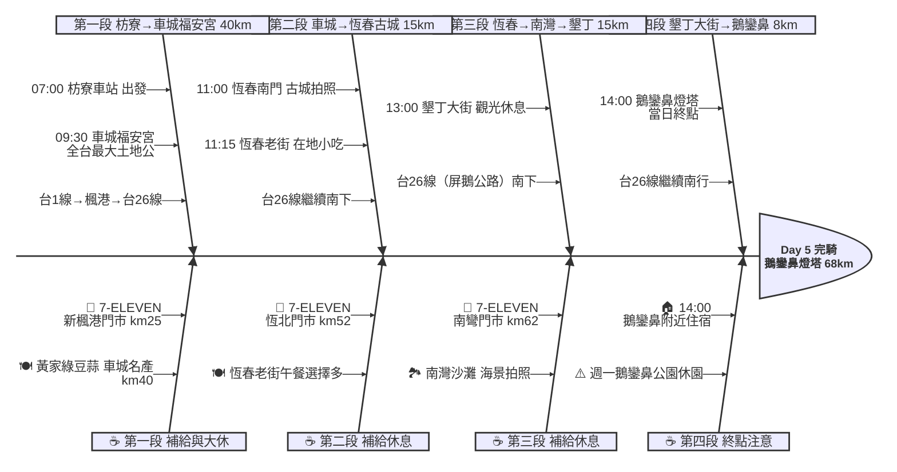

# Day 5：枋寮車站 ➔ 鵝鑾鼻燈塔（屏鵝公路南國追風行）

---

## 📍 路線總覽

* **出發地**：枋寮 / 枋山
* **目的地**：恆春 / 墾丁 / 鵝鑾鼻
* **總距離**：68.1 公里（GPX 實測）
* **總爬升**：前半段平坦（枋寮→車城），後半段有緩坡（恆春→鵝鑾鼻），總爬升約 200m
* **主要路線**：枋寮車站 ➔ 台1線南下 ➔ 楓港 ➔ 台26線（屏鵝公路）➔ 車城福安宮 ➔ 恆春古城 ➔ 南灣 ➔ 墾丁大街 ➔ 鵝鑾鼻燈塔

---

## 🌍 地圖與導航

[📱 手機導航連結（Google Maps 單車模式）](https://www.google.com/maps/dir/枋寮車站/車城福安宮/恆春南門/墾丁大街/鵝鑾鼻燈塔/@22.1,120.7,11z/data=!4m2!4m1!3e1)

#### 🗺️ 路線小地圖

> 💡 *【預設版型提醒】：請在此放置生成的路線圖 (命名為 `day5_poster.png`)，並記得將上方圖片的超連結替換成您當天的 Google My Maps 專屬連結！*

---

## 🐟 詳細路線行程圖解

---

## 🕒 建議行程與時間配速

### 第一段：枋寮車站 → 車城福安宮（約 40 km）｜屏南海岸追風段

**距離**：40 km
**路況**：由枋寮沿台1線南下，經枋山、楓港後轉接台26線（屏鵝公路）進入車城。前段沿海岸平坦，楓港至車城有輕微起伏。秋冬季可能有落山風。

**景點與補給：**
- 🚀 **07:00 枋寮車站**（起點，km 0）：Day 4 終點續行，站前有公廁與便利商店，出發前補足水分。
- 🏪 **08:30 7-ELEVEN 新楓港門市**（km 25，楓港村）：楓港聚落唯一便利商店，台1線轉台26線的關鍵路口。補水後準備進入屏鵝公路。
- 🛕 **09:30 車城福安宮**（km 40，全台最大土地公廟）：清康熙年間（1662年）創建，全東南亞最大土地公廟。金碧輝煌、香火極盛。周邊市場有綠豆蒜、洋蔥鴨肉等特產。停留 30 分鐘參拜+吃點心。
- 🍽️ **09:30–10:30 黃家綠豆蒜**（km 40，福安宮旁）：車城在地名產綠豆蒜（4.2★/6242則），清涼消暑甜品。搭配洋蔥鴨肉當上午茶大休。

---

### 第二段：車城 → 恆春古城（約 15 km）｜恆春半島入城段

**距離**：15 km
**路況**：沿台26線續南，地勢平緩，車流中等。進入恆春鎮後有紅綠燈，車速放慢。

**景點與補給：**
- 🏪 **10:45 7-ELEVEN 恆北門市**（km 52，恆春鎮北端）：進入恆春前補給，確認飲水與防曬。
- 🏰 **11:00 恆春南門**（km 55，台灣僅存完整城門）：清光緒年間建造的恆春古城，是台灣保存最完整的古城門之一。紅磚拱門造型典雅。停留 10 分鐘拍照。
- 🏘️ **11:15 恆春老街**（km 55，古城內商業街）：中山路老街保留傳統風貌，在地小吃眾多（綠豆饌、陳家蔥油餅、古早味鏢魚）。可在此午餐或小食補給。停留 20 分鐘。

---

### 第三段：恆春 → 南灣 → 墾丁大街（約 15 km）｜屏鵝公路海景段

**距離**：15 km
**路況**：出恆春南門接台26線南下，經南灣沙灘到墾丁。沿途可見蔚藍海岸與珊瑚礁海岸，有些微上下起伏。觀光客較多，注意遊覽車。

**景點與補給：**
- 🏪 **12:00 7-ELEVEN 南彎門市**（km 62，南灣路）：南灣沙灘旁補給點，可順便遠眺南灣海景。
- 🏖️ **13:00 墾丁大街**（km 70，墾丁主要觀光街）：墾丁最熱鬧的商業街，餐飲、伴手禮、水上活動一應俱全。白天相對安靜，晚上才是夜市。停留 15 分鐘休息拍照。

---

### 第四段：墾丁大街 → 鵝鑾鼻燈塔（約 8 km）｜台灣最南端抵達段

**距離**：8 km
**路況**：由墾丁大街沿台26線續行至鵝鑾鼻。最後一段為緩上坡至燈塔園區。路面良好，車流少。

**景點與補給：**
- 🗼 **14:00 鵝鑾鼻燈塔**（km 78，本日終點）：1882 年建造的白色圓塔燈塔，是台灣最南端的燈塔，被列為國定古蹟。園區內有珊瑚礁步道與海岸觀景台。入園費 NT$60。在此完騎本日行程，前往附近住宿。

---

## 🍽️ 晚餐推薦（終點周邊 3km · 貝葉斯排序）

| # | 店名 | 評分 | 留言數 | 貝葉斯分 | 備註 |
|:---:|:---|:---:|---:|:---:|:---|
| 1 | [沙丁嶼餐酒館](https://www.google.com/maps/place/?q=place_id:ChIJFbQ4knSxcTQREYzR12aFUaE) | 5.0★ | 473 | 4.6779 | 墾丁精緻餐酒館 |
| 2 | [後壁湖上安活海鮮](https://www.google.com/maps/place/?q=place_id:ChIJKaUzeDiwcTQRa2hw5EADw2s) | 4.7★ | 3996 | 4.6679 | 後壁湖生魚片 |
| 3 | [一支林海鮮](https://www.google.com/maps/place/?q=place_id:ChIJfaURJ5mxcTQRpvGj_lxHBmw) | 4.7★ | 2205 | 4.6555 | 後壁湖海鮮 |
| 4 | [天麟食苑臺灣菜](https://www.google.com/maps/place/?q=place_id:ChIJHdJeRgCxcTQRgC997nMSIiU) | 4.7★ | 314 | 4.6248 | 墾丁台菜 |
| 5 | [巷子內海鮮熱炒](https://www.google.com/maps/place/?q=place_id:ChIJS-8yioWxcTQRY-vhorkDyeY) | 4.6★ | 3436 | 4.6062 | 墾丁大街旁海鮮 |

> 💡 *排序依據：留言數越多的高分店越可信（IMDB 風格貝葉斯平均）*
> 📋 *完整 8 筆候選排名請見 [`day5_dinner.md`](./day5_dinner.md)*

---

## 💡 騎乘注意事項

1. **落山風注意**：枋寮至楓港段秋冬季可能有強烈落山風（東北季風翻越中央山脈加速），風速可達 8-10 級，須壓低重心、注意安全。
2. **楓港至車城補給空窗**：km 25（楓港 7-11）至 km 40（車城福安宮）間無大型補給點約 15 km，確保楓港補滿水。
3. **鵝鑾鼻公園週一休園**：若當日為週一，燈塔園區不開放。可改在南端「最南點」意象碑拍照打卡（園區外，免費進入）。
4. **撤退車站**：枋寮站（km 0）是最後的台鐵車站。枋寮以南至墾丁無鐵路，撤退需搭墾丁快線巴士（枋寮→恆春→墾丁，約 1 小時）或計程車。
5. **防曬與補水**：恆春半島日照強烈，全程幾乎無遮蔭。建議每 20 分鐘補水一次，攜帶至少 2 瓶水。
6. **住宿建議**：鵝鑾鼻附近住宿選擇不多，可回墾丁大街或船帆石附近找民宿。隔天 Day 6 需一大早出發攻壽卡，建議住鵝鑾鼻至船帆石區間最省隔天里程。

---

## ✨ 更佳景點參考（未排入路線，加碼推薦）

> 以下為沿途搜尋結果中，**人氣或特色高於部分已排入停靠點**、地理上又合理可繞的景點，未納入路線是為了維持節奏與里程，附此作為當天臨時加碼或下次規劃參考。

| # | 景點 | 評分 / 留言數 | Bayesian | 偏離 / 往返 | 亮點 |
|:---:|:---|:---:|:---:|:---|:---|
| 1 | **田中海鮮** | 4.4★ / 2,060 | 4.31 | 車城福安宮南方約 1 km，偏離主線 < 500m | 車城在地熱炒海鮮，評價穩定；若想吃正餐可替代綠豆蒜 |
| 2 | **恆春夜市（週日限定）** | 4.4★ / 6,176 | — | 恆春古城旁，零偏離 | 只有週日營業的在地夜市，若行程剛好遇週日可納入晚餐前逛逛 |

> 💡 車城到恆春沿線還有海生館（國立海洋生物博物館，4.5★/28000則），但需額外繞路約 5 km 且參觀需 2-3 小時，不適合環島行程中途停留。

