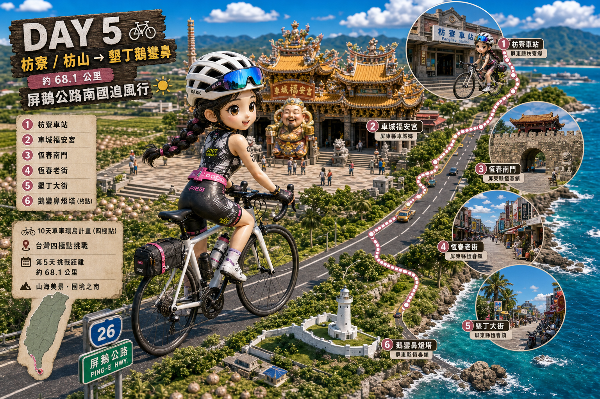
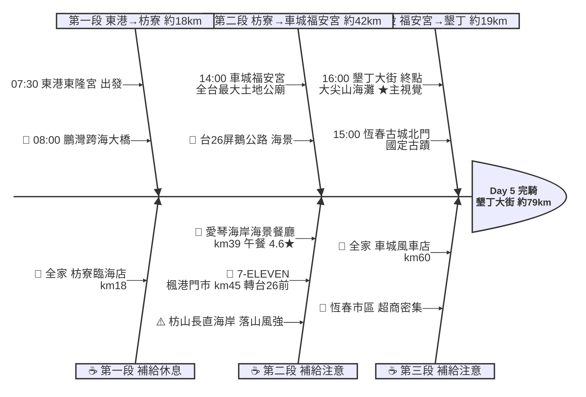

# Day 5：東港東隆宮 ➔ 墾丁大街（屏鵝南境．東港到墾丁）

---

## 路線總覽

* **出發地**：東港東隆宮
* **目的地**：墾丁
* **總距離**：78.5 公里（GPX 實測）
* **總爬升 / 下降**：↑ 194 m ／ ↓ 188 m（前段台17/台1平坦，楓港轉台26屏鵝公路後有起伏，恆春半島地形略有緩坡）
* **主要路線**：東港 ➔ 鵬灣跨海大橋 ➔ 台17/台1線 ➔ 枋山 ➔ 楓港 ➔ 台26線 ➔ 車城福安宮 ➔ 恆春古城 ➔ 墾丁大街

[📱 開啟 Google Maps 導航](https://www.google.com/maps/dir/?api=1&origin=%E5%B1%8F%E6%9D%B1%E7%B8%A3%E6%9D%B1%E6%B8%AF%E6%9D%B1%E9%9A%86%E5%AE%AE&destination=%E5%B1%8F%E6%9D%B1%E7%B8%A3%E5%A2%BE%E4%B8%81%E5%A4%A7%E8%A1%97&waypoints=%E9%B5%AC%E7%81%A3%E8%B7%A8%E6%B5%B7%E5%A4%A7%E6%A9%8B%7C%E6%9E%8B%E5%B1%B1%E6%B5%B7%E5%A4%A7%E5%B1%B1%E5%B0%8F%7C%E8%BB%8A%E5%9F%8E%E7%A6%8F%E5%AE%89%E5%AE%AE%7C%E6%81%86%E6%98%A5%E7%B8%A3%E5%9F%8E%E5%8C%97%E9%96%80&travelmode=bicycling)

<iframe src="https://www.google.com/maps/d/u/0/embed?mid=1_OoqI76KfShNADmaLx_cPvZ_pPCfut0&ehbc=2E312F" width="100%" height="100%" style="border:none; border-radius: 8px;"></iframe>

---

## 詳細路線行程圖解

---

## 建議行程與時間配速

### 第一段：東港東隆宮 → 枋寮（約 18 km）｜大鵬灣暖身段

**距離**：18 km
**路況**：自東港經大鵬灣跨海大橋，沿台17線南下進林邊、佳冬抵枋寮。全段平坦、補給充足。短程日可從容出發。

**景點與補給：**
- 🚀 **07:30 東港東隆宮**（起點，km 0）：接續 Day4 終點。出發前可逛東港漁港，本日里程短可從容。
- 🌉 **08:00 鵬灣跨海大橋**（km ~2，大鵬灣）：必經點（大鵬灣）。全台唯一可開啟的跨海大橋（4.3★/4230），潟湖風光。
- 🥤 **全家便利商店 枋寮臨海店**（km ~18，枋寮）：枋寮補給點，進入台1線長海岸前補滿。

---

### 第二段：枋寮 → 車城福安宮（約 42 km）｜屏鵝公路海景段

**距離**：42 km
**路況**：沿台1線過枋山，於楓港轉台26屏鵝公路進恆春半島。枋山至楓港長直海岸無遮蔽、冬季落山風強勁，務必補滿水分、控制節奏。

**景點與補給：**
- 🍱 **11:30–12:30 愛琴海岸海景咖啡餐廳**（km ~39，枋山）：午餐大休點。台1線旁人氣海景餐廳（4.6★/8150），面西看海，補充能量。
- 🥤 **7-ELEVEN 楓港門市**（km ~45，楓港）：楓港轉台26屏鵝公路前最後大補給。
- ⛩️ **14:00 車城福安宮**（km ~60，車城）：全台規模最大的土地公廟（4.6★/2.4萬則），香火鼎盛，可休息參拜。

---

### 第三段：車城福安宮 → 墾丁大街（約 19 km）｜國境之南收尾段

**距離**：19 km
**路況**：沿台26線經恆春古城進墾丁。恆春市區補給密集、車流漸多，過恆春後緩上坡進墾丁。

**景點與補給：**
- 🥤 **全家便利商店 車城風車店**（km ~60，車城）：車城補給點。
- 🏯 **15:00 恆春縣城北門**（km ~67，恆春）：必經點（恆春古城）。國定古蹟恆春縣城（4.4★/2205），台灣保存最完整的古城門。
- 🏁 **16:00 墾丁大街**（km ~79，墾丁）：當日終點、本日★主視覺。國境之南度假勝地，大尖石山下的椰林海灘與熱鬧大街，晚上夜市美食。

---

## 晚餐推薦

| # | 店名 | 評分 | 留言數 | 貝葉斯分 | 備註 |
|:---:|:---|:---:|---:|:---:|:---|
| 1 | [墾丁阿勝石頭鄉烤珍珠玉米](https://www.google.com/maps/place/?q=place_id:ChIJJae1TW6xcTQRTDhBwGw2Hjo) | 5★ | 9248 | 4.961 | 燒烤料理餐廳 |
| 2 | [白沙灘泰式餐廳](https://www.google.com/maps/place/?q=place_id:ChIJdZTIfIixcTQRKpQlFFRQXok) | 4.7★ | 3381 | 4.679 | 泰國餐廳 |
| 3 | [【珍饌庭園餐廳】墾丁美食｜墾丁餐廳推薦｜Kenting restaurants｜墾丁大街美食｜合菜 海產 親子 恆春美食 Dcard推薦](https://www.google.com/maps/place/?q=place_id:ChIJj5QZvOGxcTQR2X09mIwMhKw) | 4.8★ | 553 | 4.6764 | 中式餐廳 |
| 4 | [六木無煙燒肉海鮮](https://www.google.com/maps/place/?q=place_id:ChIJT1sbjT2xcTQRA9mTGJDRAPw) | 4.7★ | 1600 | 4.6648 | 日式燒肉餐廳 |
| 5 | [傳味烤魷魚](https://www.google.com/maps/place/?q=place_id:ChIJy_zNCnmxcTQRBCqXL5EakWs) | 4.9★ | 169 | 4.6509 | 燒烤料理餐廳 |

> 💡 *排序依據：留言數越多的高分店越可信（IMDB 風格貝葉斯平均）*
> 📋 *[看更多 >>](./day5_dinner.md)*

---

## 住宿推薦 🏨

| # | 飯店 | 評分 | 留言數 | 貝葉斯分 | 備註 |
|:---:|:---|:---:|---:|:---:|:---|
| 1 | [墾丁卿卿文旅 民宿推薦/住宿推薦/恆春半島住宿](https://www.google.com/maps/place/?q=place_id:ChIJ0U-9GACxcTQRXwZH1AGC_jE) | 5★ | 554 | 4.5154 |  |
| 2 | [墾丁 My Home 青年旅館背包客棧](https://www.google.com/maps/place/?q=place_id:ChIJK5LHUo-xcTQRkw4RjkbNTtQ) | 4.8★ | 933 | 4.5139 |  |
| 3 | [墾丁南國之夢(原墾丁儷山林會館)](https://www.google.com/maps/place/?q=place_id:ChIJfzUWWYqxcTQRgQxLHvubs6E) | 4.8★ | 838 | 4.4996 |  |
| 4 | [瑪雅之家](https://www.google.com/maps/place/?q=place_id:ChIJJxqeHpuxcTQRhrQrhnIF-sE) | 4.8★ | 608 | 4.4582 |  |
| 5 | [承億文旅-墾丁雅客小半島](https://www.google.com/maps/place/?q=place_id:ChIJF9rXh4WxcTQRQEDmbCtkSzY) | 4.5★ | 2581 | 4.4308 |  |

> 💡 *終點周邊 3 公里 · 49 筆候選 · IMDB 風格貝葉斯平均*
> 📋 *[看更多 >>](./day5_hotel.md)*

---

## 騎乘注意事項

1. **落山風／側風**：枋山至楓港台1線長直海岸無遮蔽，秋冬落山風強勁（逆風或強側風），務必控速、注意被風吹偏。
2. **短程日**：本日約 79km、爬升僅約 190m，是環島中較輕鬆的一天，可放慢享受國境之南風光。
3. **補給**：全段超商密集（東港、枋寮、枋山、楓港、車城、恆春），僅枋山長海岸段較空曠，楓港門市補滿即可。
4. **午餐選擇**：枋山愛琴海岸等海景餐廳假日人潮多，可改枋山甕缸雞、海鮮餐廳。
5. **墾丁住宿**：旺季墾丁大街住宿與夜市人潮多，建議提前訂房。
6. **撤退方案**：枋寮可搭台鐵枋寮站（南迴線）、枋山／加祿有台鐵枋山站，恆春、墾丁無台鐵站可搭墾丁列車客運接駁至枋寮或高雄。

---

## 更佳景點參考

> 以下為沿途 Bayesian 排名較高但未排入路線的備選點位。可視當天體力 / 天候 / 時間彈性加入。

### 景點備案

| 名次 | 名稱 | 評分 | 留言數 | 貝葉斯分 |
|:---:|:---|:---:|---:|:---:|
| 1 | 墾丁天空之鏡沙灘車《維多利亞》 | 4.9★ | 824 | 4.79 |
| 2 | 墾丁灰太狼生態教育園區 | 4.8★ | 847 | 4.71 |
| 3 | 仁鵬遊湖搭船處丨仁鵬遊湖丨㊣創始店丨大鵬灣 坐船丨大鵬灣 搭船丨大鵬灣 遊湖丨觀光船遊湖丨生態導覽丨大鵬灣濱灣公園-仁鵬遊湖搭船處 Ren Peng Boat Tour | 4.7★ | 3,440 | 4.68 |
| 4 | 落高海挑 | 4.6★ | 173 | 4.5 |
| 5 | 看海美術館 | 4.5★ | 5,162 | 4.5 |

### 午餐 / 餐廳大休備案

| 名次 | 店名 | 評分 | 留言數 | 貝葉斯分 |
|:---:|:---|:---:|---:|:---:|
| 1 | 萬有食堂 萬有萬巒豬腳•萬有牛肉麵•竹山甕仔雞(5月19號公休)團餐熱炒推薦店•隱藏版美食•團體合菜推薦•快炒熱炒餐廳•團體餐廳•特色平價美食•午餐推薦好去處 | 4.8★ | 2,925 | 4.77 |
| 2 | 夏天的盒子 Summer Box｜早午餐｜冰品｜甜點｜飲料 | 4.9★ | 664 | 4.77 |
| 3 | 水綠方創意鍋物( 平日中午收客到1330 假日中午收客到1400)(停車場在水底寮夜市空地)-枋寮熱門鍋物 | 4.8★ | 2,110 | 4.76 |

