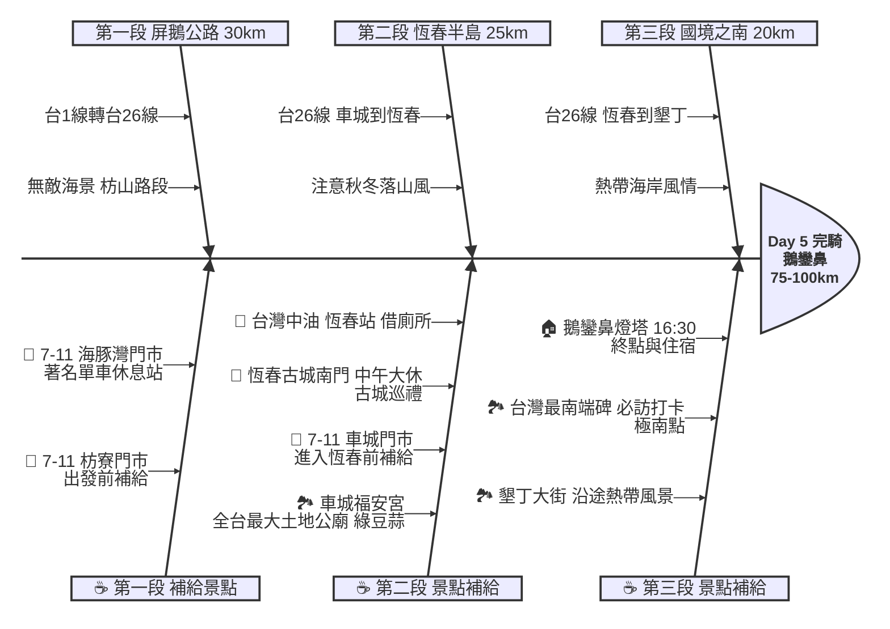

# Day 5：屏東枋寮 ➔ 屏東鵝鑾鼻 (國境之南落山風挑戰)

## 📍 路線總覽
* **出發地**：屏東枋寮車站
* **目的地**：屏東鵝鑾鼻燈塔
* **總距離**：約 75 - 100 公里
* **總爬升**：微幅起伏（主要沿著屏鵝公路，恆春半島有丘陵地形）
* **主要路線**：台1線 ➔ 台26線（屏鵝公路）

---

### 🌍 Google Maps 導航與地圖預覽

#### 手機導航連結
👉 **[點擊此處開啟 Day 5 國境之南導航（腳踏車模式）](https://www.google.com/maps/dir/?api=1&origin=%E5%B1%8F%E6%9D%B1%E6%9E%枋%E5%AF%AE%E8%BB%8A%E7%AB%99&destination=%E5%B1%8F%E6%9D%B1%E9%B5%9D%E9%91%BE%E9%BC%BB%E7%87%88%E5%A1%94&waypoints=%E5%B1%8F%E6%9D%B1%E8%BB%8A%E5%9F%8E%E7%A6%8F%E5%AE%89%E5%AE%AE%7C%E5%B1%8F%E6%9D%B1%E6%81%86%E6%98%A5%E5%8F%A4%E5%9F%8E%7C%E5%B1%8F%E6%9D%B1%E5%A2%BE%E4%B8%81%E5%A4%A7%E8%A1%97%7C%E5%8F%B0%E7%81%A3%E6%9C%80%E5%8D%97%E7%AB%AF%E7%A2%91&travelmode=bicycling)**

#### 🗺️ 路線小地圖

> 💡 *【預設版型提醒】：請在此放置生成的路線圖 (命名為 `day5_poster.png`)，並記得將上方圖片的超連結替換成您當天的 Google My Maps 專屬連結！*

---

## 🐟 魚骨圖 (Ishikawa Diagram)

---

## 🕒 建議行程與時間配速

### 第一段：屏鵝無敵海景（枋寮 ➔ 枋山 ➔ 車城）
* **距離**：約 30 km
* **路況**：從枋寮沿著台1線南下，接台26線。右側是壯麗的台灣海峽，路況平直好騎，但秋冬季需注意強烈側風（落山風）。
* **景點 / 休息補給**：
  * **出發補給**：枋寮車站附近的 **7-11 枋寮門市**。
  * **7-11 海豚灣門市**：台1線上的知名單車休息站，無敵海景。
  * **車城福安宮**（評分 4.6，推薦景點）：全台最大土地公廟，祈求環島一路平安。廟旁必吃當地名產「綠豆蒜」。

### 第二段：恆春古城（車城 ➔ 恆春）
* **距離**：約 25 km
* **路況**：進入恆春半島，路面微幅起伏。
* **景點 / 休息補給**：
  * **恆春古城南門**（評分 4.3）：本日**午餐大休點**。台灣保留最完整的古城門，周邊有許多美食餐廳與冰店，適合大休。
  * **台灣中油 恆春站**：離開恆春市區前可借用廁所與補水。

### 第三段：極南點朝聖（恆春 ➔ 墾丁 ➔ 鵝鑾鼻）
* **距離**：約 20 km
* **路況**：沿著台26線南下，經過南灣、墾丁大街，最終抵達台灣最南端。假日車流較多，請靠右騎乘。
* **景點 / 休息補給**：
  * **墾丁大街**（評分 3.9）：白天較為冷清，但充滿熱帶度假氛圍。
  * **台灣最南端碑**（評分 4.4，必訪）：四極點之二，抵達國境之南的證明。
  * **終點：鵝鑾鼻燈塔**（評分 4.5）：傍晚 16:30 抵達，純白色的武裝燈塔，附近有許多民宿可供住宿，為明天的魔王關卡（壽卡）儲備體力。

---

## 💡 騎乘注意事項

1. **落山風威脅**：每年 10 月至隔年 4 月，恆春半島會有強烈的「落山風」。強風從山上下切，側風極強，嚴重時可能將單車吹倒。請握緊把手，必要時下車推行。
2. **防曬與補水**：南部陽光猛烈，屏鵝公路部分路段無遮蔽物，請每小時定時補水，並確實做好防曬。
3. **住宿建議**：Day 5 建議直接推進至恆春或鵝鑾鼻附近住宿，這樣 Day 6 挑戰壽卡大魔王時，能保留較多時間應對爬坡。
4. **撤退方案**：
   * 枋寮過後即無火車。若遇單車故障或體力不支，只能依賴「屏東客運」或包車（墾丁快線無法上非折疊單車）。
   * 恆春轉運站是半島上最大的交通樞紐。
