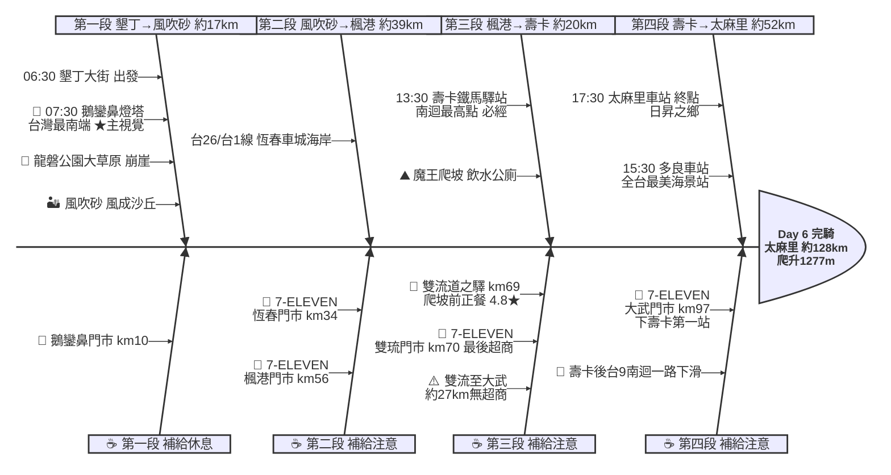

# Day 6：墾丁大街 ➔ 太麻里車站（極南壽卡翻山越嶺行）

---

## 路線總覽

* **出發地**：墾丁
* **目的地**：太麻里
* **總距離**：127.5 公里（GPX 實測）
* **總爬升 / 下降**：↑ 1277 m ／ ↓ 1234 m（全日最硬一天：台9南迴翻越壽卡累計爬升約 1277m，過壽卡後一路下滑至太平洋岸）
* **主要路線**：墾丁 ➔ 鵝鑾鼻燈塔(極南) ➔ 龍磐草原 ➔ 風吹砂 ➔ 恆春 ➔ 楓港 ➔ 台9南迴 ➔ 雙流 ➔ 壽卡 ➔ 大武 ➔ 多良車站 ➔ 太麻里

[📱 開啟 Google Maps 導航](https://www.google.com/maps/dir/?api=1&origin=%E5%B1%8F%E6%9D%B1%E7%B8%A3%E5%A2%BE%E4%B8%81%E5%A4%A7%E8%A1%97&destination=%E5%8F%B0%E6%9D%B1%E7%B8%A3%E5%A4%AA%E9%BA%BB%E9%87%8C%E8%BB%8A%E7%AB%99&waypoints=%E9%B5%9D%E9%91%BE%E9%BC%BB%E7%87%88%E5%A1%94%7C%E9%A2%A8%E5%90%B9%E7%A0%82%7C%E5%B1%8F%E6%9D%B1%E6%A5%93%E6%B8%AF%7C%E5%A3%BD%E5%8D%A1%E9%90%B5%E9%A6%AC%E9%A9%9B%E7%AB%99%7C%E5%A4%9A%E8%89%AF%E8%BB%8A%E7%AB%99&travelmode=bicycling)

<iframe src="https://www.google.com/maps/d/u/0/embed?mid=1vXv8wqmq76L0pE6IvtVsNLojfonk5i4&ehbc=2E312F" width="100%" height="100%" style="border:none; border-radius: 8px;"></iframe>

---

## 詳細路線行程圖解

---

## 建議行程與時間配速

### 第一段：墾丁大街 → 風吹砂（約 17 km）｜極南極點段

**距離**：17 km
**路況**：自墾丁沿台26線南下繞行鵝鑾鼻極南點，經龍磐草原、風吹砂東海岸。清晨先攻極南點，海岸風大、景觀絕佳。

**景點與補給：**
- 🚀 **06:30 墾丁大街**（起點，km 0）：接續 Day5 終點。本日全程約 128km、爬升約 1277m 為環島最硬一天，務必早起、備足飲水。
- 🗼 **07:30 鵝鑾鼻燈塔**（km ~11，鵝鑾鼻）：必經點、四極點之一、本日★主視覺。台灣最南端白色燈塔（4.4★/1.5萬則），可順遊台灣最南點地標。
- 🌾 **08:00 龍磐公園大草原**（km ~15，鵝鑾鼻）：崩崖、隆起珊瑚礁草原與觀星勝地（4.7★/1240），東海岸絕景。
- 🏜️ **08:20 風吹砂**（km ~17，鵝鑾鼻）：必經點。罕見風成沙丘地景（4.5★/3396），東海岸海風強勁。

---

### 第二段：風吹砂 → 楓港（約 39 km）｜恆春車城海岸段

**距離**：39 km
**路況**：自風吹砂折返經恆春、車城沿台26/台1線北上至楓港，準備轉台9南迴。沿途超商充足、補滿水分迎接壽卡。

**景點與補給：**
- 🥤 **7-ELEVEN 恆春門市**（km ~34，恆春）：恆春補給點。
- 🥤 **11:30 7-ELEVEN 楓港門市**（km ~56，楓港）：轉台9南迴公路前補給，前方進入山區。

---

### 第三段：楓港 → 壽卡鐵馬驛站（約 20 km）｜魔王壽卡爬坡段

**距離**：20 km
**路況**：沿台9南迴公路自楓港經獅子、雙流持續爬升至南迴最高點壽卡。雙流後約 7km 連續爬坡，是環島最大體力考驗。雙琉門市補滿水後再上山。

**景點與補給：**
- 🍱 **12:30–13:00 雙流道之驛**（km ~69，獅子鄉）：午餐大休點。壽卡爬坡前最後正餐（4.8★/616），吃飽再戰魔王坡。可順遊雙流國家森林遊樂區。
- 🥤 **7-ELEVEN 雙琉門市**（km ~70，獅子鄉）：壽卡爬坡前『最後一間超商』，務必補滿至少 2 瓶水（至大武約 27km 無超商）。
- ⛰️ **13:30 壽卡鐵馬驛站**（km ~76，達仁）：必經點。南迴公路最高點、單車環島聖地打卡點（4.6★/195），有飲水與公廁，蓋章留念後一路下滑。

---

### 第四段：壽卡 → 太麻里（約 52 km）｜南迴太平洋下滑段

**距離**：52 km
**路況**：過壽卡後台9線一路長下坡至太平洋岸大武，沿海岸北上經多良、金崙抵太麻里。下坡注意控速與煞車，海岸段風光明媚。

**景點與補給：**
- 🥤 **14:30 7-ELEVEN 大武門市**（km ~97，大武）：下壽卡後第一個超商，補給休息。
- 🚉 **15:30 多良觀光車站**（km ~114，太麻里）：必經點。號稱全台最美海景車站（4.1★/3.4萬則），居高臨太平洋，必拍。
- 🏁 **17:30 太麻里車站**（km ~128，太麻里）：當日終點。日昇之鄉太麻里，金針山與曙光聞名，鎮上有住宿與小吃。

---

## 晚餐推薦

| # | 店名 | 評分 | 留言數 | 貝葉斯分 | 備註 |
|:---:|:---|:---:|---:|:---:|:---|
| 1 | [維縈家鄉碳烤雞排 太麻里店](https://www.google.com/maps/place/?q=place_id:ChIJMSX_LwDPbzQR87-nfAcTnNE) | 4.9★ | 158 | 4.6564 | 速食餐廳 |
| 2 | [越南小廚](https://www.google.com/maps/place/?q=place_id:ChIJ75vo-QTPbzQRtL8dlJEhwv8) | 4.7★ | 804 | 4.653 | 越南餐廳 |
| 3 | [麻里マリ朝午食-太麻里店（店休臉書公告）](https://www.google.com/maps/place/?q=place_id:ChIJ42A4PdLPbzQR-ZSjNBRW71Q) | 4.8★ | 252 | 4.6514 | 早午餐餐廳 |
| 4 | [187嗑棧](https://www.google.com/maps/place/?q=place_id:ChIJiX27_QbPbzQRHtI2Mswq5kc) | 4.7★ | 713 | 4.6484 | 餐廳 |
| 5 | [好食屋](https://www.google.com/maps/place/?q=place_id:ChIJg6rKsJLPbzQRxSoZQQ7tiPk) | 4.9★ | 120 | 4.6284 | 早午餐餐廳 |

> 💡 *排序依據：留言數越多的高分店越可信（IMDB 風格貝葉斯平均）*
> 📋 *[看更多 >>](./day6_dinner.md)*

---

## 住宿推薦 🏨

| # | 飯店 | 評分 | 留言數 | 貝葉斯分 | 備註 |
|:---:|:---|:---:|---:|:---:|:---|
| 1 | [吉廬夫敢藝文民宿](https://www.google.com/maps/place/?q=place_id:ChIJ4ULmurHObzQRJOGMf059wsM) | 4.8★ | 530 | 4.6149 |  |
| 2 | [麻茶屋民宿 40820243](https://www.google.com/maps/place/?q=place_id:ChIJVVVVVanObzQRMGJPCZ-x29s) | 4.8★ | 261 | 4.517 |  |
| 3 | [| Taimali Hotel | 臺東縣合法旅館050號](https://www.google.com/maps/place/?q=place_id:ChIJwfSIbCLIbzQRkrMzjcDSlMc) | 4.4★ | 376 | 4.3279 |  |
| 4 | [日昇花園部落](https://www.google.com/maps/place/?q=place_id:ChIJgWHTtaPObzQRooTS_ol_DAs) | 4.6★ | 83 | 4.3143 |  |
| 5 | [（阿里客棧） 住宿 太麻里 金峰](https://www.google.com/maps/place/?q=place_id:ChIJ4Um3OdPPbzQRkHc2a-CwtV0) | 5★ | 14 | 4.2603 |  |

> 💡 *終點周邊 3 公里 · 17 筆候選 · IMDB 風格貝葉斯平均*
> 📋 *[看更多 >>](./day6_hotel.md)*

---

## 騎乘注意事項

1. **環島最硬一天**：全程約 128km、累計爬升約 1277m，壽卡（南迴最高點）為最大挑戰，務必提早出發、控制體力。
2. **壽卡補給空窗**：雙琉門市(km70) 是壽卡前最後超商，至下壽卡的大武門市(km97) 約 27km 無補給（壽卡驛站僅有飲水公廁），務必補滿至少 2 瓶水與高熱量補給品。
3. **下坡控速**：過壽卡後台9南迴長下坡，注意煞車溫度與彎道、保持安全速度。
4. **經典替代路線**：本路線採台9南迴（經楓港）爬壽卡；體力佳者可改走滿州縣道200→199（佳樂水→滿州→壽卡）的經典爬坡路線，爬升更大、風景更原始。
5. **午餐策略**：建議在雙流（km69）吃飽正餐再攻壽卡，山上無餐食。
6. **撤退方案**：楓港可折返枋寮搭台鐵枋寮站、大武有台鐵大武站、金崙有金崙站、終點太麻里有台鐵太麻里站（南迴線），體力不支可搭區間車。

---

## 更佳景點參考

> 以下為沿途 Bayesian 排名較高但未排入路線的備選點位。可視當天體力 / 天候 / 時間彈性加入。

### 景點備案

| 名次 | 名稱 | 評分 | 留言數 | 貝葉斯分 |
|:---:|:---|:---:|---:|:---:|
| 1 | 羊場小境親子園區恆春景點 | 5★ | 261 | 4.75 |
| 2 | 墾丁灰太狼生態教育園區 | 4.8★ | 847 | 4.73 |
| 3 | 龍磐崩崖地形景觀區 | 4.7★ | 192 | 4.61 |
| 4 | 國境最南鼻頭漁港 | 4.7★ | 125 | 4.6 |
| 5 | 雙流國家森林遊樂區 | 4.6★ | 5,957 | 4.6 |

### 午餐 / 餐廳大休備案

| 名次 | 店名 | 評分 | 留言數 | 貝葉斯分 |
|:---:|:---|:---:|---:|:---:|
| 1 | 絲綢咖啡（ 大溪社區入口處）） | 5★ | 1,034 | 4.89 |
| 2 | 双亭院咖啡餐食甜點 | 4.9★ | 2,024 | 4.85 |
| 3 | OA專賣野生龍蝦- | 4.9★ | 431 | 4.75 |

