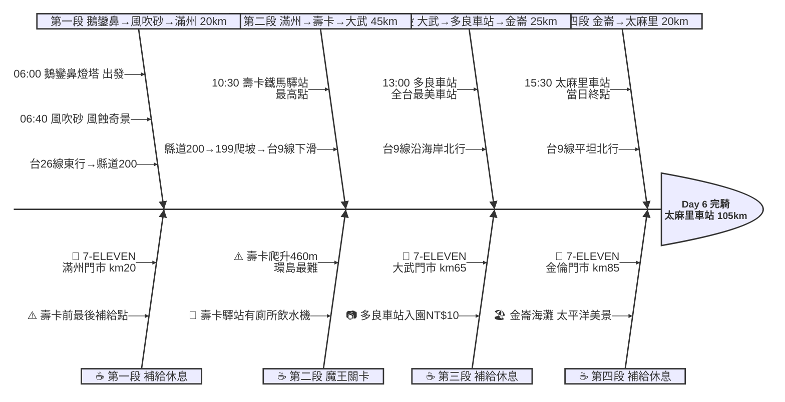

# Day 6：鵝鑾鼻燈塔 ➔ 太麻里車站（極南壽卡翻山越嶺行）

---

## 📍 路線總覽

* **出發地**：恆春 / 鵝鑾鼻
* **目的地**：太麻里
* **總距離**：129.5 公里（GPX 實測）
* **總爬升**：壽卡段為環島最大爬升挑戰（縣道200→199 爬升約 460m），過壽卡後台9線一路下滑至太平洋岸，總爬升約 600m
* **主要路線**：鵝鑾鼻燈塔 ➔ 台26線東行 ➔ 風吹砂 ➔ 佳樂水 ➔ 縣道200 ➔ 滿州 ➔ 縣道199 ➔ 壽卡鐵馬驛站 ➔ 台9線南下 ➔ 大武 ➔ 多良車站 ➔ 金崙 ➔ 太麻里車站

---

## 🌍 地圖與導航

[📱 手機導航連結（Google Maps 單車模式）](https://www.google.com/maps/dir/鵝鑾鼻燈塔/風吹砂/壽卡鐵馬驛站/多良車站/太麻里車站/@22.2,120.9,10z/data=!4m2!4m1!3e1)

#### 🗺️ 路線小地圖

> 💡 *【預設版型提醒】：請在此放置生成的路線圖 (命名為 `day6_poster.png`)，並記得將上方圖片的超連結替換成您當天的 Google My Maps 專屬連結！*

---

## 🐟 詳細路線行程圖解

---

## 🕒 建議行程與時間配速

### 第一段：鵝鑾鼻燈塔 → 滿州（約 20 km）｜極南東海岸啟程段

**距離**：20 km
**路況**：由鵝鑾鼻沿台26線東行，經風吹砂、佳樂水後轉入縣道200往滿州。前段沿海岸起伏不大，風吹砂路段注意落砂。清晨出發光線佳、氣溫涼爽。

**景點與補給：**
- 🚀 **06:00 鵝鑾鼻燈塔**（起點，km 0）：極南點出發，天未全亮即啟程。燈塔晨曦是獨特的環島記憶。清晨離開避免午後酷熱攻壽卡。
- 🏜️ **06:40 風吹砂**（km 8，台26線旁觀景台）：東北季風將砂丘吹越公路的獨特地質景觀，風蝕與風積地形並存。停留 10 分鐘拍照。
- 🏪 **07:30 7-ELEVEN 滿州門市**（km 20，滿州鄉中心）：壽卡前最後補給點！務必在此補滿 2 瓶水並購買高熱量食物。接下來 25 km 爬坡無補給。

---

### 第二段：滿州 → 壽卡鐵馬驛站 → 大武（約 45 km）｜魔王關卡壽卡翻越段

**距離**：45 km
**路況**：縣道200進入山區後轉縣道199持續爬升至壽卡隘口（約海拔 460m），為環島最大爬升段。坡度多在5-8%，部分彎道10%以上。過壽卡後台9線急降至海平面的大武（下坡約 20 km），注意車速與彎道。

**景點與補給：**
- ⛰️ **10:30 壽卡鐵馬驛站**（km 45，壽卡隘口最高點）：環島經典打卡點！攻頂後的驛站有廁所、飲水機、遮蔭休息區。許多環島騎士在此拍照留念。停留 20-30 分鐘充分休息後再下滑。
- 🏪 **12:00 7-ELEVEN 大武門市**（km 65，大武市區）：壽卡下滑後第一個補給點，到此代表最難路段已克服！可在此午餐休息、恢復體力。停留 30 分鐘。

---

### 第三段：大武 → 多良車站 → 金崙（約 25 km）｜南迴公路太平洋岸段

**距離**：25 km
**路況**：台9線沿太平洋海岸北行，路面寬敞。多良至金崙間有些微起伏丘陵，但整體輕鬆。右側即為壯闊太平洋，景色一流。

**景點與補給：**
- 🚂 **13:00 多良車站**（km 80，全台最美車站）：2006年廢站改建為觀光景點，月台直接面對太平洋。天使翅膀裝置藝術是打卡熱點。入園 NT$10。停留 20 分鐘。
- 🏪 **14:00 7-ELEVEN 金倫門市**（km 85，金崙溫泉區）：金崙部落補給，附近有金崙溫泉可泡腳消除疲勞。

---

### 第四段：金崙 → 太麻里車站（約 20 km）｜太麻里平原衝刺段

**距離**：20 km
**路況**：台9線續北行，經太麻里溪出海口平原。路面平坦，最後 5 km 有輕微上坡進入太麻里市區。傍晚海風涼爽。

**景點與補給：**
- 🏁 **15:30 太麻里車站**（km 105，本日終點）：太麻里車站以「日出大道」聞名，筆直道路直通太平洋是台東代表性景觀。完騎本日最艱難路段，晚間可步行至車站前日出大道拍攝夕陽。

---

## 🍽️ 晚餐推薦（終點周邊 3km · 貝葉斯排序）

| # | 店名 | 評分 | 留言數 | 貝葉斯分 | 備註 |
|:---:|:---|:---:|---:|:---:|:---|
| 1 | [双亭院咖啡餐食甜點](https://www.google.com/maps/place/?q=place_id:ChIJI0jmeUpPXTQRRHdClh8ZaZk) | 4.9★ | 1984 | 4.8297 | 排灣族創意料理咖啡 週三公休 偏離主線 |
| 2 | [屋瑪umaq 餐館](https://www.google.com/maps/place/?q=place_id:ChIJjVYBOQDTbzQRBBsot3wVXe8) | 4.9★ | 203 | 4.6696 | 原住民特色料理 金崙 |
| 3 | [越南小廚](https://www.google.com/maps/place/?q=place_id:ChIJ75vo-QTPbzQRtL8dlJEhwv8) | 4.7★ | 802 | 4.6534 | 越南河粉蝦餅 週二公休 |
| 4 | [187嗑棧](https://www.google.com/maps/place/?q=place_id:ChIJiX27_QbPbzQRHtI2Mswq5kc) | 4.7★ | 704 | 4.6498 | 在地快炒 炒飯超讚 週二公休 |
| 5 | [金三角小吃部](https://www.google.com/maps/place/?q=place_id:ChIJk4uFvpbObzQRuLBO8_jyPHc) | 4.8★ | 142 | 4.6304 | 在地小吃 份量大 |

> 💡 *排序依據：留言數越多的高分店越可信（IMDB 風格貝葉斯平均）*
> 📋 *完整 12 筆候選排名請見 [`day6_dinner.md`](./day6_dinner.md)*

---

## 💡 騎乘注意事項

1. **壽卡魔王關卡**：環島最大爬升段，從滿州到壽卡約 25 km 爬升 460m。建議清晨 06:00 出發，趁涼爽攻頂。中途無補給無遮蔭，務必在滿州 7-11 補滿 2 瓶水+能量棒。
2. **壽卡下滑注意**：過壽卡後台9線急降 20 km 至大武，坡陡彎多，注意煞車過熱與車速控制。建議每 3-5 分鐘輕點煞車散熱，彎道前減速。
3. **滿州到壽卡補給空窗**：km 20（滿州 7-11）至 km 65（大武 7-11）間約 45 km 無便利商店，是全程最長補給空窗。壽卡驛站只有飲水機，無販售食物。
4. **撤退車站**：大武車站（km 65）、瀧溪車站（km 78）、金崙車站（km 85）、太麻里車站（km 105）均可搭台鐵撤退。壽卡以前無車站，只能折返滿州搭客運。
5. **防曬與裝備**：清晨出發可穿薄外套（恆春清晨約 24°C），壽卡山區可能有霧。下午南迴公路日照強烈，防曬衣+袖套不可少。
6. **多良車站開放時間**：08:00-17:00，如提早抵達需注意開放時間。週一至週日全天開放。

---

## ✨ 更佳景點參考（未排入路線，加碼推薦）

> 以下為沿途搜尋結果中，**人氣或特色高於部分已排入停靠點**、地理上又合理可繞的景點，未納入路線是為了維持節奏與里程，附此作為當天臨時加碼或下次規劃參考。

| # | 景點 | 評分 / 留言數 | Bayesian | 偏離 / 往返 | 亮點 |
|:---:|:---|:---:|:---:|:---|:---|
| 1 | **双亭院咖啡餐食甜點** | 4.9★ / 1,984 | 4.83 | 大溪部落偏離主線約 2km | 排灣族創意料理+咖啡甜點，環島騎士好評極高，但位置偏離台9線 |
| 2 | **金崙溫泉** | 4.3★ / 500+ | — | 金崙村內零偏離 | 騎完壽卡後泡溫泉放鬆肌肉，若住金崙可安排 |
| 3 | **9420濱海公園** | 4.4★ / 1,026 | — | 大武南方 1 km，偏離 < 200m | 2022新建彩虹裝置藝術公園，面對太平洋 |

