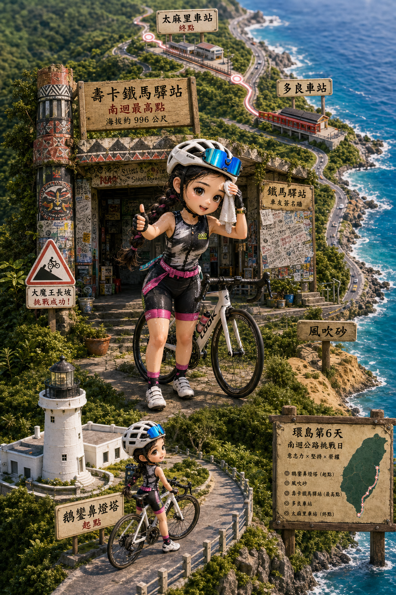
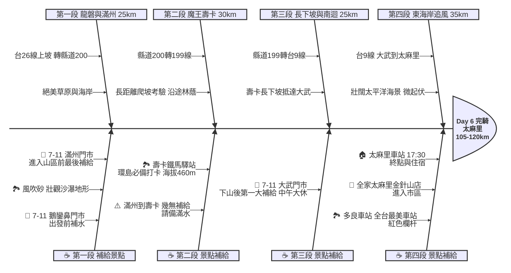

# Day 6：屏東鵝鑾鼻 ➔ 台東太麻里 (壽卡大魔王挑戰與無敵海景)

## 📍 路線總覽
* **出發地**：屏東鵝鑾鼻燈塔
* **目的地**：台東太麻里車站
* **總距離**：約 105 - 120 公里
* **總爬升**：高強度（需爬升至海拔約 460 公尺的壽卡鐵馬驛站，並有多段起伏）
* **主要路線**：台26線 ➔ 縣道200 ➔ 縣道199 ➔ 台9線（南迴公路）

---

### 🌍 Google Maps 導航與地圖預覽

#### 手機導航連結
👉 **[點擊此處開啟 Day 6 壽卡大魔王導航（腳踏車模式）](https://www.google.com/maps/dir/?api=1&origin=%E5%B1%8F%E6%9D%B1%E9%B5%9D%E9%91%BE%E9%BC%BB%E7%87%88%E5%A1%94&destination=%E5%8F%B0%E6%9D%B1%E5%A4%AA%E9%BA%BB%E9%87%8C%E8%BB%8A%E7%AB%99&waypoints=%E5%B1%8F%E6%9D%B1%E9%A2%A8%E5%90%B9%E7%A0%82%7C%E5%B1%8F%E6%9D%B1%E5%A3%BD%E5%8D%A1%E9%90%B5%E9%A6%AC%E9%A9%9B%E7%AB%99%7C%E5%8F%B0%E6%9D%B1%E5%A4%9A%E8%89%AF%E8%BB%8A%E7%AB%99&travelmode=bicycling)**

#### 🗺️ 路線小地圖

> 💡 *【預設版型提醒】：請在此放置生成的路線圖 (命名為 `day6_poster.png`)，並記得將上方圖片的超連結替換成您當天的 Google My Maps 專屬連結！*

---

## 🐟 魚骨圖 (Ishikawa Diagram)

---

## 🕒 建議行程與時間配速

### 第一段：東岸迎風（鵝鑾鼻 ➔ 風吹砂 ➔ 滿州）
* **距離**：約 25 km
* **路況**：從鵝鑾鼻出發沿著台26線東岸北上，沿途經龍磐公園與風吹砂，景色絕美但也容易遭遇強勁海風。隨後轉入縣道200前往滿州。
* **景點 / 休息補給**：
  * **風吹砂**（評分 4.5）：奇特的風蝕沙瀑地形，配上無敵太平洋海景。
  * **7-11 滿州門市**：**強烈警告**！這是進入山區爬坡前最後一個便利商店，請務必在此將水壺全部裝滿，並準備行動糧。

### 第二段：大魔王挑戰（滿州 ➔ 壽卡）
* **距離**：約 30 km
* **路況**：縣道200接縣道199。全日最艱難的路段，長達數十公里的緩長坡與連續彎道，沿途多為原始林貌，爬升至海拔 460 公尺。
* **景點 / 休息補給**：
  * **壽卡鐵馬驛站**（評分 4.6）：單車環島最具象徵性的打卡點，抵達這裡代表你已經征服了南迴公路的最高點！驛站外牆有滿滿的車友簽名。

### 第三段：極速下坡（壽卡 ➔ 大武）
* **距離**：約 25 km
* **路況**：從壽卡沿著台9線達仁段長下坡，一路滑行至東部海岸線的大武。**注意：下坡車速快，且可能有砂石車，請點放煞車、控制速度。**
* **景點 / 休息補給**：
  * **7-11 大武門市**：下山後迎來的第一個城鎮與超商，適合做為本日的**午餐大休點**。

### 第四段：最美海岸（大武 ➔ 多良 ➔ 太麻里）
* **距離**：約 35 km
* **路況**：沿著台9線東海岸向北騎乘，左側是山脈，右側是廣闊的太平洋，路況平直有微幅起伏。
* **景點 / 休息補給**：
  * **多良車站**（評分 4.1，推薦景點）：「全台最美車站」，紅色的欄杆配上碧海藍天，若運氣好還能拍到火車經過。需牽車走一小段陡坡上去。
  * **終點：太麻里車站**（評分 4.4）：傍晚抵達。車站前有條能直視太平洋的大道，為著名的打卡點。

---

## 💡 騎乘注意事項

1. **滿州補給斷層**：滿州到壽卡這段長達數十公里的山路**完全沒有便利商店**。請在滿州準備至少 2 瓶水與足夠的能量棒/巧克力。
2. **下坡控速**：壽卡往達仁的下坡十分陡峭且彎道多，加上大車頻繁，煞車請務必點放避免過熱爆胎。
3. **無撤退路線**：進入縣道200與199後，在抵達大武之前幾乎沒有任何大眾運輸可供撤退。這是意志力的考驗，若體力有狀況，請多下車推行休息。
4. **隧道安全**：台9線部分路段有隧道或明隧道，請務必開啟前後車燈，並穿著反光背心。
