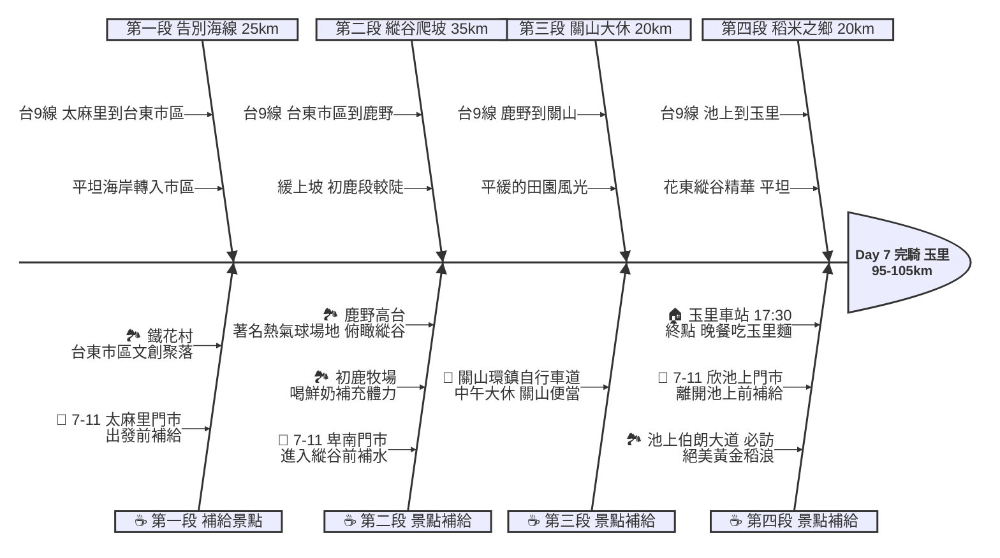

# Day 7：台東太麻里 ➔ 花蓮玉里 (花東縱谷稻浪之旅)

## 📍 路線總覽
* **出發地**：台東太麻里車站
* **目的地**：花蓮玉里車站
* **總距離**：約 95 - 105 公里
* **總爬升**：緩起伏（從太麻里海線切入縱谷，鹿野高台與初鹿需爬坡）
* **主要路線**：台9線（花東縱谷公路）

---

### 🌍 Google Maps 導航與地圖預覽

#### 手機導航連結
👉 **[點擊此處開啟 Day 7 花東縱谷導航（腳踏車模式）](https://www.google.com/maps/dir/?api=1&origin=%E5%8F%B0%E6%9D%B1%E5%A4%AA%E9%BA%BB%E9%87%8C%E8%BB%8A%E7%AB%99&destination=%E8%8A%B1%E8%93%AE%E7%8E%89%E9%87%8C%E8%BB%8A%E7%AB%99&waypoints=%E5%8F%B0%E6%9D%B1%E9%90%B5%E8%8A%B1%E6%9D%91%7C%E5%8F%B0%E6%9D%B1%E5%88%9D%E9%B9%BF%E7%89%A7%E5%A0%B4%7C%E5%8F%B0%E6%9D%B1%E9%B9%BF%E9%87%8E%E9%AB%98%E5%8F%B0%7C%E5%8F%B0%E6%9D%B1%E6%B1%A0%E4%B8%8A%E4%BC%AF%E6%9C%97%E5%A4%A7%E9%81%93&travelmode=bicycling)**

#### 🗺️ 路線小地圖

> 💡 *【預設版型提醒】：請在此放置生成的路線圖 (命名為 `day7_poster.png`)，並記得將上方圖片的超連結替換成您當天的 Google My Maps 專屬連結！*

---

## 🐟 魚骨圖 (Ishikawa Diagram)

---

## 🕒 建議行程與時間配速

### 第一段：告別海線（太麻里 ➔ 台東市區）
* **距離**：約 25 km
* **路況**：從太麻里出發，告別太平洋海線，沿著台9線進入台東市區，路面寬廣平緩。
* **景點 / 休息補給**：
  * **出發補給**：太麻里市區的 **7-11 太麻里門市** 補滿水分。
  * **鐵花村**（評分 4.5）：台東著名的音樂與文創聚落，白天雖然沒有表演，但彩繪熱氣球燈籠非常適合拍照留念。

### 第二段：縱谷爬升（台東市區 ➔ 初鹿 ➔ 鹿野）
* **距離**：約 35 km
* **路況**：離開台東市區後，正式進入被中央山脈與海岸山脈夾擊的「花東縱谷」。此段開始為緩上坡，尤其是前往初鹿牧場與鹿野高台需要爬一小段山路。
* **景點 / 休息補給**：
  * **初鹿牧場**（評分 4.2）：台灣最大的坡地牧場，推薦喝杯新鮮的初鹿鮮奶補充蛋白質。
  * **鹿野高台**（評分 4.5）：台灣熱氣球嘉年華舉辦地，擁有居高臨下俯瞰整個花東縱谷的絕佳視野。

### 第三段：米之鄉大休（鹿野 ➔ 關山）
* **距離**：約 20 km
* **路況**：從鹿野高台滑下後回到台9線主線，前往關山。兩側風景逐漸被綠色或金黃色的稻田取代。
* **景點 / 休息補給**：
  * **關山環鎮自行車道**：本日**午餐大休點**。抵達關山後，務必品嚐知名的「關山便當」，並在車站附近好好的大休。

### 第四段：黃金稻浪（關山 ➔ 池上 ➔ 玉里）
* **距離**：約 20 km
* **路況**：平坦筆直的縱谷公路，跨越縣界進入花蓮縣。
* **景點 / 休息補給**：
  * **池上伯朗大道**（評分 4.4，推薦景點）：花東縱谷必訪！筆直的鄉間小路兩旁沒有任何電線桿，秋季時是整片壯觀的黃金稻浪，並可朝聖著名的「金城武樹」。
  * **終點：玉里車站**（評分 4.1）：傍晚抵達花蓮南部的重鎮玉里。晚上推薦品嚐道地的「玉里麵」與「臭豆腐」，若有體力也可前往安通溫泉泡湯消除疲勞。

---

## 💡 騎乘注意事項

1. **縱谷氣溫**：花東縱谷因為地形阻擋海風，夏天騎乘會像在一個大烤箱裡，非常悶熱；冬天則可能會有較強的谷風。
2. **鹿野爬坡**：鹿野高台需要爬升約 250 公尺，若前一天壽卡大魔王的乳酸尚未排除，這段路會有些吃力，可依體力決定是否繞上去。
3. **小黑蚊防護**：縱谷地區（尤其是花蓮）的小黑蚊較多，休息時請噴防蚊液或穿著長袖長褲。
4. **撤退方案**：
   * 縱谷線全程與台鐵花東線平行，撤退點極多（台東、鹿野、關山、池上、玉里皆是大站），隨時可以上火車。
