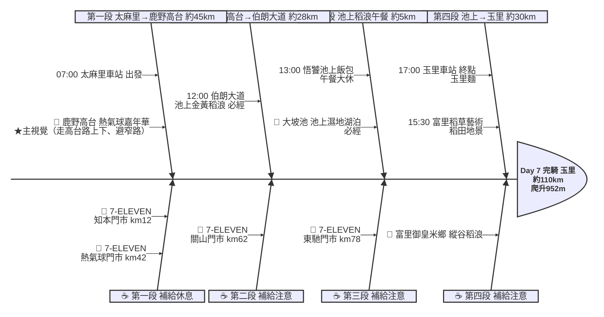

# Day 7：太麻里車站 ➔ 玉里車站（花東縱谷田園騎行）

---

## 路線總覽

* **出發地**：太麻里
* **目的地**：玉里 / 安通
* **總距離**：110.1 公里（GPX 實測）
* **總爬升 / 下降**：↑ 952 m ／ ↓ 870 m（花東縱谷地勢平緩，台9線沿卑南溪→秀姑巒溪谷北行、累計爬升約 952m，上鹿野高台走高台路一段爬升）
* **主要路線**：太麻里 ➔ 台9線 ➔ 鹿野高台（高台路上下）➔ 關山 ➔ 池上伯朗大道 ➔ 大坡池 ➔ 富里稻草藝術 ➔ 玉里車站

[📱 開啟 Google Maps 導航](https://www.google.com/maps/dir/?api=1&origin=%E5%8F%B0%E6%9D%B1%E7%B8%A3%E5%A4%AA%E9%BA%BB%E9%87%8C%E8%BB%8A%E7%AB%99&destination=%E8%8A%B1%E8%93%AE%E7%B8%A3%E7%8E%89%E9%87%8C%E8%BB%8A%E7%AB%99&waypoints=%E9%B9%BF%E9%87%8E%E9%AB%98%E5%8F%B0%7C%E6%B1%A0%E4%B8%8A%E4%BC%AF%E6%9C%97%E5%A4%A7%E9%81%93%7C%E5%A4%A7%E5%9D%A1%E6%B1%A0%7C%E5%AF%8C%E9%87%8C%E7%A8%BB%E8%8D%89%E8%97%9D%E8%A1%93%E6%99%AF%E8%A7%80%E5%8D%80&travelmode=bicycling)

<iframe src="https://www.google.com/maps/d/u/0/embed?mid=1mZ00rlAyZJeiPsaq3bUtSJxnKr9Ay_o&ehbc=2E312F" width="100%" height="100%" style="border:none; border-radius: 8px;"></iframe>

---

## 詳細路線行程圖解

---

## 建議行程與時間配速

### 第一段：太麻里 → 鹿野高台（約 47 km）｜縱谷南段

**距離**：47 km
**路況**：自太麻里沿台9線北上經台東市、卑南、初鹿進鹿野，鹿野市區補給後沿『高台路』上鹿野高台。注意：上高台請走主線高台路（較寬、汽機車共用），勿貪近抄龍馬路東33鄉道窄小產業道路與高台路42巷（部分路段需牽車），上下走同一條高台路較安全。

**景點與補給：**
- 🚀 **07:00 太麻里車站**（起點，km 0）：接續 Day6 終點。本日約 108km、爬升約 883m，花東縱谷田園風光、地勢相對平緩。
- 🥤 **7-ELEVEN 知本門市**（km ~12，知本）：出台東市區前補給點。
- 🥤 **7-ELEVEN 熱氣球門市**（km ~42，鹿野）：鹿野市區補給，上鹿野高台前補滿。
- 🎈 **11:00 鹿野高台**（km ~47，鹿野）：必經點、本日★主視覺。鹿野高台熱氣球嘉年華與飛行傘起降場（4.5★/2.7萬則），高台俯瞰縱谷茶園。上下一律走主線高台路、避開窄小產業道路（東33鄉道/42巷部分需牽車）。

---

### 第二段：鹿野高台 → 伯朗大道（約 28 km）｜鹿野關山縱谷段

**距離**：28 km
**路況**：自鹿野高台下滑回台9線北行經關山進池上，沿途縱谷稻田與山景。關山補滿補給，準備進池上稻浪。

**景點與補給：**
- 🥤 **7-ELEVEN 關山門市**（km ~62，關山）：關山補給點，午餐前補給。可順遊關山環鎮自行車道。
- 🌾 **12:00 伯朗大道**（km ~73，池上）：必經點。池上金黃稻浪、天堂路與金城武樹（4.5★/2萬則），無電線桿的筆直田間路，必拍。

---

### 第三段：池上稻浪午餐段（約 5 km）｜大坡池池上飯包

**距離**：5 km
**路況**：於池上賞大坡池濕地湖光，再吃池上飯包大休。池上市區人車較多、注意禮讓。

**景點與補給：**
- 🪷 **12:40 大坡池**（km ~77，池上）：必經點。池上濕地湖泊與環湖步道（4.4★/1萬則），縱谷群山倒映、可賞荷與水鳥。
- 🥤 **7-ELEVEN 東馳門市**（km ~78，池上）：池上市區補給點。
- 🍱 **13:00–14:00 悟饕池上飯包文化故事館**（km ~78，池上）：午餐大休點。池上飯包名店與飯包文化館（3.9★/1.7萬則），經典木盒池上便當，可參觀飯包歷史。

---

### 第四段：池上 → 玉里（約 30 km）｜富里玉里收尾段

**距離**：30 km
**路況**：自池上沿台9線過花東縣界進花蓮富里、玉里，沿途縱谷稻浪與富里米鄉。地勢平緩、田園風光收尾。

**景點與補給：**
- 🌾 **15:30 富里稻草藝術景觀區**（km ~90，富里）：必經點。富里稻田裡的稻草藝術地景（4.4★/5949），每年稻草藝術季有大型稻草人裝置，田園拍照點。
- 🏁 **17:00 玉里車站**（km ~108，玉里）：當日終點。玉里麵與安通溫泉聞名，鎮上有住宿與小吃，可泡安通溫泉解疲勞。

---

## 晚餐推薦

| # | 店名 | 評分 | 留言數 | 貝葉斯分 | 備註 |
|:---:|:---|:---:|---:|:---:|:---|
| 1 | [女兒心優質農產創意工坊](https://www.google.com/maps/place/?q=place_id:ChIJvUBbKmRrbzQR9UTxl19ZWWw) | 5★ | 392 | 4.6345 | 餐廳 |
| 2 | [北方早點丨燒餅加料、鹹豆漿](https://www.google.com/maps/place/?q=place_id:ChIJrc7ZM39qbzQRBwZVXUxvY9U) | 4.7★ | 1103 | 4.5905 | 早餐店 |
| 3 | [米達碳烤雞排](https://www.google.com/maps/place/?q=place_id:ChIJ1cFc5uRDbzQRvopWgtTkLwo) | 4.7★ | 712 | 4.5555 | 雞肉料理餐廳 |
| 4 | [玉里豬血湯早午餐](https://www.google.com/maps/place/?q=place_id:ChIJBcC2yCJrbzQR86m-696Di48) | 4.8★ | 384 | 4.5454 | 早午餐餐廳 |
| 5 | [星馬茶餐廳｜玉里美食](https://www.google.com/maps/place/?q=place_id:ChIJb9koNnpqbzQR1n6BiErxXhE) | 4.7★ | 501 | 4.5253 | 餐廳 |

> 💡 *排序依據：留言數越多的高分店越可信（IMDB 風格貝葉斯平均）*
> 📋 *[看更多 >>](./day7_dinner.md)*

---

## 住宿推薦 🏨

| # | 飯店 | 評分 | 留言數 | 貝葉斯分 | 備註 |
|:---:|:---|:---:|---:|:---:|:---|
| 1 | [小鳥散步 玉里民宿 玉里包棟](https://www.google.com/maps/place/?q=place_id:ChIJ7caGfuFBbzQRbae3zVgCHno) | 5★ | 256 | 4.7632 |  |
| 2 | [途中玉里青年旅館（全雅房，上下舖，）](https://www.google.com/maps/place/?q=place_id:ChIJC2qZFdhrbzQRi4AVS4zscz0) | 4.9★ | 410 | 4.7558 |  |
| 3 | [原鄉商旅](https://www.google.com/maps/place/?q=place_id:ChIJ3fPJi4JrbzQRbgFN4CZgh_0) | 4.8★ | 593 | 4.7143 |  |
| 4 | [910 hostel 城東館](https://www.google.com/maps/place/?q=place_id:ChIJuWXA4npqbzQRrtdbytHaBl0) | 4.8★ | 388 | 4.6844 |  |
| 5 | [山之間特色民宿｜花蓮玉里民宿｜花蓮縣合法民宿編號2868號](https://www.google.com/maps/place/?q=place_id:ChIJhdGGCTprbzQRxbkKjMJ1BVY) | 5★ | 136 | 4.6786 |  |

> 💡 *終點周邊 3 公里 · 40 筆候選 · IMDB 風格貝葉斯平均*
> 📋 *[看更多 >>](./day7_hotel.md)*

---

## 騎乘注意事項

1. **縱谷平緩**：全程約 110km、累計爬升約 952m，多為緩坡，僅上鹿野高台走高台路有一段爬升。
2. **補給充足**：台9縱谷沿線台東市、鹿野、關山、池上、富里、玉里皆有超商與餐廳，補給方便。
3. **午餐策略**：建議於池上（km78）賞大坡池後吃池上飯包大休，悟饕飯包文化館可參觀；伯朗大道一帶亦有特色餐廳。
4. **伯朗大道**：景觀區內禁行汽車、單車可進，人潮多請禮讓行人與拍照遊客，注意路況。
5. **撤退方案**：台9縱谷與台鐵台東線並行，鹿野、關山、池上、富里、玉里皆有火車站，體力不支可隨時搭區間車。

---

## 更佳景點參考

> 以下為沿途 Bayesian 排名較高但未排入路線的備選點位。可視當天體力 / 天候 / 時間彈性加入。

### 景點備案

| 名次 | 名稱 | 評分 | 留言數 | 貝葉斯分 |
|:---:|:---|:---:|---:|:---:|
| 1 | 全地型沙灘車 立式划槳 - 臺東太麻里 ATV & SUP Taitung TaiMaLi | 4.9★ | 1,453 | 4.84 |
| 2 | 東糖商圈好好玩 | 4.9★ | 84 | 4.6 |
| 3 | 天堂路 | 4.6★ | 6,931 | 4.6 |
| 4 | 脫線故事館 | 4.7★ | 117 | 4.56 |
| 5 | 太麻里車站日昇路 | 4.6★ | 278 | 4.55 |

### 午餐 / 餐廳大休備案

| 名次 | 店名 | 評分 | 留言數 | 貝葉斯分 |
|:---:|:---|:---:|---:|:---:|
| 1 | 井碳吉炭火燒肉餐廳 ｜ 台東美食 | 4.9★ | 2,346 | 4.86 |
| 2 | 荳荳阿稼早午餐 | 4.9★ | 1,531 | 4.85 |
| 3 | 66萊樂輕食 | 4.9★ | 851 | 4.81 |

