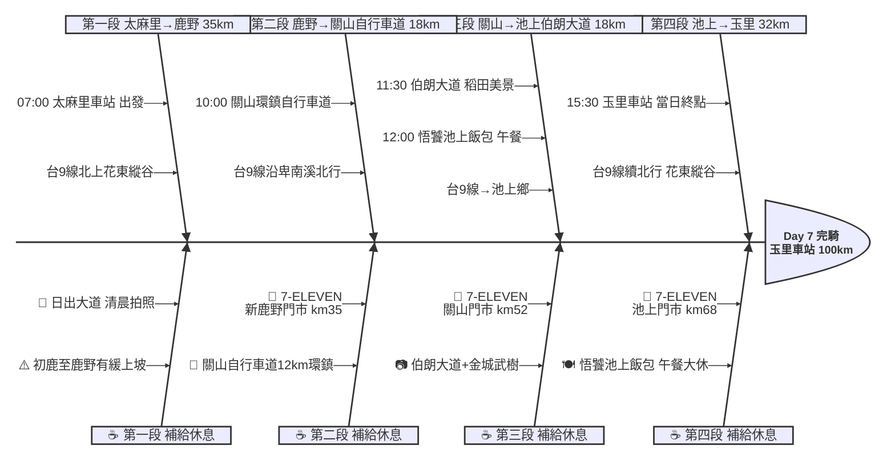

# Day 7：太麻里車站 ➔ 玉里車站（花東縱谷田園騎行）

---

## 📍 路線總覽

* **出發地**：太麻里
* **目的地**：玉里 / 安通
* **總距離**：110.9 公里（GPX 實測）
* **總爬升**：花東縱谷地勢平緩，台9線沿卑南溪→秀姑巒溪谷北行，偶有緩坡，總爬升約 350m
* **主要路線**：太麻里車站 ➔ 台9線北上 ➔ 鹿野 ➔ 關山環鎮自行車道 ➔ 池上（伯朗大道）➔ 悟饕池上飯包 ➔ 玉里車站

---

## 🌍 地圖與導航

#### 🖼️ 海報

#### 📱 手機導航連結（Google Maps 單車模式）

[開啟 Google Maps 導航](https://www.google.com/maps/dir/太麻里車站/關山環鎮自行車道/伯朗大道/悟饕池上飯包文化故事館/玉里車站/@23.0,121.2,10z/data=!4m2!4m1!3e1)

#### 🗺️ 我的地圖 (My Map) 路線

<iframe src="https://www.google.com/maps/d/u/0/embed?mid=1mZ00rlAyZJeiPsaq3bUtSJxnKr9Ay_o&ehbc=2E312F" width="100%" height="450" style="border:none; border-radius: 8px; box-shadow: 0 4px 6px rgba(0,0,0,0.1);"></iframe>

---

## 🐟 詳細路線行程圖解

---

## 🕒 建議行程與時間配速

### 第一段：太麻里車站 → 鹿野（約 35 km）｜縱谷入口晨騎段

**距離**：35 km
**路況**：由太麻里沿台9線北上，經知本、初鹿進入花東縱谷。前段沿海岸有些微起伏，過台東市區後轉入平原。初鹿至鹿野間有緩上坡。

**景點與補給：**
- 🚀 **07:00 太麻里車站**（起點，km 0）：Day 6 終點續行。出發前可步行至日出大道拍攝清晨太平洋海景。台東知名「最美車站」之一。
- 🏪 **09:00 7-ELEVEN 新鹿野門市**（km 35，鹿野鄉台9線旁）：進入鹿野前補給。鹿野以熱氣球與飛行傘聞名，高台需爬坡 5 km（可視體力決定是否繞行）。

---

### 第二段：鹿野 → 關山環鎮自行車道（約 18 km）｜縱谷田園騎行段

**距離**：18 km
**路況**：台9線續北行，地勢平坦。沿途為稻田與檳榔園交錯的農村景觀，車流較少，騎乘舒適。

**景點與補給：**
- 🚴 **10:00 關山環鎮自行車道**（km 50，全台首座環鎮自行車道）：1997年啟用的環鎮自行車道全長 12 km，沿水圳與稻田繞行關山鎮一圈。沿途可見縱谷稻浪與海岸山脈。環島騎士可選擇騎一小段體驗即可。停留 20-30 分鐘。
- 🏪 **10:30 7-ELEVEN 關山門市**（km 52，關山鎮中心）：關山鎮中心補給，附近有關山便當店可提早午餐。

---

### 第三段：關山 → 池上（伯朗大道）（約 18 km）｜金色稻浪田園段

**距離**：18 km
**路況**：台9線從關山到池上極為平坦，兩側為一望無際的稻田。伯朗大道需從台9線轉入鄉道，偏離約 2 km。

**景點與補給：**
- 🌾 **11:30 伯朗大道**（km 65，池上鄉錦新三號道路）：筆直道路兩旁是金黃稻浪（收割季前最美），金城武曾在此拍攝航空廣告而聲名大噪。騎行其中如穿越巨幅風景畫。路面平整適合單車。停留 20 分鐘拍照。
- 🍱 **12:00–13:00 悟饕池上飯包文化故事館**（km 68，池上鄉忠孝路）：池上便當始祖（1940年代創立），可坐在退役火車車廂內享用經典池上飯包。飯包 NT$80-100。附設鐵道文物展示。午餐大休 1 小時。

---

### 第四段：池上 → 玉里車站（約 32 km）｜秀姑巒溪谷北行段

**距離**：32 km
**路況**：台9線由池上北行，沿秀姑巒溪谷進入花蓮縣。地勢平緩偶有小起伏，經富里鄉後抵達玉里。下午可能有逆風。

**景點與補給：**
- 🏪 **13:00 7-ELEVEN 池上門市**（km 68，池上鎮中心）：午餐後補給，準備下午最後 32 km 路段。
- 🏁 **15:30 玉里車站**（km 100，本日終點）：花東縱谷中段重要城鎮，玉里麵是在地名食。車站周邊餐飲選擇豐富，晚間可品嚐玉里麵與在地小吃。玉里也是環島騎士常見的中繼住宿點。

---

## 🍽️ 晚餐推薦（終點周邊 3km · 貝葉斯排序）

| # | 店名 | 評分 | 留言數 | 貝葉斯分 | 備註 |
|:---:|:---|:---:|---:|:---:|:---|
| 1 | [女兒心無菜單料理](https://www.google.com/maps/place/?q=place_id:ChIJvUBbKmRrbzQR9UTxl19ZWWw) | 5.0★ | 392 | 4.6776 | 需24小時前預約 無菜單創意料理 |
| 2 | [臣佳立業餐酒館](https://www.google.com/maps/place/?q=place_id:ChIJa7UY7JprbzQRLYmpu4cpccA) | 4.9★ | 278 | 4.5926 | 餐酒館 西式料理 |
| 3 | [星馬茶餐廳](https://www.google.com/maps/place/?q=place_id:ChIJb9koNnpqbzQR1n6BiErxXhE) | 4.7★ | 500 | 4.5602 | 星馬咖哩料理 週日公休 |
| 4 | [上富快炒](https://www.google.com/maps/place/?q=place_id:ChIJJd09WotrbzQR2itOYzpBBDc) | 4.7★ | 309 | 4.5265 | 在地快炒 份量大 |
| 5 | [每日廚房](https://www.google.com/maps/place/?q=place_id:ChIJBQX4NX9qbzQRLZZj8ecUAn8) | 4.5★ | 243 | 4.4436 | 無菜單家常料理 |

> 💡 *排序依據：留言數越多的高分店越可信（IMDB 風格貝葉斯平均）*
> 📋 *完整 12 筆候選排名請見 [`day7_dinner.md`](./day7_dinner.md)*

---

## 💡 騎乘注意事項

1. **鹿野高台偏離注意**：鹿野高台需從台9線爬坡約 5 km（爬升 150m），是熱氣球嘉年華場地。若非嘉年華期間且體力有餘可繞行，否則建議在台9線上遠眺即可。
2. **伯朗大道禁止機動車輛**：伯朗大道（錦新三號道路）禁止汽機車通行，僅允許自行車與行人。環島騎士可直接騎入，是難得的純單車道路體驗。
3. **池上飯包注意**：悟饕池上飯包假日人潮眾多，建議平日前往或避開 12:00-13:00 尖峰。也可選擇「全美行池上便當」或「家鄉池上飯包」作為替代。
4. **撤退車站**：台東車站（km 15）、鹿野車站（km 35）、關山車站（km 52）、池上車站（km 70）、富里車站（km 85）、玉里車站（km 100）均可搭台鐵撤退。花東線班次密集。
5. **下午逆風**：花東縱谷下午常有南風（順風）或北風（逆風），視季節而定。若遇逆風，池上到玉里段可能較吃力，預留 30 分鐘緩衝。
6. **安通溫泉**：玉里南方約 8 km 有安通溫泉（日治時代開發），若住安通可在此泡湯放鬆肌肉。

---

## ✨ 更佳景點參考（未排入路線，加碼推薦）

> 以下為沿途搜尋結果中，**人氣或特色高於部分已排入停靠點**、地理上又合理可繞的景點，未納入路線是為了維持節奏與里程，附此作為當天臨時加碼或下次規劃參考。

| # | 景點 | 評分 / 留言數 | Bayesian | 偏離 / 往返 | 亮點 |
|:---:|:---|:---:|:---:|:---|:---|
| 1 | **鹿野高台** | 4.5★ / 26,931 | 4.47 | 需爬坡 5 km 偏離台9線 | 熱氣球嘉年華場地+飛行傘，景色壯觀但爬升 150m |
| 2 | **初鹿牧場** | 4.1★ / 12,000+ | — | 台9線旁偏離 1 km | 乳牛牧場+鮮奶冰淇淋，但門票 NT$200 且停留需 1hr |
| 3 | **鐵花村** | 4.3★ / 8,000+ | — | 台東市區，偏離主線約 3 km | 原住民文創市集+音樂表演，晚間才有氣氛 |

