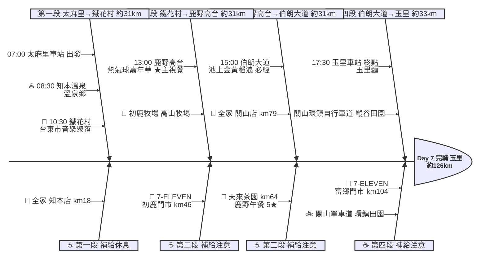

# Day 7：太麻里車站 ➔ 玉里車站（花東縱谷田園騎行）

---

## 路線總覽

* **出發地**：太麻里
* **目的地**：玉里 / 安通
* **總距離**：125.7 公里（GPX 實測）
* **總爬升 / 下降**：↑ 1063 m ／ ↓ 980 m（花東縱谷地勢平緩，台9線沿卑南溪→秀姑巒溪谷北行，偶有緩坡）
* **主要路線**：太麻里 ➔ 知本溫泉 ➔ 台東市鐵花村 ➔ 初鹿牧場 ➔ 鹿野高台 ➔ 關山單車道 ➔ 池上伯朗大道 ➔ 富里 ➔ 玉里車站

[📱 開啟 Google Maps 導航](https://www.google.com/maps/dir/?api=1&origin=%E5%8F%B0%E6%9D%B1%E7%B8%A3%E5%A4%AA%E9%BA%BB%E9%87%8C%E8%BB%8A%E7%AB%99&destination=%E8%8A%B1%E8%93%AE%E7%B8%A3%E7%8E%89%E9%87%8C%E8%BB%8A%E7%AB%99&waypoints=%E7%9F%A5%E6%9C%AC%E6%BA%AB%E6%B3%89%7C%E5%8F%B0%E6%9D%B1%E9%90%B5%E8%8A%B1%E6%9D%91%7C%E5%88%9D%E9%B9%BF%E7%89%A7%E5%A0%B4%7C%E9%B9%BF%E9%87%8E%E9%AB%98%E5%8F%B0%7C%E6%B1%A0%E4%B8%8A%E4%BC%AF%E6%9C%97%E5%A4%A7%E9%81%93&travelmode=bicycling)

<iframe src="https://www.google.com/maps/d/u/0/embed?mid=1mZ00rlAyZJeiPsaq3bUtSJxnKr9Ay_o&ehbc=2E312F" width="100%" height="100%" style="border:none; border-radius: 8px;"></iframe>

---

## 詳細路線行程圖解

---

## 建議行程與時間配速

### 第一段：太麻里車站 → 鐵花村（約 31 km）｜溫泉與市區段

**距離**：31 km
**路況**：自太麻里沿台9線北上經知本溫泉進台東市區。縱谷起點地勢平緩、補給充足，台東市區可逛鐵花村。

**景點與補給：**
- 🚀 **07:00 太麻里車站**（起點，km 0）：接續 Day6 終點，日昇之鄉出發，沿台9線進入花東縱谷。
- ♨️ **08:30 知本溫泉**（km ~14，卑南）：必經點。知名溫泉鄉（4.2★/1456），可短暫休息（泡腳）。
- 🎵 **10:30 鐵花村音樂聚落慢市集**（km ~31，台東市）：必經點。台東市鐵道藝術村旁音樂聚落（4.5★/1.5萬則），熱氣球意象與市集。

---

### 第二段：鐵花村 → 鹿野高台（約 31 km）｜縱谷牧場段

**距離**：31 km
**路況**：沿台9線北上經卑南、初鹿進鹿野。縱谷田園風光，初鹿牧場後緩上鹿野高台。

**景點與補給：**
- 🐄 **12:00 初鹿牧場**（km ~49，卑南）：必經點。南台灣最大高山牧場（4.2★/9256），鮮乳與大草原。
- 🎈 **13:00 鹿野高台**（km ~62，鹿野）：必經點、本日★主視覺。熱氣球嘉年華與飛行傘基地（4.5★/2.7萬則），縱谷全景。

---

### 第三段：鹿野高台 → 伯朗大道（約 31 km）｜關山池上稻浪段

**距離**：31 km
**路況**：於鹿野午餐後沿台9線經關山環鎮自行車道進池上。縱谷稻田風光最美一段，關山補給後騎入伯朗大道。

**景點與補給：**
- 🍜 **13:30–14:30 天來茶園-鹿野高台**（km ~64，鹿野）：午餐大休點。鹿野高台旁茶園餐（5★/1647，麵店 10:00-14:00、週一休），福鹿茶與在地料理。
- 🚲 **全家便利商店 台東關山店**（km ~79，關山）：關山補給點。可順遊關山環鎮自行車道（全台第一條環鎮自行車道）。
- 🌾 **15:30 伯朗大道**（km ~93，池上）：必經點。池上金黃稻浪間的筆直田園路（4.4★/9606），金城武樹、無電線桿的天堂路。

---

### 第四段：伯朗大道 → 玉里車站（約 33 km）｜縱谷收尾段

**距離**：33 km
**路況**：沿台9線過池上、富里進花蓮玉里。縱谷田園一路平緩，富里補給後抵玉里。

**景點與補給：**
- 🥤 **7-ELEVEN 富鄉門市**（km ~104，富里）：富里補給點，進花蓮前補給。
- 🏁 **17:30 玉里車站**（km ~121，玉里）：當日終點。玉里麵、玉里橋頭臭豆腐聞名，可住玉里鎮或南下安通溫泉。

---

## 晚餐推薦

| # | 店名 | 評分 | 留言數 | 貝葉斯分 | 備註 |
|:---:|:---|:---:|---:|:---:|:---|
| 1 | [女兒心優質農產創意工坊](https://www.google.com/maps/place/?q=place_id:ChIJvUBbKmRrbzQR9UTxl19ZWWw) | 5★ | 392 | 4.6345 | 餐廳 |
| 2 | [北方早點丨燒餅加料、鹹豆漿](https://www.google.com/maps/place/?q=place_id:ChIJrc7ZM39qbzQRBwZVXUxvY9U) | 4.7★ | 1103 | 4.5905 | 早餐店 |
| 3 | [米達碳烤雞排](https://www.google.com/maps/place/?q=place_id:ChIJ1cFc5uRDbzQRvopWgtTkLwo) | 4.7★ | 712 | 4.5555 | 雞肉料理餐廳 |
| 4 | [玉里豬血湯早午餐](https://www.google.com/maps/place/?q=place_id:ChIJBcC2yCJrbzQR86m-696Di48) | 4.8★ | 384 | 4.5454 | 早午餐餐廳 |
| 5 | [星馬茶餐廳｜玉里美食](https://www.google.com/maps/place/?q=place_id:ChIJb9koNnpqbzQR1n6BiErxXhE) | 4.7★ | 501 | 4.5253 | 餐廳 |

> 💡 *排序依據：留言數越多的高分店越可信（IMDB 風格貝葉斯平均）*
> 📋 *[看更多 >>](./day7_dinner.md)*

---

## 住宿推薦 🏨

| # | 飯店 | 評分 | 留言數 | 貝葉斯分 | 備註 |
|:---:|:---|:---:|---:|:---:|:---|
| 1 | [小鳥散步 玉里民宿 玉里包棟](https://www.google.com/maps/place/?q=place_id:ChIJ7caGfuFBbzQRbae3zVgCHno) | 5★ | 256 | 4.7632 |  |
| 2 | [途中玉里青年旅館（全雅房，上下舖，）](https://www.google.com/maps/place/?q=place_id:ChIJC2qZFdhrbzQRi4AVS4zscz0) | 4.9★ | 410 | 4.7558 |  |
| 3 | [原鄉商旅](https://www.google.com/maps/place/?q=place_id:ChIJ3fPJi4JrbzQRbgFN4CZgh_0) | 4.8★ | 593 | 4.7143 |  |
| 4 | [910 hostel 城東館](https://www.google.com/maps/place/?q=place_id:ChIJuWXA4npqbzQRrtdbytHaBl0) | 4.8★ | 388 | 4.6844 |  |
| 5 | [山之間特色民宿｜花蓮玉里民宿｜花蓮縣合法民宿編號2868號](https://www.google.com/maps/place/?q=place_id:ChIJhdGGCTprbzQRxbkKjMJ1BVY) | 5★ | 136 | 4.6786 |  |

> 💡 *終點周邊 3 公里 · 40 筆候選 · IMDB 風格貝葉斯平均*
> 📋 *[看更多 >>](./day7_hotel.md)*

---

## 騎乘注意事項

1. **縱谷天氣**：花東縱谷日夜溫差大、午後偶有雷陣雨，備好雨具與防曬。
2. **補給**：台9線沿線城鎮（知本、台東市、初鹿、鹿野、關山、池上、富里）超商充足，補給無虞。
3. **午餐時間**：天來茶園麵店僅 10:00-14:00、週一公休，建議準時或改鹿野／關山其他餐廳（如關山便當、米國學校）。
4. **伯朗大道**：旺季遊客多、需與遊園車及行人共道，騎乘減速注意安全；金城武樹一帶禁止車輛進入需牽行。
5. **關山環鎮自行車道**：全台第一條環鎮自行車道，時間充裕可繞行體驗縱谷田園。
6. **撤退方案**：台9線與台鐵台東線並行，知本站、台東站、鹿野站、關山站、池上站、富里站、玉里站皆可搭區間車，彈性極高。

---

## 更佳景點參考

> 以下為沿途 Bayesian 排名較高但未排入路線的備選點位。可視當天體力 / 天候 / 時間彈性加入。

### 景點備案

| 名次 | 名稱 | 評分 | 留言數 | 貝葉斯分 |
|:---:|:---|:---:|---:|:---:|
| 1 | 全地型沙灘車 立式划槳 - 臺東太麻里 ATV & SUP Taitung TaiMaLi | 4.9★ | 1,453 | 4.84 |
| 2 | 東糖商圈好好玩 | 4.9★ | 84 | 4.6 |
| 3 | 天堂路 | 4.6★ | 6,931 | 4.6 |
| 4 | 脫線故事館 | 4.7★ | 117 | 4.56 |
| 5 | 太麻里車站日昇路 | 4.6★ | 278 | 4.55 |

### 午餐 / 餐廳大休備案

| 名次 | 店名 | 評分 | 留言數 | 貝葉斯分 |
|:---:|:---|:---:|---:|:---:|
| 1 | 井碳吉炭火燒肉餐廳 ｜ 台東美食 | 4.9★ | 2,346 | 4.86 |
| 2 | 荳荳阿稼早午餐 | 4.9★ | 1,531 | 4.85 |
| 3 | 66萊樂輕食 | 4.9★ | 851 | 4.81 |

