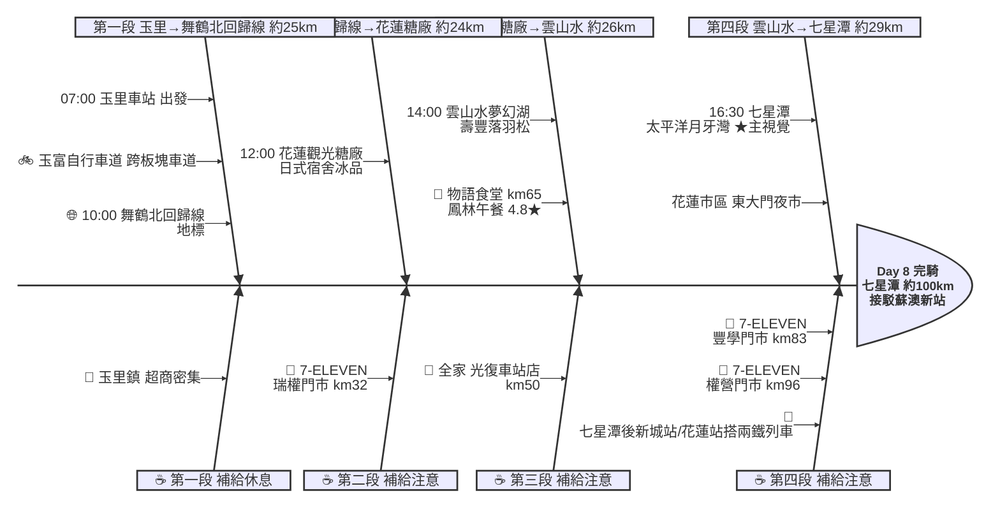

# Day 8：玉里車站 ➔ 七星潭（花東縱谷北行接駁日）

---

## 路線總覽

* **出發地**：玉里 / 安通
* **目的地**：花蓮七星潭
* **總距離**：99.8 公里（GPX 實測）
* **總爬升 / 下降**：↑ 446 m ／ ↓ 566 m（花東縱谷平緩北行，經瑞穗、光復至花蓮市抵七星潭；七星潭後於花蓮站／新城站搭兩鐵列車接駁蘇澳新站（跳過蘇花公路））
* **主要路線**：玉里 ➔ 玉富自行車道 ➔ 舞鶴北回歸線 ➔ 花蓮糖廠 ➔ 鳳林 ➔ 壽豐雲山水 ➔ 花蓮市 ➔ 七星潭

[📱 開啟 Google Maps 導航](https://www.google.com/maps/dir/?api=1&origin=%E8%8A%B1%E8%93%AE%E7%B8%A3%E7%8E%89%E9%87%8C%E8%BB%8A%E7%AB%99&destination=%E8%8A%B1%E8%93%AE%E4%B8%83%E6%98%9F%E6%BD%AD&waypoints=%E7%8E%89%E5%AF%8C%E8%87%AA%E8%A1%8C%E8%BB%8A%E9%81%93%7C%E8%88%9E%E9%B6%B4%E5%8C%97%E5%9B%9E%E6%AD%B8%E7%B7%9A%7C%E8%8A%B1%E8%93%AE%E8%A7%80%E5%85%89%E7%B3%96%E5%BB%A0%7C%E8%8A%B1%E8%93%AE%E9%9B%B2%E5%B1%B1%E6%B0%B4%E5%A4%A2%E5%B9%BB%E6%B9%96&travelmode=bicycling)

<iframe src="https://www.google.com/maps/d/u/0/embed?mid=1GvqnRVpnttfq3DpjfVhqopTxqsV-EKU&ehbc=2E312F" width="100%" height="100%" style="border:none; border-radius: 8px;"></iframe>

---

## 詳細路線行程圖解

---

## 建議行程與時間配速

### 第一段：玉里車站 → 舞鶴北回歸線（約 25 km）｜縱谷板塊段

**距離**：25 km
**路況**：自玉里沿玉富自行車道與台9線北上經瑞穗舞鶴。縱谷平緩、補給充足，玉富車道為跨歐亞與菲律賓板塊的特殊路線。

**景點與補給：**
- 🚀 **07:00 玉里車站**（起點，km 0）：接續 Day7 終點。可先嚐玉里麵當早餐再出發。
- 🚲 **07:20 玉富自行車道**（km ~5，玉里）：必經點。跨越歐亞與菲律賓板塊交界的自行車道（4.4★/313），舊鐵橋改建。
- 🌐 **10:00 北回歸線標誌公園**（km ~25，瑞穗舞鶴）：必經點。北回歸線通過地標（4.2★/8809），舞鶴台地茶與咖啡產區。

---

### 第二段：舞鶴北回歸線 → 花蓮糖廠（約 24 km）｜縱谷糖鄉段

**距離**：24 km
**路況**：沿台9線北上經瑞穗、富源進光復花蓮糖廠。平緩好騎，瑞權門市補給。

**景點與補給：**
- 🥤 **7-ELEVEN 瑞權門市**（km ~32，瑞穗）：瑞穗補給點。
- 🍦 **12:00 花蓮觀光糖廠**（km ~49，光復）：必經點。日式木造宿舍群與招牌冰品（4.1★/2.3萬則），歇腳吃冰好去處。

---

### 第三段：花蓮糖廠 → 雲山水（約 26 km）｜鳳林壽豐段

**距離**：26 km
**路況**：沿台9線經鳳林、壽豐北上。鳳林午餐後騎入壽豐雲山水落羽松園區。

**景點與補給：**
- 🥤 **全家便利商店 光復車站店**（km ~50，光復）：光復補給點。
- 🍱 **13:00–14:00 物語食堂＆精油工坊**（km ~65，鳳林）：午餐大休點。鳳林高人氣食堂（4.8★/4148），在地食材料理。
- 🌳 **14:30 花蓮雲山水夢幻湖**（km ~75，壽豐）：落羽松與夢幻湖倒映中央山脈（4.1★/1.5萬則），網美打卡地。

---

### 第四段：雲山水 → 七星潭（約 29 km）｜花蓮太平洋收尾段

**距離**：29 km
**路況**：沿台9線經花蓮市區轉往北濱抵七星潭。花蓮市區車流多、注意號誌；七星潭後於新城站或花蓮站搭兩鐵列車接駁蘇澳新站（依 index 建議跳過蘇花公路）。

**景點與補給：**
- 🥤 **7-ELEVEN 豐學門市**（km ~83，壽豐）：壽豐補給點。
- 🥤 **7-ELEVEN 權營門市**（km ~96，花蓮市）：花蓮市進七星潭前補給。
- 🏁 **16:30 七星潭海岸風景特定區**（km ~104，新城）：當日終點、本日★主視覺。月牙灣弧形礫石海灘與清水斷崖背景（4.6★/2.8萬則）。隨後於新城站／花蓮站搭兩鐵列車接駁蘇澳新站。

---

## 晚餐推薦

| # | 店名 | 評分 | 留言數 | 貝葉斯分 | 備註 |
|:---:|:---|:---:|---:|:---:|:---|
| 1 | [安口食堂 星潭店](https://www.google.com/maps/place/?q=place_id:ChIJJz3j-XohZjQRyqzPDJal8B0) | 4.8★ | 757 | 4.6627 | 餐廳 |
| 2 | [暗潮燒烤](https://www.google.com/maps/place/?q=place_id:ChIJTzb8isUhZjQRzDZsC6vIYl4) | 4.9★ | 210 | 4.5681 | 餐廳 |
| 3 | [川壽司 花蓮 新城 家樂福附近 日式 生魚片 居酒屋 燒烤 炸物 烏龍麵](https://www.google.com/maps/place/?q=place_id:ChIJEbdTDHufaDQRKKm-AJ_jb5w) | 4.7★ | 333 | 4.531 | 日式餐廳 |
| 4 | [Wooli韓式料理店](https://www.google.com/maps/place/?q=place_id:ChIJPS_NyoSfaDQRilyM-ATao_g) | 4.8★ | 196 | 4.5247 | 韓國餐廳 |
| 5 | [町屋丼飯 北埔店-花蓮美食-餐廳-咖哩-Restaurants](https://www.google.com/maps/place/?q=place_id:ChIJ16odd5yfaDQRw1Gc86yN884) | 4.7★ | 275 | 4.5156 | 餐廳 |

> 💡 *排序依據：留言數越多的高分店越可信（IMDB 風格貝葉斯平均）*
> 📋 *[看更多 >>](./day8_dinner.md)*

---

## 住宿推薦 🏨

| # | 飯店 | 評分 | 留言數 | 貝葉斯分 | 備註 |
|:---:|:---|:---:|---:|:---:|:---|
| 1 | [七星潭泥作輕旅](https://www.google.com/maps/place/?q=place_id:ChIJtZN5UwkhZjQRt064wVNSut4) | 4.9★ | 394 | 4.7739 |  |
| 2 | [七星潭水上明月海景渡假旅店 Hotelmoon](https://www.google.com/maps/place/?q=place_id:ChIJe1QZqKkgZjQR7Ybf9a2cpKA) | 4.9★ | 369 | 4.7698 |  |
| 3 | [去七星潭海景民宿](https://www.google.com/maps/place/?q=place_id:ChIJ9bUMLF0hZjQRPfb0A6nPTpw) | 4.9★ | 369 | 4.7698 |  |
| 4 | [聚一夏民宿](https://www.google.com/maps/place/?q=place_id:ChIJzyOPklafaDQRMlNmfhYg5Vg) | 5★ | 199 | 4.766 |  |
| 5 | [七星潭星海民宿_寵物友善（近柴館旁，勿入巷內)](https://www.google.com/maps/place/?q=place_id:ChIJbQOkTqggZjQR_NPVIBzqWJg) | 4.8★ | 786 | 4.7491 |  |

> 💡 *終點周邊 3 公里 · 30 筆候選 · IMDB 風格貝葉斯平均*
> 📋 *[看更多 >>](./day8_hotel.md)*

---

## 騎乘注意事項

1. **火車接駁（重要）**：依 index 建議跳過蘇花公路，於七星潭附近的新城站或花蓮站搭乘兩鐵列車（可載單車）接駁至蘇澳新站，務必事先查好班次與單車車廂規定。
2. **花蓮市區車流**：花蓮市區與台9線車流較多，行經注意號誌與大型車。
3. **補給充足**：台9縱谷沿線（瑞穗、光復、鳳林、壽豐、花蓮市）超商密集，補給無虞。
4. **午餐選擇**：鳳林物語食堂人氣高、假日需候位，可改光復糖廠周邊或鳳林韭菜臭豆腐、剝皮辣椒美食。
5. **七星潭安全**：海灘為陡降礫石灘、暗流強勁，切勿下水戲水，岸邊賞景即可。
6. **撤退方案**：台9線與台鐵花東線並行，瑞穗站、光復站、鳳林站、壽豐站、花蓮站皆可搭車；接駁本身即搭火車，彈性極高。

---

## 更佳景點參考

> 以下為沿途 Bayesian 排名較高但未排入路線的備選點位。可視當天體力 / 天候 / 時間彈性加入。

### 景點備案

| 名次 | 名稱 | 評分 | 留言數 | 貝葉斯分 |
|:---:|:---|:---:|---:|:---:|
| 1 | 花蓮海市蜃樓海景秘境 | 5★ | 475 | 4.77 |
| 2 | 七星潭 | 4.8★ | 817 | 4.7 |
| 3 | 野猴子探險森林 | 4.7★ | 1,628 | 4.66 |
| 4 | 台灣黑熊教育館 | 4.7★ | 824 | 4.62 |
| 5 | 七星潭 | 4.6★ | 1,512 | 4.57 |

### 午餐 / 餐廳大休備案

| 名次 | 店名 | 評分 | 留言數 | 貝葉斯分 |
|:---:|:---|:---:|---:|:---:|
| 1 | 小村·日 壽司（花蓮店）｜日式餐廳｜花蓮美食｜聚餐餐廳｜客製化餐盒｜生魚片蛋糕｜ | 4.9★ | 3,585 | 4.86 |
| 2 | 梅蘢鎮 | 4.9★ | 2,217 | 4.84 |
| 3 | 帕芙莉食堂（全預約）提前一天訂位 | 4.9★ | 1,255 | 4.81 |

