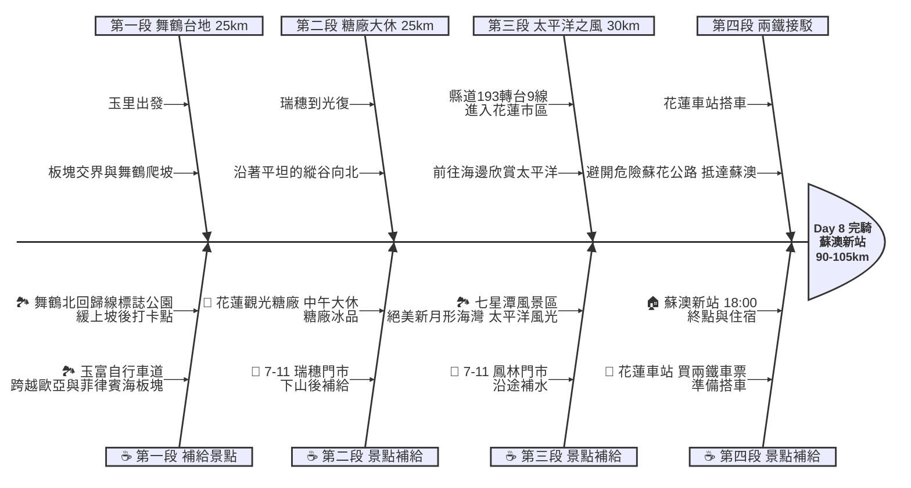

# Day 8：花蓮玉里 ➔ 宜蘭蘇澳 (縱谷北返與兩鐵接駁)

## 📍 路線總覽
* **出發地**：花蓮玉里車站
* **目的地**：宜蘭蘇澳新站（從花蓮搭火車接駁抵達）
* **總距離**：單車騎乘約 90 - 105 公里
* **總爬升**：微幅起伏（玉里到瑞穗間有舞鶴台地需爬升）
* **主要路線**：縣道193線（或台9線） ➔ 兩鐵列車接駁（花蓮 ➔ 蘇澳新站）

---

### 🌍 Google Maps 導航與地圖預覽

#### 手機導航連結
👉 **[點擊此處開啟 Day 8 縱谷北返導航（腳踏車模式）](https://www.google.com/maps/dir/?api=1&origin=%E8%8A%B1%E8%93%AE%E7%8E%89%E9%87%8C%E8%BB%8A%E7%AB%99&destination=%E8%8A%B1%E8%93%AE%E8%BB%8A%E7%AB%99&waypoints=%E8%8A%B1%E8%93%AE%E7%8E%89%E5%AF%8C%E8%87%AA%E8%A1%8C%E8%BB%8A%E9%81%93%7C%E8%8A%B1%E8%93%AE%E8%88%9E%E9%B6%B4%E5%8C%97%E5%9B%9E%E6%AD%B8%E7%B7%9A%E6%A8%99%E8%AA%8C%E5%85%AC%E5%9C%92%7C%E8%8A%B1%E8%93%AE%E5%85%89%E5%BE%A9%E7%B3%96%E5%BB%A0%7C%E8%8A%B1%E8%93%AE%E4%B8%83%E6%98%9F%E6%BD%AD%E9%A2%A8%E6%99%AF%E5%8D%80&travelmode=bicycling)**

> *(💡 抵達花蓮車站後，請搭乘火車前往終點蘇澳新站，避開危險的蘇花公路。)*

#### 🗺️ 路線小地圖

> 💡 *【預設版型提醒】：請在此放置生成的路線圖 (命名為 `day8_poster.png`)，並記得將上方圖片的超連結替換成您當天的 Google My Maps 專屬連結！*

---

## 🐟 魚骨圖 (Ishikawa Diagram)

---

## 🕒 建議行程與時間配速

### 第一段：板塊交界與舞鶴（玉里 ➔ 瑞穗）
* **距離**：約 25 km
* **路況**：從玉里出發，可騎乘由舊鐵道改建的玉富自行車道。隨後轉入台9線，會遇到舞鶴台地的緩上坡，爬升約 150 公尺。
* **景點 / 休息補給**：
  * **玉富自行車道**（評分 4.4，推薦景點）：亞洲唯一橫跨兩個板塊（歐亞板塊與菲律賓海板塊）的自行車道，橋上有板塊交界的打卡標誌。
  * **舞鶴北回歸線標誌公園**（評分 4.2）：爬上舞鶴台地後的最佳休息點，有巨大的白色日晷造型標誌。

### 第二段：平原糖廠大休（瑞穗 ➔ 光復）
* **距離**：約 25 km
* **路況**：從瑞穗下滑後，建議可選擇車流較少、風景極美的「縣道 193 線」北上，這條路是花東單車族的秘境路線。
* **景點 / 休息補給**：
  * **花蓮觀光糖廠**（評分 4.2）：本日**午餐大休點**。抵達光復後必訪的休息站，腹地廣大，推薦品嚐各種口味的糖廠冰淇淋。

### 第三段：直奔太平洋（光復 ➔ 花蓮市區 ➔ 七星潭）
* **距離**：約 30 - 40 km
* **路況**：繼續沿著縱谷往北進入吉安、花蓮市區。若時間充裕可往海邊騎乘。
* **景點 / 休息補給**：
  * **七星潭風景區**（評分 4.6，最高人氣必訪）：絕美的新月形礫石海灣，直面浩瀚的太平洋，是花蓮最著名的海景打卡點。

### 第四段：兩鐵接駁避險（花蓮車站 ➔ 蘇澳新站）
* **說明**：因為蘇花公路大卡車多、無慢車道、部分隧道狹窄，且常有落石，**強烈建議單車環島者跳過此段**，改由火車接駁。
* **景點 / 休息補給**：
  * **花蓮車站**：抵達花蓮後，請至售票窗口購買「兩鐵列車」車票（人車同車廂）前往蘇澳新站。
  * **終點：蘇澳新站**：搭乘約 1.5 - 2 小時火車後抵達。蘇澳新站周邊較為荒涼，建議騎至蘇澳市區或冬山附近住宿。

---

## 💡 騎乘注意事項

1. **縣道 193 選擇**：台9線縱谷段雖然直但大車較多；縣道 193 線雖然有微幅起伏且距離稍長，但沿途綠樹成蔭、車流極少，強烈建議單車族走 193 線北上。
2. **兩鐵列車班次**：台鐵能讓單車「不拆車直接推上車」的兩鐵區間車班次有限，請務必在出發前幾天先上台鐵網站查詢時刻表，並控制在花蓮市區的抵達時間。
3. **七星潭瘋狗浪**：七星潭為陡降型海灘，雖然美麗但海象危險，請勿過度靠近海邊，嚴禁下水。
