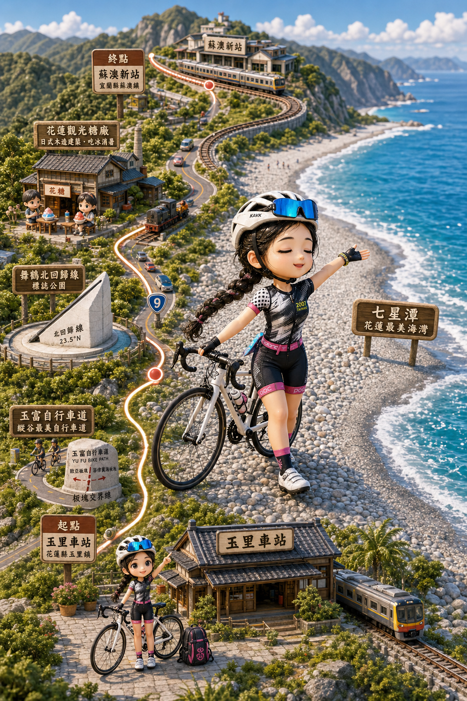
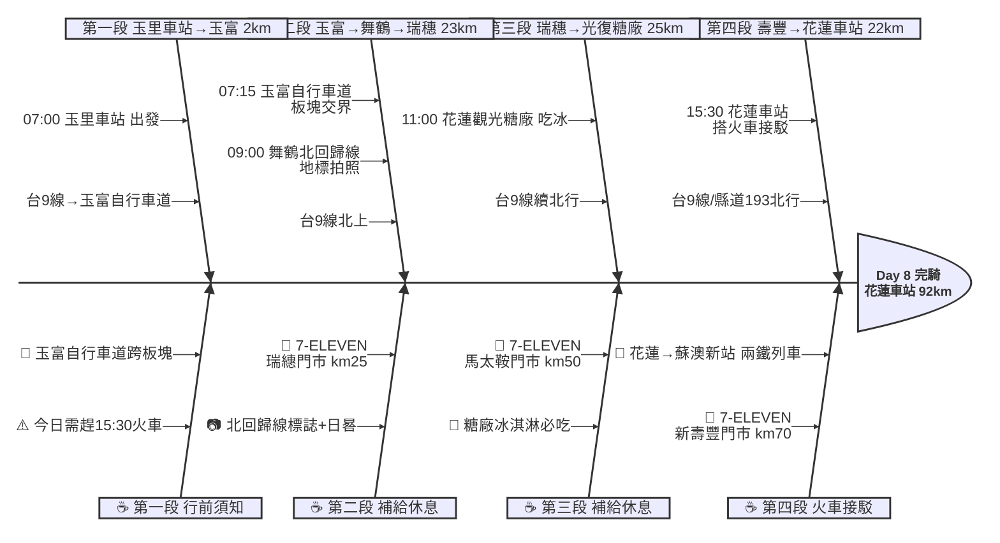

# Day 8：玉里車站 ➔ 花蓮車站（→蘇澳新站）（花東縱谷北行接駁日）

---

## 路線總覽

* **出發地**：玉里 / 安通
* **目的地**：花蓮 → 蘇澳新站 (火車接駁)
* **總距離**：100.6 公里（GPX 實測）
* **總爬升 / 下降**：↑ 506 m ／ ↓ 631 m（花東縱谷北行，整體下坡居多；花蓮站搭火車接駁至蘇澳）
* **主要路線**：玉里車站 ➔ 玉富自行車道 ➔ 台9線北上 ➔ 舞鶴北回歸線 ➔ 瑞穗 ➔ 光復糖廠 ➔ 壽豐 ➔ 花蓮車站（搭火車→蘇澳新站）

[📱 開啟 Google Maps 導航](https://www.google.com/maps/dir/玉里車站/北回歸線標誌公園+瑞穗/花蓮觀光糖廠/花蓮車站/@23.6,121.4,10z/data=!4m2!4m1!3e1)

<iframe src="https://www.google.com/maps/d/u/0/embed?mid=1GvqnRVpnttfq3DpjfVhqopTxqsV-EKU&ehbc=2E312F" width="100%" height="100%" style="border:none; border-radius: 8px;"></iframe>

---

## 詳細路線行程圖解

---

## 建議行程與時間配速

### 第一段：玉里車站 → 玉富自行車道（約 2 km）｜板塊交界晨騎段

**距離**：2 km
**路況**：由玉里車站出發，沿舊鐵道改建的玉富自行車道騎行。路面平整，專用車道無車流干擾。

**景點與補給：**
- 🚀 **07:00 玉里車站**（起點，km 0）：Day 7 終點續行。今日需在 15:30 前抵達花蓮車站搭兩鐵列車，節奏不宜太慢。
- 🌏 **07:15 玉富自行車道**（km 2，舊東線鐵道）：全球唯一橫跨歐亞板塊與菲律賓海板塊的自行車道！利用 2003 年廢棄的玉里至東里段鐵路改建。秀姑巒溪大橋上可見板塊交界標示。停留 10 分鐘拍照。

---

### 第二段：玉富 → 舞鶴北回歸線 → 瑞穗（約 23 km）｜北回歸線地標段

**距離**：23 km
**路況**：台9線由富里經舞鶴到瑞穗，沿縱谷平緩北行。舞鶴台地有輕微上坡，北回歸線標誌就在台9線路旁。

**景點與補給：**
- ☀️ **09:00 舞鶴北回歸線標誌公園**（km 20，台9線旁）：北緯 23.5° 北回歸線通過台灣的標誌地標。公園內有天文裝置、星座圖案地磚與日晷。夏至正午太陽直射時標柱無影。停留 10 分鐘拍照。
- 🏪 **09:30 7-ELEVEN 瑞繐門市**（km 25，瑞穗鄉）：瑞穗鎮補給。附近有瑞穗溫泉與瑞穗牧場，若有餘裕可繞行品嚐瑞穗鮮奶。

---

### 第三段：瑞穗 → 花蓮觀光糖廠（約 25 km）｜縱谷糖廠文化段

**距離**：25 km
**路況**：台9線由瑞穗北行經鳳林至光復，地勢平坦。光復糖廠園區大，可快速吃冰拍照即離開。

**景點與補給：**
- 🏭 **11:00 花蓮觀光糖廠**（km 50，光復鄉糖廠街）：1920年代建造的日治糖廠，2002年停產後轉型觀光園區。園內冰品店販售超過 40 種口味冰淇淋（NT$35-55），花生與紅豆口味最受歡迎。還有日式木屋、錦鯉魚池。停留 20 分鐘吃冰拍照。
- 🏪 **11:30 7-ELEVEN 馬太鞍門市**（km 50，光復鄉）：糖廠旁補給，準備下午北行至花蓮。

---

### 第四段：光復 → 壽豐 → 花蓮車站（約 42 km）｜趕搭火車衝刺段

**距離**：42 km
**路況**：台9線或縣道193（車少較安全）北行，經壽豐至花蓮市區。路面平坦但距離較長，須注意時間管理以趕上兩鐵列車。

**景點與補給：**
- 🏪 **13:30 7-ELEVEN 新壽豐門市**（km 70，壽豐鄉）：壽豐鄉補給，距花蓮市區約 22 km。確認時間是否趕得上火車。
- 🚂 **15:30 花蓮車站**（km 92，本日終點）：搭乘兩鐵列車（攜帶自行車上火車）前往蘇澳新站，約 1.5-2 小時車程。跳過蘇花公路（大卡車多、無慢車道、落石風險）。抵達蘇澳新站後可前往南方澳享用海鮮晚餐。

---

## 晚餐推薦

| # | 店名 | 評分 | 留言數 | 貝葉斯分 | 備註 |
|:---:|:---|:---:|---:|:---:|:---|
| 1 | [老時光燒肉酒肴](https://www.google.com/maps/place/?q=place_id:ChIJ2VVALcGfaDQRkjKccxTOx3k) | 4.8★ | 11688 | 4.7292 | 居酒屋 |
| 2 | [小村·日 壽司（花蓮店）｜日式餐廳｜花蓮美食｜聚餐餐廳｜客製化餐盒｜生魚片蛋糕｜](https://www.google.com/maps/place/?q=place_id:ChIJpTHZfGufaDQRYwv9zZs77ZI) | 4.9★ | 3572 | 4.6898 | 壽司店 |
| 3 | [香茅廚房《Lemongrass Kitchen》花蓮美食/花蓮餐廳/花蓮泰式料理/花蓮必吃/花蓮聚餐/寵物親子友善餐廳](https://www.google.com/maps/place/?q=place_id:ChIJw87z53WfaDQRB494Xktk3NU) | 4.9★ | 2612 | 4.6457 | 泰國餐廳 |
| 4 | [花蓮市立丼物園](https://www.google.com/maps/place/?q=place_id:ChIJkW2NqgmfaDQRZOqdD_Jj67E) | 4.9★ | 2301 | 4.6271 | 日式餐廳 |
| 5 | [饗泰多 Siam More 泰式風格餐廳 花蓮遠百店](https://www.google.com/maps/place/?q=place_id:ChIJF5w35AefaDQReBCh2s4TjdQ) | 4.9★ | 2245 | 4.6234 | 餐廳 |

> 💡 *排序依據：留言數越多的高分店越可信（IMDB 風格貝葉斯平均）*
> 📋 *[看更多 >>](./day8_dinner.md)*

---

## 住宿推薦 🏨

| # | 飯店 | 評分 | 留言數 | 貝葉斯分 | 備註 |
|:---:|:---|:---:|---:|:---:|:---|
| 1 | [花蓮品悅文旅](https://www.google.com/maps/place/?q=place_id:ChIJv0onO4ifaDQRktpDiZdJOww) | 5★ | 3387 | 4.8066 |  |
| 2 | [悅樂旅店‧花蓮中福 OLAH Poshtel Hualien Zhongfu](https://www.google.com/maps/place/?q=place_id:ChIJsbmXYJ2faDQRJefZgX8-UZY) | 4.8★ | 2174 | 4.6206 |  |
| 3 | [去那邊民宿-【花蓮電梯民宿】](https://www.google.com/maps/place/?q=place_id:ChIJ751PxT6faDQRozEKJD8G1RE) | 5★ | 816 | 4.5847 |  |
| 4 | [花蓮青年旅館．北吉光輕旅 Hualien Hostel Bayhouse](https://www.google.com/maps/place/?q=place_id:ChIJe7-1qbCfaDQRaLK31rEPXYs) | 4.8★ | 1558 | 4.5835 |  |
| 5 | [康橋商旅-花蓮站前館](https://www.google.com/maps/place/?q=place_id:ChIJT9gvA7afaDQRSrBEVTOeLQw) | 4.6★ | 6283 | 4.5532 |  |

> 💡 *終點周邊 3 公里 · 64 筆候選 · IMDB 風格貝葉斯平均*
> 📋 *[看更多 >>](./day8_hotel.md)*

---

## 騎乘注意事項

1. **蘇花公路安全考量**：蘇花公路大卡車多且無慢車道，隧道內危險性高，強烈建議搭火車接駁。花蓮至蘇澳新站的兩鐵列車班次可上台鐵官網查詢（每日約 4-6 班可攜車）。
2. **兩鐵列車預約**：攜帶自行車的「兩鐵列車」需事先在台鐵官網或 APP 預約自行車車位，每班車限量。建議出發前 2 週預訂。若無車位可拆前輪裝車袋搭一般自強號。
3. **時間管理**：今日從玉里至花蓮約 92 km，若要趕 15:30 火車需維持 15-18 km/h 均速。建議不要在各景點停留太久，每站 10-15 分鐘為上限。
4. **撤退車站**：富里車站（km 10）、瑞穗車站（km 28）、鳳林車站（km 45）、光復車站（km 50）、壽豐車站（km 70）、花蓮車站（km 92）。若體力不支可提前搭火車至花蓮再轉接蘇澳。
5. **縣道193替代路線**：光復到花蓮段可選台9線或縣道193。193 號走秀姑巒溪東岸，車流較少但路面品質略差。建議壽豐以北走台9線較安全。
6. **七星潭繞行**：七星潭位於花蓮市北方約 10 km（偏離主線），若時間充裕且不趕火車可繞行一看。自行車道可直達七星潭海灘。

---

## 更佳景點參考

> 以下為沿途 Bayesian 排名較高但未排入路線的備選點位。可視當天體力 / 天候 / 時間彈性加入。

### 景點備案

| 名次 | 名稱 | 評分 | 留言數 | 貝葉斯分 |
|:---:|:---|:---:|---:|:---:|
| 1 | 七星潭 | 4.6★ | 1,512 | 4.4 |

