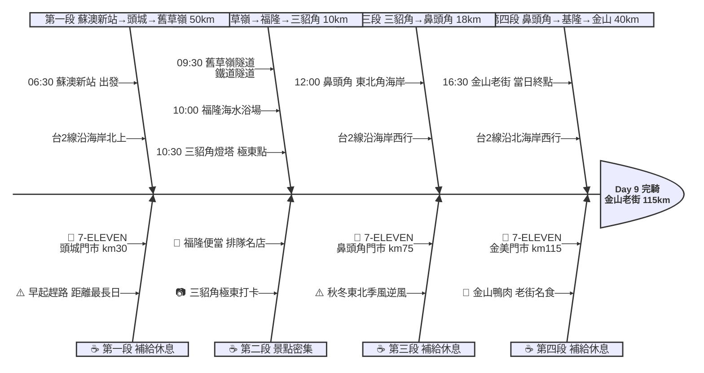

# Day 9：蘇澳新站 ➔ 金山老街（東北角濱海極東追風行）

---

## 路線總覽

* **出發地**：蘇澳新站 / 蘇澳
* **目的地**：三貂角 → 金山 / 萬里
* **總距離**：134.0 公里（GPX 實測）
* **總爬升 / 下降**：↑ 702 m ／ ↓ 714 m（台2線北部濱海沿海岸多丘陵，環島第二大爬升日）
* **主要路線**：蘇澳新站 ➔ 台2線北上 ➔ 頭城 ➔ 大里 ➔ 舊草嶺隧道 ➔ 福隆 ➔ 三貂角燈塔 ➔ 鼻頭角 ➔ 基隆 ➔ 萬里 ➔ 金山老街

[📱 開啟 Google Maps 導航](https://www.google.com/maps/dir/蘇澳新站/舊草嶺隧道/福隆海水浴場/三貂角燈塔/金山老街/@25.1,121.9,10z/data=!4m2!4m1!3e1)

<iframe src="https://www.google.com/maps/d/u/0/embed?mid=1U19-f5poClZDbwvfVpxBD9fd-caBebk&ehbc=2E312F" width="100%" height="100%" style="border:none; border-radius: 8px;"></iframe>

---

## 詳細路線行程圖解

---

## 建議行程與時間配速

### 第一段：蘇澳新站 → 頭城 → 舊草嶺隧道（約 50 km）｜宜蘭海岸晨騎段

**距離**：50 km
**路況**：由蘇澳新站出發沿台2線北上，經頭城、大里沿東海岸騎行。路面平坦但有隧道，清晨車流少。大里至舊草嶺隧道段進入新北市。

**景點與補給：**
- 🚀 **06:30 蘇澳新站**（起點，km 0）：今日距離最長（115 km），建議 06:30 前出發。前晚搭火車從花蓮抵達，住蘇澳市區。
- 🏪 **08:30 7-ELEVEN 頭城門市**（km 30，頭城鎮）：頭城鎮補給。此處已離開宜蘭進入東北角海岸線。附近有蘭陽博物館可遠眺。
- 🚇 **09:30 舊草嶺隧道**（km 50，福隆端入口）：1924年通車的舊鐵路隧道（2,167m），2008年改為自行車/步行專用道。隧道內涼爽有燈光，穿越宜蘭新北縣界。環島騎士可直接通行（08:30-16:30開放）。停留 15 分鐘。

---

### 第二段：舊草嶺隧道 → 福隆 → 三貂角燈塔（約 10 km）｜極東點打卡段

**距離**：10 km
**路況**：出舊草嶺隧道後回到台2線，經福隆至三貂角。三貂角燈塔需從台2線岔路爬坡約 1 km（坡度較陡），是本日最重要景點。

**景點與補給：**
- 🏖️ **10:00 福隆海水浴場**（km 53，東北角代表沙灘）：每年夏天舉辦沙雕藝術節的黃金沙灘。車站旁的「福隆便當」是環島騎士必吃（NT$60-80）。可在此快速用餐。停留 15 分鐘。
- 🗼 **10:30 三貂角燈塔**（km 57，台灣極東點）：1935年建造的白色西洋式燈塔，位於台灣本島最東端。園區內有極東點方位標示、展覽室。需從台2線爬坡約 1 km，景色壯闘值得一攻。四極點第三座達成！停留 20 分鐘。

---

### 第三段：三貂角 → 鼻頭角（約 18 km）｜東北角海岸段

**距離**：18 km
**路況**：台2線沿東北角海岸西行，沿途奇岩海蝕景觀不斷。路面起伏較多（小丘+隧道），秋冬季可能有強烈東北季風（逆風）。

**景點與補給：**
- 🏪 **12:00 7-ELEVEN 鼻頭角門市**（km 75，鼻頭角）：東北角鼻頭角聚落旁補給。附近有鼻頭角步道（需爬坡 30 分鐘），若時間充裕可遠眺。

---

### 第四段：鼻頭角 → 基隆 → 萬里 → 金山老街（約 40 km）｜北海岸落日衝刺段

**距離**：40 km
**路況**：台2線由鼻頭角經基隆市沿北海岸西行至金山。基隆段有較長上坡（大武崙），萬里至金山段回復平坦。傍晚可能逆風。

**景點與補給：**
- 🏪 **15:30 7-ELEVEN 金美門市**（km 115，金山市區）：金山市區補給，距金山老街步行 3 分鐘。
- 🏁 **16:30 金山老街**（km 115，本日終點）：金包里老街（清朝至今超過 300 年歷史），「金山鴨肉」是全台知名排隊名店。老街上還有手工芋圓、卜肉等小吃。完騎後可步行逛老街吃晚餐。

---

## 晚餐推薦

| # | 店名 | 評分 | 留言數 | 貝葉斯分 | 備註 |
|:---:|:---|:---:|---:|:---:|:---|
| 1 | [君浩美食坊](https://www.google.com/maps/place/?q=place_id:ChIJwxfugTZLXTQRXpdg2TdpSDg) | 4.8★ | 1355 | 4.7378 | 海鮮快炒 北海岸 |
| 2 | [享魚路](https://www.google.com/maps/place/?q=place_id:ChIJHX911HVLXTQRQYlbhgbphbg) | 4.8★ | 398 | 4.6795 | 漁港海鮮 金山 |
| 3 | [拾物香](https://www.google.com/maps/place/?q=place_id:ChIJ34PFPvNNXTQRppe_tMp8zaE) | 4.8★ | 347 | 4.6732 | 創意料理 老街旁 |
| 4 | [煦新館](https://www.google.com/maps/place/?q=place_id:ChIJfUH2dP1LXTQRyA8tCSqLV_0) | 4.9★ | 59 | 4.6283 | 日式定食 |
| 5 | [海荔食堂](https://www.google.com/maps/place/?q=place_id:ChIJCzD5nNBLXTQRx3gr5ljkkN8) | 4.7★ | 107 | 4.6168 | 創意餐食 老街旁 |

> 💡 *排序依據：留言數越多的高分店越可信（IMDB 風格貝葉斯平均）*
> 📋 *[看更多 >>](./day9_dinner.md)*

---

## 騎乘注意事項

1. **秋冬東北季風**：東北角在秋冬季會有強烈東北季風（正面逆風），風速可達 7-9 級。若遇強風日，蘇澳至三貂角段騎乘難度大幅提高，須做好防風準備並降低時速預期。
2. **舊草嶺隧道開放時間**：08:30-16:30（夏季延至 17:30），假日人潮眾多。環島騎士需注意開放時間，若太早抵達需等待。隧道內禁止逆向行駛。
3. **三貂角爬坡**：從台2線岔路到三貂角燈塔約 1 km 陡坡，但景色值得。若體力不支可在岔路口拍照後略過。
4. **撤退車站**：蘇澳新站（km 0）、頭城車站（km 30）、大里車站（km 45）、福隆車站（km 53）、瑞芳車站（km 80）、基隆車站（km 90）。北部台鐵班次密集，撤退容易。
5. **基隆段注意**：基隆市區車流量大，部分路段有公車與貨車。建議走台2線（濱海）而非進入基隆市中心。
6. **今日距離最長**：全程約 115 km 是十天中距離最長的一天，需注意時間管理。建議 06:30 前出發，中午前完成三貂角打卡，下午衝刺至金山。

---

## 更佳景點參考

> *當日候選池所有可評分點位皆已入選或為鎖定必經點，無加碼推薦。*

