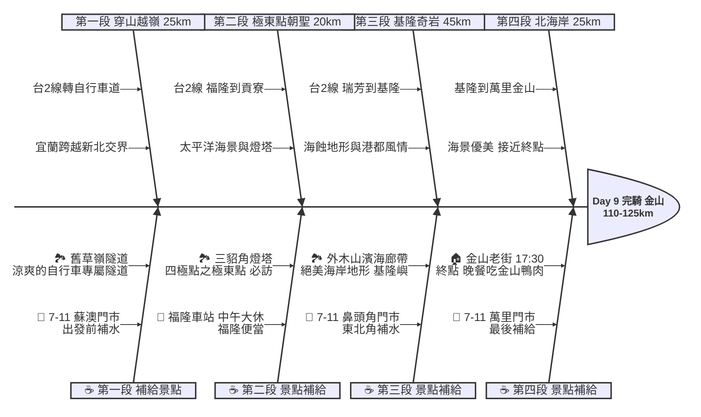

# Day 9：宜蘭蘇澳 ➔ 新北金山 (東北角極東點與海岸奇岩)

## 📍 路線總覽
* **出發地**：宜蘭蘇澳新站
* **目的地**：新北金山老街
* **總距離**：約 110 - 125 公里
* **總爬升**：微幅起伏（東北角海岸線沿途多為平緩公路，部分海岬路段有短坡）
* **主要路線**：台2線（北部濱海公路）

---

### 🌍 Google Maps 導航與地圖預覽

#### 手機導航連結
👉 **[點擊此處開啟 Day 9 東北角極東導航（腳踏車模式）](https://www.google.com/maps/dir/?api=1&origin=%E5%AE%9C%E8%98%AD%E8%98%87%E6%BE%B3%E6%96%B0%E7%AB%99&destination=%E6%96%B0%E5%8C%97%E9%87%91%E5%B1%B1%E8%80%81%E8%A1%97&waypoints=%E6%96%B0%E5%8C%97%E8%88%8A%E8%8D%89%E5%B6%BA%E9%9A%A7%E9%81%93%7C%E6%96%B0%E5%8C%97%E7%A6%8F%E9%9A%86%E8%BB%8A%E7%AB%99%7C%E6%96%B0%E5%8C%97%E4%B8%89%E8%B2%82%E8%A7%92%E7%87%88%E5%A1%94%7C%E5%9F%BA%E9%9A%86%E5%A4%96%E6%9C%A8%E5%B1%B1%E6%BF%B1%E6%B5%B7%E5%BB%8A%E5%B8%B6&travelmode=bicycling)**

#### 🗺️ 路線小地圖

> 💡 *【預設版型提醒】：請在此放置生成的路線圖 (命名為 `day9_poster.png`)，並記得將上方圖片的超連結替換成您當天的 Google My Maps 專屬連結！*

---

## 🐟 魚骨圖 (Ishikawa Diagram)

---

## 🕒 建議行程與時間配速

### 第一段：蘭陽啟程（蘇澳 ➔ 舊草嶺隧道）
* **距離**：約 25 km
* **路況**：從蘇澳出發，沿著台2線往北。抵達石城後，強烈建議離開省道，轉入「舊草嶺隧道」專用自行車道，免去爬坡且非常涼爽。
* **景點 / 休息補給**：
  * **出發補給**：蘇澳市區的 **7-11 蘇澳門市**。
  * **舊草嶺隧道**（評分 4.6）：總長 2 公里的古老鐵道隧道，是新北與宜蘭的交界，騎在隧道內會聽到火車的音效，非常有趣。

### 第二段：極東點朝聖（舊草嶺隧道 ➔ 福隆 ➔ 三貂角）
* **距離**：約 20 km
* **路況**：出隧道後抵達福隆，隨後沿著台2線向東北角前進，路況平直靠海。
* **景點 / 休息補給**：
  * **福隆車站**（評分 4.3）：本日**午餐大休點**。車站前有許多家著名的「福隆便當」，是單車族最棒的碳水化合物來源。
  * **三貂角燈塔**（評分 4.5，必訪）：四極點之三，台灣本島極東點！充滿地中海風情的純白建築。**注意：上燈塔有一小段極陡坡，建議牽車。**

### 第三段：東北角奇岩（三貂角 ➔ 鼻頭角 ➔ 基隆）
* **距離**：約 45 km
* **路況**：台2線北部濱海公路。右側是變化萬千的海蝕平台與奇岩怪石，左側是高聳的山壁。大卡車非常多，請務必騎在機慢車道。
* **景點 / 休息補給**：
  * **7-11 鼻頭角門市**：漫長的海岸線中重要的補給站。
  * **外木山濱海廊帶**（評分 4.6）：進入基隆後，外木山海岸有專屬的自行車與步道，可遠眺基隆嶼。

### 第四段：北海岸終章（基隆 ➔ 萬里 ➔ 金山）
* **距離**：約 25 km
* **路況**：離開基隆市區後，進入萬里與金山，逐漸靠近大台北生活圈。
* **景點 / 休息補給**：
  * **7-11 萬里門市**：抵達終點前的最後補給。
  * **終點：金山老街**（評分 4.1）：傍晚抵達。金山老街（金包里老街）有著名的金山鴨肉、地瓜冰淇淋，附近也有溫泉可泡湯放鬆。

---

## 💡 騎乘注意事項

1. **東北季風威脅**：若在秋冬季（10月至隔年4月）進行環島，東北角將面臨強烈且冰冷的「東北季風」。**逆風**騎乘會讓體力消耗倍增，時速可能降至 10-15 km/h，請務必預留更多騎乘時間，並穿著防風外套。
2. **大車頻繁**：台2線（尤其是瑞芳至基隆段）有大量砂石車與貨櫃車，請隨時注意後方來車，避免與大車併行。
3. **隧道替代方案**：若「舊草嶺隧道」因故未開放（營業時間通常至下午 17:00，假日人多），則必須騎乘台2線繞行三貂角一圈，距離會增加且需爬坡。
4. **撤退方案**：
   * 福隆車站、雙溪車站、瑞芳車站皆可作為火車撤退點。
   * 抵達基隆後，可直接搭乘台鐵或國道客運返回台北。
