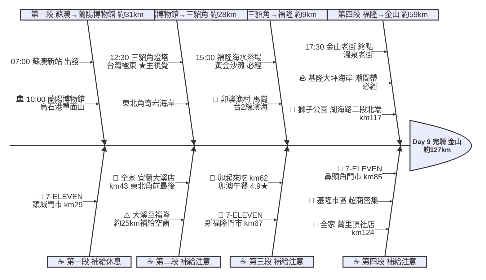

# Day 9：蘇澳新站 ➔ 金山老街（東北角濱海極東追風行）

---

## 路線總覽

* **出發地**：蘇澳新站 / 蘇澳
* **目的地**：新北市金山區金山老街
* **總距離**：126.8 公里（GPX 實測）
* **總爬升 / 下降**：↑ 823 m ／ ↓ 835 m（台2線北部濱海公路沿海岸起伏，多小丘與隧道，東北角至基隆段有數段爬坡）
* **主要路線**：蘇澳新站 ➔ 台2線 ➔ 頭城蘭陽博物館 ➔ 三貂角燈塔(極東) ➔ 卯澳 ➔ 福隆 ➔ 鼻頭角 ➔ 基隆海岸 ➔ 萬里 ➔ 金山

[📱 開啟 Google Maps 導航](https://www.google.com/maps/dir/?api=1&origin=%E5%AE%9C%E8%98%AD%E7%B8%A3%E8%98%87%E6%BE%B3%E6%96%B0%E8%BB%8A%E7%AB%99&destination=%E6%96%B0%E5%8C%97%E5%B8%82%E9%87%91%E5%B1%B1%E8%80%81%E8%A1%97&waypoints=%E9%A0%AD%E5%9F%8E%E8%98%AD%E9%99%BD%E5%8D%9A%E7%89%A9%E9%A4%A8%7C%E4%B8%89%E8%B2%82%E8%A7%92%E7%87%88%E5%A1%94%7C%E7%A6%8F%E9%9A%86%E6%B5%B7%E6%B0%B4%E6%B5%B4%E5%A0%B4%7C%E5%9F%BA%E9%9A%86%E5%A4%A7%E5%9D%AA%E6%B5%B7%E5%B2%B8&travelmode=bicycling)

<iframe src="https://www.google.com/maps/d/u/0/embed?mid=1U19-f5poClZDbwvfVpxBD9fd-caBebk&ehbc=2E312F" width="100%" height="100%" style="border:none; border-radius: 8px;"></iframe>

---

## 詳細路線行程圖解

---

## 建議行程與時間配速

### 第一段：蘇澳新站 → 蘭陽博物館（約 31 km）｜蘭陽平原段

**距離**：31 km
**路況**：自蘇澳新站沿台2線北上經宜蘭壯圍、頭城海岸抵蘭陽博物館。蘭陽平原平緩好騎、補給充足。

**景點與補給：**
- 🚀 **07:00 蘇澳新站**（起點，km 0）：接續 Day8 火車接駁。出發沿台2線（北部濱海公路）北上。
- 🥤 **7-ELEVEN 頭城門市**（km ~29，頭城）：頭城補給點。
- 🏛️ **10:00 蘭陽博物館**（km ~31，頭城烏石港）：單面山造型建築（4.4★/2.2萬則），烏石港旁地標，破蘇澳到東北角的長空檔。

---

### 第二段：蘭陽博物館 → 三貂角燈塔（約 28 km）｜東北角極東段

**距離**：28 km
**路況**：沿台2線經外澳、北關、大里、石城進入新北東北角抵極東三貂角。大溪後進入東北角海岸補給漸稀，務必在大溪門市補滿。

**景點與補給：**
- 🥤 **全家便利商店 宜蘭大溪店**（km ~43，頭城大溪）：進東北角海岸前『最後補給』，至福隆約 25km 超商稀少，補滿水分。
- 🗼 **12:30 三貂角燈塔**（km ~59，貢寮）：必經點、四極點之一、本日★主視覺。台灣本島最東端純白燈塔（4.5★/1.5萬則），太平洋與東海交會。

---

### 第三段：三貂角燈塔 → 福隆（約 9 km）｜卯澳漁村段

**距離**：9 km
**路況**：自三貂角沿台2線（北部濱海公路）經卯澳漁村、馬崗潮間帶濱海抵福隆。卯澳漁村海鮮午餐、馬崗一帶海蝕地景為東北角經典路段；全段壓在台2線濱海主線，不繞入舊草嶺隧道自行車道。

**景點與補給：**
- 🍱 **13:00–14:00 卯起來吃（卯澳店）**（km ~62，貢寮卯澳）：午餐大休點。卯澳漁村人氣海鮮（4.9★/695，現場候位），石花凍與海菜。
- 🏖️ **15:00 福隆海水浴場**（km ~68，貢寮）：必經點。雙溪河口黃金沙灘（4.2★/6863），福隆便當必嚐。

---

### 第四段：福隆 → 金山老街（約 59 km）｜北海岸收尾段

**距離**：59 km
**路況**：沿台2線經鼻頭角、龍洞、南雅、水湳洞陰陽海進基隆，續沿北海岸經萬里抵金山。基隆外木山段（大坪海岸→獅子公園）改走湖海路二段濱海自行車道（避台2線車陣），於獅子公園轉回台2線；其餘全程壓在台2線（含進金山的中山路主線）。東北角奇岩海岸風光絕美、數段爬坡；基隆市區與北海岸車流較多。秋冬東北季風強勁逆風。

**景點與補給：**
- 🥤 **7-ELEVEN 鼻頭角門市**（km ~85，瑞芳）：鼻頭角龍洞補給點。
- 🪨 **16:30 大坪海岸**（km ~100，基隆八斗子）：必經點（基隆海岸）。八斗子潮間帶海蝕平台（4.5★/2309），退潮時生態豐富。
- 🦁 **17:00 獅子公園**（km ~117，萬里外木山）：外木山湖海路二段北端濱海公園（4.3★/3921）。此處為湖海路二段自行車道終點、轉回台2線；展望基隆嶼與外木山海岸。
- 🥤 **全家便利商店 萬里頂社店**（km ~124，萬里）：萬里補給點，進金山前補給。
- 🏁 **17:30 金山老街**（km ~127，金山）：當日終點。金山老街小吃（鴨肉、芋圓）與溫泉，住宿可泡湯放鬆。

---

## 晚餐推薦

| # | 店名 | 評分 | 留言數 | 貝葉斯分 | 備註 |
|:---:|:---|:---:|---:|:---:|:---|
| 1 | [金包里農舍莊園](https://www.google.com/maps/place/?q=place_id:ChIJ9Se0QgWzQjQRpZAVa4CxHdc) | 4.9★ | 3498 | 4.7327 | 甜品餐廳 |
| 2 | [君浩美食坊(公休日見IG或臉書公告）](https://www.google.com/maps/place/?q=place_id:ChIJwxfugTZLXTQRXpdg2TdpSDg) | 4.8★ | 1361 | 4.5346 | 中式餐廳 |
| 3 | [和雅齋](https://www.google.com/maps/place/?q=place_id:ChIJZQl6LlRLXTQRLc8fnURbzDg) | 4.7★ | 977 | 4.44 | 素食餐廳 |
| 4 | [《自家漁船》花義思廚坊](https://www.google.com/maps/place/?q=place_id:ChIJyfyYcAxLXTQRulaJxwTOWa0) | 4.6★ | 1455 | 4.4318 | 西餐廳 |
| 5 | [金山大碗石頭火鍋－新北金山好吃美食推薦 新北金山石頭火鍋 金山老街美食 金山海鮮活體螃蟹推薦 金山必吃聚餐餐廳](https://www.google.com/maps/place/?q=place_id:ChIJge11y2lLXTQRwDGIf77BwAY) | 4.7★ | 892 | 4.4291 | 火鍋店 |

> 💡 *排序依據：留言數越多的高分店越可信（IMDB 風格貝葉斯平均）*
> 📋 *[看更多 >>](./day9_dinner.md)*

---

## 住宿推薦 🏨

| # | 飯店 | 評分 | 留言數 | 貝葉斯分 | 備註 |
|:---:|:---|:---:|---:|:---:|:---|
| 1 | [Dapu - Hotspring 大埔硫磺溫泉商旅](https://www.google.com/maps/place/?q=place_id:ChIJ62Be8qZMXTQRy6E6tfxgkQg) | 4.8★ | 8977 | 4.7371 |  |
| 2 | [沐川海㡳溫泉](https://www.google.com/maps/place/?q=place_id:ChIJwQUbv6ZMXTQRGwo0bQGZ_0s) | 4.7★ | 4343 | 4.6127 |  |
| 3 | [海寶溫泉會館](https://www.google.com/maps/place/?q=place_id:ChIJs2fRhKhMXTQREOqUQlAxuX4) | 4.7★ | 477 | 4.4413 |  |
| 4 | [金山民宿·美人山民宿 Beauty Mountain Homestay(B&B)](https://www.google.com/maps/place/?q=place_id:ChIJP5pAS4BNXTQRpZsXUKzq93U) | 4.9★ | 185 | 4.4183 |  |
| 5 | [璞真民宿](https://www.google.com/maps/place/?q=place_id:ChIJG_XngVmzQjQRMZBAr8oZhB8) | 4.7★ | 164 | 4.3923 |  |

> 💡 *終點周邊 3 公里 · 20 筆候選 · IMDB 風格貝葉斯平均*
> 📋 *[看更多 >>](./day9_hotel.md)*

---

## 騎乘注意事項

1. **東北季風逆風（重要）**：秋冬季東北角至北海岸有強烈東北季風（逆風），騎乘難度大增、須預留較多時間並做好防風（index 提醒）。
2. **補給空窗**：宜蘭大溪(km43)→福隆(km68) 約 25km 行經東北角海岸（大里、石城、三貂角、卯澳）超商稀少，務必於大溪門市補滿水分。
3. **奇岩海岸爬坡**：鼻頭角、龍洞、南雅一帶台2線多上下坡與隧道，注意車流與會車安全。
4. **外木山湖海路二段**：基隆外木山段（大坪海岸→獅子公園）改走湖海路二段濱海自行車道（自行車專用、避台2線車陣與隧道），路面平緩濱海展望佳、終點獅子公園可眺基隆嶼，留意行人與會車。
5. **午餐選擇**：卯澳、福隆海鮮與福隆便當為特色，卯起來吃需現場候位，亦可改福隆月台便當。
6. **撤退方案**：台2線與台鐵宜蘭線／深澳線並行，頭城站、大里站、福隆站、貢寮站、瑞芳站、八斗子站皆可搭區間車（多可載單車），基隆可搭客運。

---

## 更佳景點參考

> 以下為沿途 Bayesian 排名較高但未排入路線的備選點位。可視當天體力 / 天候 / 時間彈性加入。

### 景點備案

| 名次 | 名稱 | 評分 | 留言數 | 貝葉斯分 |
|:---:|:---|:---:|---:|:---:|
| 1 | Healtdeva 赫蒂法莊園 | 4.8★ | 14,491 | 4.79 |
| 2 | 舊草嶺隧道南下資訊站 | 4.6★ | 1,361 | 4.57 |
| 3 | 馬崗潮間帶 | 4.6★ | 1,887 | 4.57 |
| 4 | 龍洞灣岬步道 | 4.6★ | 2,047 | 4.57 |
| 5 | 鼻頭角風景區 | 4.6★ | 1,049 | 4.56 |

### 午餐 / 餐廳大休備案

| 名次 | 店名 | 評分 | 留言數 | 貝葉斯分 |
|:---:|:---|:---:|---:|:---:|
| 1 | 蟹老闆活海鮮-烏石港推薦海鮮餐廳 | 4.9★ | 32,301 | 4.89 |
| 2 | 哇烤好吃 | 5★ | 2,182 | 4.87 |
| 3 | 石港春帆精緻海鮮餐廳 | 4.9★ | 5,753 | 4.85 |

