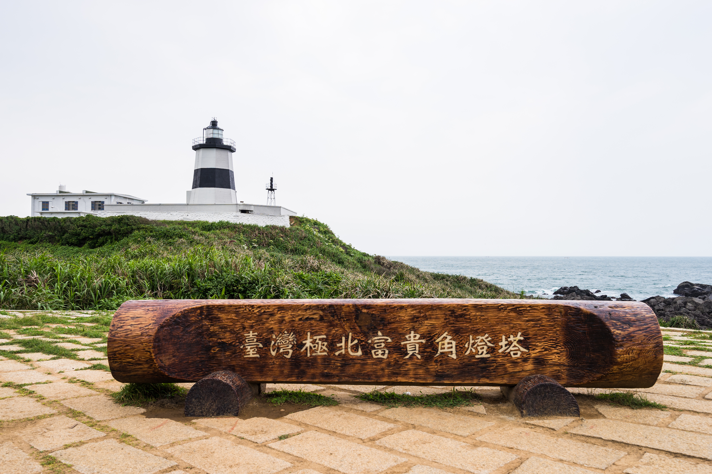
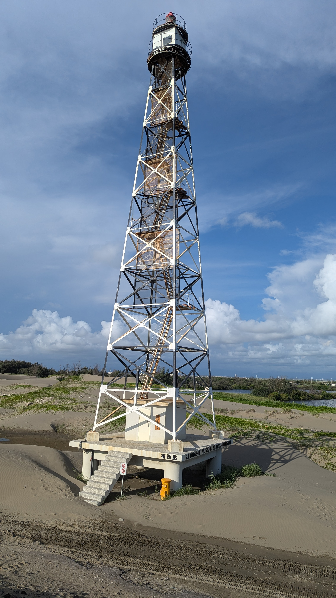
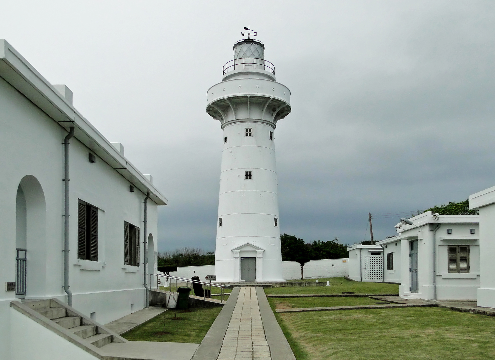
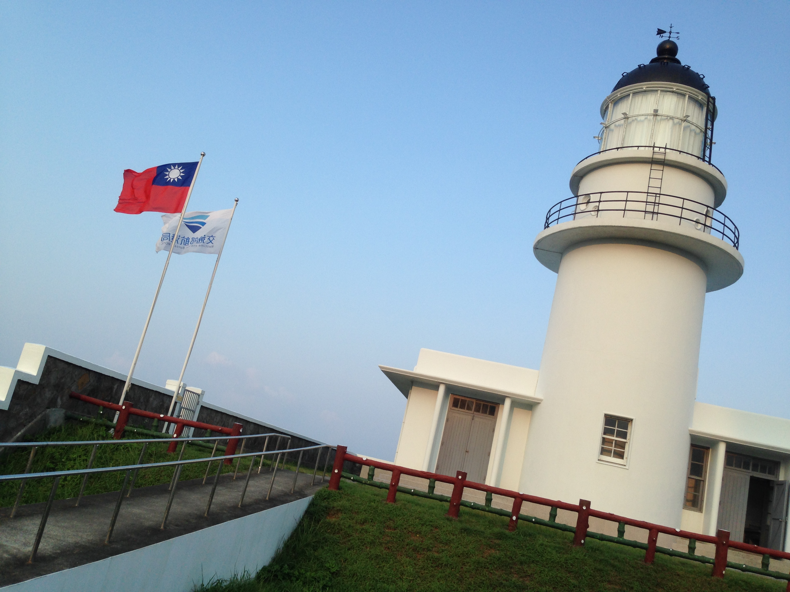

# 台灣四極點地標參考筆記

這些圖片是本地參考資產，用於未來 CyclingTW 封面海報的生成。它們旨在幫助在視覺上區分四個極點地標，而不是僅依賴地名。

## 圖片檔案列表

- 富貴角燈塔（極北）：  `./fuguijiao/fuguijiao_lighthouse.jpg`
- 國聖港燈塔（極西）：  `./guosheng/guosheng_port_lighthouse.jpg`
- 鵝鑾鼻燈塔（極南）：  `./eluanbi/eluanbi_lighthouse.jpg`
- 三貂角燈塔（極東）：  `./sandiaojiao/sandiaojiao_lighthouse.jpg`

## 視覺差異化特徵指引

### 富貴角燈塔 (Fuguijiao Lighthouse)

- **地理角色**：極北點。
- **提示詞特徵**：八角形塔身、黑白相間水平橫條紋燈塔、北海岸礁岩地貌、開闊的海岸地形。
- **本地檔案**：  `./fuguijiao/fuguijiao_lighthouse.jpg`
- **來源**：維基共享資源，"Wongwt 富貴角燈塔 (17227480422).jpg"
- **作者**：Wei-Te Wong
- **授權協議**：CC BY-SA 2.0
- **網址**：https://commons.wikimedia.org/wiki/File:Wongwt_%E5%AF%8C%E8%B2%B4%E8%A7%92%E7%87%88%E5%A1%94_(17227480422).jpg

### 國聖港燈塔 (Guosheng Port Lighthouse)

- **地理角色**：極西點。
- **提示詞特徵**：黑白相間金屬鐵架塔造型（類似高壓電塔）、無封閉外牆、四角鐵架結構；周圍為平坦的西海岸沙洲、沙丘與濕地地形（避免畫成高大的白色圓柱狀燈塔）。
- **本地檔案**：  `./guosheng/guosheng_port_lighthouse.jpg`
- **來源**：維基共享資源，"20240623 Guosheng Port Lighthouse.jpg"
- **作者**：Alexsh
- **授權協議**：CC BY-SA 4.0
- **網址**：https://commons.wikimedia.org/wiki/File:20240623_Guosheng_Port_Lighthouse.jpg

### 鵝鑾鼻燈塔 (Eluanbi Lighthouse)

- **地理角色**：極南點。
- **提示詞特徵**：純白色圓柱狀塔身、墾丁熱帶南部風情、燈塔底部帶有白色的堡壘圍牆、明亮開闊的綠色草坪與陽光。
- **本地檔案**：  `./eluanbi/eluanbi_lighthouse.jpg`
- **來源**：維基共享資源，"Eluanbi Lighthouse 02.jpg"
- **作者**：Bernard Gagnon
- **授權協議**：CC BY-SA 3.0 或 GFDL
- **網址**：https://commons.wikimedia.org/wiki/File:Eluanbi_Lighthouse_02.jpg

### 三貂角燈塔 (Sandiaojiao Lighthouse)

- **地理角色**：極東點。
- **提示詞特徵**：純白色圓柱狀塔身、頂部帶有圓球狀雷達罩、旁邊有明顯的純白色圓頂雷達站、東北角懸崖與太平洋景致。
- **本地檔案**：  `./sandiaojiao/sandiaojiao_lighthouse.jpg`
- **來源**：維基共享資源，"Sandiaojiao Lighthouse, ROC national flag and MPB flag 20140803.jpg"
- **作者**：bryan...
- **授權協議**：CC BY-SA 2.0
- **網址**：https://commons.wikimedia.org/wiki/File:Sandiaojiao_Lighthouse,_ROC_national_flag_and_MPB_flag_20140803.jpg

## 生圖指導原則

在生成封面海報或相關圖像時，請將這些參考資訊作為特定地標的視覺指引：

- **避免同質化**：切勿將四個極點全部畫成一模一樣的標準白色圓柱燈塔。
- **避免純文字依賴**：不要僅依靠文字標籤來區分這四個極點，必須從外觀輪廓進行區隔。
- **保留顯著的輪廓差異**：富貴角為八角黑白條紋；國聖為低矮/纖細的沙洲黑白鐵架塔；鵝鑾鼻為帶有堡壘圍牆的純白圓柱；三貂角為帶有雷達圓球的白色圓柱與雷達站背景。
- **提示詞權重優化**：如果生圖的輸入插槽（Image reference slot）有限，請優先使用富貴角、國聖和鵝鑾鼻的圖片作為參考，因為它們的輪廓對比最強烈；三貂角的特徵（雷達罩、懸崖）則可用文字提示詞進行補充描述。
